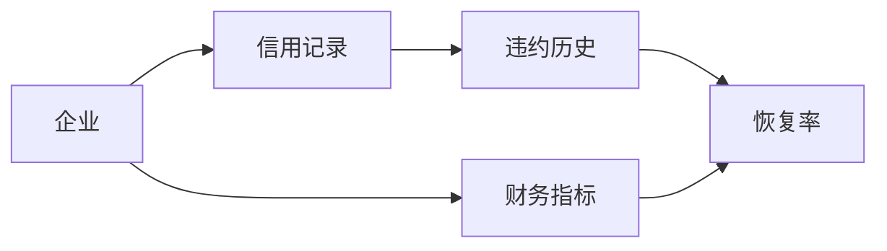
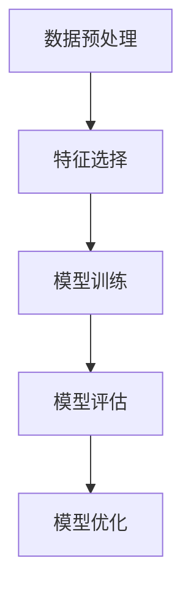
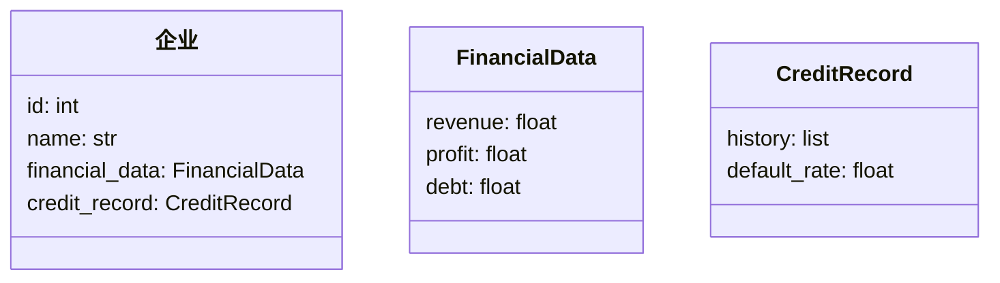

                 


# 设计智能化的企业信用违约恢复率预测模型

> 关键词：企业信用违约、恢复率预测、机器学习、智能化模型、风险评估

> 摘要：本文旨在探讨如何设计一个智能化的企业信用违约恢复率预测模型。通过结合机器学习算法和大数据分析，我们能够更准确地预测企业违约后的恢复情况，从而帮助金融机构降低风险，优化信贷决策。本文将从背景介绍、核心概念、算法原理、系统架构设计、项目实战到最佳实践等方面，全面阐述这一模型的设计与实现过程。

---

# 第一章: 企业信用违约恢复率预测模型的背景与问题

## 1.1 信用违约恢复率预测的背景

### 1.1.1 企业信用违约的定义与特征

企业信用违约是指借款企业未能按照合同约定偿还债务本息的情况。其主要特征包括：

- **违约风险**：企业由于经营状况恶化、财务压力过大等原因，无法按时偿还债务。
- **恢复率**：企业在违约后，通过重组、清偿等方式，最终能够回收的债务比例。

### 1.1.2 信用违约恢复率预测的现实意义

信用违约恢复率预测对于金融机构具有重要意义：

- **风险控制**：帮助金融机构评估贷款风险，优化信贷结构。
- **资产保全**：通过预测违约后的恢复情况，制定相应的资产保全策略。
- **决策支持**：为金融机构的信贷审批、贷款定价提供数据支持。

### 1.1.3 智能化预测模型的必要性

传统的信用评估方法依赖于经验判断和简单的统计分析，存在以下不足：

- **数据维度单一**：难以捕捉企业的复杂信用行为。
- **预测精度低**：无法准确反映企业违约后的恢复情况。
- **模型静态**：难以适应市场环境的变化。

通过引入机器学习算法和大数据分析，可以构建智能化的预测模型，显著提高预测精度和实用性。

---

## 1.2 问题描述与目标

### 1.2.1 信用违约恢复率预测的核心问题

我们需要解决以下核心问题：

- 如何从企业的历史数据中提取有效特征，用于预测违约恢复率？
- 如何选择合适的机器学习算法，构建高精度的预测模型？
- 如何确保模型的可解释性，便于金融机构理解和应用？

### 1.2.2 智能化预测的目标与边界

- **目标**：构建一个能够准确预测企业信用违约恢复率的智能化模型。
- **边界**：模型仅用于预测，不直接涉及企业的信贷决策，但可为信贷决策提供参考。

### 1.2.3 模型的外延与应用场景

- **外延**：模型不仅适用于单一企业，还可扩展至行业或地区的信用风险评估。
- **应用场景**：银行、资产管理公司、信用评级机构等。

---

## 1.3 问题解决思路

### 1.3.1 数据驱动的预测方法

- 通过收集企业的财务数据、经营数据、信用记录等，构建数据驱动的预测模型。
- 使用机器学习算法，如逻辑回归、随机森林等，进行建模和预测。

### 1.3.2 模型选择与优化策略

- 根据数据特征选择合适的算法。
- 通过交叉验证、网格搜索等方法优化模型参数。

### 1.3.3 智能化预测的关键技术

- **数据预处理**：缺失值处理、特征工程。
- **算法选择**：逻辑回归、支持向量机、随机森林等。
- **模型评估**：准确率、召回率、AUC曲线等指标。

---

## 1.4 概念结构与核心要素

### 1.4.1 核心概念的层次结构

- **上层**：信用违约恢复率预测。
- **中层**：企业信用状况、违约风险、恢复率。
- **下层**：财务指标、经营指标、信用记录等。

### 1.4.2 模型输入与输出的定义

- **输入**：企业的财务数据、经营数据、信用记录等。
- **输出**：企业信用违约后的恢复率预测值。

### 1.4.3 关键要素的特征分析

| 关键要素 | 特征描述 | 示例 |
|----------|----------|------|
| 财务指标 | 资产负债率、流动比率、净利润率 | 资产负债率 = 负债总额 / 资产总额 |
| 经营指标 | 主营业务收入增长率、市场份额 | 主营业务收入增长率 = (本期收入 - 上期收入) / 上期收入 |
| 信用记录 | 违约历史、逾期情况 | 违约次数、最长逾期天数 |

---

## 1.5 本章小结

本章从背景、问题、目标、解决思路和概念结构等方面，全面介绍了企业信用违约恢复率预测模型的设计背景和核心要素。下一章将详细探讨模型的核心概念与联系。

---

# 第二章: 信用违约恢复率预测的核心概念

## 2.1 核心概念的原理

### 2.1.1 信用风险的基本原理

信用风险是指债务人或交易对手未能履行其合同义务，给债权人造成损失的风险。其基本原理包括：

1. **债务人违约的可能性**：取决于债务人的信用状况、财务状况等因素。
2. **违约后的损失**：包括直接损失和间接损失。

### 2.1.2 恢复率预测的数学模型

恢复率预测模型可以通过回归分析来实现。其基本形式如下：

$$ \text{恢复率} = \beta_0 + \beta_1 x_1 + \beta_2 x_2 + \cdots + \beta_n x_n + \epsilon $$

其中，$x_i$ 是特征变量，$\beta_i$ 是回归系数，$\epsilon$ 是误差项。

### 2.1.3 智能化预测的算法基础

智能化预测主要依赖于机器学习算法，如：

- **逻辑回归**：用于分类问题。
- **随机森林**：用于分类和回归问题。
- **支持向量机**：用于分类和回归问题。

---

## 2.2 核心概念的特征对比

### 2.2.1 不同预测模型的特征对比

| 模型类型 | 优点 | 缺点 |
|----------|------|------|
| 逻辑回归 | 简单易懂，可解释性高 | 适用于线性可分数据 |
| 随机森林 | 高精度，抗过拟合 | 计算复杂度高 |
| 支持向量机 | 高精度，适用于非线性数据 | 参数敏感 |

### 2.2.2 数据特征与模型性能的关系

数据特征的选择直接影响模型的性能。例如：

- **特征相关性**：相关性高的特征可能导致模型过拟合。
- **特征重要性**：重要特征能够显著提高模型的预测精度。

### 2.2.3 智能化预测的特征选择

特征选择是智能化预测的关键步骤。常用的方法包括：

- **基于统计的方法**：如卡方检验。
- **基于机器学习的方法**：如随机森林的特征重要性排序。
- **基于领域知识的方法**：结合专家经验选择特征。

---

## 2.3 ER实体关系图架构

以下是企业的信用违约恢复率预测模型的实体关系图：



---

## 2.4 本章小结

本章详细探讨了信用违约恢复率预测的核心概念，包括原理、特征对比和实体关系图。下一章将介绍基于机器学习的恢复率预测算法。

---

# 第三章: 基于机器学习的恢复率预测算法

## 3.1 算法原理

### 3.1.1 逻辑回归模型

逻辑回归是一种常用的分类算法，其核心思想是通过 sigmoid 函数将线性回归的结果映射到概率空间。

$$ P(y=1|x) = \frac{1}{1 + e^{-\beta x}} $$

### 3.1.2 支持向量机模型

支持向量机通过找到一个超平面，将数据分为两类。其目标函数如下：

$$ \min \frac{1}{2} ||\beta||^2 + C \sum_{i=1}^n \xi_i $$
$$ \text{subject to } y_i (\beta x_i + \beta_0) \geq 1 - \xi_i $$
$$ \xi_i \geq 0 $$

### 3.1.3 随机森林模型

随机森林通过构建多个决策树，并对结果进行投票或平均，提高模型的准确性和鲁棒性。

---

## 3.2 算法流程图

以下是算法的流程图：



---

## 3.3 算法实现代码

以下是基于逻辑回归的实现代码：

```python
import pandas as pd
from sklearn.model_selection import train_test_split
from sklearn.linear_model import LogisticRegression

# 数据加载与预处理
data = pd.read_csv('credit_data.csv')
X = data.drop('default_rate', axis=1)
y = data['default_rate']

# 数据分割
X_train, X_test, y_train, y_test = train_test_split(X, y, test_size=0.2, random_state=42)

# 模型训练
model = LogisticRegression()
model.fit(X_train, y_train)

# 模型评估
print("Accuracy:", model.score(X_test, y_test))
```

---

## 3.4 本章小结

本章详细介绍了基于机器学习的恢复率预测算法，包括逻辑回归、支持向量机和随机森林。下一章将探讨系统的架构设计。

---

# 第四章: 企业信用违约恢复率预测系统的架构设计

## 4.1 系统功能设计

### 4.1.1 领域模型设计

以下是领域模型的类图：



### 4.1.2 系统功能模块

系统功能模块包括：

- 数据采集模块：采集企业的财务数据、信用记录等。
- 数据处理模块：对数据进行清洗、转换和特征工程。
- 模型训练模块：基于机器学习算法训练预测模型。
- 模型部署模块：将模型部署到生产环境，供用户调用。

---

## 4.2 系统架构设计

以下是系统的架构图：


---

## 4.3 系统接口设计

### 4.3.1 API接口设计

以下是API接口的定义：

```python
from flask import Flask, request, jsonify

app = Flask(__name__)

@app.route('/predict', methods=['POST'])
def predict():
    data = request.json
    # 数据处理
    # 模型预测
    return jsonify({'result': prediction})
```

---

## 4.4 本章小结

本章详细探讨了系统的架构设计，包括功能模块、架构图和接口设计。下一章将通过项目实战，展示模型的具体实现。

---

# 第五章: 项目实战

## 5.1 环境安装

- **Python 3.8+**
- **Jupyter Notebook**
- **Scikit-learn、Pandas、Numpy**

---

## 5.2 核心代码实现

以下是核心代码实现：

```python
import pandas as pd
from sklearn.ensemble import RandomForestRegressor
from sklearn.model_selection import train_test_split
from sklearn.metrics import mean_absolute_error

# 数据加载
data = pd.read_csv('credit_data.csv')
X = data.drop('recovery_rate', axis=1)
y = data['recovery_rate']

# 数据分割
X_train, X_test, y_train, y_test = train_test_split(X, y, test_size=0.2, random_state=42)

# 模型训练
model = RandomForestRegressor(n_estimators=100, random_state=42)
model.fit(X_train, y_train)

# 模型预测
y_pred = model.predict(X_test)

# 模型评估
print("MAE:", mean_absolute_error(y_test, y_pred))
```

---

## 5.3 案例分析

通过实际案例分析，验证模型的预测效果：

1. **数据准备**：加载企业信用数据。
2. **特征工程**：选择关键特征，如财务指标、经营指标等。
3. **模型训练**：训练随机森林模型。
4. **模型评估**：计算MAE、R²等指标，评估模型性能。

---

## 5.4 本章小结

本章通过项目实战，展示了模型的具体实现和案例分析。下一章将总结最佳实践。

---

# 第六章: 最佳实践与总结

## 6.1 总结

本章总结了企业信用违约恢复率预测模型的设计与实现过程，包括背景介绍、核心概念、算法原理、系统架构设计和项目实战。

---

## 6.2 小结

- **优势**：模型具有高精度，能够准确预测恢复率。
- **不足**：模型的可解释性有待进一步提升。
- **改进建议**：引入更多特征，优化模型结构。

---

## 6.3 注意事项

- **数据隐私**：注意保护企业的数据隐私。
- **模型维护**：定期更新模型，确保其准确性。
- **技术支持**：提供技术支持，确保模型的顺利应用。

---

## 6.4 拓展阅读

- **相关书籍**：《机器学习实战》、《信用风险建模》
- **在线资源**：Kaggle上的信用风险数据集

---

# 作者：AI天才研究院/AI Genius Institute & 禅与计算机程序设计艺术 /Zen And The Art of Computer Programming

---

以上是《设计智能化的企业信用违约恢复率预测模型》的完整目录结构和内容概览。

