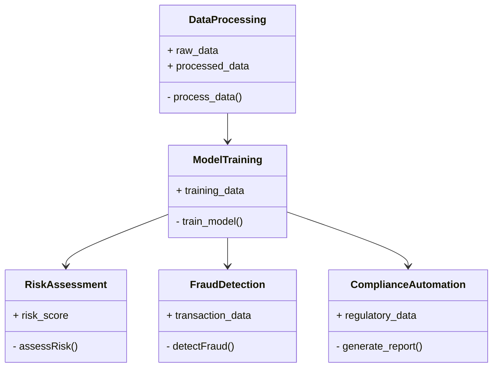
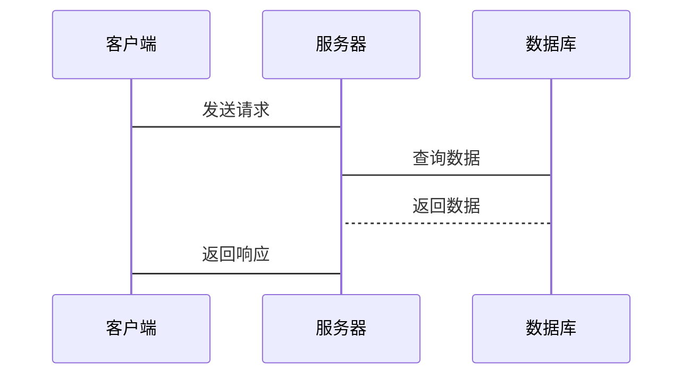

                 

# 《金融监管科技（RegTech）中的AI应用》

> **关键词**: 人工智能, 金融监管科技, 智慧监管, 风险评估, 欺诈检测

> **摘要**: 本文详细探讨人工智能（AI）在金融监管科技（RegTech）中的应用，涵盖AI的核心技术、在金融监管中的具体应用、算法原理、系统架构设计以及实际项目案例。通过分析风险评估、欺诈检测、合规自动化等场景，结合机器学习、深度学习和自然语言处理技术，展示AI如何提升金融监管的效率和准确性。同时，本文通过系统设计和实战案例，提供从理论到实践的全面指导，助力读者理解并应用AI技术于RegTech领域。

---

# 第1章: 金融监管科技（RegTech）与人工智能（AI）概述

## 1.1 金融监管科技的定义与背景

### 1.1.1 金融监管科技的定义

金融监管科技（RegTech）是指利用新兴技术手段优化和增强金融监管能力的创新解决方案。通过技术手段提高监管效率、降低合规成本，并确保金融机构的合规性。

### 1.1.2 金融监管科技的发展背景

随着金融市场的快速发展和全球化进程的加速，金融机构面临的监管压力和合规要求日益增加。传统的人工监管方式效率低下、成本高昂，难以应对复杂的金融环境。同时，数据量的爆炸式增长和金融产品的不断创新，使得传统的监管方法逐渐失效。

### 1.1.3 金融监管科技的核心目标与作用

RegTech的核心目标是通过技术创新解决金融监管中的痛点，包括提高监管效率、降低合规成本、增强风险控制能力等。其作用体现在以下几个方面：

1. **提高监管效率**：通过自动化技术快速处理大量数据，实时监控市场动态。
2. **降低合规成本**：自动化合规流程，减少人工干预，降低运营成本。
3. **增强风险控制**：利用AI技术预测和识别潜在风险，提前采取措施。

## 1.2 人工智能（AI）的基本概念与技术基础

### 1.2.1 人工智能的定义与特点

人工智能（AI）是指由人创造的能够执行通常需要人类智能的任务的系统或机器。AI系统能够执行如学习、推理、问题解决等任务，具有自适应性和自我优化能力。

### 1.2.2 机器学习、深度学习与自然语言处理简介

- **机器学习**：通过数据训练模型，使模型能够从数据中学习并做出预测或决策。
- **深度学习**：一种机器学习方法，通过多层神经网络模拟人类大脑的处理方式。
- **自然语言处理（NLP）**：使计算机能够理解、处理和生成人类语言的技术。

## 1.3 RegTech与AI的结合：问题背景与应用领域

### 1.3.1 传统金融监管的痛点与挑战

1. **数据量大**：金融机构产生的数据量庞大，人工处理效率低。
2. **合规复杂**：不断变化的监管法规要求金融机构频繁调整合规策略。
3. **风险多样化**：金融市场风险种类繁多，传统监管方法难以覆盖所有风险。

### 1.3.2 AI在金融监管中的应用潜力

AI技术能够帮助金融机构和监管机构更高效地处理海量数据，实时监控市场动态，预测潜在风险，从而提升监管效率和准确性。

### 1.3.3 本章小结

本章介绍了RegTech的定义和背景，阐述了AI的基本概念和技术基础，并探讨了AI在RegTech中的应用潜力。通过结合RegTech和AI的优势，为后续章节的深入分析奠定了基础。

---

# 第2章: AI在金融监管中的核心应用

## 2.1 风险评估与预测

### 2.1.1 基于AI的风险评估模型

利用机器学习算法构建风险评估模型，对客户的信用风险、市场风险等进行预测和评估。

### 2.1.2 机器学习在信用评分中的应用

通过训练机器学习模型，利用客户的交易数据、信用历史等信息，预测客户的信用评分。

## 2.2 欺诈检测与预防

### 2.2.1 基于AI的欺诈检测系统

利用深度学习技术，分析交易数据中的异常行为，识别潜在的欺诈交易。

### 2.2.2 深度学习在交易欺诈中的应用

通过训练深度学习模型，捕捉交易数据中的复杂模式，提高欺诈检测的准确性。

## 2.3 合规与监管报告自动化

### 2.3.1 自然语言处理在合规文档分析中的应用

利用NLP技术，自动分析监管法规文档，提取关键信息，帮助金融机构制定合规策略。

### 2.3.2 AI驱动的监管报告自动生成

通过自然语言处理技术，自动生成监管报告，减少人工干预，提高效率。

## 2.4 市场监控与异常检测

### 2.4.1 基于AI的市场行为分析

利用AI技术分析市场参与者的行为模式，识别市场操纵等异常行为。

### 2.4.2 实时监控与异常检测算法

通过实时数据流处理技术，结合异常检测算法，及时发现市场中的异常交易行为。

## 2.5 本章小结

本章详细探讨了AI在金融监管中的核心应用，包括风险评估、欺诈检测、合规自动化和市场监控等方面，展示了AI技术如何帮助金融机构和监管机构提升监管效率和准确性。

---

# 第3章: AI在RegTech中的技术基础

## 3.1 机器学习基础

### 3.1.1 监督学习、无监督学习与强化学习简介

- **监督学习**：通过标记数据训练模型，预测新的数据标签。
- **无监督学习**：在无标记数据上发现数据结构和模式。
- **强化学习**：通过试错机制，学习最优决策策略。

### 3.1.2 常见机器学习算法及其应用场景

- **线性回归**：用于预测连续型变量，如股票价格预测。
- **决策树**：用于分类和回归，如客户信用评分。
- **支持向量机（SVM）**：用于分类问题，如欺诈检测。

## 3.2 深度学习与神经网络

### 3.2.1 深度学习的基本原理

通过多层神经网络，学习数据的高层次特征，提高模型的表达能力。

### 3.2.2 卷积神经网络（CNN）与循环神经网络（RNN）在金融中的应用

- **CNN**：用于图像处理和时间序列分析，如股票价格预测。
- **RNN**：用于处理序列数据，如时间序列分析和自然语言处理。

## 3.3 自然语言处理（NLP）与文本挖掘

### 3.3.1 NLP的基本概念与技术

- **文本分类**：将文本分类到预定义的类别中，如情感分析。
- **实体识别**：识别文本中的命名实体，如公司名称、日期等。

### 3.3.2 基于NLP的金融文本分析

利用NLP技术分析新闻、财报等文本，提取市场情绪和关键信息。

## 3.4 数据预处理与特征工程

### 3.4.1 数据清洗与特征提取

- **数据清洗**：处理缺失值、异常值和重复数据。
- **特征提取**：从数据中提取有用的特征，用于模型训练。

### 3.4.2 数据标准化与归一化

- **标准化**：将数据缩放到统一的尺度，如Z-score标准化。
- **归一化**：将数据缩放到[0,1]范围，如min-max归一化。

---

# 第4章: AI在RegTech中的算法原理

## 4.1 监督学习算法

### 4.1.1 线性回归算法

#### 4.1.1.1 线性回归的数学模型

$$ y = \beta_0 + \beta_1 x + \epsilon $$

其中，$\beta_0$是截距，$\beta_1$是回归系数，$\epsilon$是误差项。

#### 4.1.1.2 线性回归的实现步骤

1. 数据收集：收集输入特征 $x$ 和目标变量 $y$。
2. 模型训练：通过最小二乘法求解回归系数 $\beta_0$ 和 $\beta_1$。
3. 模型预测：利用训练好的模型进行预测。

### 4.1.2 支持向量机（SVM）

#### 4.1.2.1 SVM的数学模型

SVM通过构建超平面，将数据分为两类，目标是最化间隔最大化。

$$ \text{minimize} \quad \frac{1}{2}||\mathbf{w}||^2 $$
$$ \text{subject to} \quad y_i (\mathbf{w} \cdot \mathbf{x_i} + b) \geq 1, \quad i=1,2,\dots,n $$

其中，$\mathbf{w}$是权重向量，$b$是偏置项，$y_i$是标签。

#### 4.1.2.2 SVM的实现步骤

1. 数据预处理：标准化数据，选择适当的核函数。
2. 模型训练：使用SVM算法训练模型。
3. 模型预测：利用训练好的模型进行分类。

## 4.2 无监督学习算法

### 4.2.1 K-means聚类

#### 4.2.1.1 K-means的数学模型

K-means通过将数据分成K个簇，最小化簇内平方误差之和。

$$ \text{minimize} \quad \sum_{i=1}^{K} \sum_{j=1}^{n_i} (x_{ij} - \mu_i)^2 $$

其中，$\mu_i$是第i个簇的中心点，$x_{ij}$是第j个样本在第i个簇中的特征。

#### 4.2.1.2 K-means的实现步骤

1. 初始化：随机选择K个初始簇中心。
2. 聚类：将每个样本分配到最近的簇中心。
3. 更新：计算每个簇的新中心，重复步骤1和2直到收敛。

## 4.3 强化学习算法

### 4.3.1 Q-Learning算法

#### 4.3.1.1 Q-Learning的数学模型

Q-Learning通过维护Q值表，学习最优策略。

$$ Q(s, a) = Q(s, a) + \alpha [r + \gamma \max Q(s', a') - Q(s, a)] $$

其中，$\alpha$是学习率，$\gamma$是折扣因子，$s$是当前状态，$a$是动作，$s'$是下一个状态，$r$是奖励。

#### 4.3.1.2 Q-Learning的实现步骤

1. 初始化：初始化Q值表为零。
2. 环境交互：根据当前状态选择动作，执行动作，得到奖励和下一个状态。
3. 更新Q值：根据Q-Learning公式更新Q值。
4. 重复步骤2和3直到收敛。

---

# 第5章: RegTech系统的系统架构与设计

## 5.1 问题场景介绍

RegTech系统需要处理大量的金融数据，实时监控市场动态，预测风险，检测欺诈，确保合规。

## 5.2 系统功能设计

### 5.2.1 领域模型（mermaid类图）

## 5.3 系统架构设计（mermaid架构图）

## 5.4 系统接口设计

1. 数据接口：提供数据输入、处理和存储接口。
2. 模型接口：提供模型训练、预测和评估接口。
3. 报告接口：提供合规报告生成和查询接口。

## 5.5 系统交互（mermaid序列图）

---

# 第6章: 项目实战——基于AI的欺诈检测系统

## 6.1 项目背景与目标

开发一个基于AI的欺诈检测系统，利用机器学习技术实时检测交易中的欺诈行为。

## 6.2 项目环境搭建

1. 安装Python和相关库（如scikit-learn、TensorFlow、Pandas）。
2. 数据准备：收集交易数据，包括时间戳、交易金额、用户ID等。

## 6.3 系统核心实现

### 6.3.1 数据预处理

1. 清洗数据：处理缺失值、异常值。
2. 特征提取：提取交易金额、时间间隔、交易地点等特征。

### 6.3.2 模型训练与评估

1. 选择算法：使用随机森林或XGBoost进行分类。
2. 训练模型：训练欺诈检测模型。
3. 评估模型：计算准确率、召回率、F1分数。

### 6.3.3 系统实现

1. 实时数据采集：通过API接口获取交易数据。
2. 模型预测：对实时交易进行欺诈预测。
3. 系统报警：当检测到欺诈交易时，触发报警机制。

## 6.4 案例分析与结果解读

### 6.4.1 案例分析

通过实际交易数据，展示模型的预测结果和报警情况。

### 6.4.2 结果解读

分析模型的预测准确率、召回率等指标，评估模型的性能。

## 6.5 项目总结与优化

### 6.5.1 项目总结

总结项目的开发过程和成果，评估系统的性能和效果。

### 6.5.2 模型优化

通过超参数调优、特征工程等方法进一步优化模型性能。

---

# 第7章: 总结与展望

## 7.1 本章总结

本文详细探讨了AI在RegTech中的应用，从技术基础到实际应用，为读者提供了全面的指导。

## 7.2 未来展望

随着AI技术的不断发展，RegTech将更加智能化和自动化，未来可能在以下几个方面进一步发展：

1. **智能监管**：利用AI技术实现更加智能化的监管决策。
2. **实时监控**：通过实时数据分析，实现更快速的市场反应。
3. **多模态数据处理**：结合文本、图像等多种数据源，提升监管的全面性。

## 7.3 最佳实践 Tips

1. **数据质量**：确保数据的准确性和完整性。
2. **模型解释性**：选择具有良好解释性的模型，便于理解和优化。
3. **持续学习**：定期更新模型，适应市场变化。

---

# 作者

**作者：AI天才研究院/AI Genius Institute & 禅与计算机程序设计艺术 /Zen And The Art of Computer Programming**

---

以上是《金融监管科技（RegTech）中的AI应用》的详细目录和部分内容概述。通过以上章节，读者可以系统地了解AI在金融监管科技中的应用，从基础理论到实际项目实现，全面掌握相关知识。

