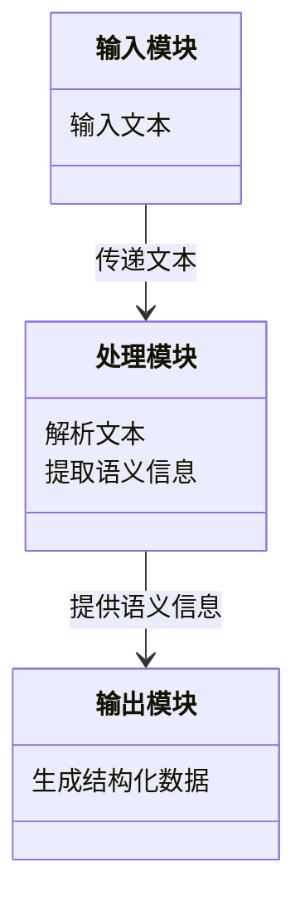
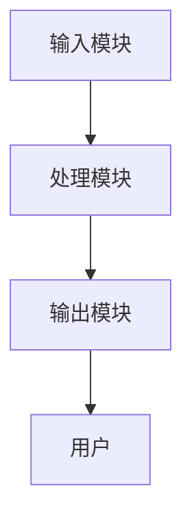
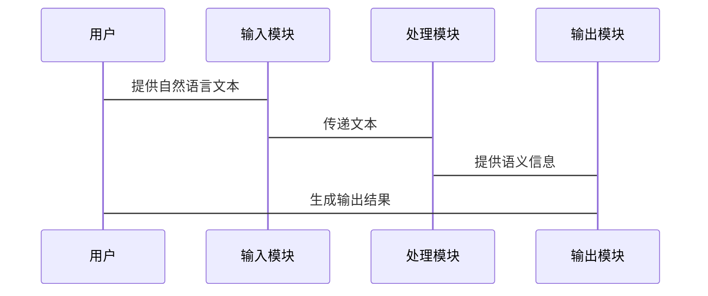

                 


```markdown
# AI Agent 的语言理解：提升 LLM 的语义解析能力

> 关键词：AI Agent, LLM, 语义解析, 语言理解, 自然语言处理

> 摘要：本文深入探讨了AI Agent在语言理解中的作用，重点分析了如何通过提升大语言模型（LLM）的语义解析能力来增强AI Agent的理解能力。文章从背景、核心概念、算法原理、系统架构、项目实战等多个方面展开，详细讲解了相关技术和实现方法，并提供了实际案例分析。

---

# 第1章: AI Agent 与 LLM 的背景与概念

## 1.1 AI Agent 的定义与特点

### 1.1.1 AI Agent 的定义
AI Agent（人工智能代理）是指能够感知环境、自主决策并执行任务的智能实体。它可以是一个软件程序，也可以是物理设备，具备以下特点：
- **自主性**：无需外部干预，自主完成任务。
- **反应性**：能够实时感知环境变化并做出反应。
- **目标导向**：基于目标驱动行为，追求最优结果。
- **学习能力**：通过数据和经验不断优化自身性能。

### 1.1.2 AI Agent 的核心特点
- **智能性**：具备理解和推理能力，能够处理复杂问题。
- **交互性**：支持与用户或其他系统的交互。
- **适应性**：能够适应不同环境和任务需求。
- **安全性**：确保在安全范围内执行任务，避免风险。

### 1.1.3 AI Agent 的应用场景
AI Agent广泛应用于智能助手、推荐系统、自动驾驶、智能客服等领域。例如，智能助手（如Siri、Alexa）通过自然语言处理技术为用户提供服务，自动驾驶系统通过环境感知和决策优化实现安全驾驶。

## 1.2 LLM 的定义与特点

### 1.2.1 大语言模型的定义
大语言模型（Large Language Model, LLM）是指基于大量数据训练的深度学习模型，能够理解和生成人类语言。其核心是通过神经网络结构（如Transformer）处理文本数据，生成高质量的文本输出。

### 1.2.2 LLM 的核心特点
- **大规模训练**：基于海量数据训练，具备广泛的知识覆盖。
- **上下文理解**：能够捕捉文本中的上下文关系，理解语境。
- **多任务能力**：通过微调和特定任务训练，能够处理多种自然语言处理任务（如翻译、问答、摘要）。

### 1.2.3 LLM 的主要应用领域
- **文本生成**：生成高质量的文章、故事、代码等。
- **问答系统**：回答用户问题，提供信息检索服务。
- **机器翻译**：实现多种语言之间的自动翻译。
- **情感分析**：分析文本中的情感倾向，用于市场调研和用户反馈分析。

## 1.3 AI Agent 与 LLM 的关系

### 1.3.1 AI Agent 中的 LLM
LLM作为AI Agent的核心组件之一，负责处理自然语言输入和输出。AI Agent通过调用LLM API，实现对用户指令的理解和执行。

### 1.3.2 LLM 如何增强 AI Agent 的语言理解能力
- **语义理解**：LLM能够理解复杂的语义结构，帮助AI Agent准确解析用户意图。
- **上下文处理**：通过上下文理解，AI Agent可以更准确地响应用户需求。
- **动态调整**：基于LLM的反馈，AI Agent能够动态调整其行为策略。

### 1.3.3 两者结合的潜在优势
- **高效交互**：通过LLM的自然语言处理能力，AI Agent能够与用户进行更自然、高效的交互。
- **智能决策**：结合LLM的理解能力，AI Agent可以做出更智能的决策。
- **多语言支持**：LLM支持多种语言，使AI Agent能够为全球用户提供服务。

## 1.4 本章小结
本章介绍了AI Agent和LLM的基本概念、特点及其应用场景，并重点分析了两者之间的关系。通过结合LLM的语义理解能力，AI Agent能够显著提升其语言理解能力，为用户提供更智能、更高效的交互体验。

---

# 第2章: 语义解析的核心概念

## 2.1 语义解析的定义与目标

### 2.1.1 语义解析的定义
语义解析（Semantic Parsing）是指将自然语言文本转换为结构化的信息表示的过程。其目标是理解文本的深层含义，提取有用的信息。

### 2.1.2 语义解析的目标
- **信息提取**：从文本中提取关键信息（如实体、关系）。
- **意图识别**：识别用户的意图，理解用户的需求。
- **语义理解**：将文本转换为计算机可理解的结构化数据。

## 2.2 语义解析的关键技术

### 2.2.1 基于规则的语义解析
- **规则定义**：通过预定义的规则，匹配文本中的模式，提取信息。
- **优点**：简单易懂，适用于特定领域的解析。
- **缺点**：规则维护成本高，难以处理复杂语义。

### 2.2.2 基于统计的语义解析
- **统计模型**：利用统计学习方法，训练模型从文本中提取信息。
- **优点**：能够处理复杂语义，适应性强。
- **缺点**：需要大量标注数据，计算复杂度高。

### 2.2.3 基于深度学习的语义解析
- **深度学习模型**：利用神经网络模型（如Transformer）进行语义解析。
- **优点**：能够自动学习特征，处理复杂语义。
- **缺点**：需要大量数据和计算资源。

## 2.3 语义解析的挑战与解决方案

### 2.3.1 语义解析的挑战
- **歧义性**：自然语言文本中存在多种解释可能性。
- **语境依赖性**：语义理解依赖于上下文。
- **数据稀疏性**：某些领域数据不足，影响模型性能。

### 2.3.2 解决方案
- **多模态融合**：结合文本、图像、语音等多种模态信息，提高语义理解能力。
- **预训练模型**：利用大规模预训练模型（如BERT、GPT）提升语义解析能力。
- **动态调整**：根据反馈动态优化模型参数，提高适应性。

## 2.4 本章小结
本章重点介绍了语义解析的核心概念、关键技术及其挑战。通过结合深度学习技术，语义解析能够更准确地理解自然语言文本，为AI Agent的语言理解能力提供有力支持。

---

# 第3章: 算法原理讲解

## 3.1 大语言模型的训练过程

### 3.1.1 数据准备
- **数据清洗**：去除噪声数据，确保数据质量。
- **数据标注**：对文本进行标注，提供监督信号。
- **数据增强**：通过数据增强技术（如同义词替换）提高数据多样性。

### 3.1.2 模型选择
- **选择模型架构**：如Transformer、BERT等。
- **初始化参数**：随机初始化模型参数。
- **训练策略**：选择合适的训练策略（如微调、从头训练）。

### 3.1.3 训练过程
- **前向传播**：输入数据，计算模型输出。
- **损失计算**：计算预测值与真实值之间的损失。
- **反向传播**：通过梯度下降优化模型参数。

## 3.2 注意力机制的原理

### 3.2.1 注意力机制的定义
注意力机制（Attention Mechanism）是一种用于处理序列数据的方法，能够捕捉文本中的语义关系。

### 3.2.2 注意力机制的实现
- **查询、键、值**：通过查询（Query）、键（Key）、值（Value）三部分计算注意力权重。
- **权重计算**：通过点积和Softmax函数计算注意力权重。
- **加权求和**：根据注意力权重加权求和，得到最终输出。

### 3.2.3 注意力机制的优势
- **捕捉长距离依赖**：能够捕捉文本中的长距离语义关系。
- **自适应调整权重**：根据上下文自动调整注意力权重。

## 3.3 提升语义解析的具体算法

### 3.3.1 基于Transformer的语义解析
- **模型架构**：利用Transformer模型进行语义解析。
- **训练策略**：通过预训练和微调提升模型性能。
- **优化方法**：采用Adam优化器，设置合适的学习率。

### 3.3.2 基于上下文的语义解析
- **上下文表示**：利用上下文信息进行语义解析。
- **动态调整模型**：根据上下文动态调整模型参数。

### 3.3.3 基于强化学习的语义解析
- **强化学习框架**：通过强化学习优化语义解析模型。
- **奖励机制**：设计合适的奖励函数，指导模型优化方向。

## 3.4 本章小结
本章详细讲解了大语言模型的训练过程和注意力机制的原理，并介绍了几种提升语义解析能力的具体算法。通过这些算法，可以显著提升AI Agent的语义解析能力。

---

# 第4章: 数学模型与公式

## 4.1 概率分布模型

### 4.1.1 概率分布的定义
概率分布（Probability Distribution）是指随机变量取各个值的概率。

### 4.1.2 概率分布的公式
$$ P(x) = \frac{1}{\sqrt{2\pi\sigma^2}} e^{-\frac{(x-\mu)^2}{2\sigma^2}} $$

其中：
- $\mu$ 是均值
- $\sigma$ 是标准差

### 4.1.3 概率分布的应用
- **文本生成**：通过概率分布生成文本。
- **语义解析**：通过概率分布计算文本中词语的概率，辅助语义理解。

## 4.2 损失函数与优化

### 4.2.1 损失函数的定义
损失函数（Loss Function）是用来衡量模型预测值与真实值之间的差距。

### 4.2.2 损失函数的公式
$$ L = -\sum_{i=1}^{n} y_i \log p(y_i) $$

其中：
- $y_i$ 是真实值
- $p(y_i)$ 是模型预测的概率

### 4.2.3 优化方法
- **梯度下降**：通过计算损失函数的梯度，更新模型参数。
- **Adam优化器**：结合动量和自适应学习率，优化模型参数。

## 4.3 具体公式讲解与案例

### 4.3.1 案例分析
假设我们有一个简单的二分类问题，损失函数为交叉熵损失函数：
$$ L = -\frac{1}{N}\sum_{i=1}^{N} y_i \log p(y_i) $$

其中：
- $N$ 是样本数量
- $y_i$ 是真实标签
- $p(y_i)$ 是模型预测的概率

### 4.3.2 公式推导
通过链式法则计算损失函数对模型参数的梯度，然后更新模型参数：
$$ \theta = \theta - \eta \frac{\partial L}{\partial \theta} $$

其中：
- $\theta$ 是模型参数
- $\eta$ 是学习率

## 4.4 本章小结
本章通过公式推导和案例分析，详细讲解了概率分布模型和损失函数的优化方法。这些数学模型为提升AI Agent的语义解析能力提供了理论基础。

---

# 第5章: 系统架构与设计

## 5.1 问题场景介绍

### 5.1.1 系统需求
- **高可扩展性**：支持大规模数据处理。
- **高可用性**：确保系统稳定运行。
- **高实时性**：快速响应用户请求。

### 5.1.2 系统约束
- **计算资源**：有限的计算能力。
- **数据隐私**：确保数据安全。
- **用户交互**：支持多种用户交互方式。

## 5.2 系统功能设计

### 5.2.1 系统功能模块
- **输入模块**：接收用户输入的自然语言文本。
- **处理模块**：解析文本，提取语义信息。
- **输出模块**：生成结构化数据或自然语言输出。

### 5.2.2 功能流程
1. 用户输入自然语言文本。
2. 输入模块将文本传递给处理模块。
3. 处理模块解析文本，提取语义信息。
4. 输出模块生成结构化数据或自然语言输出。

### 5.2.3 功能设计图（类图）


## 5.3 系统架构设计

### 5.3.1 系统架构图


### 5.3.2 系统组件
- **输入模块**：负责接收用户输入。
- **处理模块**：负责解析文本，提取语义信息。
- **输出模块**：负责生成输出结果。

## 5.4 接口与交互设计

### 5.4.1 接口设计
- **输入接口**：接收自然语言文本。
- **输出接口**：输出结构化数据或自然语言文本。

### 5.4.2 交互流程


## 5.5 本章小结
本章详细介绍了系统架构与设计，包括功能模块、系统架构图和交互流程。通过合理的系统设计，可以显著提升AI Agent的语义解析能力。

---

# 第6章: 项目实战

## 6.1 环境安装与配置

### 6.1.1 环境需求
- **Python 3.8+**
- **TensorFlow 2.0+**
- **Keras 2.2.5**
- **Transformers库**

### 6.1.2 安装依赖
```bash
pip install tensorflow==2.0.0 keras==2.2.5 transformers
```

## 6.2 核心代码实现

### 6.2.1 加载预训练模型
```python
from transformers import AutoTokenizer, AutoModelForMaskedLM
tokenizer = AutoTokenizer.from_pretrained('bert-base-uncased')
model = AutoModelForMaskedLM.from_pretrained('bert-base-uncased')
```

### 6.2.2 定义语义解析函数
```python
def semantic_parsing(input_text):
    inputs = tokenizer(input_text, return_tensors='np')
    outputs = model(**inputs)
    return outputs.last_hidden_state
```

### 6.2.3 模型训练与优化
```python
optimizer = tf.keras.optimizers.Adam(learning_rate=1e-4)
model.compile(optimizer=optimizer, loss='sparse_categorical_crossentropy')
model.fit(train_data, epochs=3, validation_data=val_data)
```

## 6.3 代码解读与分析

### 6.3.1 加载预训练模型
- 使用Transformers库加载预训练的BERT模型。
- Tokenizer用于将文本转换为模型可接受的格式。

### 6.3.2 定义语义解析函数
- 输入文本经过分词和编码。
- 模型生成隐藏层表示，用于语义解析。

### 6.3.3 模型训练与优化
- 定义优化器和损失函数。
- 使用训练数据训练模型，验证集进行验证。

## 6.4 案例分析与详细讲解

### 6.4.1 案例背景
假设我们有一个简单的文本分类任务，训练模型识别文本中的情感倾向。

### 6.4.2 实现步骤
1. 数据准备：收集和标注情感倾向数据。
2. 模型训练：使用预训练模型进行微调。
3. 模型评估：使用测试数据评估模型性能。
4. 模型优化：根据评估结果优化模型参数。

## 6.5 本章小结
本章通过实际案例，详细讲解了AI Agent的语义解析能力提升项目的环境配置、核心代码实现和案例分析。通过这些实战，读者可以更好地理解理论知识。

---

# 第7章: 最佳实践与小结

## 7.1 实践中的注意事项

### 7.1.1 数据质量
- 数据清洗和标注是关键，确保数据质量。
- 处理稀有事件和长尾数据，提高模型鲁棒性。

### 7.1.2 模型选择
- 根据任务需求选择合适的模型架构。
- 结合预训练模型和微调策略，提升模型性能。

### 7.1.3 系统设计
- 合理设计系统架构，确保系统的可扩展性和稳定性。
- 考虑数据隐私和安全，确保系统合规性。

## 7.2 经验总结与建议

### 7.2.1 持续优化
- 定期监控模型性能，根据反馈进行优化。
- 采用自动化工具，提高开发效率。

### 7.2.2 团队协作
- 建立高效的团队协作机制。
- 确保团队成员之间的有效沟通与合作。

### 7.2.3 技术选型
- 关注技术趋势，选择合适的工具和技术。
- 及时更新模型和算法，保持技术领先性。

## 7.3 拓展阅读与进一步学习

### 7.3.1 推荐书籍
- 《Deep Learning》
- 《自然语言处理入门》

### 7.3.2 在线资源
- TensorFlow官方文档
- Hugging Face Transformers库

## 7.4 本章小结
本章总结了提升AI Agent语义解析能力的最佳实践，提供了实践中的注意事项和经验总结，并推荐了进一步学习的资源。通过不断优化和学习，可以显著提升AI Agent的语言理解能力。

---

# 作者：AI天才研究院/AI Genius Institute & 禅与计算机程序设计艺术 /Zen And The Art of Computer Programming
```

