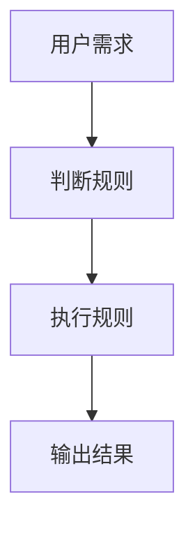
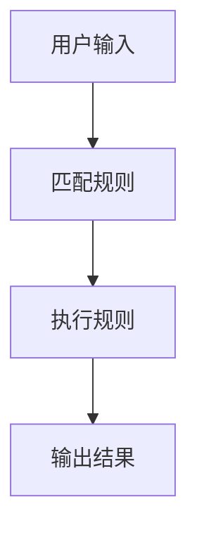
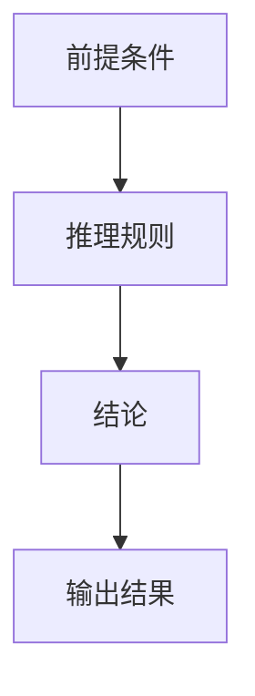
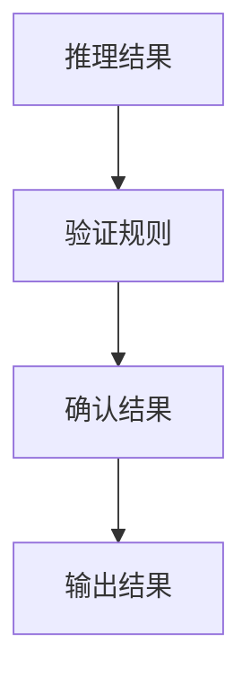
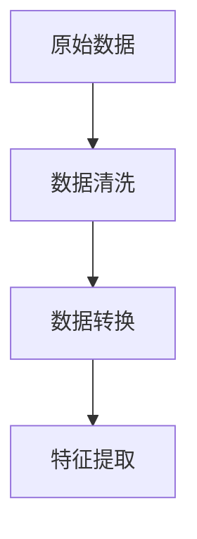
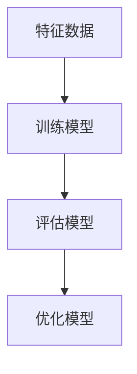
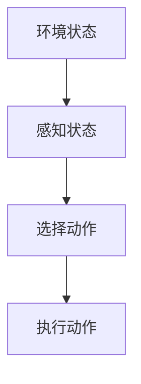
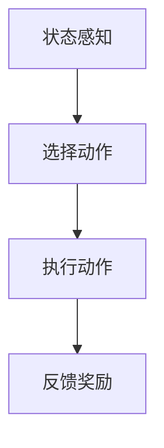
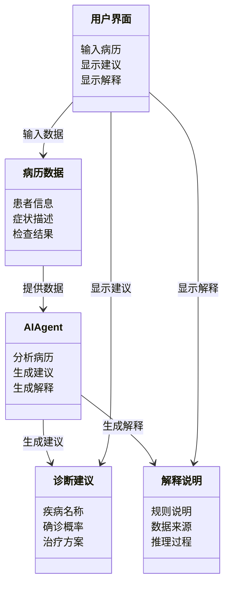

                 


# AI Agent的可解释性设计：理解AI决策过程

## 关键词：AI Agent，可解释性，决策过程，人工智能，算法原理

## 摘要：  
随着人工智能技术的快速发展，AI Agent在各个领域的应用日益广泛。然而，AI Agent的决策过程往往被视为“黑箱”，这不仅影响了用户的信任，还带来了法律和伦理上的挑战。本文从AI Agent的基本概念出发，深入探讨其可解释性的核心概念、算法原理、系统架构以及实际应用，旨在帮助读者理解AI Agent的决策过程，并掌握提升其可解释性的方法。通过具体案例分析和代码实现，本文为AI Agent的可解释性设计提供了全面的指导。

---

# 第一部分：AI Agent的基本概念与背景

## 第1章：AI Agent的基本概念与特点

### 1.1 什么是AI Agent

AI Agent（人工智能代理）是指能够感知环境、自主决策并执行任务的智能实体。与传统程序不同，AI Agent具备以下特点：

- **自主性**：AI Agent能够在没有外部干预的情况下独立运行。
- **反应性**：能够根据环境的变化调整行为。
- **目标导向**：通过设定目标来驱动决策和行动。
- **学习能力**：能够通过数据和经验不断优化自身的决策能力。

### 1.2 AI Agent的分类

AI Agent可以根据不同的标准进行分类：

#### 1.2.1 基于规则的AI Agent

基于规则的AI Agent通过预定义的规则和逻辑进行决策。例如，简单的规则可以是“如果A，则B”。这种方法具有高度的可解释性，但难以处理复杂的非线性问题。

#### 1.2.2 基于逻辑的AI Agent

基于逻辑的AI Agent通过逻辑推理来进行决策。例如，使用逻辑编程语言（如Prolog）来实现。这种方法的决策过程相对透明，但推理效率可能较低。

#### 1.2.3 基于统计学习的AI Agent

基于统计学习的AI Agent通过机器学习算法（如决策树、随机森林、支持向量机等）进行决策。这些方法通常需要大量数据支持，决策过程较为复杂，可解释性较低。

#### 1.2.4 基于强化学习的AI Agent

基于强化学习的AI Agent通过与环境的交互来学习最优策略。例如，自动驾驶系统可以通过强化学习来优化驾驶行为。这种方法通常需要大量数据和时间来训练，决策过程具有较高的复杂性。

### 1.3 AI Agent的应用场景

AI Agent的应用场景非常广泛，以下是几个典型例子：

#### 1.3.1 智能助手

智能助手（如Siri、Alexa）通过自然语言处理和任务执行来提供服务。这些AI Agent需要具备高度的可解释性，以便用户理解其行为。

#### 1.3.2 自动驾驶

自动驾驶系统需要实时感知环境并做出决策。由于安全性和法律合规性的要求，自动驾驶的决策过程必须具备高度的可解释性。

#### 1.3.3 智能客服

智能客服通过自然语言处理和对话系统为用户提供服务。可解释性对于提升用户体验和信任至关重要。

#### 1.3.4 医疗诊断辅助

医疗AI Agent需要辅助医生进行诊断，其决策过程必须具备高度的透明性和可解释性，以确保诊断的准确性和合规性。

---

## 第2章：可解释性的重要性与挑战

### 2.1 可解释性在AI Agent中的意义

可解释性是AI Agent设计中的关键问题，以下是其重要性：

#### 2.1.1 可解释性的重要性

- **用户信任**：可解释性是用户信任AI Agent的基础。用户需要理解AI Agent的决策过程，才能信任其结果。
- **法律合规**：在医疗、金融等领域，AI Agent的决策过程需要符合法律和行业规范，可解释性是合规的基础。
- **问题排查**：可解释性有助于开发者快速定位和解决问题。

#### 2.1.2 可解释性与用户信任

用户信任与AI Agent的可解释性密切相关。如果用户无法理解AI Agent的决策过程，他们可能会拒绝使用相关服务或产生抵触情绪。

#### 2.1.3 可解释性与法律合规

在一些高风险领域（如医疗、金融），AI Agent的决策过程需要符合相关法律法规。可解释性是确保AI Agent合规的关键。

### 2.2 AI Agent可解释性的挑战

尽管可解释性的重要性不言而喻，但在实际应用中仍面临诸多挑战：

#### 2.2.1 复杂算法的黑箱问题

许多先进的AI算法（如深度学习模型）是“黑箱”模型，其决策过程难以被解释。

#### 2.2.2 数据依赖性的影响

AI Agent的决策过程高度依赖数据，而数据的质量和偏差可能影响可解释性。

#### 2.2.3 用户认知差异

不同用户对AI Agent的可解释性需求可能存在差异，如何满足多样化的解释需求是一个挑战。

---

## 第3章：AI Agent决策过程的可解释性层次

### 3.1 可解释性的层次模型

可解释性可以分为以下几个层次：

#### 3.1.1 表层可解释性

表层可解释性是指AI Agent的决策过程可以通过简单的规则或逻辑进行解释。例如，基于规则的AI Agent的决策过程通常具有较高的表层可解释性。

#### 3.1.2 深层可解释性

深层可解释性是指AI Agent的决策过程可以通过复杂的推理或模型解释。例如，基于逻辑推理的AI Agent的决策过程可以被分解为多个逻辑步骤，从而实现深层可解释性。

#### 3.1.3 全局可解释性

全局可解释性是指AI Agent的决策过程可以在整体上被解释。例如，通过全局模型分析AI Agent的决策逻辑，以理解其整体行为。

### 3.2 可解释性与可理解性的关系

可解释性与可理解性密切相关，但并非完全相同。以下是两者的关系：

#### 3.2.1 可解释性的维度

- **局部可解释性**：针对特定决策的解释。
- **全局可解释性**：针对整个决策过程的解释。

#### 3.2.2 用户视角的可理解性

不同用户对可解释性的理解可能不同。例如，技术专家可能更关注模型的数学原理，而普通用户可能更关注结果的实际意义。

### 3.3 ER实体关系图

以下是AI Agent决策过程的实体关系图：

```mermaid
er
    actor: 用户
    agent: AI Agent
    rule: 决策规则
    decision: 决策结果
    environment: 环境
    action: 行为
   解释: 解释结果
    用户需求: 用户需求

    用户 --> 解释: 需求解释
    解释 <---> rule: 应用规则
    解释 <---> decision: 解释决策
    decision <---> action: 驱动行为
    agent <---> environment: 感知环境
    agent <---> decision: 生成决策
    用户 <---> 解释: 交互解释
```

---

## 第4章：AI Agent可解释性的核心概念与联系

### 4.1 可解释性原理

可解释性原理是指AI Agent如何生成和验证解释。以下是关键点：

#### 4.1.1 解释生成机制

解释生成机制是AI Agent生成解释的核心机制。例如，基于规则的AI Agent可以通过分解规则生成解释。

#### 4.1.2 解释验证方法

解释验证方法用于验证解释的准确性和合理性。例如，可以通过逻辑推理验证解释的正确性。

#### 4.1.3 解释评估标准

解释评估标准用于衡量解释的质量。例如，可以通过清晰度、准确性、完整性等指标评估解释的质量。

### 4.2 核心概念对比表

以下是AI Agent可解释性相关概念的对比表：

| 概念 | 可解释性 | 不可解释性 |
|------|----------|------------|
| 决策过程 | 可分解、可理解 | 黑箱、难以理解 |
| 算法类型 | 基于规则、逻辑 | 深度学习、强化学习 |
| 应用场景 | 智能助手、医疗诊断 | 自动驾驶、金融交易 |

### 4.3 实体关系图

以下是AI Agent解释生成过程的实体关系图：

```mermaid
er
    agent: AI Agent
    environment: 环境
    decision: 决策结果
    rule: 决策规则
    user: 用户
    explanation: 解释结果

    agent <---> environment: 感知环境
    agent <---> decision: 生成决策
    rule <---> decision: 应用规则
    agent <---> explanation: 生成解释
    user <---> explanation: 需求解释
```

---

## 第5章：AI Agent可解释性算法原理

### 5.1 基于规则的AI Agent

基于规则的AI Agent通过预定义的规则进行决策。以下是其实现流程：

#### 5.1.1 规则定义

规则定义是基于规则的AI Agent的核心。例如：



#### 5.1.2 规则匹配

规则匹配是基于规则的AI Agent的关键步骤。例如：



### 5.2 基于逻辑的AI Agent

基于逻辑的AI Agent通过逻辑推理进行决策。以下是其实现流程：

#### 5.2.1 逻辑推理

逻辑推理是基于逻辑的AI Agent的核心。例如：



#### 5.2.2 推理验证

推理验证是确保逻辑推理的正确性的重要步骤。例如：



### 5.3 基于统计学习的AI Agent

基于统计学习的AI Agent通过机器学习算法进行决策。以下是其实现流程：

#### 5.3.1 数据预处理

数据预处理是基于统计学习的AI Agent的第一步。例如：



#### 5.3.2 模型训练

模型训练是基于统计学习的AI Agent的核心步骤。例如：



### 5.4 基于强化学习的AI Agent

基于强化学习的AI Agent通过与环境的交互进行决策。以下是其实现流程：

#### 5.4.1 状态感知

状态感知是基于强化学习的AI Agent的第一步。例如：



#### 5.4.2 动作选择

动作选择是基于强化学习的AI Agent的关键步骤。例如：



---

## 第6章：AI Agent可解释性系统的分析与架构设计

### 6.1 问题场景介绍

以医疗诊断中的AI Agent为例，设计一个可解释的AI诊断系统。以下是系统设计的关键点：

#### 6.1.1 系统目标

系统目标是通过AI Agent辅助医生进行疾病诊断，同时提供可解释的决策过程。

#### 6.1.2 系统功能需求

- **病历分析**：分析患者的病历数据。
- **诊断建议**：根据病历数据生成诊断建议。
- **解释生成**：为诊断建议提供可解释性说明。

### 6.2 系统功能设计

以下是系统的功能模块设计：



### 6.3 系统架构设计

以下是系统的架构设计：


### 6.4 系统接口设计

以下是系统的接口设计：

```mermaid
sequence
    用户 --> 系统: 提交病历
    系统 --> 数据预处理: 处理病历
    数据预处理 --> AI Agent: 提供数据
    AI Agent --> 诊断建议: 生成建议
    AI Agent --> 解释说明: 生成解释
    系统 --> 用户: 显示建议
    系统 --> 用户: 显示解释
```

---

## 第7章：AI Agent可解释性项目实战

### 7.1 环境安装

以下是项目实战所需的环境和工具：

- **Python 3.8+**
- **Jupyter Notebook**
- **Scikit-learn**
- **NLTK**

### 7.2 核心代码实现

以下是基于规则的AI Agent的实现代码：

```python
# 基于规则的AI Agent实现
class RuleBasedAgent:
    def __init__(self):
        self.rules = {
            '发烧': '建议就医检查',
            '咳嗽': '建议多喝水休息',
            '头痛': '建议服用退烧药'
        }

    def diagnose(self, symptoms):
        diagnosis = []
        for symptom in symptoms:
            if symptom in self.rules:
                diagnosis.append(self.rules[symptom])
        return diagnosis

# 示例使用
agent = RuleBasedAgent()
symptoms = ['发烧', '咳嗽']
result = agent.diagnose(symptoms)
print("诊断建议:", result)
```

### 7.3 代码应用解读与分析

上述代码实现了一个基于规则的AI Agent，能够根据输入的症状生成诊断建议。以下是代码的关键点：

- **规则定义**：通过字典存储诊断规则。
- **症状处理**：遍历输入的症状，匹配规则并生成诊断建议。
- **结果输出**：返回诊断建议列表。

### 7.4 实际案例分析

以输入症状为“发烧”和“咳嗽”为例，AI Agent的诊断建议为“建议就医检查”和“建议多喝水休息”。以下是解释：

- **发烧**：根据规则，发烧需要就医检查。
- **咳嗽**：根据规则，咳嗽需要多喝水休息。

### 7.5 项目小结

通过上述实战，我们可以看到基于规则的AI Agent的实现相对简单，且具有较高的可解释性。然而，这种方法适用于简单的决策场景，对于复杂的决策问题可能需要结合其他方法。

---

## 第8章：AI Agent可解释性的最佳实践与总结

### 8.1 总结与回顾

本文从AI Agent的基本概念出发，深入探讨了其可解释性的核心概念、算法原理、系统架构以及实际应用。通过具体案例分析和代码实现，为AI Agent的可解释性设计提供了全面的指导。

### 8.2 设计原则

以下是设计AI Agent时需要注意的关键原则：

- **可解释性优先**：在设计AI Agent时，优先考虑可解释性。
- **用户为中心**：根据用户的需求和认知能力设计解释方式。
- **透明性与可控性**：确保AI Agent的决策过程透明，并提供用户可控的解释选项。

### 8.3 实施建议

以下是提升AI Agent可解释性的实施建议：

- **简化决策逻辑**：尽可能简化AI Agent的决策逻辑，使其更易于解释。
- **提供多种解释方式**：根据用户需求提供不同深度的解释方式。
- **持续优化**：通过用户反馈不断优化AI Agent的解释能力。

### 8.4 注意事项

在设计AI Agent时，需要注意以下事项：

- **数据质量**：确保数据的准确性和完整性。
- **算法选择**：根据具体场景选择合适的算法。
- **用户教育**：通过用户教育提升其对AI Agent的理解和信任。

### 8.5 拓展阅读

以下是拓展阅读的推荐内容：

- **《可解释的人工智能：模型、方法与应用》**
- **《人工智能：一种现代方法》**
- **《机器学习实战》**

---

## 作者：AI天才研究院 & 禅与计算机程序设计艺术

---

以上是关于《AI Agent的可解释性设计：理解AI决策过程》的完整文章内容，希望对您有所帮助！

