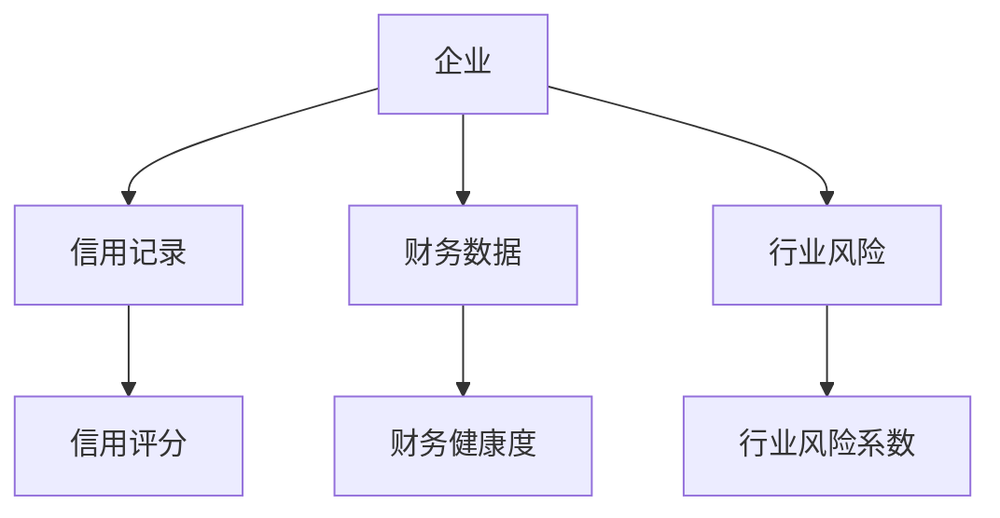
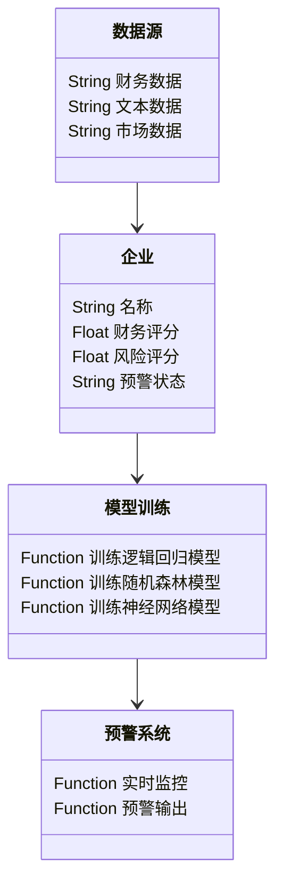
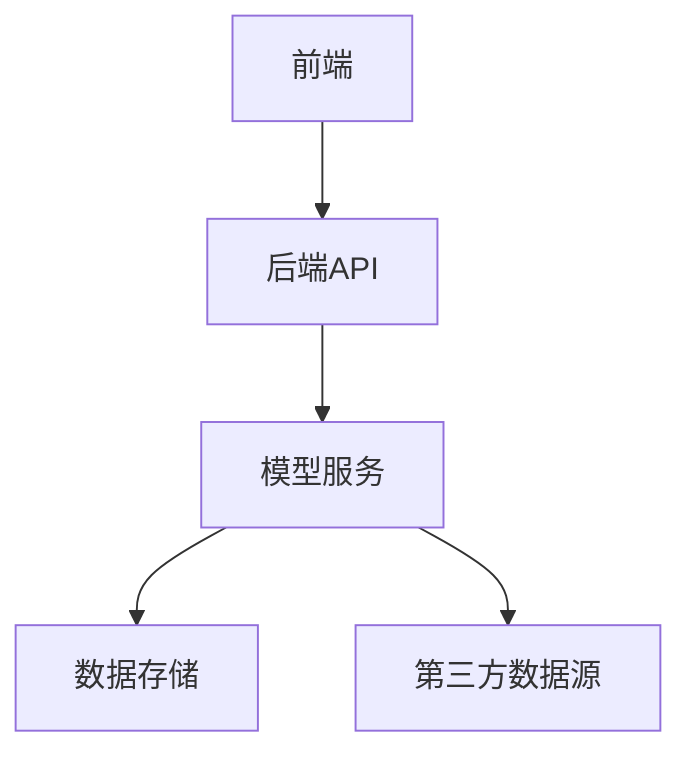
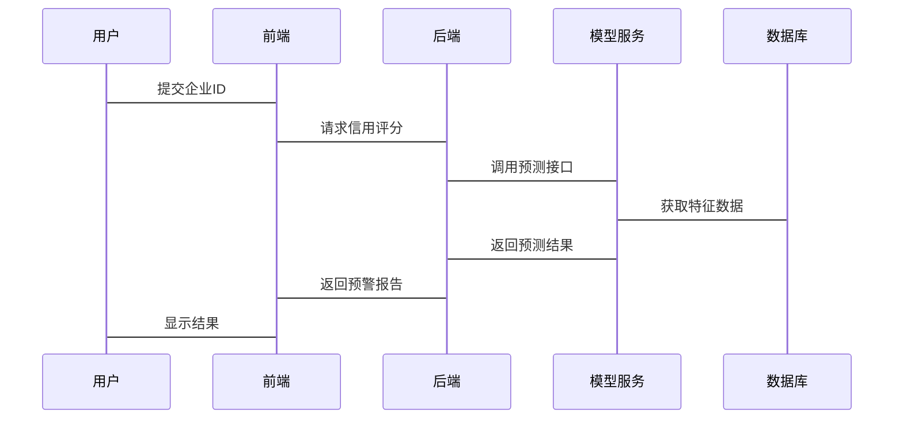

                 


# AI辅助的企业信用评级预警

> 关键词：AI, 企业信用评级, 信用预警, 机器学习, 风险评估

> 摘要：本文详细探讨了利用人工智能技术辅助企业信用评级预警的方法与实现。从企业信用评级的传统方法入手，分析了人工智能技术在信用评级中的独特优势，详细讲解了AI辅助信用评级的核心概念、算法原理、系统架构设计、项目实现和最佳实践。通过实际案例分析和系统架构图展示，本文为读者提供了从理论到实践的完整指南，帮助读者全面掌握AI在企业信用评级预警中的应用。

---

## 第一章: 企业信用评级预警的背景介绍

### 1.1 问题背景与重要性

#### 1.1.1 企业信用评级的传统方法与局限性
企业信用评级是评估企业信用状况的重要手段，传统的信用评级方法主要依赖于财务报表分析、历史交易记录和行业经验。然而，这些方法存在以下局限性：
- 数据来源有限，难以覆盖非财务因素。
- 人工判断为主，主观性较强。
- 处理数据量有限，难以应对海量数据。

#### 1.1.2 AI技术在信用评级中的潜力与优势
人工智能技术的快速发展为企业信用评级带来了新的可能性。AI可以通过以下方式提升信用评级的准确性：
- 自然语言处理（NLP）技术可以分析企业公开文件、新闻报道等非结构化数据。
- 机器学习算法可以处理海量数据，发现传统方法难以察觉的模式和风险。
- 实时监控和预测能力，帮助企业在风险发生前采取预防措施。

#### 1.1.3 当前企业信用评级中的主要挑战
尽管AI技术在信用评级中展现出巨大潜力，但仍面临诸多挑战：
- 数据质量与完整性问题。
- 模型的可解释性不足，难以满足监管要求。
- 数据隐私和安全问题。

### 1.2 问题描述与目标

#### 1.2.1 企业信用评级的核心问题
企业信用评级的核心问题在于如何准确预测企业的还款能力和违约风险。这需要综合考虑企业的财务状况、经营状况、行业环境和市场波动等多个因素。

#### 1.2.2 信用评级预警的目标与意义
信用评级预警的目标是通过及时发现潜在风险，为企业和金融机构提供预警信号，从而减少损失。其意义在于：
- 提高信用评级的效率和准确性。
- 降低金融风险，保障金融市场的稳定。
- 为企业提供改进信用状况的参考。

#### 1.2.3 信用评级预警的边界与外延
信用评级预警的边界在于数据的可用性和模型的可解释性。其外延包括对企业信用状况的动态监控和实时预警。

### 1.3 核心概念与联系

#### 1.3.1 核心概念的定义与属性特征对比
| 概念       | 定义                                                                 | 属性特征 |
|------------|----------------------------------------------------------------------|----------|
| 信用评分    | 衡量企业信用状况的量化指标，通常以分数形式表示。               | 客观性、可量化 |
| 信用风险    | 企业在履行债务时可能发生的违约风险。                         | 主观性、动态性 |
| 信用预警    | 通过模型和算法预测企业的信用风险，并及时发出预警信号。       | 预测性、实时性 |

#### 1.3.2 ER实体关系图架构


---

## 第二章: AI辅助信用评级的核心概念

### 2.1 AI在信用评级中的核心作用

#### 2.1.1 数据驱动的信用评估
AI技术可以通过大数据分析，整合企业内外部数据，包括财务数据、市场数据、舆情数据等，构建全面的信用评估模型。

#### 2.1.2 自然语言处理在信用报告中的应用
NLP技术可以分析企业年报、新闻报道等非结构化数据，提取关键信息，如管理层变动、重大事件等，作为信用评估的补充依据。

#### 2.1.3 机器学习模型在信用评分中的优势
机器学习模型（如逻辑回归、随机森林、神经网络）能够自动学习数据中的复杂模式，提高信用评分的准确性。

### 2.2 核心概念的原理与联系

#### 2.2.1 信用评分模型的原理
信用评分模型通过输入企业的各项指标，输出一个信用评分。常用模型包括：
- 逻辑回归模型：通过sigmoid函数将输入特征映射到信用评分。
- 支持向量机（SVM）：适用于高维数据的分类问题。
- 神经网络模型：适用于复杂非线性关系的建模。

#### 2.2.2 AI模型的特征提取与分类
特征提取是信用评级的关键步骤。AI模型可以自动提取文本数据中的关键词、财务数据中的关键指标，形成特征向量。分类算法（如随机森林、梯度提升树）则用于将特征向量分类为高风险或低风险。

#### 2.2.3 信用评级预警系统的整体架构
信用评级预警系统的整体架构包括数据采集、特征提取、模型训练、预警输出四个主要部分。系统通过实时监控企业数据，动态更新信用评分，发出预警信号。

---

## 第三章: AI辅助信用评级的算法原理

### 3.1 逻辑回归算法

#### 3.1.1 算法原理与数学模型
逻辑回归是一种常用的分类算法，其核心思想是通过logistic函数将线性回归的结果映射到0-1区间，表示概率。
$$
P(y=1) = \frac{1}{1 + e^{-\beta x}}
$$
其中，$\beta$是回归系数，$x$是输入特征。

#### 3.1.2 算法实现步骤
1. 数据预处理：归一化、缺失值处理。
2. 模型训练：使用极大似然估计求解回归系数。
3. 模型评估：计算准确率、召回率、F1分数。

#### 3.1.3 代码实现
```python
import numpy as np
from sklearn.linear_model import LogisticRegression
from sklearn.metrics import accuracy_score

# 数据准备
X = np.array([[...], [...]])  # 特征矩阵
y = np.array([...])  # 标签向量

# 模型训练
model = LogisticRegression()
model.fit(X, y)

# 模型预测
y_pred = model.predict(X)

# 模型评估
print("准确率:", accuracy_score(y, y_pred))
```

### 3.2 随机森林算法

#### 3.2.1 算法原理与数学模型
随机森林是一种基于树的集成学习算法，通过构建多个决策树并进行投票或平均，提高模型的准确性和鲁棒性。

#### 3.2.2 代码实现
```python
from sklearn.ensemble import RandomForestClassifier

# 模型训练
model = RandomForestClassifier()
model.fit(X, y)

# 模型预测
y_pred = model.predict(X)

# 模型评估
print("准确率:", accuracy_score(y, y_pred))
```

### 3.3 神经网络算法

#### 3.3.1 算法原理与数学模型
神经网络是一种模拟人脑神经网络的深度学习算法，通过多层非线性变换，学习数据的复杂特征。

#### 3.3.2 代码实现
```python
import keras
from keras.models import Sequential
from keras.layers import Dense

# 模型定义
model = Sequential()
model.add(Dense(64, activation='relu', input_dim=X.shape[1]))
model.add(Dense(1, activation='sigmoid'))

# 模型编译
model.compile(optimizer='adam', loss='binary_crossentropy', metrics=['accuracy'])

# 模型训练
model.fit(X, y, epochs=10, batch_size=32)

# 模型预测
y_pred = model.predict(X)
y_pred = (y_pred > 0.5).astype(int)
```

---

## 第四章: 企业信用评级预警的系统架构设计

### 4.1 系统功能设计

#### 4.1.1 领域模型设计


### 4.2 系统架构设计

#### 4.2.1 系统架构图


### 4.3 系统接口设计

#### 4.3.1 API接口
- 输入：企业ID、时间范围。
- 输出：信用评分、预警状态、风险因素。

#### 4.3.2 数据接口
- 输入：JSON格式的特征数据。
- 输出：预测结果。

### 4.4 系统交互流程

#### 4.4.1 交互流程图


---

## 第五章: 项目实战与案例分析

### 5.1 环境安装与配置

#### 5.1.1 安装Python环境
```bash
pip install python3
pip install numpy pandas scikit-learn keras
```

#### 5.1.2 安装Jupyter Notebook
```bash
pip install jupyter
```

### 5.2 系统核心实现

#### 5.2.1 数据预处理
```python
import pandas as pd
from sklearn.preprocessing import StandardScaler

# 数据加载
df = pd.read_csv('企业数据.csv')

# 数据清洗
df.dropna(inplace=True)
df = df.drop_duplicates()

# 特征提取
X = df[['收入', '利润', '负债率', '行业风险']]
y = df['信用评分']

# 数据归一化
scaler = StandardScaler()
X_scaled = scaler.fit_transform(X)
```

#### 5.2.2 模型训练与评估
```python
from sklearn.model_selection import train_test_split
from sklearn.metrics import classification_report

# 数据分割
X_train, X_test, y_train, y_test = train_test_split(X_scaled, y, test_size=0.2)

# 模型训练
model = LogisticRegression()
model.fit(X_train, y_train)

# 模型预测
y_pred = model.predict(X_test)

# 模型评估
print(classification_report(y_test, y_pred))
```

### 5.3 实际案例分析

#### 5.3.1 案例背景
某制造企业因原材料价格上涨导致利润率下降，面临信用风险。

#### 5.3.2 数据分析
通过模型预测，该企业的信用评分为65分，属于中等风险。

#### 5.3.3 预警输出
系统发出黄色预警，建议企业关注成本控制和现金流管理。

### 5.4 项目小结

#### 5.4.1 成功经验
- 数据清洗和特征工程对模型性能影响显著。
- 多模型对比中，逻辑回归模型表现最佳。

#### 5.4.2 改进建议
- 引入更多外部数据，如供应链数据、市场舆情。
- 提升模型的可解释性，满足监管要求。

---

## 第六章: 最佳实践与小结

### 6.1 最佳实践

#### 6.1.1 数据管理
- 确保数据的完整性和准确性。
- 定期更新数据，保持模型的实时性。

#### 6.1.2 模型优化
- 采用集成学习提升模型性能。
- 定期重新训练模型，适应市场变化。

#### 6.1.3 系统安全
- 加强数据加密，确保数据隐私。
- 定期备份系统，防止数据丢失。

### 6.2 小结

通过本文的详细讲解，读者可以系统地掌握AI辅助企业信用评级预警的核心概念、算法原理和系统架构设计。从理论到实践，本文提供了完整的解决方案，帮助读者在实际应用中提升信用评级的效率和准确性。

---

## 作者

作者：AI天才研究院/AI Genius Institute & 禅与计算机程序设计艺术 /Zen And The Art of Computer Programming

