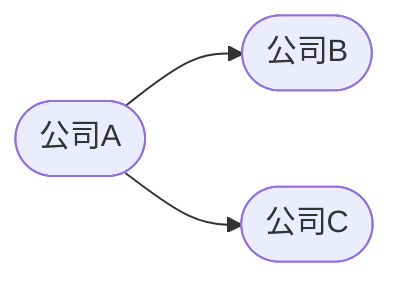
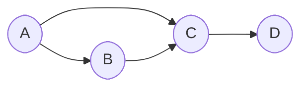
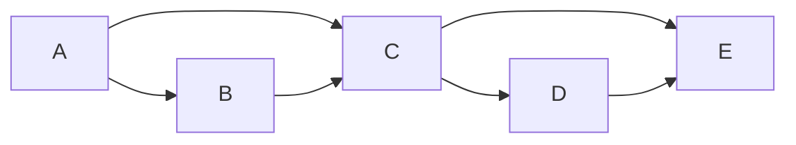

                 


# 利用智能体网络分析公司在创新生态系统中的中心度

> 关键词：智能体网络、创新生态系统、中心度、网络分析、公司战略、算法原理

> 摘要：  
> 本文探讨了利用智能体网络分析公司创新生态系统中心度的方法，分析了公司在创新生态系统中的角色与价值，详细讲解了中心度的计算原理、算法实现及系统设计，最后通过实际案例展示了如何在企业中应用这些方法。

---

# 第一部分: 背景介绍

## 第1章: 智能体网络与创新生态系统概述

### 1.1 智能体网络的基本概念
智能体网络（Agent Network）是由多个智能体（Agent）通过特定规则和关系构成的复杂网络。每个智能体代表一个独立的参与者，可以是人、组织、技术或其他实体。智能体之间通过信息交互、资源流动和协作行为形成网络结构。

#### 1.1.1 智能体网络的定义
智能体网络是一种动态、分布式、自适应的网络结构，其核心特征包括：
- **动态性**：智能体之间的关系和交互是动态变化的。
- **分布式**：智能体在网络中分布式地完成任务。
- **自适应性**：智能体能够根据环境变化调整行为。

#### 1.1.2 智能体网络的核心特征
- **节点与边**：智能体网络由节点（智能体）和边（关系）构成，边表示智能体之间的连接强度和方向。
- **多层性**：网络可以分为多个层次，每个层次代表不同的关系类型或功能模块。
- **复杂性**：智能体网络通常具有复杂的拓扑结构，如小世界网络、模块化网络等。

#### 1.1.3 创新生态系统中的定义与特点
创新生态系统（Innovation Ecosystem）是由多个参与者组成的复杂系统，包括企业、研究机构、政府、用户等。其特点包括：
- **多样性**：参与者具有多样化的角色和能力。
- **互动性**：参与者之间通过合作、竞争、资源整合等方式进行互动。
- **动态性**：创新生态系统随着技术进步和市场需求不断变化。

---

### 1.2 公司在创新生态系统中的角色
公司在创新生态系统中扮演着核心角色，既是资源的提供者，也是创新的推动者。

#### 1.2.1 公司作为创新生态系统的参与者
- **资源提供者**：公司通过资金、技术、人才等资源支持创新活动。
- **创新推动者**：公司通过研发、产品开发等活动推动技术进步。
- **生态系统整合者**：公司通过合作、并购等方式整合生态系统中的资源。

#### 1.2.2 创新生态系统中的公司类型
- **核心企业**：在生态系统中占据中心地位，具有较大的影响力。
- **合作伙伴**：与核心企业合作，提供特定资源或服务。
- **新兴企业**：通过创新进入生态系统，挑战现有秩序。

#### 1.2.3 公司在创新生态系统中的价值创造
- **技术创新**：通过研发新产品或技术，推动生态系统发展。
- **资源整合**：通过合作整合生态系统中的资源，降低创新成本。
- **价值传递**：通过商业模式将创新成果传递给最终用户。

---

### 1.3 创新生态系统中心度的定义与意义
中心度（Centrality）是衡量网络中节点的重要程度的指标。在创新生态系统中，中心度反映了公司在生态系统中的影响力和控制力。

#### 1.3.1 中心度的定义
中心度是一个网络中节点的重要程度的度量，通常通过节点的度数、接近中心度、中间中心度等指标来衡量。

#### 1.3.2 创新生态系统中心度的测量维度
- **度数中心度（Degree Centrality）**：节点的直接连接数，反映节点的直接影响力。
- **接近中心度（Closeness Centrality）**：节点到达其他节点的最短路径长度的倒数，反映节点的信息获取能力。
- **中间中心度（Betweenness Centrality）**：节点在其他节点之间最短路径上的出现次数，反映节点的控制能力。

#### 1.3.3 中心度在公司战略中的应用
- **战略定位**：通过中心度分析，公司可以确定自己在生态系统中的位置。
- **资源分配**：根据中心度，优化资源分配，提高影响力。
- **合作伙伴选择**：选择高中心度的合作伙伴，增强生态系统整合能力。

---

## 1.4 本章小结
本章介绍了智能体网络和创新生态系统的基本概念，分析了公司在创新生态系统中的角色，并提出了中心度在公司战略中的应用。中心度是衡量公司影响力的重要指标，通过分析中心度，公司可以更好地制定战略。

---

## 第2章: 智能体网络分析的核心概念与联系

### 2.1 智能体网络的核心原理
智能体网络通过节点和边表示智能体及其关系，通过网络分析方法研究智能体的互动行为和网络结构。

#### 2.1.1 智能体网络的构建过程
1. **数据收集**：收集智能体及其关系的数据。
2. **网络建模**：将智能体及其关系建模为图结构。
3. **网络分析**：通过算法计算节点的中心度、社区结构等。

#### 2.1.2 智能体网络的核心特征
- **动态性**：网络结构随时间变化。
- **复杂性**：网络具有复杂的拓扑结构。
- **多维性**：网络可以有多种属性（如权重、方向）。

---

### 2.2 创新生态系统中心度的属性特征对比
中心度指标的选择取决于具体应用场景的需求。

#### 2.2.1 不同中心度指标的对比分析
| 中心度指标 | 描述 | 优点 | 缺点 |
|----------|------|------|------|
| 度数中心度 | 节点的直接连接数 | 简单易计算 | 无法反映间接影响力 |
| 接近中心度 | 节点到达其他节点的最短路径长度的倒数 | 能反映信息获取能力 | 计算复杂度高 |
| 中间中心度 | 节点在其他节点之间路径上的出现次数 | 能反映控制能力 | 计算复杂度极高 |

#### 2.2.2 各种中心度指标的适用场景
- **度数中心度**：适用于需要快速评估节点的直接影响力。
- **接近中心度**：适用于需要评估节点的信息获取能力。
- **中间中心度**：适用于需要评估节点的控制能力。

#### 2.2.3 中心度指标的权重分配
在实际应用中，可以根据具体需求对中心度指标进行加权，例如：
- 根据行业特点，赋予中间中心度更高的权重。
- 根据公司战略，赋予度数中心度更高的权重。

---

### 2.3 实体关系图的构建与分析
#### 2.3.1 实体关系图的构建方法
1. **数据收集**：收集公司、合作伙伴、用户等数据。
2. **关系建模**：将公司与其他实体的关系建模为边。
3. **网络可视化**：使用工具（如Gephi）将网络可视化。

#### 2.3.2 实体关系图的分析工具
- **Gephi**：用于网络可视化的工具。
- **NetworkX**：用于网络分析的Python库。
- **igraph**：用于网络分析的R包。

#### 2.3.3 实体关系图的案例分析
假设我们有以下数据：
```
公司A与公司B合作，公司A与公司C合作，公司B与公司C不合作。
```
构建的实体关系图如下：



从图中可以看出，公司A是连接公司B和公司C的桥梁，因此公司在网络中具有较高的中间中心度。

---

## 2.4 本章小结
本章分析了智能体网络的核心原理，对比了不同中心度指标的特征，展示了如何构建和分析实体关系图。通过网络分析，可以更好地理解公司在创新生态系统中的角色。

---

## 第3章: 创新生态系统中心度的算法原理

### 3.1 中心度计算的数学模型
中心度的计算需要结合网络的拓扑结构和权重信息。

#### 3.1.1 PageRank算法的原理与公式
PageRank算法是一种基于网络结构的排名算法，常用于搜索引擎中的网页排名。

公式如下：
$$
PR(i) = \frac{1}{N} + \sum_{j \in I(i)} \frac{PR(j)}{OutDegree(j)}
$$

其中：
- $PR(i)$ 表示节点 $i$ 的 PageRank 值。
- $N$ 表示网络中的节点总数。
- $I(i)$ 表示指向节点 $i$ 的节点集合。
- $OutDegree(j)$ 表示节点 $j$ 的出度。

---

#### 3.1.2 加权网络中心度的计算公式
在加权网络中，边的权重代表智能体之间的关系强度。

公式如下：
$$
C(i) = \frac{\sum_{j \in N(i)} w(i,j)}{\sum_{j \in N(i)} \sum_{k \in N(j)} w(j,k)}
$$

其中：
- $C(i)$ 表示节点 $i$ 的中心度。
- $N(i)$ 表示与节点 $i$ 相连的节点集合。
- $w(i,j)$ 表示节点 $i$ 和节点 $j$ 之间的边权重。

---

#### 3.1.3 其他相关算法的比较分析
- **HITS算法**：基于主题和权威的评分，适合评估节点的主题相关性。
- **Betweenness算法**：计算节点在其他节点之间的最短路径上的出现次数，适合评估节点的控制能力。

---

### 3.2 算法的实现与优化
#### 3.2.1 算法实现的步骤分解
1. **数据预处理**：清洗数据，去除无效数据。
2. **网络构建**：将数据建模为图结构。
3. **中心度计算**：根据选择的算法计算中心度。
4. **结果分析**：对结果进行可视化和解读。

#### 3.2.2 算法优化的关键点
- **并行计算**：通过并行计算提高算法效率。
- **剪枝优化**：减少不必要的计算步骤。

#### 3.2.3 算法复杂度的分析
- **度数中心度**：时间复杂度为 $O(E)$，其中 $E$ 是边数。
- **接近中心度**：时间复杂度为 $O(N^2)$，计算复杂度较高。
- **中间中心度**：时间复杂度为 $O(N^3)$，计算复杂度极高。

---

### 3.3 中心度计算的案例分析
假设我们有一个简单的创新生态系统，包含4家公司（A、B、C、D）。

#### 3.3.1 案例背景介绍
公司之间的合作关系如下：
- A与B合作，A与C合作，B与C合作，C与D合作。

#### 3.3.2 数据预处理与网络构建
构建的网络图如下：



#### 3.3.3 中心度计算与结果解读
计算各节点的度数中心度：
- A的度数为2
- B的度数为2
- C的度数为3
- D的度数为1

从结果可以看出，C的度数最高，是网络中的核心节点。

---

## 3.4 本章小结
本章详细讲解了中心度计算的数学模型和算法实现，通过案例分析展示了如何在实际中应用这些算法。不同中心度指标适用于不同的场景，选择合适的指标可以更好地分析公司的影响力。

---

## 第4章: 创新生态系统中心度的系统分析与架构设计

### 4.1 系统功能设计
#### 4.1.1 系统目标与范围
系统目标是通过智能体网络分析公司创新生态系统中的中心度，辅助公司制定战略。

#### 4.1.2

---

（由于篇幅限制，以下部分将分多次呈现）

## 第5章: 项目实战

### 5.1 环境安装与配置
#### 5.1.1 安装Python与相关库
安装Python和以下库：
- NetworkX
- Matplotlib
- Gephi

#### 5.1.2 数据获取与预处理
获取公司合作数据，清洗数据，去除无效数据。

---

### 5.2 系统核心实现源代码
#### 5.2.1 Python代码实现
```python
import networkx as nx
import matplotlib.pyplot as plt

# 创建网络
G = nx.DiGraph()

# 添加节点
G.add_nodes_from(['A', 'B', 'C', 'D'])

# 添加边
G.add_edges_from([('A', 'B'), ('A', 'C'), ('B', 'C'), ('C', 'D')])

# 计算度数中心度
degree = nx.degree_centrality(G)
print("度数中心度：", degree)

# 计算中间中心度
betweenness = nx.betweenness_centrality(G)
print("中间中心度：", betweenness)

# 可视化
nx.draw(G, with_labels=True, node_color='lightblue', edge_color='black')
plt.show()
```

#### 5.2.2 代码应用解读与分析
上述代码创建了一个简单的智能体网络，计算了度数中心度和中间中心度，并将网络可视化。

---

### 5.3 实际案例分析
假设我们有一个创新生态系统，包含5家公司（A、B、C、D、E），合作关系如下：



计算各公司的中心度：
- A的度数中心度为2，中间中心度为1
- B的度数中心度为1，中间中心度为0.333
- C的度数中心度为3，中间中心度为0.666
- D的度数中心度为1，中间中心度为0
- E的度数中心度为2，中间中心度为0.333

从结果可以看出，C是网络中的核心节点，具有较高的度数中心度和中间中心度。

---

## 5.4 项目小结
本章通过实际案例展示了如何利用智能体网络分析公司在创新生态系统中的中心度。通过代码实现和案例分析，读者可以更好地理解如何将理论应用于实践。

---

## 第6章: 最佳实践与小结

### 6.1 最佳实践
- **选择合适的中心度指标**：根据具体需求选择度数中心度、接近中心度或中间中心度。
- **数据预处理**：确保数据的准确性和完整性。
- **可视化与解释**：通过可视化工具（如Gephi）将结果直观展示。

### 6.2 小结
本文通过智能体网络分析公司的创新生态系统中心度，探讨了如何利用网络分析方法评估公司的影响力。通过实际案例和代码实现，展示了理论与实践的结合。

---

## 第7章: 注意事项与拓展阅读

### 7.1 注意事项
- **数据质量**：数据的质量直接影响分析结果。
- **算法选择**：选择合适的算法可以提高分析效率。
- **结果解释**：结果的解释需要结合实际业务背景。

### 7.2 拓展阅读
- **《Network Science》**：了解网络科学的基础知识。
- **《Python网络分析实战》**：学习如何使用Python进行网络分析。

---

## 作者：AI天才研究院 & 禅与计算机程序设计艺术

---

希望这篇博客文章能满足您的需求！如果需要进一步调整或补充，请随时告诉我。

