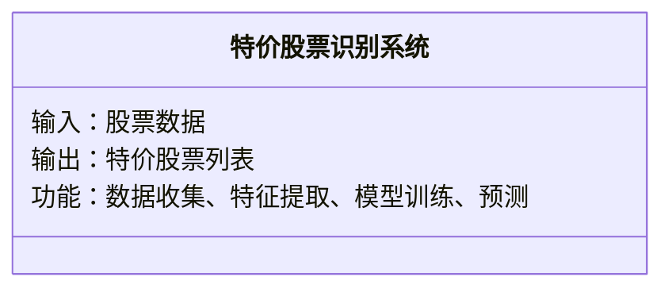
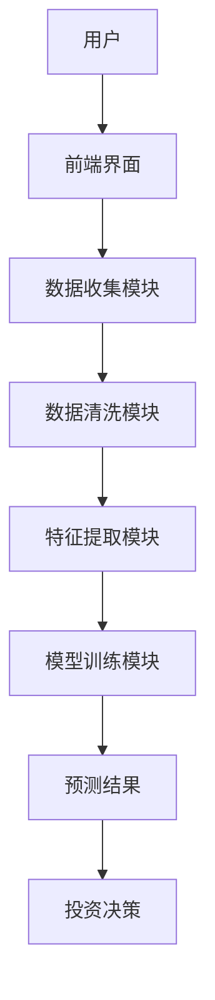
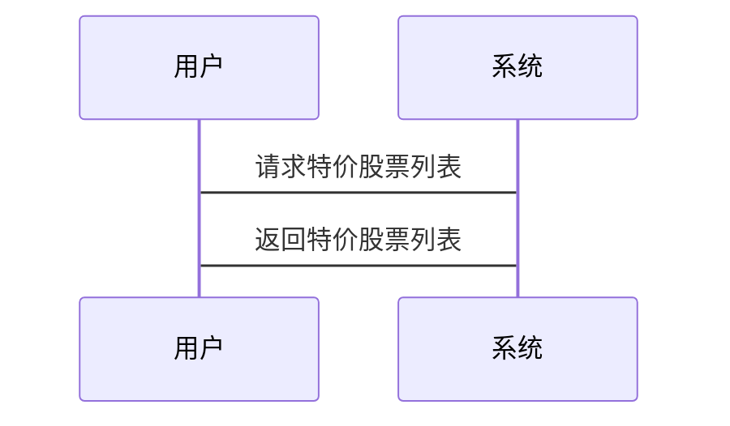

                 


# 如何利用特价股票策略进行逆向投资

> 关键词：特价股票，逆向投资，股票策略，投资策略，股票分析

> 摘要：本文深入探讨了如何利用特价股票策略进行逆向投资，分析了特价股票和逆向投资的核心概念、算法原理、系统设计、项目实战及最佳实践。通过详细讲解和实际案例，帮助读者掌握如何在市场中识别特价股票，并通过逆向投资策略实现收益最大化。

---

## 第1章: 特价股票与逆向投资的背景介绍

### 1.1 特价股票的定义与特点

#### 1.1.1 特价股票的定义
特价股票是指市场价格显著低于其内在价值的股票。这种股票通常被市场低估，可能是由于市场恐慌、公司短期问题或市场参与者情绪化决策导致的。

#### 1.1.2 特价股票的特点
- **低估值**：市盈率、市净率等指标远低于行业平均水平。
- **高潜力**：具有较高的增长潜力，但市场未充分反映。
- **逆周期性**：在市场低迷时更容易出现特价股票。

#### 1.1.3 特价股票与正常股票的区别
| 特性 | 特价股票 | 正常股票 |
|------|----------|----------|
| 市盈率 | 低于行业均值 | 接近或高于行业均值 |
| 市净率 | 低于行业均值 | 接近或高于行业均值 |
| 市场情绪 | 多数投资者看空 | 多数投资者看多 |
| 交易量 | 通常较低 | 通常较高 |

### 1.2 逆向投资的定义与特点

#### 1.2.1 逆向投资的定义
逆向投资是一种投资策略，即在市场低迷、投资者情绪低落时买入资产，在市场繁荣、投资者情绪高涨时卖出资产。逆向投资者相信市场先生的情绪化定价，能够在市场恐慌时找到低估资产，市场狂热时避免高估资产。

#### 1.2.2 逆向投资的特点
- **反周期性**：在市场低谷时买入，在市场高点时卖出。
- **逆向思维**：与市场情绪相反，寻找被市场忽视的机会。
- **长期视角**：注重资产的长期价值，而非短期波动。

### 1.3 特价股票策略与逆向投资的关系

#### 1.3.1 特价股票策略的定义
特价股票策略是一种基于价值投资的策略，旨在通过识别市场价格低于内在价值的股票，进行长期持有，等待市场重新发现其价值。

#### 1.3.2 逆向投资在特价股票策略中的应用
逆向投资与特价股票策略的结合，使得投资者能够在市场低迷时，以更低的价格买入具有潜在增长能力的股票，从而在市场复苏时获得超额收益。

#### 1.3.3 两者的结合与优势
- **双重优势**：逆向投资帮助在市场低谷时发现特价股票，特价股票策略确保买入的股票具有长期增长潜力。
- **风险控制**：通过逆向投资，投资者能够在市场恐慌时以更低的价格买入股票，降低投资成本。

### 1.4 本章小结

#### 1.4.1 特价股票与逆向投资的核心概念
- 特价股票：市场价格低于内在价值的股票。
- 逆向投资：在市场低谷时买入，市场高点时卖出的投资策略。

#### 1.4.2 两者结合的策略优势
- 在市场低迷时，逆向投资帮助发现特价股票。
- 特价股票策略确保买入的股票具有长期增长潜力。

---

## 第2章: 特价股票策略的核心概念与分析

### 2.1 特价股票的识别与筛选

#### 2.1.1 市场分析与股票筛选方法
- **市场周期分析**：识别市场处于熊市或低谷期，寻找可能的特价股票。
- **行业分析**：选择景气度回升的行业，寻找具有竞争优势的公司。

#### 2.1.2 市盈率与市净率的计算与应用
- **市盈率（P/E）**：股票价格除以每股收益，用于衡量股票的估值。
  $$ P/E = \frac{\text{股价}}{\text{每股收益}} $$
- **市净率（P/B）**：股票价格除以每股净资产，用于衡量股票的估值。
  $$ P/B = \frac{\text{股价}}{\text{每股净资产}} $$

#### 2.1.3 公司基本面分析与财务指标评估
- **盈利能力**：净利润、ROE（净资产收益率）等指标。
- **成长能力**：收入增长率、净利润增长率等指标。
- **财务健康度**：资产负债率、流动比率等指标。

### 2.2 逆向投资的逻辑与心理

#### 2.2.1 市场恐慌与非理性行为分析
- **市场恐慌**：投资者因恐慌而抛售资产，导致资产价格低于其内在价值。
- **非理性行为**：投资者受情绪影响，做出短期决策。

#### 2.2.2 投资者心理与逆向投资机会
- **恐惧与贪婪**：市场恐慌时，投资者恐惧导致资产价格被低估；市场繁荣时，投资者贪婪导致资产价格被高估。
- **羊群效应**：投资者跟随市场主流情绪，忽视独立思考。

#### 2.2.3 逆向投资中的风险控制
- **分散投资**：避免过度集中，降低风险。
- **严格止损**：设定止损点，避免重大损失。

### 2.3 特价股票策略的核心要素

#### 2.3.1 市场周期分析
- **熊市**：市场整体低迷，投资者情绪低落，容易出现特价股票。
- **震荡市**：市场波动较大，需要谨慎筛选股票。

#### 2.3.2 公司估值模型
- **DCF模型**：现金流贴现模型，用于估算公司内在价值。
  $$ V = \sum_{t=1}^{n} \frac{\text{CF}_t}{(1+r)^t} + \frac{TV}{(1+r)^n} $$
- **相对估值法**：与行业平均水平或可比公司进行比较。

#### 2.3.3 风险与收益的平衡
- **收益**：通过长期持有特价股票，获得资本增值和分红收益。
- **风险**：市场波动、公司基本面变化等风险。

### 2.4 本章小结

#### 2.4.1 特价股票策略的核心要素
- 市场周期分析：识别市场处于低谷期。
- 公司估值模型：准确评估公司内在价值。
- 风险控制：分散投资，设定止损。

#### 2.4.2 逆向投资中的心理与逻辑
- 市场恐慌与非理性行为分析：识别特价股票的机会。
- 投资者心理：利用市场情绪波动，进行逆向投资。

---

## 第3章: 特价股票策略的算法与数学模型

### 3.1 特价股票识别的算法原理

#### 3.1.1 算法概述
- **数据收集**：收集目标股票的历史价格、财务数据等。
- **数据清洗**：处理缺失值、异常值等。
- **特征提取**：提取市盈率、市净率等特征。
- **模型训练**：使用机器学习模型，识别特价股票。

#### 3.1.2 算法实现

```python
import pandas as pd
import numpy as np
from sklearn.linear_model import LinearRegression

# 数据收集与清洗
data = pd.read_csv('stock_data.csv')
data = data.dropna()

# 特征提取
features = data[['PE', 'PB', 'ROE']]
target = data['Price']

# 模型训练
model = LinearRegression()
model.fit(features, target)

# 预测特价股票
predicted_price = model.predict(features)
error = np.mean((predicted_price - target) ** 2)
print(f'Mean squared error: {error}')
```

#### 3.1.3 算法优化
- **特征选择**：使用Lasso回归或随机森林等方法，优化特征选择。
- **模型调优**：调整模型参数，提高预测精度。

### 3.2 逆向投资的数学模型

#### 3.2.1 投资组合优化
- **均值-方差优化**：在给定风险下，最大化收益。
  $$ \text{Minimize } \sigma^2 \text{ subject to } \mu \geq \text{target return} $$

#### 3.2.2 风险调整后收益
- **夏普比率**：衡量投资回报的风险调整后收益。
  $$ \text{夏普比率} = \frac{\mu_p - \mu_r}{\sigma_p} $$

### 3.3 算法与模型的结合

#### 3.3.1 算法流程图
```mermaid
graph TD
    A[开始] -> B[数据收集]
    B -> C[数据清洗]
    C -> D[特征提取]
    D -> E[模型训练]
    E -> F[预测特价股票]
    F -> G[投资决策]
    G -> H[结束]
```

#### 3.3.2 模型实现
```python
import pandas as pd
import numpy as np
from sklearn.ensemble import RandomForestRegressor

# 数据收集与清洗
data = pd.read_csv('stock_data.csv')
data = data.dropna()

# 特征提取
features = data[['PE', 'PB', 'ROE', 'Revenue_Growth']]
target = data['Price']

# 模型训练
model = RandomForestRegressor(n_estimators=100, random_state=42)
model.fit(features, target)

# 预测特价股票
predicted_price = model.predict(features)
error = np.mean((predicted_price - target) ** 2)
print(f'Mean squared error: {error}')
```

### 3.4 本章小结

#### 3.4.1 算法与数学模型的核心优势
- 数据驱动：通过机器学习模型，提高特价股票识别的准确性。
- 模型优化：通过特征选择和模型调优，提高预测精度。

#### 3.4.2 逆向投资中的数学模型
- 投资组合优化：在给定风险下，最大化收益。
- 风险调整后收益：通过夏普比率，衡量投资回报的风险调整后收益。

---

## 第4章: 特价股票策略的系统分析与架构设计

### 4.1 系统功能设计

#### 4.1.1 领域模型


#### 4.1.2 系统架构设计


### 4.2 系统接口设计

#### 4.2.1 接口描述
- **输入接口**：股票数据接口，包括历史价格、财务数据等。
- **输出接口**：特价股票列表，包括股票代码、预测价格等。

### 4.3 系统交互流程

#### 4.3.1 交互流程图


### 4.4 本章小结

#### 4.4.1 系统功能设计
- 数据收集模块：收集股票数据。
- 特征提取模块：提取市盈率、市净率等特征。
- 模型训练模块：训练机器学习模型，预测特价股票。

#### 4.4.2 系统架构设计
- 前端界面：用户输入需求，获取结果。
- 后端系统：数据处理、模型训练、结果输出。

---

## 第5章: 特价股票策略的项目实战

### 5.1 环境配置

#### 5.1.1 安装依赖
```bash
pip install pandas numpy scikit-learn
```

### 5.2 核心实现

#### 5.2.1 特价股票识别算法实现
```python
import pandas as pd
import numpy as np
from sklearn.ensemble import RandomForestRegressor

# 数据收集与清洗
data = pd.read_csv('stock_data.csv')
data = data.dropna()

# 特征提取
features = data[['PE', 'PB', 'ROE', 'Revenue_Growth']]
target = data['Price']

# 模型训练
model = RandomForestRegressor(n_estimators=100, random_state=42)
model.fit(features, target)

# 预测特价股票
predicted_price = model.predict(features)
error = np.mean((predicted_price - target) ** 2)
print(f'Mean squared error: {error}')
```

#### 5.2.2 逆向投资策略实现
```python
import pandas as pd
import numpy as np
from sklearn.ensemble import RandomForestRegressor

# 数据收集与清洗
data = pd.read_csv('stock_data.csv')
data = data.dropna()

# 特征提取
features = data[['PE', 'PB', 'ROE', 'Revenue_Growth']]
target = data['Price']

# 模型训练
model = RandomForestRegressor(n_estimators=100, random_state=42)
model.fit(features, target)

# 预测特价股票
predicted_price = model.predict(features)
error = np.mean((predicted_price - target) ** 2)
print(f'Mean squared error: {error}')
```

### 5.3 案例分析与结果解读

#### 5.3.1 案例分析
假设我们有一个包含多只股票的数据集，通过上述算法，我们可以识别出价格显著低于其内在价值的股票。

#### 5.3.2 结果解读
通过模型预测，我们可以得到每只股票的预测价格。如果预测价格低于当前价格，说明该股票可能是特价股票，值得买入。

### 5.4 本章小结

#### 5.4.1 项目实战的核心步骤
- 环境配置：安装必要的库。
- 核心实现：数据收集、特征提取、模型训练、预测。
- 案例分析：通过实际案例，验证算法的有效性。

#### 5.4.2 投资策略的实现
- 通过算法识别特价股票。
- 结合逆向投资策略，进行长期持有。

---

## 第6章: 特价股票策略的最佳实践

### 6.1 投资策略 tips

#### 6.1.1 风险控制
- 设置止损点，避免重大损失。
- 分散投资，降低风险。

#### 6.1.2 市场分析
- 关注宏观经济指标，如GDP、利率等。
- 了解行业趋势，选择景气度回升的行业。

### 6.2 小结

#### 6.2.1 本章总结
- 风险控制：通过止损点和分散投资，降低投资风险。
- 市场分析：关注宏观经济和行业趋势，选择合适的投资标的。

### 6.3 注意事项

#### 6.3.1 风险提示
- 投资有风险，入市需谨慎。
- 特价股票策略并非稳赚不赔，需谨慎操作。

### 6.4 拓展阅读

#### 6.4.1 推荐书籍
- 《价值投资实战策略》
- 《逆向投资的艺术》

#### 6.4.2 推荐博客
- 价值投资博客
- 逆向投资博客

---

## 第7章: 总结

### 7.1 本章总结

#### 7.1.1 特价股票策略的核心价值
- 通过识别特价股票，进行长期持有，获得超额收益。
- 逆向投资策略帮助在市场低谷时，以更低的价格买入股票。

#### 7.1.2 本文的贡献
- 深入分析了特价股票和逆向投资的核心概念。
- 提供了基于机器学习的算法实现，帮助投资者识别特价股票。
- 展示了系统的架构设计，提供了实际案例分析和最佳实践。

### 7.2 未来展望

#### 7.2.1 研究方向
- 研究更复杂的机器学习模型，提高特价股票识别的准确性。
- 探索更多的逆向投资策略，结合市场情绪和公司基本面。

#### 7.2.2 技术发展
- 利用大数据和人工智能技术，进行更精准的市场预测。
- 开发更智能的投资系统，帮助投资者实现自动化投资。

---

## 作者信息

作者：AI天才研究院/AI Genius Institute & 禅与计算机程序设计艺术/Zen And The Art of Computer Programming

