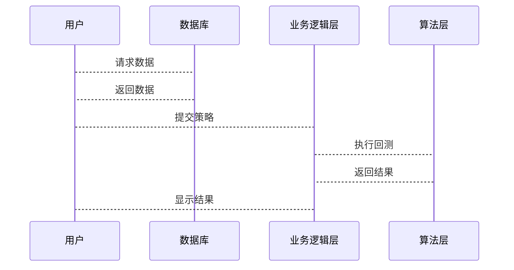

                 


# 开发智能化的资产配置策略回测引擎

## 关键词：资产配置，回测引擎，智能化，策略优化，机器学习

## 摘要：  
本文深入探讨了开发智能化资产配置策略回测引擎的核心技术与实现方法。通过结合资产配置的基本原理、回测引擎的关键技术以及智能化优化算法，本文旨在为读者提供一个系统化的开发框架，帮助其高效地设计和实现智能化的资产配置策略回测引擎。文章内容涵盖从理论基础到实际应用的全过程，包括核心概念分析、算法原理讲解、系统架构设计以及项目实战案例，最终为读者提供一个全面的解决方案。

---

# 第一部分: 资产配置策略回测引擎的背景与意义

## 第1章: 资产配置策略回测引擎概述

### 1.1 资产配置策略回测引擎的背景

#### 1.1.1 资产配置的基本概念  
资产配置是指将资金分配到不同资产类别（如股票、债券、商品等）中，以实现投资目标（如收益最大化、风险最小化）的过程。资产配置的核心在于根据市场环境和投资者需求，动态调整各类资产的权重。

#### 1.1.2 回测引擎的定义与作用  
回测引擎是一种用于模拟投资策略在历史数据上表现的工具。通过回测，投资者可以评估策略的有效性、风险和收益，从而为实际投资决策提供依据。  

#### 1.1.3 智能化资产配置的必要性  
传统资产配置方法依赖于经验判断，存在主观性强、效率低下的问题。随着机器学习和大数据技术的发展，智能化资产配置能够通过数据驱动的方式优化配置策略，提高投资效率和准确性。

### 1.2 资产配置策略回测引擎的意义

#### 1.2.1 提高投资决策的科学性  
通过回测引擎，投资者可以基于历史数据和数学模型，科学评估不同配置策略的表现，避免主观判断的偏差。  

#### 1.2.2 降低投资风险的重要性  
回测引擎能够帮助投资者识别潜在风险，评估策略在不同市场条件下的表现，从而制定更加稳健的投资计划。  

#### 1.2.3 提高投资效率的潜力  
智能化回测引擎能够自动化地生成、测试和优化配置策略，显著提高投资效率，降低成本。  

### 1.3 本书的核心目标与结构

#### 1.3.1 本书的核心目标  
本文旨在帮助读者系统性地理解资产配置策略回测引擎的核心技术，掌握其开发方法，并通过实际案例展示如何实现智能化的配置策略。  

#### 1.3.2 本书的章节安排  
文章将从资产配置的基本概念、回测引擎的核心技术入手，逐步深入讲解算法原理、系统架构设计、项目实战等内容，最终帮助读者掌握开发智能化回测引擎的完整流程。  

#### 1.3.3 本书的读者群体  
本书适合对资产配置和回测引擎感兴趣的投资专业人士、数据科学家以及软件开发人员阅读，尤其适合希望将人工智能技术应用于金融领域的读者。

---

# 第二部分: 资产配置策略回测引擎的核心概念与技术

## 第2章: 资产配置策略的核心概念

### 2.1 资产配置的基本原理

#### 2.1.1 资产配置的分类  
资产配置通常分为战略性资产配置和战术性资产配置。战略性配置关注长期投资目标，而战术性配置则根据市场短期变化进行动态调整。  

#### 2.1.2 资产配置的权重分配  
权重分配是资产配置的核心问题，需要在不同资产类别之间找到收益与风险的平衡点。  

#### 2.1.3 资产配置的风险与收益平衡  
通过调整各类资产的权重，投资者可以在风险与收益之间找到最佳平衡点。  

### 2.2 资产配置策略的类型

#### 2.2.1 均衡配置策略  
均衡配置策略将资金平均分配到不同资产类别中，以分散风险。  

#### 2.2.2 动态再平衡策略  
动态再平衡策略根据市场变化定期调整资产权重，以维持预设的配置比例。  

#### 2.2.3 基于市场预测的主动配置策略  
主动配置策略基于对市场的预测进行超配或低配，具有较高的风险和收益潜力。  

### 2.3 资产配置策略的优化方法

#### 2.3.1 基于历史数据的优化  
通过历史数据拟合最优配置比例，寻找收益-风险最佳组合。  

#### 2.3.2 基于情景分析的优化  
在不同市场情景下测试策略表现，寻找稳健的配置方案。  

#### 2.3.3 基于机器学习的优化  
利用机器学习算法（如遗传算法、粒子群优化）优化配置策略，提高适应性。  

## 第3章: 回测引擎的核心技术

### 3.1 回测引擎的基本原理

#### 3.1.1 回测的定义与流程  
回测是指在历史数据上模拟策略执行的过程，评估其表现。流程包括数据获取、策略执行、结果分析等。  

#### 3.1.2 回测数据的来源与处理  
回测数据通常来源于金融数据库，需要进行清洗、标准化等预处理。  

#### 3.1.3 回测指标的计算与分析  
常用的回测指标包括收益、风险、夏普比率等，用于评估策略的优劣。  

### 3.2 回测引擎的关键技术

#### 3.2.1 数据处理与清洗技术  
数据清洗包括去除缺失值、处理异常值等，确保数据质量。  

#### 3.2.2 策略执行与模拟交易技术  
模拟交易需要精确复制策略的执行逻辑，包括交易成本、滑点等细节。  

#### 3.2.3 性能优化与并行计算技术  
通过并行计算加速回测过程，适用于大规模数据和复杂策略。  

### 3.3 回测引擎的智能化升级

#### 3.3.1 基于机器学习的策略优化  
利用机器学习算法优化配置策略，提升其适应性和收益能力。  

#### 3.3.2 基于自然语言处理的策略生成  
通过NLP技术分析市场报告，生成新的配置策略。  

#### 3.3.3 基于强化学习的策略迭代  
强化学习通过不断试错优化策略，适应动态变化的市场环境。  

---

# 第三部分: 资产配置策略回测引擎的算法原理与实现

## 第4章: 资产配置策略的算法原理

### 4.1 基于均值-方差模型的优化算法

#### 4.1.1 均值-方差模型的数学推导  
均值-方差模型通过最小化投资组合的方差，在给定收益下找到最优配置。  
数学公式：  
$$\text{目标：} \min \sigma^2$$  
$$\text{约束：} \sum w_i r_i = R, \sum w_i = 1$$  

#### 4.1.2 约束条件下的优化问题  
在均值-方差模型中，通常需要考虑权重的非负性和和为1的约束。  

#### 4.1.3 算法实现与代码示例  
以下是基于均值-方差模型的优化算法的Python代码示例：

```python
import numpy as np
import pandas as pd
from scipy.optimize import minimize

# 示例数据：资产的预期收益和协方差矩阵
mu = np.array([0.1, 0.15, 0.08])
cov = np.array([[0.04, 0.03, 0.02],
                [0.03, 0.06, 0.01],
                [0.02, 0.01, 0.05]])

# 定义优化目标函数
def objective(w):
    return np.dot(w.T, np.dot(cov, w))

# 定义约束条件
cons = ({'type': 'eq', 'fun': lambda w: sum(w) - 1},
        {'type': 'ineq', 'fun': lambda w: w})

# 初始猜测
w0 = np.array([1/3, 1/3, 1/3])

# 使用scipy.optimize.minimize求解
result = minimize(objective, w0, constraints=cons)

print("最优权重：", result.x)
```

### 4.2 基于遗传算法的优化策略

#### 4.2.1 遗传算法的基本原理  
遗传算法是一种基于自然选择和遗传机制的优化算法，包括选择、交叉、变异等操作。  

#### 4.2.2 遗传算法在资产配置中的应用  
将遗传算法应用于资产配置问题，可以通过不断迭代优化配置权重。  

#### 4.2.3 算法实现与代码示例  
以下是基于遗传算法的资产配置优化代码示例：

```python
import numpy as np
import pandas as pd

def fitness(individual):
    # 计算收益和风险
    w = individual
    port_value = np.dot(w, mu)  # 收益
    port_risk = np.sqrt(np.dot(w, np.dot(cov, w)))  # 风险
    return -port_value / port_risk  # 目标是最小化风险或最大化收益

# 初始化种群
pop = np.random.rand(10, 3)
pop = pop / pop.sum(axis=1)[:, None]

# 遗传算法迭代
for _ in range(50):
    # 计算适应度
    fitness_values = np.apply_along_axis(fitness, 1, pop)
    # 选择
    parents = pop[np.argsort(-fitness_values)][:5]
    # 交叉
    offspring = np.zeros_like(parents)
    for i in range(2):
        for j in range(5):
            if j % 2 == i:
                offspring[j] = parents[i]
    # 变异
    offspring += np.random.randn(5, 3) * 0.1
    pop = np.vstack((parents, offspring))
    pop = pop / pop.sum(axis=1)[:, None]

# 输出最优解
print("最优权重：", pop[0])
```

### 4.3 基于粒子群优化算法的配置策略

#### 4.3.1 粒子群优化算法的原理  
粒子群优化算法是一种基于群体智能的优化算法，通过粒子的移动寻找最优解。  

#### 4.3.2 粒子群优化算法在资产配置中的应用  
将粒子群优化应用于资产配置问题，可以通过群体协作找到最优配置权重。  

#### 4.3.3 算法实现与代码示例  
以下是基于粒子群优化算法的资产配置优化代码示例：

```python
import numpy as np

def evaluate(position):
    w = position
    port_value = np.dot(w, mu)  # 收益
    port_risk = np.sqrt(np.dot(w, np.dot(cov, w)))  # 风险
    return -port_value / port_risk  # 目标是最小化风险或最大化收益

# 初始化粒子群
n_particles = 10
n_assets = 3
position = np.random.rand(n_particles, n_assets)
position = position / position.sum(axis=1)[:, None]

# 粒子群优化迭代
for _ in range(50):
    # 计算适应度
    fitness = np.apply_along_axis(evaluate, 1, position)
    # 更新全局最优
    global_best = np.max(fitness)
    # 更新粒子速度和位置
    for i in range(n_particles):
        v = np.random.randn(n_assets) * 0.1
        position[i] += v
        position[i] /= sum(position[i])
    # 重置超出范围的粒子
    for i in range(n_particles):
        if sum(position[i]) != 1:
            position[i] = np.random.rand(n_assets) / np.sum(np.random.rand(n_assets))

# 输出最优解
print("最优权重：", position[0])
```

## 第5章: 回测引擎的算法实现

### 5.1 回测引擎的算法框架

#### 5.1.1 数据预处理模块  
数据预处理包括清洗、标准化等步骤，确保数据质量。  

#### 5.1.2 策略执行模块  
策略执行模块模拟策略在历史数据上的表现，记录每一步的收益和风险。  

#### 5.1.3 结果分析模块  
结果分析模块计算回测指标，评估策略的有效性。  

### 5.2 回测引擎的核心算法

#### 5.2.1 回测数据的处理与存储  
回测数据通常存储在数据库中，支持高效的查询和分析。  

#### 5.2.2 策略执行的模拟交易  
模拟交易需要考虑交易成本、滑点等现实因素，确保回测结果的准确性。  

#### 5.2.3 性能优化与并行计算  
通过并行计算加速回测过程，适用于大规模数据和复杂策略。  

---

# 第四部分: 资产配置策略回测引擎的系统架构设计

## 第6章: 资产配置策略回测引擎的系统架构设计

### 6.1 问题场景介绍

#### 6.1.1 系统目标  
开发一个智能化的资产配置策略回测引擎，支持多种配置策略的回测、优化和分析。  

#### 6.1.2 系统范围  
系统涵盖数据获取、策略执行、结果分析等核心功能。  

#### 6.1.3 用户需求  
用户包括机构投资者、个人投资者和数据科学家，需求包括策略回测、优化、风险评估等。  

### 6.2 项目介绍

#### 6.2.1 项目目标  
开发一个高效、智能的资产配置策略回测引擎，支持多种配置策略的测试和优化。  

#### 6.2.2 项目范围  
项目涵盖数据处理、算法实现、系统架构设计、用户界面设计等。  

#### 6.2.3 项目计划  
项目分为需求分析、设计、开发、测试和部署五个阶段，预计在6个月内完成。  

### 6.3 系统功能设计

#### 6.3.1 领域模型设计  
领域模型包括资产、策略、回测、优化等核心概念，通过类图展示其关系。  

Mermaid 类图：  


#### 6.3.2 系统架构设计  
系统架构采用分层设计，包括数据层、业务逻辑层和用户界面层。  

Mermaid 架构图：  
```mermaid
archiecture
    客户端 --> 中间件
    中间件 --> 数据库
    中间件 --> 业务逻辑层
    业务逻辑层 --> 算法层
    算法层 --> 数据源
```

#### 6.3.3 系统接口设计  
系统接口包括数据接口、策略接口和结果接口，支持RESTful API调用。  

#### 6.3.4 系统交互设计  
系统交互流程包括用户请求、数据处理、策略执行、结果返回等步骤。  

Mermaid 序列图：  


---

# 第五部分: 资产配置策略回测引擎的项目实战

## 第7章: 项目实战

### 7.1 项目环境搭建

#### 7.1.1 系统需求  
开发环境：Python 3.8+，Jupyter Notebook，IDE  
依赖库：Pandas, NumPy, Scipy, Plotly  

#### 7.1.2 环境安装  
安装必要的依赖库：  
```bash
pip install pandas numpy scipy plotly
```

### 7.2 项目核心实现

#### 7.2.1 数据获取与预处理  
从金融数据库获取历史数据，清洗并标准化。  

#### 7.2.2 策略实现  
实现多种配置策略，包括均值-方差模型、遗传算法、粒子群优化等。  

#### 7.2.3 回测与优化  
在历史数据上回测策略，优化配置权重，评估策略表现。  

### 7.3 实际案例分析

#### 7.3.1 案例背景  
假设我们有3种资产（股票、债券、商品），目标是找到最优配置比例。  

#### 7.3.2 数据准备  
获取3种资产的历史收益率和协方差矩阵。  

#### 7.3.3 策略实现  
使用均值-方差模型和遗传算法优化配置权重。  

#### 7.3.4 结果分析  
比较不同策略的回测结果，选择最优配置方案。  

### 7.4 项目小结

#### 7.4.1 项目成果  
开发了一个智能化的资产配置策略回测引擎，支持多种策略的回测和优化。  

#### 7.4.2 经验总结  
在实际开发中，需要注意数据质量、算法优化和系统架构设计，确保系统的高效性和稳定性。  

---

# 第六部分: 资产配置策略回测引擎的最佳实践与优化

## 第8章: 最佳实践与优化

### 8.1 系统优化建议

#### 8.1.1 数据处理优化  
使用并行计算加速数据处理，减少数据预处理时间。  

#### 8.1.2 算法优化建议  
根据具体问题选择合适的算法，优化算法参数，提高计算效率。  

#### 8.1.3 系统架构优化  
采用分布式架构，提高系统的扩展性和可用性。  

### 8.2 实际应用中的注意事项

#### 8.2.1 数据的时序性  
确保回测数据的时间序列性，避免数据泄漏。  

#### 8.2.2 策略的可解释性  
复杂的策略可能难以解释，需要确保策略的透明性和可解释性。  

#### 8.2.3 系统的稳定性  
确保系统在极端市场条件下仍能稳定运行。  

### 8.3 拓展阅读与学习资源

#### 8.3.1 推荐书籍  
1. 《投资学》——（美）查尔斯·埃里森  
2. 《机器学习实战》——（美）亚瑟·萨摩斯  

#### 8.3.2 推荐课程  
1. 《量化投资与算法交易》  
2. 《机器学习在金融中的应用》  

---

# 第七部分: 结论与展望

## 第9章: 结论与展望

### 9.1 全文总结  
本文系统性地介绍了资产配置策略回测引擎的核心技术与实现方法，通过理论分析、算法实现和项目实战，帮助读者掌握开发智能化回测引擎的完整流程。  

### 9.2 未来展望  
随着人工智能和大数据技术的不断发展，智能化资产配置策略回测引擎将更加智能化、自动化和高效化。未来的研究方向包括更复杂的优化算法、更强大的系统架构设计以及更广泛的应用场景。  

---

# 作者：AI天才研究院/AI Genius Institute & 禅与计算机程序设计艺术 /Zen And The Art of Computer Programming

---

**感谢您的耐心阅读！如果本文对您有所帮助，欢迎分享给更多对人工智能和金融技术感兴趣的朋友。**

