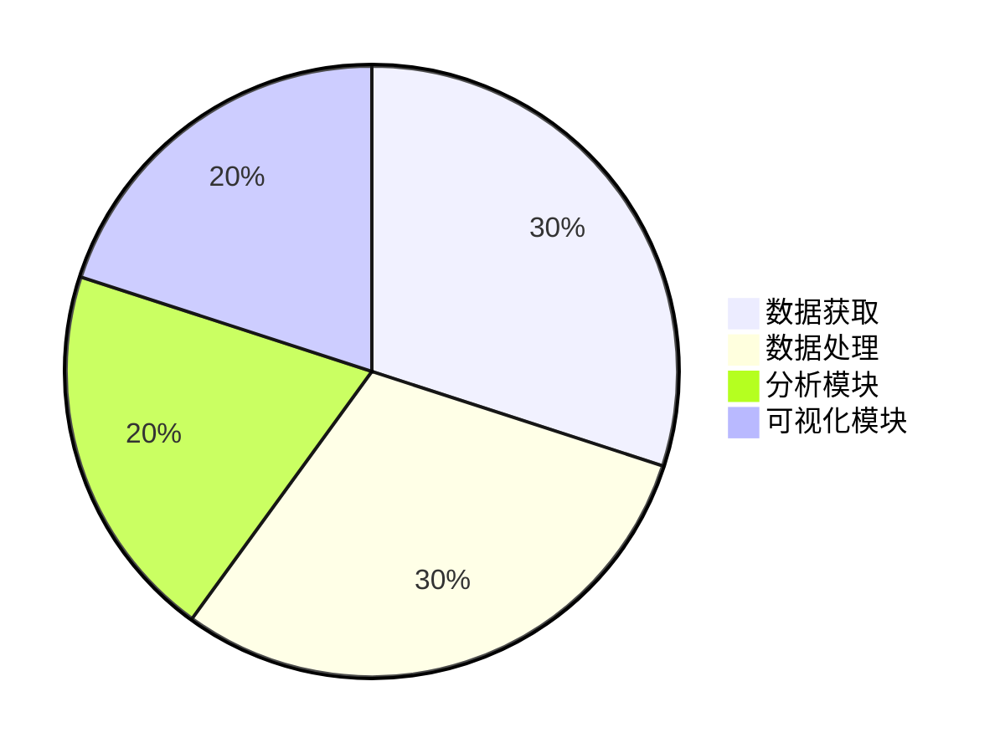
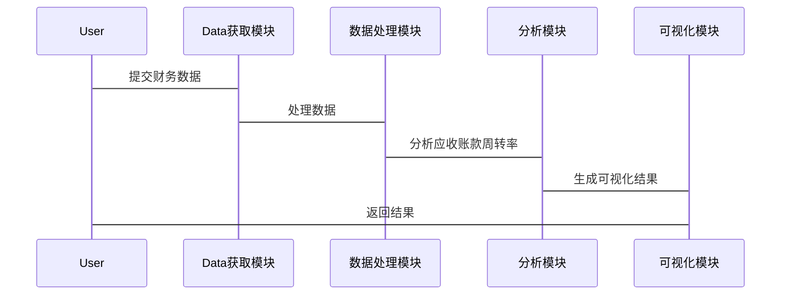

                 


# 彼得林奇对公司应收账款周转率变化的深入分析

> 关键词：彼得·林奇，应收账款周转率，财务分析，投资策略，信用风险

> 摘要：本文深入分析了彼得·林奇如何通过公司应收账款周转率的变化来评估企业财务健康状况和信用风险。文章首先介绍了应收账款周转率的基本概念和计算方法，然后详细阐述了彼得·林奇的投资策略及其对周转率变化的重视。接着，从算法原理、系统架构设计、项目实战等多个方面，结合具体案例，详细讲解了如何通过应收账款周转率的变化进行深入分析，并提供了相应的技术实现和最佳实践建议。

---

## 第一部分：应收账款周转率变化的背景与重要性

### 第1章：应收账款周转率的基本概念

#### 1.1 应收账款周转率的定义与计算方法

##### 1.1.1 应收账款的定义
应收账款是指企业在赊销商品或服务后，客户承诺在未来某个日期支付的款项。它是企业流动资产的重要组成部分，反映了企业在销售过程中对客户的信用管理能力。

##### 1.1.2 应收账款周转率的计算公式
应收账款周转率（Accounts Receivable Turnover Ratio）是衡量企业应收账款管理效率和流动资金周转情况的重要指标，其计算公式为：
$$
\text{应收账款周转率} = \frac{\text{营业收入}}{\text{平均应收账款}}
$$
其中，平均应收账款 = (期初应收账款 + 期末应收账款) / 2。

##### 1.1.3 应收账款周转率的行业基准
应收账款周转率的行业基准因行业而异。例如，零售业通常具有较高的周转率，而制造业或建筑业的周转率可能较低。投资者需要结合行业特性进行横向比较。

#### 1.2 应收账款周转率的重要性

##### 1.2.1 应收账款周转率与企业流动资金的关系
应收账款周转率反映了企业将应收账款转化为现金的速度。周转率高意味着企业回收账款能力强，能够更快地将资金投入生产或投资，从而提高资金使用效率。

##### 1.2.2 应收账款周转率对财务健康的影响
应收账款周转率是评估企业财务健康状况的重要指标之一。周转率低可能意味着企业存在应收账款回收困难的问题，进而影响企业的流动资金和偿债能力。

##### 1.2.3 应收账款周转率与企业信用管理的关系
应收账款周转率是企业信用管理效率的直接体现。通过分析周转率的变化，可以判断企业的信用政策是否合理，是否存在客户拖欠账款的问题。

### 第2章：彼得·林奇的投资风格与应收账款分析

#### 2.1 彼得·林奇的投资者简介

##### 2.1.1 彼得·林奇的生平简介
彼得·林奇（Peter Lynch）是美国著名的投资专家，曾任富达麦哲伦基金的经理，以其卓越的投资业绩闻名。他注重基本面分析，擅长从财务报表中挖掘投资机会。

##### 2.1.2 彼得·林奇的投资理念
彼得·林奇主张长期投资，关注企业的基本面，尤其是财务指标的变化。他认为，通过分析财务报表，尤其是应收账款、存货和应付账款等关键指标，可以发现企业的潜在价值和投资机会。

##### 2.1.3 彼得·林奇对财务指标的关注点
彼得·林奇在选股时，特别关注企业的应收账款周转率、存货周转率等指标。他认为，这些指标能够反映企业的运营效率和财务健康状况。

#### 2.2 应收账款周转率在彼得·林奇分析中的地位

##### 2.2.1 应收账款周转率作为选股标准的重要性
彼得·林奇认为，应收账款周转率是评估企业信用管理能力和财务健康状况的重要指标。他倾向于选择应收账款周转率高、且持续稳定的公司进行投资。

##### 2.2.2 彼得·林奇如何通过应收账款周转率评估企业信用风险
彼得·林奇通过分析应收账款周转率的变化趋势，判断企业的信用政策是否合理，是否存在客户拖欠账款的风险。例如，如果一家公司的应收账款周转率突然下降，可能意味着客户支付能力减弱，企业的信用风险增加。

##### 2.2.3 应收账款周转率变化对投资决策的影响
应收账款周转率的变化直接影响企业的现金流和运营效率。彼得·林奇认为，周转率下降可能预示着企业未来的盈利能力和偿债能力将受到影响，因此可能会影响投资决策。

---

## 第二部分：应收账款周转率变化的深入分析

### 第3章：应收账款周转率变化的核心概念与原理

#### 3.1 应收账款周转率变化的定义与特征

##### 3.1.1 应收账款周转率变化的定义
应收账款周转率变化是指企业在一定时期内应收账款周转率的增减情况。通过分析周转率的变化趋势，可以判断企业的应收账款管理效率是否发生变化。

##### 3.1.2 应收账款周转率变化的特征
- **波动性**：周转率的变化可能受到季节性因素或行业周期的影响，表现出一定的波动性。
- **趋势性**：长期来看，周转率的变化可能反映企业的信用政策调整或市场环境的变化。
- **关联性**：周转率变化与其他财务指标（如净利润率、存货周转率等）密切相关。

##### 3.1.3 应收账款周转率变化的驱动因素
- **信用政策**：企业是否放宽或收紧信用政策直接影响应收账款的回收速度。
- **客户支付能力**：客户财务状况的变化会影响应收账款的周转速度。
- **行业特性**：不同行业的应收账款周转率变化趋势可能不同。

#### 3.2 应收账款周转率变化的数学模型与公式

##### 3.2.1 应收账款周转率变化的计算公式
假设企业连续三年的应收账款周转率分别为T1、T2和T3，则变化趋势可以通过以下方式计算：
$$
\Delta T = T3 - T2 = T2 - T1
$$
如果ΔT > 0，说明周转率在增加；如果ΔT < 0，则说明周转率在减少。

##### 3.2.2 彼得·林奇分析方法中的数学模型
彼得·林奇通常会结合其他财务指标（如净利润率、毛利率等）进行综合分析。他可能会使用以下公式来评估企业的综合财务状况：
$$
\text{综合财务评分} = \frac{\text{净利润率} + \text{应收账款周转率} + \text{存货周转率}}{3}
$$

##### 3.2.3 应收账款周转率变化与企业利润的关系公式
应收账款周转率的变化会直接影响企业的现金流和利润。例如，周转率下降可能导致企业的资金占用增加，进而影响净利润率。公式如下：
$$
\text{净利润率} = \frac{\text{净利润}}{\text{营业收入}}
$$
如果应收账款周转率下降，而营业收入不变，可能意味着企业需要投入更多资金用于应收账款，从而降低净利润率。

### 第4章：应收账款周转率变化的算法原理

#### 4.1 应收账款周转率变化的计算流程

##### 4.1.1 数据收集与处理
首先收集企业的财务报表数据，包括营业收入和应收账款。数据来源可以是企业的年度报告或财务数据库。

##### 4.1.2 计算应收账款周转率
使用以下公式计算应收账款周转率：
$$
\text{应收账款周转率} = \frac{\text{营业收入}}{\text{平均应收账款}}
$$
其中，平均应收账款 = (期初应收账款 + 期末应收账款) / 2。

##### 4.1.3 分析周转率变化趋势
通过比较不同时间段的应收账款周转率，分析其变化趋势。例如，可以绘制趋势图来直观展示变化情况。

#### 4.2 应收账款周转率变化的预测模型

##### 4.2.1 时间序列分析方法
使用时间序列分析方法（如ARIMA模型）预测未来的应收账款周转率。以下是Python代码示例：
```python
from statsmodels.tsa.arima_model import ARIMA
import pandas as pd

# 假设df是包含应收账款周转率的数据框，index为时间序列
model = ARIMA(df['Accounts Receivable Turnover'], order=(1, 1, 1))
model_fit = model.fit()
```

##### 4.2.2 机器学习算法的应用
使用机器学习算法（如随机森林或XGBoost）预测应收账款周转率的变化。以下是Python代码示例：
```python
from sklearn.ensemble import RandomForestRegressor
import pandas as pd

# 假设X是特征矩阵，y是目标变量（应收账款周转率变化）
model = RandomForestRegressor(n_estimators=100)
model.fit(X, y)
```

##### 4.2.3 基于彼得·林奇分析方法的预测模型
结合彼得·林奇的投资策略，可以使用以下步骤构建预测模型：
1. 收集企业的历史财务数据。
2. 计算应收账款周转率和其他相关指标。
3. 使用统计或机器学习方法预测未来的应收账款周转率变化。
4. 结合行业基准和企业具体情况，评估投资风险。

### 第5章：应收账款周转率变化的系统分析与架构设计

#### 5.1 应收账款周转率变化分析的系统架构

##### 5.1.1 系统功能模块划分
- 数据获取模块：从数据库或财务报表中获取数据。
- 数据处理模块：计算应收账款周转率和其他相关指标。
- 分析模块：分析周转率变化趋势，并生成预测结果。
- 可视化模块：将分析结果以图表形式展示。

##### 5.1.2 系统数据流图
```mermaid
graph TD
    A[数据获取] -> B[数据处理]
    B -> C[分析模块]
    C -> D[可视化模块]
```

##### 5.1.3 系统架构设计图（Mermaid 流程图）


#### 5.2 应收账款周转率变化分析的系统接口设计

##### 5.2.1 数据接口规范
- 输入接口：接受企业的财务数据。
- 输出接口：返回应收账款周转率和其他相关指标。

##### 5.2.2 API接口设计
- GET /api/accounts_receivable_turnover：获取应收账款周转率数据。
- POST /api/predict：提交预测请求，返回预测结果。

##### 5.2.3 数据交互流程图（Mermaid 序列图）


### 第6章：项目实战——基于彼得·林奇方法的应收账款周转率分析

#### 6.1 项目环境与工具安装

##### 6.1.1 开发环境搭建
- 操作系统：Windows/Mac/Linux
- 开发工具：PyCharm/VS Code
- 数据库：MySQL/SQLite

##### 6.1.2 数据获取与处理工具安装
- 数据库连接工具：pymysql或sqlite3
- 数据分析工具：pandas
- 数据可视化工具：matplotlib或seaborn

##### 6.1.3 数据分析工具配置
- 安装Python库：pip install pandas matplotlib pymysql

#### 6.2 核心代码实现

##### 6.2.1 数据获取与处理
```python
import pandas as pd
import pymysql

# 连接数据库
conn = pymysql.connect(host='localhost', user='root', password='password', db='financial_data')
query = "SELECT * FROM accounts_receivable"

# 读取数据
df = pd.read_sql(query, conn)
conn.close()
```

##### 6.2.2 计算应收账款周转率
```python
# 计算平均应收账款
df['Average Accounts Receivable'] = (df['Accounts Receivable Beginning'] + df['Accounts Receivable Ending']) / 2

# 计算应收账款周转率
df['Accounts Receivable Turnover'] = df['Revenue'] / df['Average Accounts Receivable']
```

##### 6.2.3 分析周转率变化趋势
```python
import matplotlib.pyplot as plt

# 绘制趋势图
plt.figure(figsize=(10, 6))
plt.plot(df['Accounts Receivable Turnover'], label='Accounts Receivable Turnover')
plt.xlabel('Year')
plt.ylabel('Turnover Rate')
plt.title('Accounts Receivable Turnover Trend')
plt.legend()
plt.show()
```

#### 6.3 实际案例分析与解读

##### 6.3.1 案例背景
假设我们分析一家制造业公司过去5年的财务数据，重点关注其应收账款周转率的变化。

##### 6.3.2 数据分析与解读
通过计算发现，该公司的应收账款周转率在过去3年呈现下降趋势。这可能意味着公司的信用政策变得宽松，或者客户的支付能力有所下降。根据彼得·林奇的分析方法，这可能预示着公司的信用风险增加，投资风险上升。

#### 6.4 项目小结

##### 6.4.1 项目总结
通过本项目，我们成功地使用彼得·林奇的方法分析了公司的应收账款周转率变化，发现了潜在的信用风险。

##### 6.4.2 注意事项
- 数据的准确性和完整性直接影响分析结果，因此需要确保数据来源可靠。
- 应收账款周转率的变化需要结合其他财务指标和行业背景进行综合分析，避免单一指标的误判。

##### 6.4.3 拓展阅读
- 《彼得·林奇的投资策略》
- 《财务报表分析与股票投资》

---

## 第三部分：总结与最佳实践

### 第7章：总结与最佳实践

#### 7.1 小结
通过本文的分析，我们可以看出，应收账款周转率是评估企业财务健康状况和信用风险的重要指标。彼得·林奇通过深入分析应收账款周转率的变化，为企业投资决策提供了重要的参考依据。

#### 7.2 注意事项
- 在实际分析中，应结合其他财务指标和行业背景，避免单一指标的误判。
- 数据的准确性和完整性是分析的基础，需要确保数据来源可靠。

#### 7.3 拓展阅读
- 《彼得·林奇的投资策略》
- 《财务报表分析与股票投资》
- 《信用风险管理与应收账款分析》

---

## 作者信息

作者：AI天才研究院/AI Genius Institute & 禅与计算机程序设计艺术 /Zen And The Art of Computer Programming

---

通过本文的详细分析，我们不仅了解了应收账款周转率的基本概念和计算方法，还深入探讨了彼得·林奇如何通过分析应收账款周转率的变化来评估企业的信用风险和财务健康状况。希望本文能为投资者和财务分析师提供有价值的参考和启示。

