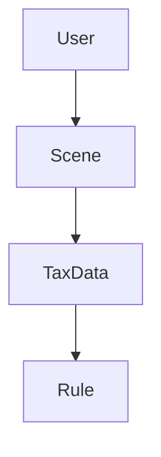
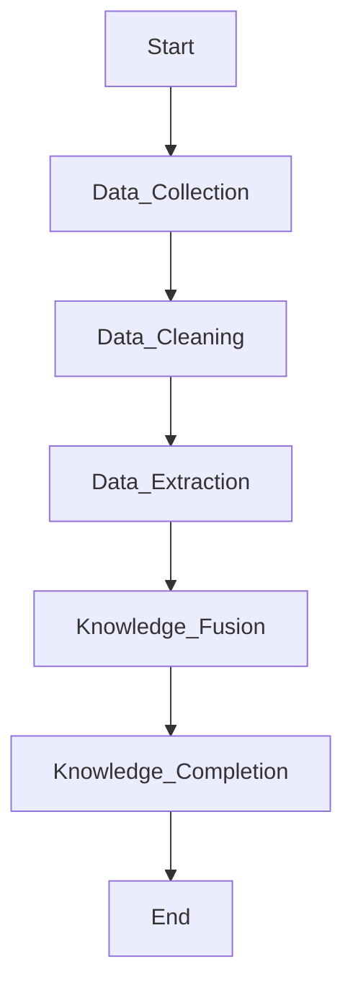
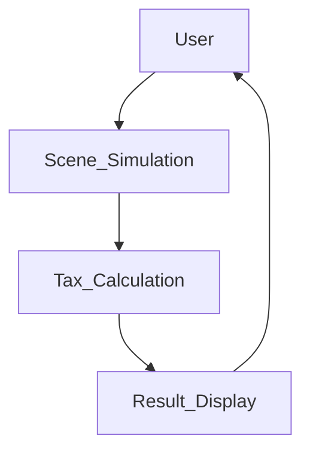

                 


# 构建智能化的个人税务筹划多场景模拟助手

> 关键词：智能化、税务筹划、多场景模拟、人工智能、知识图谱、系统架构

> 摘要：本文详细探讨了如何构建一个智能化的个人税务筹划多场景模拟助手，通过结合人工智能、大数据和知识图谱等技术，帮助用户在复杂多变的税务环境中实现最优税务规划。文章从背景、核心概念、算法原理、系统架构到项目实战，全面解析了构建这一助手的各个关键环节，并提供了丰富的技术细节和实现方案。

---

## 第一部分: 智能化个人税务筹划助手的背景与需求

### 第1章: 个人税务筹划的智能化需求

#### 1.1 税务筹划的背景与挑战
- **1.1.1 税务筹划的基本概念**
  - 税务筹划是通过合法手段优化税务负担的过程，涉及收入、支出、资产配置等多个方面。
  - 税务筹划的核心目标是在遵守税法的前提下，最大化个人或企业的经济利益。

- **1.1.2 传统税务筹划的痛点与局限性**
  - **信息不对称**：传统税务筹划依赖于专业人员的经验，但信息获取成本高，且难以覆盖所有可能的场景。
  - **计算复杂性**：税务计算涉及多种税率、扣除项和优惠政策，手动计算容易出错。
  - **场景多样性**：个人的收入来源、家庭状况、投资行为等复杂因素，使得税务筹划需要考虑多个场景。

- **1.1.3 智能化税务筹划的必要性**
  - 随着税收政策的复杂化和个性化需求的增加，传统的手动筹划方式已无法满足需求。
  - 人工智能和大数据技术的发展为自动化、智能化的税务筹划提供了技术支撑。

#### 1.2 多场景模拟助手的核心需求
- **1.2.1 多场景模拟的定义与特点**
  - 多场景模拟是指在不同的假设条件下，对税务结果进行预测和优化的过程。
  - 场景多样性：涵盖收入变化、资产配置调整、家庭状况变化等多种可能性。
  - 高效性：通过算法快速生成多种场景的税务结果，帮助用户找到最优方案。

- **1.2.2 税务筹划中的多场景模拟需求**
  - **收入预测**：根据职业发展、投资收益等因素，预测未来收入。
  - **支出优化**：模拟不同支出方案对税务的影响，找到最优支出结构。
  - **资产配置**：评估不同资产配置对税务的影响，优化资产结构。

- **1.2.3 用户对智能化助手的具体要求**
  - **实时性**：快速生成模拟结果，满足用户的即时需求。
  - **交互性**：用户可以自定义输入参数，灵活调整模拟场景。
  - **准确性**：确保模拟结果的准确性，避免因错误导致的经济损失。

#### 1.3 智能化税务助手的技术背景
- **1.3.1 人工智能技术的发展**
  - 人工智能技术（如机器学习、自然语言处理）为税务筹划提供了自动化和智能化的工具。
  - 通过深度学习模型，可以快速分析大量税务数据，生成最优方案。

- **1.3.2 大数据在税务筹划中的应用**
  - 大数据技术可以整合多来源的税务数据，为模拟提供全面的数据支持。
  - 数据挖掘技术可以帮助发现隐藏的税务优化机会。

- **1.3.3 知识图谱与规则引擎的结合**
  - 知识图谱用于构建税务相关的知识库，包括税率、优惠政策、法律法规等。
  - 规则引擎用于根据用户输入生成模拟场景，并结合知识图谱进行推理。

#### 1.4 本章小结
- 本章介绍了智能化税务筹划的背景、挑战和需求，明确了多场景模拟助手的核心目标和技术背景。
- 下一章将深入探讨智能化税务助手的核心概念与原理，包括税务筹划的基本原理、多场景模拟的核心要素以及系统架构的设计。

---

## 第二部分: 智能化税务助手的核心概念与原理

### 第2章: 智能化税务助手的核心概念

#### 2.1 税务筹划的核心概念
- **2.1.1 税务筹划的基本原理**
  - 税务筹划需要遵循税法规定，利用税法中的优惠政策和扣除项，合法降低税务负担。
  - 税务筹划的核心在于对收入、支出和资产的合理规划。

- **2.1.2 税务筹划的法律框架**
  - 不同国家和地区的税法规定差异较大，需要结合具体法律进行筹划。
  - 税务筹划必须在法律允许的范围内进行，避免触犯法律风险。

- **2.1.3 税务筹划的边界与外延**
  - 税务筹划的边界在于合法合规，不能通过虚构交易或隐瞒收入等手段逃税。
  - 外延包括与税务相关的财务规划、资产配置、投资决策等。

#### 2.2 多场景模拟的核心要素
- **2.2.1 场景模拟的定义与分类**
  - 场景模拟是基于假设条件，对税务结果进行预测的过程。
  - 场景可以分为收入变化、支出调整、资产配置调整等不同类型。

- **2.2.2 场景模拟的核心要素**
  - 输入参数：用户的收入、支出、资产等基本信息。
  - 模拟规则：基于税法的计算规则。
  - 输出结果：不同场景下的税务负担和优化建议。

- **2.2.3 场景模拟的实现方式**
  - 基于规则的模拟：根据预设的规则生成模拟结果。
  - 基于机器学习的模拟：利用历史数据训练模型，生成预测结果。

#### 2.3 智能化助手的系统架构
- **2.3.1 系统架构的核心要素**
  - 数据层：存储用户数据、税务规则、历史模拟数据。
  - 服务层：负责数据处理、模拟计算、结果生成。
  - 用户层：提供用户交互界面，展示模拟结果。

- **2.3.2 系统架构的逻辑关系**
  - 数据层为服务层提供数据支持，服务层基于数据层的数据进行计算，生成结果反馈给用户层。

- **2.3.3 系统架构的优缺点**
  - 优点：模块化设计，便于扩展和维护。
  - 缺点：需要处理大量的数据，对计算能力要求较高。

#### 2.4 核心概念对比表
| 概念       | 属性       | 特点                       |
|------------|------------|----------------------------|
| 税务筹划    | 规则性     | 遵循税法规定               |
| 多场景模拟  | 多变性     | 针对不同场景进行模拟       |
| 智能化助手  | 智能性     | 利用AI技术实现自动化       |

#### 2.5 ER实体关系图


---

## 第三部分: 智能化税务助手的算法原理

### 第3章: 知识图谱构建算法

#### 3.1 知识图谱构建的基本原理
- **3.1.1 知识图谱的定义与特点**
  - 知识图谱是一种结构化的知识表示形式，由节点和边组成。
  - 节点代表实体或概念，边代表实体之间的关系。

- **3.1.2 知识图谱的构建流程**
  1. 数据采集：从多种来源获取税务相关的数据。
  2. 数据清洗：去除重复和噪声数据。
  3. 数据抽取：从文本中提取结构化信息。
  4. 知识融合：将多个数据源的信息整合到统一的知识图谱中。
  5. 知识完善：通过推理和验证完善知识图谱。

- **3.1.3 知识图谱的存储与管理**
  - 常见的存储方式包括图数据库（如Neo4j）和关系型数据库。
  - 知识图谱的管理需要考虑数据的动态更新和版本控制。

#### 3.2 知识图谱构建的算法实现
- **3.2.1 基于规则的构建算法**
  - 通过预设的规则从文本中抽取结构化信息。
  - 例如，从新闻文章中提取公司名称、职位等信息。

- **3.2.2 基于机器学习的构建算法**
  - 使用自然语言处理技术（如BERT）进行实体识别和关系抽取。
  - 通过训练模型自动构建知识图谱。

- **3.2.3 知识图谱构建的数学模型**
  - 实体识别：基于概率模型的命名实体识别（NER）。
  - 关系抽取：基于图嵌入的TransE模型。

---

### 3.3 算法流程图


#### 3.4 算法实现代码
```python
# 示例：基于规则的实体识别
import spacy

nlp = spacy.load("en_core_web_sm")
text = "John works at Google as a data scientist."
doc = nlp(text)

for ent in doc.ents:
    print(f"{ent.text} - {ent.label_}")
```

---

## 第四部分: 智能化税务助手的系统架构与设计

### 第4章: 系统架构设计

#### 4.1 问题场景介绍
- 系统需要支持多用户、多场景的税务模拟，确保数据的安全性和隐私性。
- 系统需要能够快速响应用户的查询，并提供个性化的优化建议。

#### 4.2 项目介绍
- **项目目标**：构建一个智能化的个人税务筹划多场景模拟助手。
- **项目范围**：涵盖收入、支出、资产配置等多个方面。
- **项目阶段**：需求分析、系统设计、开发实现、测试优化。

#### 4.3 系统功能设计
- **领域模型**：用户、场景、税务数据、规则等核心概念。
- **功能模块**：
  - 数据采集模块：采集用户的收入、支出、资产等信息。
  - 场景模拟模块：基于用户输入生成多种模拟场景。
  - 优化建议模块：根据模拟结果提供优化建议。

#### 4.4 系统架构设计
- **系统架构图**：
  ```mermaid
  graph TD
      User --> Scene_Simulation
      Scene_Simulation --> Tax_Calculation
      Tax_Calculation --> Result_Display
  ```

- **模块化设计**：
  - 数据层：存储用户数据和税务规则。
  - 服务层：负责数据处理和计算。
  - 用户层：提供交互界面和结果展示。

#### 4.5 系统接口设计
- **数据获取接口**：用户提供收入、支出等数据。
- **模拟计算接口**：基于输入数据生成模拟场景。
- **结果展示接口**：将计算结果返回给用户。

#### 4.6 系统交互流程图


---

## 第五部分: 智能化税务助手的项目实战

### 第5章: 项目实战

#### 5.1 环境安装
- **安装Python和相关库**：
  ```bash
  pip install numpy pandas spacy transformers
  ```

#### 5.2 系统核心实现
- **数据采集模块**：
  ```python
  import pandas as pd

  def collect_data():
      data = pd.DataFrame(columns=["收入", "支出", "资产"])
      return data
  ```

- **场景模拟模块**：
  ```python
  def simulate_scene(income, expense, asset):
      tax = income * 0.1  # 示例税率
      net_income = income - expense
      return tax, net_income, asset
  ```

#### 5.3 代码应用解读与分析
- **数据预处理**：
  ```python
  data = collect_data()
  data["净收入"] = data["收入"] - data["支出"]
  ```

- **模拟计算**：
  ```python
  tax_results = []
  for index in data.index:
      tax, net_income, asset = simulate_scene(data.loc[index, "收入"], data.loc[index, "支出"], data.loc[index, "资产"])
      tax_results.append(tax)
  data["税后收入"] = tax_results
  ```

#### 5.4 实际案例分析
- 案例：假设用户收入为10万元，支出为4万元，资产为50万元。
- 模拟结果：税后收入为6万元，资产优化建议为增加投资型保险。

#### 5.5 项目小结
- 本章通过实际案例展示了智能化税务助手的实现过程，包括数据采集、场景模拟和结果展示。
- 下一章将总结最佳实践，包括性能优化、数据安全和用户体验等方面。

---

## 第六部分: 智能化税务助手的最佳实践与总结

### 第6章: 最佳实践

#### 6.1 性能优化
- **数据压缩**：使用Pandas的DataFrame进行数据压缩。
- **并行计算**：利用多线程或分布式计算加速模拟过程。

#### 6.2 数据安全性
- **数据加密**：对用户数据进行加密存储。
- **访问控制**：采用权限管理，确保数据安全。

#### 6.3 用户体验优化
- **交互设计**：优化用户界面，提升用户体验。
- **反馈机制**：及时反馈模拟结果，增强用户信任。

#### 6.4 小结
- 本文详细介绍了构建智能化个人税务筹划多场景模拟助手的各个方面，包括背景、核心概念、算法原理、系统架构和项目实战。
- 通过最佳实践，可以进一步优化系统的性能和用户体验。

---

## 作者信息

作者：AI天才研究院/AI Genius Institute & 禅与计算机程序设计艺术 /Zen And The Art of Computer Programming

---

### 总结
本文系统地探讨了构建智能化个人税务筹划多场景模拟助手的各个方面，从背景需求到系统实现，提供了全面的技术解析和实现方案。通过本文的指导，读者可以深入了解如何利用人工智能和大数据技术，构建一个高效、智能的税务筹划助手，帮助用户在复杂多变的税务环境中实现最优规划。

