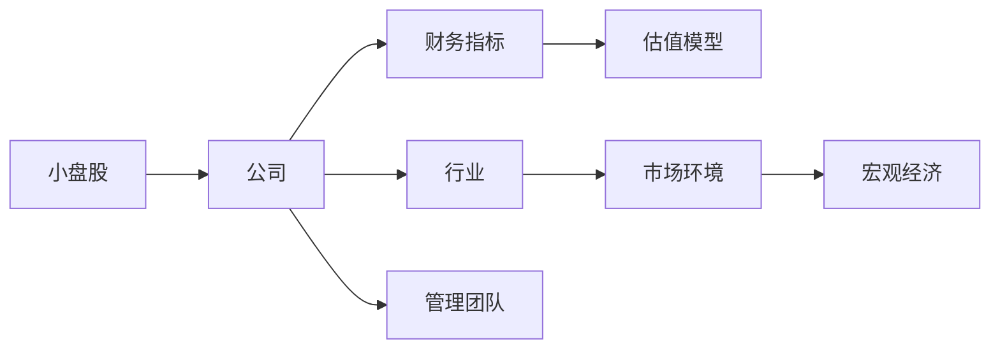
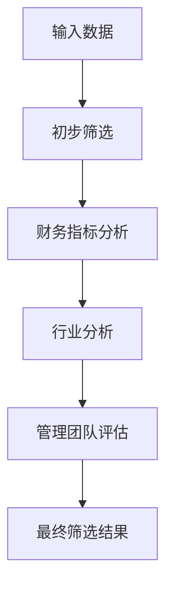
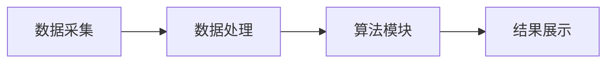

                 


# 约翰·聂夫的小盘股研究方法论

> 关键词：小盘股投资、约翰·聂夫、投资方法论、研究框架、数学模型

> 摘要：本文系统地探讨了约翰·聂夫的小盘股研究方法论，从基本概念、核心要素、算法原理、系统架构到项目实战，全面解析了小盘股投资的策略与实践。通过详细的流程图、数学公式和代码示例，深入分析了小盘股研究的关键步骤与实现细节，为投资者提供了全面的理论指导和实践参考。

---

# 第一部分: 小盘股投资的背景与概述

# 第1章: 小盘股投资的背景与概述

## 1.1 小盘股的定义与特点
### 1.1.1 小盘股的定义
- 小盘股：指市值较小的公司股票，通常在10亿到20亿美元之间。
- 特点：流动性较低、波动性较大、成长性强。

### 1.1.2 小盘股市场的特点
- 市场规模小，公司数量少。
- 交易量低，流动性不足。
- 市场波动较大，风险较高。

### 1.1.3 小盘股投资的潜在机会与风险
- 机会：潜在高回报，成长空间大。
- 风险：流动性风险、信息不对称、市场波动大。

## 1.2 约翰·聂夫的投资理念与方法
### 1.2.1 约翰·聂夫的背景介绍
- 约翰·聂夫：著名小盘股投资者，专注于小盘股研究与投资。
- 投资理念：价值投资，注重基本面分析。

### 1.2.2 小盘股投资的核心理念
- 专注于基本面分析，寻找低估的公司。
- 长期投资，耐心持有，等待价值回归。

### 1.2.3 聂夫投资方法的基本框架
- 筛选公司：市值小、估值低、成长性强。
- 风险控制：分散投资，避免过度集中。

## 1.3 小盘股研究的必要性与挑战
### 1.3.1 小盘股研究的重要性
- 帮助投资者识别潜在机会。
- 提供决策支持，降低投资风险。

### 1.3.2 小盘股研究的主要挑战
- 数据获取困难：小盘股信息较少，数据不完整。
- 研究成本高：需要投入更多时间和资源。

### 1.3.3 如何克服研究中的难点
- 利用公开数据，结合行业分析。
- 建立数据库，系统化研究。

## 1.4 本章小结
- 本章介绍了小盘股的定义、特点以及约翰·聂夫的投资理念。
- 强调了小盘股研究的必要性，并分析了研究中的挑战与解决方案。

---

# 第2章: 小盘股研究的核心概念与联系

## 2.1 小盘股研究的核心概念
### 2.1.1 市值与企业规模的关系
- 市值小，企业规模小，成长空间大。
- 市值与企业规模的关系：市值反映市场对公司价值的评估。

### 2.1.2 小盘股的市场定位与竞争优势
- 市场定位：小盘股通常处于 niche 市场。
- 竞争优势：小盘股公司可能在特定领域具有竞争优势。

### 2.1.3 小盘股的生命周期与投资阶段
- 生命周期：从小盘股到大盘股的演变过程。
- 投资阶段：早期阶段的小盘股更具成长性。

## 2.2 小盘股研究的核心要素
### 2.2.1 财务指标分析
- 利润率：ROE、净利润率。
- 成长性：收入增长率、净利润增长率。

### 2.2.2 行业分析与竞争环境
- 行业分析：行业周期、竞争格局。
- 竞争优势：成本优势、技术优势。

### 2.2.3 管理团队与公司治理
- 管理团队：经验、能力、稳定性。
- 公司治理：股权结构、董事会治理。

## 2.3 小盘股研究的关联性分析
### 2.3.1 小盘股与宏观经济的关系
- 经济周期：小盘股在经济复苏期表现较好。
- 宏观政策：财政政策、货币政策对小盘股的影响。

### 2.3.2 小盘股与行业周期的关系
- 行业周期：成长性行业的小盘股更具投资价值。
- 行业趋势：新兴行业的小盘股潜力大。

### 2.3.3 小盘股与市场情绪的关系
- 市场情绪：投资者情绪波动影响小盘股价格。
- 市场流动性：流动性不足时，小盘股波动更大。

## 2.4 核心概念对比分析表
### 表2.1 小盘股与大盘股的核心区别对比
| **维度**       | **小盘股**                     | **大盘股**                     |
|----------------|-------------------------------|-------------------------------|
| 市值规模       | 小，通常在10-20亿美元         | 大，通常在20亿美元以上       |
| 流动性         | 低，交易量小                 | 高，交易量大                 |
| 成长性         | 高，潜在增长空间大           | 低，增长较为稳定             |
| 风险           | 高，波动大                   | 低，波动较小                 |

## 2.5 小盘股研究的ER实体关系图


## 2.6 本章小结
- 本章详细分析了小盘股研究的核心概念，包括市值与企业规模的关系、市场定位与竞争优势、生命周期与投资阶段。
- 通过对比分析表和ER实体关系图，进一步明确了小盘股研究的关键要素及其相互关系。

---

# 第3章: 小盘股研究的算法原理与数学模型

## 3.1 小盘股筛选算法的基本原理
### 3.1.1 算法目标与输入
- 目标：筛选具有投资价值的小盘股。
- 输入：公司基本面数据、行业数据、市场数据。

### 3.1.2 算法的核心步骤
1. 数据预处理：清洗数据，去除异常值。
2. 财务指标筛选：基于ROE、净利润增长率等指标筛选。
3. 行业分析：根据行业周期和竞争格局进行筛选。
4. 综合评估：结合财务指标、行业分析和管理团队评估，综合打分。

### 3.1.3 算法的输出与结果解释
- 输出：符合条件的小盘股列表。
- 结果解释：根据评分高低排序，选择评分高的公司作为投资标的。

## 3.2 多因素筛选模型
### 3.2.1 多因素模型的构建
- 模型目标：综合考虑多个因素，筛选出最优小盘股。
- 模型结构：包括财务指标、行业分析、管理团队评估三个模块。

### 3.2.2 算法流程图


## 3.3 数学模型与公式
### 3.3.1 市盈率（P/E）公式
$$ 

P/E = \frac{股票价格}{每股收益（EPS）} $$

### 3.3.2 市净率（P/B）公式
$$ 

P/B = \frac{股票价格}{每股净资产（BPS）} $$

### 3.3.3 净利润增长率公式
$$ 

净利润增长率 = \frac{本期净利润 - 上期净利润}{上期净利润} \times 100\% $$

## 3.4 算法实现细节
### 3.4.1 数据预处理
- 数据清洗：去除缺失值、异常值。
- 数据标准化：统一数据格式，便于分析。

### 3.4.2 财务指标筛选
- 筛选标准：ROE > 10%，净利润增长率 > 5%。
- 示例代码：
```python
import pandas as pd

# 数据加载
df = pd.read_csv('小盘股数据.csv')

# 数据清洗
df.dropna(inplace=True)
df.drop_duplicates(inplace=True)

# 财务指标筛选
mask = (df['ROE'] > 10) & (df['净利润增长率'] > 5)
selected_df = df[mask]
```

### 3.4.3 行业分析
- 行业筛选：选择成长性行业。
- 示例代码：
```python
import pandas as pd

# 行业分析
industry_mask = df['行业'] == '科技'
selected_industry_df = df[industry_mask]
```

### 3.4.4 综合评分
- 综合评分公式：
$$ 

综合评分 = 0.4 \times 财务评分 + 0.3 \times 行业评分 + 0.3 \times 管理团队评分 $$

## 3.5 本章小结
- 本章详细讲解了小盘股筛选算法的基本原理，包括数据预处理、财务指标筛选、行业分析和综合评分。
- 通过示例代码和数学公式，展示了算法实现的具体步骤。

---

# 第4章: 小盘股研究的系统架构与实现

## 4.1 系统架构设计
### 4.1.1 系统功能模块
- 数据采集模块：采集公司基本面数据、行业数据。
- 数据处理模块：清洗、标准化数据。
- 算法模块：多因素筛选模型。
- 结果展示模块：输出筛选结果。

### 4.1.2 系统架构图


## 4.2 系统实现细节
### 4.2.1 数据采集
- 数据来源：公开数据、行业报告。
- 数据接口设计：通过API获取实时数据。

### 4.2.2 数据处理
- 数据清洗：去除异常值、重复值。
- 数据标准化：统一单位、格式。

### 4.2.3 算法实现
- 使用Python编写筛选模型。
- 实现步骤：数据加载、筛选、评分、排序。

### 4.2.4 系统接口设计
- 输入接口：数据文件或API。
- 输出接口：筛选结果列表。

## 4.3 系统交互流程
### 4.3.1 用户输入
- 用户输入数据文件路径。
- 用户选择筛选条件。

### 4.3.2 系统处理
- 数据加载。
- 数据处理。
- 算法筛选。
- 结果展示。

## 4.4 系统实现的代码示例
```python
import pandas as pd

def load_data(file_path):
    return pd.read_csv(file_path)

def preprocess_data(df):
    df.dropna(inplace=True)
    df.drop_duplicates(inplace=True)
    return df

def screen_stocks(df):
    mask = (df['ROE'] > 10) & (df['净利润增长率'] > 5)
    selected = df[mask]
    return selected

# 主函数
def main():
    file_path = '小盘股数据.csv'
    df = load_data(file_path)
    df_processed = preprocess_data(df)
    result = screen_stocks(df_processed)
    print(result)

if __name__ == '__main__':
    main()
```

## 4.5 本章小结
- 本章详细讲解了小盘股研究的系统架构与实现。
- 通过代码示例展示了系统设计的具体步骤。

---

# 第5章: 小盘股研究的项目实战

## 5.1 项目背景与目标
### 5.1.1 项目背景
- 研究小盘股的投资机会。
- 挖掘潜在高回报股票。

### 5.1.2 项目目标
- 筛选出具有投资价值的小盘股。
- 提供投资决策支持。

## 5.2 项目实施步骤
### 5.2.1 数据收集
- 收集小盘股的基本面数据。
- 收集行业报告和市场分析。

### 5.2.2 数据分析
- 使用多因素筛选模型进行分析。
- 综合评分，排序筛选结果。

## 5.3 项目实战案例
### 5.3.1 案例分析
- 选择一家小盘股公司，分析其基本面。
- 结合行业分析，评估其投资价值。

### 5.3.2 投资决策
- 根据筛选结果，制定投资策略。
- 分散投资，控制风险。

## 5.4 项目总结与经验分享
### 5.4.1 项目总结
- 成功筛选出具有投资价值的小盘股。
- 研究过程中积累了宝贵的经验。

### 5.4.2 经验分享
- 数据获取是关键，需多渠道收集。
- 分析需结合行业趋势和市场环境。
- 投资需谨慎，注重风险控制。

## 5.5 本章小结
- 本章通过项目实战，展示了小盘股研究的具体实施步骤。
- 强调了数据收集和分析的重要性。

---

# 第6章: 小盘股研究的最佳实践与注意事项

## 6.1 小盘股研究的最佳实践
### 6.1.1 数据收集与处理
- 多渠道收集数据，确保数据准确性。
- 数据清洗，去除异常值。

### 6.1.2 分析方法与工具
- 使用Python进行数据分析。
- 结合行业报告和市场分析。

### 6.1.3 投资策略与风险管理
- 分散投资，避免过度集中。
- 设置止损点，控制风险。

## 6.2 小盘股研究的注意事项
### 6.2.1 数据的局限性
- 数据不全，可能影响分析结果。
- 数据滞后性，需结合实时信息。

### 6.2.2 市场波动的风险
- 小盘股波动大，需谨慎操作。
- 市场情绪影响股价，需关注市场变化。

### 6.2.3 投资决策的主观性
- 分析结果需结合实际情况。
- 投资决策需考虑市场环境和个人风险承受能力。

## 6.3 本章小结
- 本章总结了小盘股研究的最佳实践和注意事项。
- 强调了数据收集、分析方法和风险管理的重要性。

---

# 第7章: 小盘股研究的未来展望与拓展阅读

## 7.1 小盘股研究的未来展望
### 7.1.1 技术进步对研究的影响
- 人工智能在小盘股研究中的应用。
- 大数据分析技术的进一步发展。

### 7.1.2 市场变化与投资机会
- 新兴行业的小盘股潜力大。
- 全球化背景下，国际化投资机会增多。

## 7.2 拓展阅读推荐
### 7.2.1 经典书籍
- 《约翰·聂夫的投资哲学》
- 《小盘股投资策略》

### 7.2.2 网络资源
- 投资论坛：雪球、东方财富网。
- 数据平台：Yahoo Finance、Google Finance。

## 7.3 本章小结
- 本章展望了小盘股研究的未来发展方向。
- 推荐了相关的拓展阅读资源。

---

# 作者：AI天才研究院/AI Genius Institute & 禅与计算机程序设计艺术 /Zen And The Art of Computer Programming

