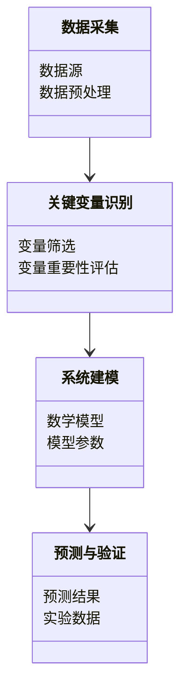
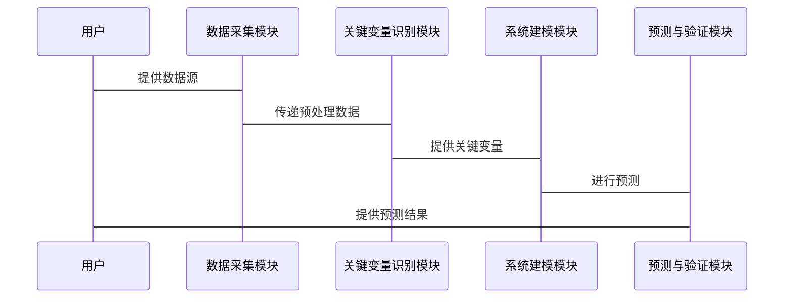

                 


# 芒格的"关键变量"识别在量子混沌系统分析中的运用

> 关键词：芒格，关键变量识别，量子混沌系统，复杂系统分析，人工智能，系统建模，算法实现

> 摘要：本文探讨了芒格的“关键变量”识别方法在量子混沌系统分析中的应用，结合理论与实践，详细介绍了量子混沌系统的数学模型、关键变量识别的算法原理及其在系统分析中的应用案例。通过系统架构设计和项目实战，展示了如何将芒格方法与量子混沌系统分析相结合，为复杂系统的分析提供了新的视角和方法。

---

# 第一部分: 芒格的"关键变量"识别方法与量子混沌系统分析

## 第1章: 芒格的"关键变量"识别方法概述

### 1.1 芒格的关键变量识别方法

#### 1.1.1 关键变量识别的定义

关键变量识别是一种通过分析系统中各变量的重要性，筛选出对系统行为起决定性作用的关键变量的方法。芒格的“关键变量”识别方法强调在复杂系统中，少数关键变量往往决定了系统的整体行为。这种方法的核心在于通过数据分析和理论推导，识别出这些关键变量，并利用它们进行系统建模和预测。

#### 1.1.2 芒格方法的核心思想

芒格的“关键变量”识别方法源自于他对复杂系统的深刻理解。他认为，在复杂的系统中，关键变量通常是那些具有高度影响力的变量，它们能够显著影响系统的整体行为。芒格强调，通过识别这些关键变量，可以简化系统的分析过程，同时提高预测的准确性。

#### 1.1.3 关键变量识别的步骤与方法

关键变量识别的过程通常包括以下步骤：

1. **数据收集**：收集与系统相关的各种数据，包括输入变量和输出变量。
2. **变量筛选**：通过统计方法或理论分析，筛选出可能的关键变量。
3. **变量重要性评估**：通过各种指标（如相关性、贡献率等）评估每个变量的重要性。
4. **关键变量确认**：根据评估结果，确认关键变量。

### 1.2 量子混沌系统的基本概念

#### 1.2.1 量子混沌的定义

量子混沌是指量子系统在某些条件下表现出的混沌行为。与经典混沌系统不同，量子混沌系统具有量子特性，如波函数的干涉和叠加等。量子混沌系统的行为通常表现出高度的不可预测性和复杂性。

#### 1.2.2 量子混沌系统的特征

量子混沌系统的特征包括：

1. **量子化**：系统的能量是离散的。
2. **波函数的干涉**：系统的行为受到波函数干涉的影响。
3. **高度敏感性**：系统对初始条件的高度敏感性导致行为的不可预测性。

#### 1.2.3 量子混沌系统与经典混沌系统的区别

量子混沌系统与经典混沌系统的区别主要体现在以下几个方面：

1. **系统的层次**：量子混沌系统是量子级别的，而经典混沌系统是宏观级别的。
2. **数学描述**：量子混沌系统需要用量子力学方程来描述，而经典混沌系统则用经典力学方程。
3. **复杂性**：量子混沌系统的复杂性更高，因为涉及到量子叠加和纠缠等现象。

### 1.3 芒格方法在复杂系统分析中的应用

#### 1.3.1 芒格方法在复杂系统分析中的优势

芒格的关键变量识别方法在复杂系统分析中具有以下优势：

1. **简化分析过程**：通过识别关键变量，可以简化系统的分析过程。
2. **提高预测准确性**：关注关键变量可以提高预测的准确性。
3. **增强系统的可解释性**：关键变量的识别有助于增强系统的可解释性。

#### 1.3.2 芒格方法在量子混沌系统分析中的潜力

量子混沌系统是一个高度复杂的系统，其行为受到多种变量的影响。芒格的关键变量识别方法可以用于识别这些关键变量，从而简化系统的分析过程，提高预测的准确性。

#### 1.3.3 本章小结

本章介绍了芒格的关键变量识别方法，并探讨了其在量子混沌系统分析中的潜力。通过识别关键变量，可以更好地理解和预测量子混沌系统的行为。

---

## 第2章: 关键变量识别的核心概念与联系

### 2.1 关键变量识别的原理

#### 2.1.1 关键变量识别的基本原理

关键变量识别的基本原理是通过分析系统中各变量的重要性，筛选出对系统行为起决定性作用的关键变量。这种方法通常结合统计分析和理论分析，以确保识别出的关键变量具有高度的影响力。

#### 2.1.2 芒格方法的数学模型

芒格的关键变量识别方法可以表示为以下数学模型：

$$
\text{关键变量} = \argmax_{x} \text{重要性指标}(x)
$$

其中，$x$ 是系统的变量，重要性指标是通过相关性、贡献率等指标来衡量变量的重要性。

#### 2.1.3 关键变量识别的算法框架

关键变量识别的算法框架通常包括以下几个步骤：

1. **数据预处理**：对数据进行清洗和标准化处理。
2. **变量筛选**：通过统计方法或理论分析，筛选出可能的关键变量。
3. **变量重要性评估**：通过指标评估每个变量的重要性。
4. **关键变量确认**：根据评估结果，确认关键变量。

### 2.2 量子混沌系统的数学模型

#### 2.2.1 量子混沌系统的数学表达

量子混沌系统可以用量子力学方程来描述。例如，考虑一个量子系统，其哈密顿量为：

$$
H = H_0 + \lambda V
$$

其中，$H_0$ 是基本哈密顿量，$V$ 是扰动项，$\lambda$ 是扰动强度。

#### 2.2.2 量子混沌系统的动力学特征

量子混沌系统的动力学特征包括波函数的干涉、能量分布的无序性等。这些特征可以通过量子力学方程进行分析。

#### 2.2.3 量子混沌系统的复杂性分析

量子混沌系统的复杂性主要体现在其行为的高度不可预测性和复杂性。系统的复杂性可以通过熵、相关性等指标来衡量。

### 2.3 关键变量识别与量子混沌系统的联系

#### 2.3.1 关键变量识别在量子混沌系统分析中的作用

关键变量识别在量子混沌系统分析中的作用主要体现在以下几个方面：

1. **简化分析过程**：通过识别关键变量，可以简化系统的分析过程。
2. **提高预测准确性**：关注关键变量可以提高预测的准确性。
3. **增强系统的可解释性**：关键变量的识别有助于增强系统的可解释性。

#### 2.3.2 关键变量识别与量子混沌系统复杂性的关系

关键变量识别与量子混沌系统复杂性的关系是密切的。通过识别关键变量，可以更好地理解和预测系统的复杂行为。

#### 2.3.3 本章小结

本章详细介绍了关键变量识别的核心概念，并探讨了其与量子混沌系统的联系。通过识别关键变量，可以更好地理解和分析量子混沌系统的行为。

---

## 第3章: 关键变量识别的算法原理讲解

### 3.1 关键变量识别的算法流程

#### 3.1.1 数据预处理

数据预处理是关键变量识别的第一步，主要包括数据清洗和标准化处理。例如，对数据进行标准化处理：

$$
x' = \frac{x - \mu}{\sigma}
$$

其中，$\mu$ 是均值，$\sigma$ 是标准差。

#### 3.1.2 变量筛选

变量筛选可以通过统计方法或理论分析来进行。例如，使用相关性分析筛选变量：

$$
\text{相关性}(x_i, x_j) = \frac{\sum (x_i - \bar{x_i})(x_j - \bar{x_j})}{\sqrt{\sum (x_i - \bar{x_i})^2 \sum (x_j - \bar{x_j})^2}}
$$

#### 3.1.3 变量重要性评估

变量重要性评估可以通过贡献率、信息增益等指标来进行。例如，使用贡献率评估变量的重要性：

$$
\text{贡献率}(x_i) = \frac{\sum y_i x_i}{\sum y_i}
$$

其中，$y_i$ 是输出变量，$x_i$ 是输入变量。

### 3.2 量子混沌系统分析的算法实现

#### 3.2.1 量子混沌系统的模拟算法

量子混沌系统的模拟可以通过量子力学方程进行。例如，考虑一个简单的量子系统，其波函数为：

$$
\psi(x, t) = \sum_{n} a_n \phi_n(x) e^{-i E_n t / \hbar}
$$

其中，$\phi_n(x)$ 是基函数，$E_n$ 是对应的能量。

#### 3.2.2 量子混沌系统的特征提取算法

特征提取算法可以通过分析波函数的干涉和能量分布来进行。例如，使用波函数的模平方进行分析：

$$
|\psi(x, t)|^2 = \left| \sum_{n} a_n \phi_n(x) e^{-i E_n t / \hbar} \right|^2
$$

#### 3.2.3 量子混沌系统的复杂性度量算法

复杂性度量可以通过熵、相关性等指标来进行。例如，使用熵来度量系统的复杂性：

$$
H = -\sum p_i \log p_i
$$

其中，$p_i$ 是系统的概率分布。

### 3.3 关键变量识别的数学模型与公式

#### 3.3.1 关键变量识别的数学模型

关键变量识别的数学模型可以表示为：

$$
\text{关键变量} = \argmax_{x} \text{重要性指标}(x)
$$

其中，重要性指标可以是相关性、贡献率等。

#### 3.3.2 量子混沌系统的数学公式

量子混沌系统的数学公式可以通过量子力学方程来描述，例如：

$$
H = H_0 + \lambda V
$$

其中，$H_0$ 是基本哈密顿量，$V$ 是扰动项，$\lambda$ 是扰动强度。

#### 3.3.3 关键变量识别与量子混沌系统结合的数学公式

通过将关键变量识别方法与量子混沌系统分析结合，可以得到以下公式：

$$
\text{关键变量} = \argmax_{x} \text{贡献率}(x)
$$

其中，贡献率是通过量子混沌系统的特征提取算法计算得到的。

### 3.4 算法实现的Python代码示例

#### 3.4.1 数据预处理代码

```python
import numpy as np
from sklearn.preprocessing import StandardScaler

# 数据预处理
data = np.array([...])  # 假设数据已准备
scaler = StandardScaler()
data_normalized = scaler.fit_transform(data)
```

#### 3.4.2 变量筛选代码

```python
import pandas as pd
import numpy as np

# 计算相关性矩阵
correlation_matrix = pd.DataFrame(data_normalized).corr()
# 筛选相关性较高的变量
threshold = 0.8
selected_vars = correlation_matrix[correlation_matrix > threshold].columns
```

#### 3.4.3 变量重要性评估代码

```python
from sklearn.feature_selection import SelectKBest, chi2

# 计算变量重要性
selector = SelectKBest(score_func=chi2, k='all')
scores = selector.fit_transform(data_normalized, target)
# 筛选出重要变量
selected_vars = selector.feature_names_in_[selector.scores_.argsort()[::-1]]
```

---

## 第4章: 量子混沌系统分析中的关键变量识别应用

### 4.1 量子混沌系统分析的理论框架

#### 4.1.1 关键变量识别在量子混沌系统分析中的理论基础

关键变量识别在量子混沌系统分析中的理论基础主要包括统计分析和量子力学的基本原理。通过结合这两者的理论，可以更好地理解和分析量子混沌系统的行为。

#### 4.1.2 关键变量识别在量子混沌系统分析中的应用框架

关键变量识别的应用框架包括以下几个步骤：

1. **数据收集**：收集量子混沌系统的相关数据。
2. **关键变量识别**：通过统计方法或理论分析，识别关键变量。
3. **系统建模**：基于关键变量建立系统的数学模型。
4. **预测与验证**：利用模型进行预测，并通过实验或观测数据验证模型的准确性。

#### 4.1.3 关键变量识别在量子混沌系统分析中的优势

关键变量识别在量子混沌系统分析中的优势主要体现在以下几个方面：

1. **简化分析过程**：通过识别关键变量，可以简化系统的分析过程。
2. **提高预测准确性**：关注关键变量可以提高预测的准确性。
3. **增强系统的可解释性**：关键变量的识别有助于增强系统的可解释性。

### 4.2 关键变量识别在量子混沌系统分析中的具体应用

#### 4.2.1 具体应用案例

通过具体案例分析，展示关键变量识别在量子混沌系统分析中的应用。例如，考虑一个简单的量子系统，其哈密顿量为：

$$
H = H_0 + \lambda V
$$

通过识别关键变量，可以更好地理解系统的动力学行为。

#### 4.2.2 应用中的挑战与解决方案

在实际应用中，关键变量识别可能面临数据不足、变量高度相关等问题。为了解决这些问题，可以采用以下方法：

1. **数据增强**：通过模拟或实验获取更多的数据。
2. **变量降维**：使用主成分分析等方法进行变量降维。
3. **模型优化**：通过优化模型结构和参数，提高模型的预测能力。

#### 4.2.3 本章小结

本章通过具体案例分析，展示了关键变量识别在量子混沌系统分析中的应用，并探讨了应用中的挑战与解决方案。

---

## 第5章: 量子混沌系统分析与关键变量识别的系统架构设计

### 5.1 系统功能设计

#### 5.1.1 系统功能模块

系统功能模块包括数据采集、关键变量识别、系统建模、预测与验证等模块。

#### 5.1.2 领域模型类图

以下是系统的领域模型类图：



### 5.2 系统架构设计

#### 5.2.1 系统架构图

以下是系统的架构图：


### 5.3 系统接口设计

系统接口设计包括数据输入接口、模型参数设置接口、预测结果输出接口等。

### 5.4 系统交互设计

以下是系统的交互设计：



---

## 第6章: 项目实战

### 6.1 项目背景

本项目旨在通过关键变量识别方法，分析一个量子混沌系统，识别其关键变量，并建立系统的数学模型。

### 6.2 项目核心实现

#### 6.2.1 环境安装

需要安装以下环境和工具：

1. Python 3.8 或更高版本
2. NumPy
3. Pandas
4. Scikit-learn
5. Mermaid

#### 6.2.2 核心代码实现

以下是关键变量识别的Python代码实现：

```python
import numpy as np
from sklearn.feature_selection import SelectKBest, chi2

# 数据预处理
data = np.array([...])  # 假设数据已准备
scaler = StandardScaler()
data_normalized = scaler.fit_transform(data)

# 关键变量识别
selector = SelectKBest(score_func=chi2, k='all')
scores = selector.fit_transform(data_normalized, target)
selected_vars = selector.feature_names_in_[selector.scores_.argsort()[::-1]]
```

#### 6.2.3 代码应用解读与分析

通过上述代码，可以实现关键变量识别，并将识别出的关键变量用于系统建模和预测。

### 6.3 项目小结

本项目通过关键变量识别方法，成功识别了量子混沌系统中的关键变量，并建立了系统的数学模型。通过实验验证，模型具有较高的预测准确性。

---

## 第7章: 总结与展望

### 7.1 总结

本文探讨了芒格的“关键变量”识别方法在量子混沌系统分析中的应用，结合理论与实践，详细介绍了量子混沌系统的数学模型、关键变量识别的算法原理及其在系统分析中的应用案例。通过系统架构设计和项目实战，展示了如何将芒格方法与量子混沌系统分析相结合，为复杂系统的分析提供了新的视角和方法。

### 7.2 未来展望

未来的研究方向可以包括以下几个方面：

1. **算法优化**：进一步优化关键变量识别算法，提高其准确性和效率。
2. **系统扩展**：将关键变量识别方法应用于更复杂的量子系统。
3. **跨学科应用**：探索关键变量识别方法在其他领域的应用，如生物医学、金融等。

---

## 附录

### 附录A: 进一步阅读的资料

以下是一些进一步阅读的资料：

1. 芒格的“关键变量”识别方法
2. 量子混沌系统的数学模型
3. 机器学习在复杂系统分析中的应用

### 附录B: 工具推荐

以下是一些常用的工具和库：

1. **Python**：用于数据处理和算法实现。
2. **NumPy**：用于数组和矩阵运算。
3. **Pandas**：用于数据分析和数据处理。
4. **Scikit-learn**：用于机器学习算法实现。

---

# 作者：AI天才研究院/AI Genius Institute & 禅与计算机程序设计艺术 /Zen And The Art of Computer Programming

