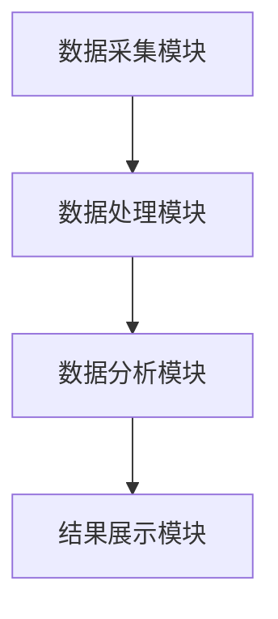
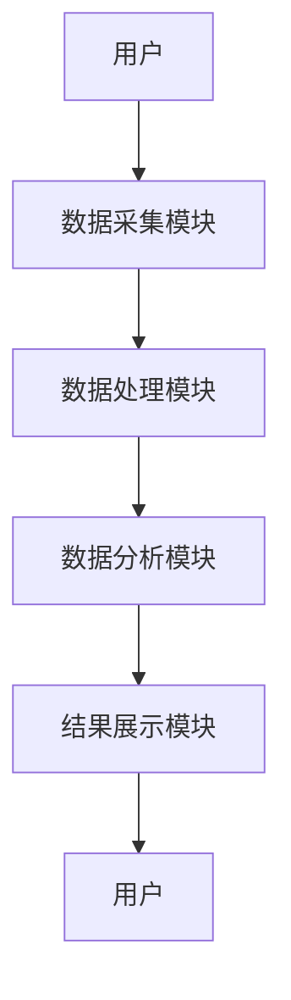

                 

# 芒格的"逆向工程"思维在量子算法专利分析中的应用

---

## 关键词：
- 芒格思维
- 逆向工程
- 量子算法
- 专利分析
- 技术研究

---

## 摘要：
本文探讨了芒格的"逆向工程"思维在量子算法专利分析中的应用。通过结合逆向思维与量子算法的特点，提出了一种新的专利分析方法，旨在从结果出发，逆向推导技术实现路径，从而在专利研究中发现潜在的技术突破点。文章详细阐述了逆向工程思维的核心原理、量子算法的基本概念、专利分析的系统架构，并通过实际案例展示了逆向工程思维在量子算法专利分析中的具体应用。

---

# 第一部分: 芒格的"逆向工程"思维与量子算法专利分析概述

## 第1章: 芒格的"逆向工程"思维与量子算法专利分析的背景介绍

### 1.1 "逆向工程"思维的定义与特点
"逆向工程"思维是一种从结果出发，逆向推导出实现该结果所需条件的思维方式。其核心在于通过分析结果的特征，反向推导出可能的实现路径或技术方案。与传统的"正向思维"不同，逆向思维更加注重从目标出发，寻找实现目标的最优路径。

#### 1.1.1 "逆向工程"思维的定义
逆向工程思维是一种通过分析结果来推断实现过程的思维方式。其本质是通过已知的结果，反向推导出可能的实现路径或技术方案。这种方法在解决问题时，能够帮助我们从多个角度思考，找到更优的解决方案。

#### 1.1.2 "逆向工程"思维的核心要素
- **目标明确性**：逆向思维需要明确结果的目标。
- **路径多样性**：通过反向推导，可以发现多种实现路径。
- **逻辑性**：逆向思维依赖于严密的逻辑推理。

#### 1.1.3 "逆向工程"思维在问题解决中的优势
- **高效性**：通过反向推导，可以快速找到解决问题的关键点。
- **创新性**：逆向思维能够帮助我们发现新的解决方案。
- **系统性**：逆向思维能够帮助我们从整体上理解问题。

### 1.2 量子算法的基本概念
量子算法是基于量子计算原理设计的算法，其核心在于利用量子叠加和量子纠缠等量子现象来实现计算任务。与经典算法相比，量子算法在某些特定问题上具有显著的计算优势。

#### 1.2.1 量子算法的定义
量子算法是利用量子计算机的特性设计的算法。其核心在于利用量子叠加和量子纠缠等量子现象来实现计算任务。

#### 1.2.2 量子算法与经典算法的主要区别
- **计算基础**：经典算法基于二进制逻辑，而量子算法基于量子叠加和量子纠缠。
- **计算速度**：在某些特定问题上，量子算法的计算速度远快于经典算法。
- **计算复杂度**：量子算法的计算复杂度在某些问题上显著低于经典算法。

#### 1.2.3 量子算法在实际应用中的重要性
量子算法在密码学、优化问题、化学模拟等领域具有重要的应用价值。例如，Shor算法可以在 polynomial time 内分解大整数，从而对RSA加密构成威胁。

### 1.3 专利分析的基本原理
专利分析是通过对专利数据的分析，研究技术的发展趋势、技术热点、技术空白等。其核心在于从大量的专利数据中提取有价值的信息，为技术创新提供参考。

#### 1.3.1 专利分析的定义
专利分析是对专利数据进行分析，研究技术的发展趋势、技术热点、技术空白等。

#### 1.3.2 专利分析的主要方法
- **定量分析**：通过统计方法分析专利数量、分布等。
- **定性分析**：通过技术关键词、专利摘要等进行技术内容分析。
- **对比分析**：对不同技术领域或不同时间的专利进行对比。

#### 1.3.3 专利分析在技术研究中的作用
专利分析可以帮助研究者了解技术的发展趋势，发现技术空白，为技术创新提供参考。

### 1.4 芒格的"逆向工程"思维与量子算法专利分析的结合
通过将逆向思维应用于量子算法专利分析，可以实现从结果到技术路径的逆向推导，从而发现潜在的技术突破点。

#### 1.4.1 "逆向工程"思维在专利分析中的应用
通过逆向思维，可以从专利的结果出发，反向推导出可能的技术实现路径。

#### 1.4.2 量子算法专利分析的特殊性
量子算法的复杂性和独特性使得其专利分析需要特殊的思考方式。

#### 1.4.3 两者的结合对技术研究的意义
通过逆向思维，可以更高效地从大量专利数据中提取有价值的信息，发现潜在的技术突破点。

### 1.5 本章小结
本章介绍了逆向工程思维的基本概念和特点，以及量子算法和专利分析的基本原理。通过分析逆向思维在专利分析中的应用，为后续的量子算法专利分析奠定了基础。

---

## 第2章: "逆向工程"思维与量子算法专利分析的核心概念

### 2.1 "逆向工程"思维的数学模型
通过数学模型，可以将逆向思维的过程转化为具体的数学表达式，从而更方便地应用于实际分析中。

#### 2.1.1 "逆向工程"思维的数学表达
假设我们有一个目标结果 \( R \)，逆向思维的目标是找到能够实现 \( R \) 的技术路径 \( T \)。数学表达式可以表示为：
$$ T = f^{-1}(R) $$
其中，\( f \) 是从技术路径到结果的映射函数，\( f^{-1} \) 是其逆函数。

#### 2.1.2 相关变量的定义与关系
- **目标结果 \( R \)**：需要实现的具体结果。
- **技术路径 \( T \)**：实现结果所需的技术步骤。
- **映射函数 \( f \)**：技术路径到结果的映射关系。

#### 2.1.3 数学模型的验证与应用
通过具体的案例验证数学模型的有效性，并将其应用于实际的专利分析中。

### 2.2 量子算法的数学模型
量子算法的核心在于利用量子叠加和量子纠缠等量子现象，通过数学模型描述量子算法的运行过程。

#### 2.2.1 量子算法的基本数学框架
量子算法的核心是量子态的叠加和量子门的操作。量子态可以用向量表示，量子门可以用矩阵表示。

#### 2.2.2 量子态与量子运算的数学表示
- **量子态**：可以用向量表示，例如：
$$ | \psi \rangle = \begin{bmatrix} a \\ b \end{bmatrix} $$
其中，\( a \) 和 \( b \) 是复数，满足 \( |a|^2 + |b|^2 = 1 \)。

- **量子门**：可以用矩阵表示，例如：
$$ X = \begin{bmatrix} 0 & 1 \\ 1 & 0 \end{bmatrix} $$
表示的是一个 Pauli-X 门。

#### 2.2.3 量子算法的复杂度分析
量子算法的复杂度通常用量子位数和量子运算的次数来表示。例如，Shor算法的时间复杂度为：
$$ O(\log N) $$
其中，\( N \) 是要分解的整数。

### 2.3 专利分析的数学模型
专利分析可以通过数学模型提取专利数据中的有用信息，例如技术关键词的出现频率、专利申请人之间的关系等。

#### 2.3.1 专利数据的特征提取
- **技术关键词提取**：通过自然语言处理技术提取专利中的技术关键词。
- **专利分类提取**：根据专利分类号提取技术领域。

#### 2.3.2 专利分析的指标体系
- **专利数量**：某个技术领域内的专利数量。
- **专利申请人**：主要专利申请人的分布。
- **专利引用**：专利之间的引用关系。

#### 2.3.3 专利分析的数学模型构建
通过统计分析和机器学习方法，构建专利分析的数学模型。例如，可以用 TF-IDF 方法提取技术关键词，或者用聚类算法分析技术领域。

### 2.4 "逆向工程"思维与量子算法专利分析的联系
通过将逆向思维应用于量子算法专利分析，可以更高效地从大量专利数据中发现潜在的技术突破点。

#### 2.4.1 "逆向工程"思维在专利分析中的具体应用
- **从结果出发**：通过分析专利的结果，反向推导出可能的技术路径。
- **技术路径分析**：通过逆向思维，分析技术路径的可行性。

#### 2.4.2 量子算法的特殊性对专利分析的影响
- **技术复杂性**：量子算法的复杂性使得其专利分析需要特殊的技巧。
- **技术前沿性**：量子算法是前沿技术，专利分析需要关注最新的技术发展。

#### 2.4.3 两者的结合对技术研究的推动作用
通过逆向思维，可以更高效地从大量专利数据中提取有价值的信息，发现潜在的技术突破点。

### 2.5 本章小结
本章介绍了逆向思维的数学模型和量子算法的数学模型，分析了逆向思维在专利分析中的应用。通过数学模型的构建，为后续的量子算法专利分析奠定了理论基础。

---

## 第3章: 量子算法的数学模型与算法原理

### 3.1 量子算法的基本原理
量子算法的核心在于利用量子叠加和量子纠缠等量子现象，通过数学模型描述量子算法的运行过程。

#### 3.1.1 量子叠加与量子纠缠
- **量子叠加**：量子态可以同时处于多个状态的叠加态。
- **量子纠缠**：两个或多个量子态之间存在纠缠关系，其中一个态的变化会直接影响另一个态。

#### 3.1.2 量子门与量子电路
- **量子门**：量子门是对量子态进行操作的基本单位。
- **量子电路**：由多个量子门组成的电路，可以实现复杂的量子算法。

#### 3.1.3 量子算法的基本步骤
- **初始化**：将量子态初始化为特定的叠加态。
- **量子运算**：对量子态进行一系列的量子门操作。
- **测量**：通过对量子态的测量，得到最终结果。

### 3.2 量子算法的数学模型
通过数学模型描述量子算法的运行过程，例如量子态的表示、量子门的矩阵表示等。

#### 3.2.1 量子算法的数学表达
量子算法可以用量子态和量子门的矩阵表示来描述。例如，Shor算法可以用以下步骤表示：
1. 初始化量子态 \( |x\rangle \)。
2. 对量子态进行一系列的量子门操作，得到 \( |y\rangle \)。
3. 测量量子态 \( |y\rangle \) 得到结果 \( r \)。

#### 3.2.2 量子算法的复杂度分析
量子算法的复杂度通常用量子位数和量子运算的次数来表示。例如，Shor算法的时间复杂度为：
$$ O(\log N) $$

#### 3.2.3 量子算法的实现步骤
- **初始化**：将量子态初始化为特定的叠加态。
- **量子运算**：对量子态进行一系列的量子门操作。
- **测量**：通过对量子态的测量，得到最终结果。

### 3.3 量子算法的实现案例
通过具体的实现案例，展示量子算法的运行过程和实际应用。

#### 3.3.1 Shor算法的实现
Shor算法是一种用于大整数分解的量子算法。其主要步骤包括：
1. 初始化量子态 \( |x\rangle \)。
2. 对量子态进行一系列的量子门操作，得到 \( |y\rangle \)。
3. 测量量子态 \( |y\rangle \) 得到结果 \( r \)。

#### 3.3.2 Grover算法的实现
Grover算法是一种用于无序数据库搜索的量子算法。其主要步骤包括：
1. 初始化量子态 \( |x\rangle \)。
2. 对量子态进行一系列的量子门操作，得到 \( |y\rangle \)。
3. 测量量子态 \( |y\rangle \) 得到结果 \( r \)。

#### 3.3.3 量子傅里叶变换的实现
量子傅里叶变换是一种用于量子信号处理的算法。其主要步骤包括：
1. 初始化量子态 \( |x\rangle \)。
2. 对量子态进行一系列的量子门操作，得到 \( |y\rangle \)。
3. 测量量子态 \( |y\rangle \) 得到结果 \( r \)。

### 3.4 量子算法的数学公式
通过数学公式详细描述量子算法的运行过程，例如量子态的表示、量子门的矩阵表示等。

#### 3.4.1 量子叠加的数学表达
$$ | \psi \rangle = \alpha |0\rangle + \beta |1\rangle $$
其中，\( \alpha \) 和 \( \beta \) 是复数，满足 \( |\alpha|^2 + |\beta|^2 = 1 \)。

#### 3.4.2 量子纠缠的数学表达
$$ | \psi \rangle = \frac{1}{\sqrt{2}} (|0\rangle \otimes |1\rangle + |1\rangle \otimes |0\rangle) $$
表示两个量子态之间的纠缠关系。

#### 3.4.3 量子算法的复杂度公式
Shor算法的时间复杂度为：
$$ O(\log N) $$
其中，\( N \) 是要分解的整数。

### 3.5 本章小结
本章详细介绍了量子算法的基本原理和数学模型，通过具体的实现案例展示了量子算法的运行过程和实际应用。通过数学公式的详细推导，为后续的量子算法专利分析奠定了理论基础。

---

## 第4章: 专利分析的系统架构与实现方案

### 4.1 专利分析的系统架构
通过系统架构的设计，实现量子算法专利分析的高效性和准确性。

#### 4.1.1 系统模块划分
- **数据采集模块**：负责采集专利数据。
- **数据处理模块**：负责对专利数据进行清洗和预处理。
- **数据分析模块**：负责对专利数据进行分析和挖掘。
- **结果展示模块**：负责展示分析结果。

#### 4.1.2 系统功能设计
- **数据采集**：从专利数据库中采集专利数据。
- **数据处理**：对专利数据进行清洗和预处理。
- **数据分析**：通过对专利数据的分析，发现技术趋势和热点。
- **结果展示**：通过可视化的方式展示分析结果。

#### 4.1.3 系统架构图（Mermaid）

### 4.2 专利数据的采集与预处理
通过数据采集和预处理，确保专利数据的准确性和完整性。

#### 4.2.1 数据源的选择
选择可靠的专利数据库，例如USPTO、欧洲专利局数据库等。

#### 4.2.2 数据清洗与预处理
- **数据清洗**：去除重复数据、错误数据等。
- **数据预处理**：对专利数据进行格式化处理，提取技术关键词、专利申请人等信息。

#### 4.2.3 数据存储与管理
通过数据库或数据仓库存储专利数据，确保数据的高效管理和快速查询。

### 4.3 专利分析的实现步骤
通过具体的实现步骤，展示专利分析的全过程。

#### 4.3.1 数据分析方法的选择
- **统计分析**：用于分析专利数量、分布等。
- **文本挖掘**：用于分析专利摘要、技术关键词等。
- **机器学习**：用于发现技术趋势和热点。

#### 4.3.2 数据分析模型的构建
- **关键词提取**：使用TF-IDF方法提取技术关键词。
- **主题建模**：使用LDA模型进行主题建模。
- **聚类分析**：将专利数据进行聚类分析，发现技术热点。

#### 4.3.3 数据分析结果的展示
- **可视化展示**：通过图表、热图等方式展示分析结果。
- **报告生成**：生成分析报告，总结分析结果。

### 4.4 专利分析的系统实现
通过具体的系统实现，展示专利分析的全过程。

#### 4.4.1 系统功能设计
- **数据采集**：从专利数据库中采集专利数据。
- **数据处理**：对专利数据进行清洗和预处理。
- **数据分析**：通过对专利数据的分析，发现技术趋势和热点。
- **结果展示**：通过可视化的方式展示分析结果。

#### 4.4.2 系统接口设计
- **数据接口**：与专利数据库对接，实现数据的采集和传输。
- **用户界面**：提供友好的用户界面，方便用户进行数据分析和结果查看。

#### 4.4.3 系统交互流程图（Mermaid）

### 4.5 本章小结
本章详细介绍了专利分析的系统架构和实现方案，通过系统的模块划分和功能设计，展示了专利分析的全过程。通过具体的实现步骤和系统设计，确保专利分析的高效性和准确性。

---

## 第5章: 逆向思维在量子算法专利分析中的应用案例

### 5.1 量子算法专利分析的背景与目标
通过具体的案例分析，展示逆向思维在量子算法专利分析中的应用。

#### 5.1.1 案例背景
假设我们想要分析某公司在量子算法领域的专利布局，目标是通过逆向思维发现其技术路径。

#### 5.1.2 案例目标
通过逆向思维，从结果出发，反向推导出可能的技术路径，发现潜在的技术突破点。

### 5.2 逆向思维在量子算法专利分析中的具体应用
通过具体的分析步骤，展示逆向思维在量子算法专利分析中的应用。

#### 5.2.1 数据采集
从专利数据库中采集该公司在量子算法领域的专利数据。

#### 5.2.2 数据分析
通过对专利数据的分析，提取技术关键词、专利申请人等信息。

#### 5.2.3 技术路径推导
通过逆向思维，从结果出发，反向推导出可能的技术路径。

### 5.3 逆向思维在量子算法专利分析中的优势
通过具体的案例分析，展示逆向思维在量子算法专利分析中的优势。

#### 5.3.1 提高分析效率
通过逆向思维，可以快速从大量专利数据中提取有价值的信息。

#### 5.3.2 发现潜在技术突破点
通过逆向思维，可以发现潜在的技术路径，为技术创新提供参考。

#### 5.3.3 提高分析的准确性
通过逆向思维，可以更准确地分析技术路径，发现潜在的技术空白。

### 5.4 本章小结
本章通过具体的案例分析，展示了逆向思维在量子算法专利分析中的应用。通过逆向思维，可以更高效地从大量专利数据中发现潜在的技术突破点，为技术创新提供参考。

---

## 第6章: 逆向思维在量子算法专利分析中的最佳实践

### 6.1 逆向思维在专利分析中的最佳实践
通过具体的实践案例，展示逆向思维在专利分析中的应用。

#### 6.1.1 确定分析目标
明确分析的目标，例如分析某公司在量子算法领域的专利布局。

#### 6.1.2 收集专利数据
从专利数据库中采集相关的专利数据。

#### 6.1.3 数据清洗与预处理
对专利数据进行清洗和预处理，提取有用的信息。

#### 6.1.4 分析技术路径
通过逆向思维，从结果出发，反向推导出可能的技术路径。

### 6.2 逆向思维在量子算法专利分析中的注意事项
在实际应用中，需要注意以下几点：

#### 6.2.1 数据的准确性
确保专利数据的准确性和完整性。

#### 6.2.2 技术路径的可行性
通过逆向思维推导出的技术路径需要进一步验证其可行性。

#### 6.2.3 结果的可解释性
分析结果需要具有可解释性，能够清晰地展示技术路径的逻辑性。

### 6.3 逆向思维在量子算法专利分析中的拓展阅读
推荐一些相关的拓展阅读材料，例如量子算法的经典文献、专利分析的优秀案例等。

#### 6.3.1 量子算法的经典文献
- Shor算法的论文
- Grover算法的论文

#### 6.3.2 专利分析的优秀案例
- 某公司在量子算法领域的专利分析报告

### 6.4 本章小结
本章总结了逆向思维在专利分析中的最佳实践，提出了在实际应用中需要注意的事项，并推荐了一些拓展阅读材料，供读者进一步学习和研究。

---

## 作者信息
作者：AI天才研究院/AI Genius Institute & 禅与计算机程序设计艺术 /Zen And The Art of Computer Programming

---

以上是完整的目录大纲和文章内容。

