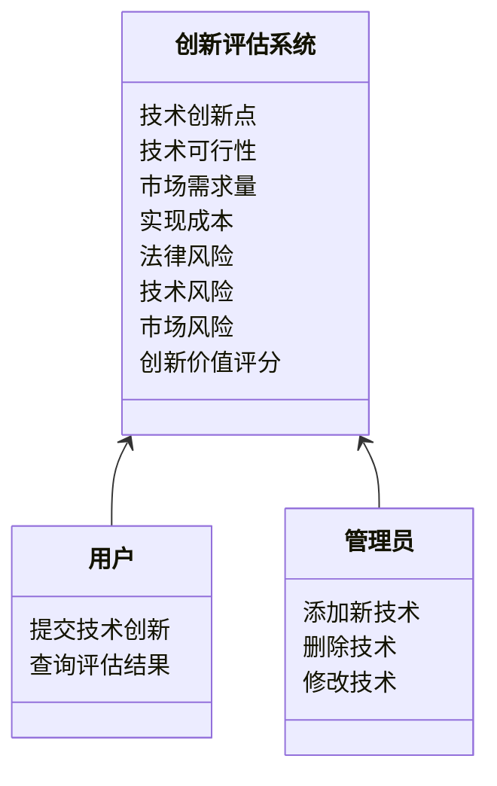
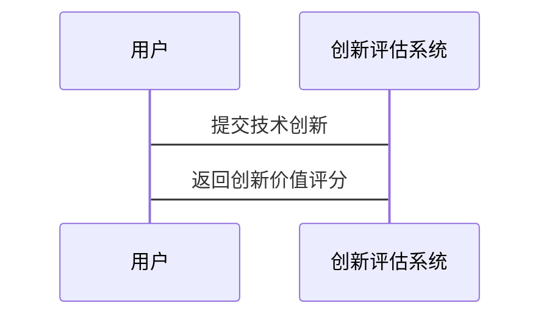

                 


# 费雪的创新评估体系：应对颠覆性技术的影响

> 关键词：创新评估体系，颠覆性技术，费雪模型，创新价值，技术评估

> 摘要：本文探讨了费雪创新评估体系在应对颠覆性技术影响中的作用，通过详细分析其核心概念、数学模型和系统架构，结合实际案例，展示了如何利用该体系进行创新评估和战略规划。

---

# 第一部分: 费雪创新评估体系的背景与核心概念

## 第1章: 费雪创新评估体系概述

### 1.1 费雪创新评估体系的背景

#### 1.1.1 创新评估的定义与重要性
创新评估是指对新技术、新产品或新商业模式的潜在价值、风险和可行性进行系统分析的过程。在当今快速变化的技术环境中，创新评估对于企业制定战略决策至关重要。通过科学的评估体系，企业能够识别出具有真正价值的创新，并避免因盲目投资而导致的资源浪费。

#### 1.1.2 费雪体系的起源与发展
费雪创新评估体系由著名创新管理学家菲利普·费雪（Philip Fisher）提出，最初用于评估新兴技术的潜力。该体系通过分析技术的创新性、可行性和市场潜力，帮助企业识别出可能改变行业格局的颠覆性技术。

#### 1.1.3 费雪体系的核心目标与应用场景
费雪体系的核心目标是通过系统化的评估方法，帮助企业识别出具有高潜力的创新技术，并预测这些技术对企业现有业务的潜在影响。其应用场景包括技术投资决策、产品开发规划和风险管理等领域。

### 1.2 颠覆性技术的定义与特征

#### 1.2.1 颠覆性技术的定义
颠覆性技术是指那些能够从根本上改变行业格局、商业模式或用户行为的新技术。这类技术通常以低性能但高性价比的方式进入市场，逐步取代现有的主流技术。

#### 1.2.2 颠覆性技术的特征分析
- **低成本**：颠覆性技术通常以更低的成本提供更高的性能或新的功能。
- **高潜力**：这类技术有潜力改变行业的竞争格局。
- **非连续性**：颠覆性技术往往通过破坏性创新的方式进入市场。

#### 1.2.3 颠覆性技术对传统行业的冲击
颠覆性技术的出现往往会对传统行业造成巨大冲击。例如，数字支付技术颠覆了传统的银行支付体系，社交媒体改变了传统的广告行业。

## 第2章: 费雪创新评估体系的核心要素

### 2.1 创新评估的核心概念

#### 2.1.1 创新价值的评估维度
- **技术可行性**：技术是否能够在实际中应用。
- **市场潜力**：技术是否具有广泛的应用场景。
- **经济价值**：技术是否能够为企业创造经济效益。

#### 2.1.2 创新潜力的评估标准
- **技术独特性**：技术是否具有独特的创新点。
- **竞争优势**：技术是否能够在市场上形成竞争优势。
- **可扩展性**：技术是否能够在不同场景下扩展应用。

#### 2.1.3 创新风险的评估方法
- **技术风险**：技术是否成熟，是否存在技术瓶颈。
- **市场风险**：市场需求是否充足，是否存在市场接受度问题。
- **法律风险**：是否存在知识产权纠纷或其他法律问题。

### 2.2 费雪创新评估模型

#### 2.2.1 费雪创新评估模型的结构
费雪创新评估模型由三个核心要素组成：技术可行性、市场潜力和经济价值。模型通过综合评估这三个维度的指标，得出创新的总体价值。

#### 2.2.2 模型的核心要素与关系
- **技术可行性**：评估技术的实现难度和可行性。
- **市场潜力**：评估技术的市场前景和应用范围。
- **经济价值**：评估技术的经济收益和投资回报。

#### 2.2.3 模型的适用范围与局限性
费雪创新评估模型适用于大多数技术创新评估场景，但在面对高度不确定的颠覆性技术时，模型可能无法准确预测其潜在影响。

## 第3章: 颠覆性技术与创新评估的关系

### 3.1 颠覆性技术的识别与分类

#### 3.1.1 技术颠覆的类型
- **渐进式颠覆**：逐步改进现有技术，最终取代传统技术。
- **破坏性颠覆**：以全新的技术模式进入市场，迅速改变行业格局。

#### 3.1.2 颠覆性技术的特征分析
- **低成本**：颠覆性技术通常以更低的成本提供更高的性能。
- **高潜力**：具有改变行业格局的潜力。
- **非连续性**：与现有技术相比，颠覆性技术往往具有显著的创新点。

#### 3.1.3 颠覆性技术对传统行业的冲击
颠覆性技术的出现往往会对传统行业造成巨大冲击。例如，数字支付技术颠覆了传统的银行支付体系，社交媒体改变了传统的广告行业。

### 3.2 费雪体系在应对颠覆性技术中的作用

#### 3.2.1 费雪体系在技术评估中的应用
费雪创新评估体系通过系统化的评估方法，帮助企业识别出具有高潜力的创新技术，并预测这些技术对企业现有业务的潜在影响。

#### 3.2.2 费雪体系在风险控制中的作用
通过评估技术的可行性、市场潜力和经济价值，费雪体系可以帮助企业识别和控制创新过程中可能面临的技术风险、市场风险和经济风险。

#### 3.2.3 费雪体系在战略规划中的价值
费雪创新评估体系为企业的技术投资决策提供了科学依据，帮助企业制定合理的创新战略，从而在激烈的市场竞争中占据优势。

---

# 第二部分: 费雪创新评估体系的理论基础

## 第4章: 创新评估的理论模型

### 4.1 费雪创新评估模型的数学表达

#### 4.1.1 创新价值的数学公式
$$ V = f(I, P, R) $$
其中，V为创新价值，I为创新强度，P为创新潜力，R为创新风险。

#### 4.1.2 创新强度的计算
创新强度I可以通过以下公式计算：
$$ I = \frac{N_{\text{创新点}}}{D_{\text{技术复杂度}}} $$
其中，$N_{\text{创新点}}$为技术的创新点数量，$D_{\text{技术复杂度}}$为技术实现的复杂度。

#### 4.1.3 创新潜力的评估
创新潜力P可以通过以下公式计算：
$$ P = \frac{M_{\text{市场需求}}}{C_{\text{成本}}} $$
其中，$M_{\text{市场需求}}$为技术的市场需求量，$C_{\text{成本}}$为技术的实现成本。

#### 4.1.4 创新风险的量化
创新风险R可以通过以下公式计算：
$$ R = \frac{L_{\text{法律风险}} + T_{\text{技术风险}} + M_{\text{市场风险}}}{3} $$
其中，$L_{\text{法律风险}}$为法律风险的评分，$T_{\text{技术风险}}$为技术风险的评分，$M_{\text{市场风险}}$为市场风险的评分。

### 4.2 颠覆性技术的判定标准

#### 4.2.1 技术颠覆的判定指标
- **技术独特性**：技术是否具有独特的创新点。
- **成本优势**：技术是否具有显著的成本优势。
- **市场潜力**：技术是否具有广泛的市场潜力。

#### 4.2.2 技术颠覆的量化方法
通过费雪创新评估模型，可以将颠覆性技术的潜力量化为具体的数值，从而帮助企业更好地评估其价值。

#### 4.2.3 技术颠覆的评估流程
1. 确定颠覆性技术的创新点。
2. 评估技术的可行性、市场潜力和经济价值。
3. 计算创新价值V，判断技术是否具有颠覆性。

## 第5章: 创新评估的算法原理

### 5.1 费雪创新评估算法

#### 5.1.1 算法的基本原理
费雪创新评估算法通过综合评估技术的创新性、可行性和市场潜力，得出创新的总体价值。算法的核心是将多个评估指标进行加权计算，得出最终的创新价值评分。

#### 5.1.2 算法的输入与输出
- **输入**：技术创新点、技术可行性、市场需求量、实现成本、法律风险、技术风险、市场风险。
- **输出**：创新价值评分、技术创新潜力评分。

#### 5.1.3 算法的实现步骤
1. 收集技术创新点、技术可行性、市场需求量等数据。
2. 计算创新强度I。
3. 计算创新潜力P。
4. 计算创新风险R。
5. 综合计算创新价值V。

#### 5.1.4 算法的数学模型
创新价值V的计算公式如下：
$$ V = \alpha I + \beta P - \gamma R $$
其中，$\alpha$、$\beta$、$\gamma$为权重系数，通常取值范围在0到1之间。

### 5.2 算法的实现示例

#### 5.2.1 示例场景
假设我们正在评估一种新型支付技术，技术创新点为3，技术可行性为80%，市场需求量为100万，实现成本为50万，法律风险为20%，技术风险为30%，市场风险为40%。

#### 5.2.2 计算创新强度I
$$ I = \frac{3}{2} = 1.5 $$

#### 5.2.3 计算创新潜力P
$$ P = \frac{100}{50} = 2 $$

#### 5.2.4 计算创新风险R
$$ R = \frac{20 + 30 + 40}{3} = 30 $$

#### 5.2.5 计算创新价值V
假设权重系数$\alpha = 0.5$，$\beta = 0.3$，$\gamma = 0.2$：
$$ V = 0.5 \times 1.5 + 0.3 \times 2 - 0.2 \times 30 = 0.75 + 0.6 - 6 = -4.65 $$

由于创新价值V为负数，说明该技术的创新价值较低，不值得投资。

---

# 第三部分: 系统分析与架构设计方案

## 第6章: 系统分析与架构设计

### 6.1 问题场景介绍
假设我们正在为一家科技公司设计一个创新评估系统，用于评估公司内部的研发项目和外部的技术投资。

### 6.2 系统功能设计

#### 6.2.1 领域模型设计
以下是创新评估系统的领域模型：



#### 6.2.2 系统架构设计
以下是创新评估系统的架构设计：

```mermaid
container 创新评估系统 {
    component 数据库 {
        技术信息表
        用户表
        评估结果表
    }
    component 服务层 {
        创新评估算法
        数据处理服务
    }
    component 界面层 {
        用户界面
        管理界面
    }
}
```

#### 6.2.3 系统接口设计
创新评估系统提供以下接口：

- `submitTechnology(技术创新点, 技术可行性, 市场需求量, 实现成本, 法律风险, 技术风险, 市场风险)`
- `getAssessmentResult()`

#### 6.2.4 系统交互设计
以下是用户与系统之间的交互流程：



---

# 第四部分: 项目实战

## 第7章: 项目实战

### 7.1 环境安装

#### 7.1.1 安装Python环境
确保安装了Python 3.8及以上版本。

#### 7.1.2 安装依赖库
安装所需的依赖库：
```bash
pip install numpy matplotlib
```

### 7.2 系统核心实现源代码

#### 7.2.1 创新评估算法实现
```python
def calculate_innovation_value(I, P, R, alpha=0.5, beta=0.3, gamma=0.2):
    V = alpha * I + beta * P - gamma * R
    return V

# 示例数据
I = 1.5
P = 2
R = 30
V = calculate_innovation_value(I, P, R)
print(f"创新价值评分: {V}")
```

#### 7.2.2 系统交互实现
```python
class InnovationAssessmentSystem:
    def __init__(self):
        self.technologies = []

    def submit_technology(self, **kwargs):
        I = kwargs['I']
        P = kwargs['P']
        R = kwargs['R']
        V = calculate_innovation_value(I, P, R)
        self.technologies.append({'V': V, **kwargs})

    def get_assessment_result(self, index):
        return self.technologies[index]

# 使用示例
system = InnovationAssessmentSystem()
system.submit_technology(I=1.5, P=2, R=30)
print(system.get_assessment_result(0))
```

### 7.3 代码应用解读与分析
上述代码实现了一个简单的创新评估系统，用户可以通过调用`submit_technology`方法提交技术创新参数，系统会计算并返回创新价值评分。评分结果可以帮助企业判断是否值得投资该技术。

### 7.4 实际案例分析
假设我们正在评估一种新型支付技术：

- 技术创新点I = 1.5
- 市场潜力P = 2
- 创新风险R = 30

计算创新价值V：
$$ V = 0.5 \times 1.5 + 0.3 \times 2 - 0.2 \times 30 = 0.75 + 0.6 - 6 = -4.65 $$

由于创新价值V为负数，说明该技术的创新价值较低，不值得投资。

### 7.5 项目小结
通过以上代码实现，我们可以看到费雪创新评估体系在实际项目中的应用价值。通过量化评估指标，企业可以更科学地做出技术投资决策。

---

# 第五部分: 总结与展望

## 第8章: 总结与展望

### 8.1 小结
费雪创新评估体系通过系统化的评估方法，帮助企业识别出具有高潜力的创新技术，并预测这些技术对企业现有业务的潜在影响。通过量化评估指标，企业可以更科学地做出技术投资决策。

### 8.2 注意事项
在实际应用中，需要注意以下几点：
- 数据的准确性和完整性。
- 模型的适用性和局限性。
- 风险评估的全面性和细致性。

### 8.3 未来展望
随着人工智能和大数据技术的发展，费雪创新评估体系将更加智能化和自动化。未来的创新评估系统将能够实时分析市场动态，自动调整评估模型，为企业提供更加精准的创新评估服务。

---

# 作者

作者：AI天才研究院/AI Genius Institute & 禅与计算机程序设计艺术/Zen And The Art of Computer Programming

