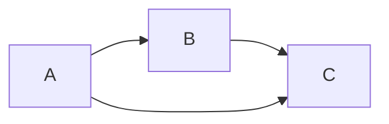
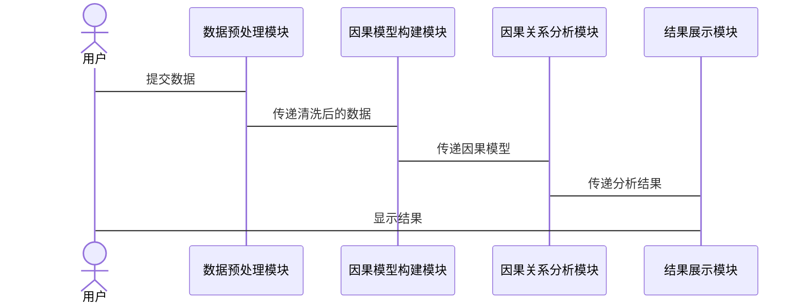

                 


# 《金融领域因果推断的研究与应用》

> 关键词：因果推断、金融分析、时间序列、因果图模型、潜在结果框架

> 摘要：本文系统地探讨了因果推断在金融领域的研究与应用。从因果推断的基本概念出发，分析了其在金融数据分析中的重要性。通过详细阐述因果图模型、潜在结果框架和时间序列因果推断等核心理论，结合具体金融场景，深入探讨了因果推断的算法实现及其在资产定价、风险管理等领域的实际应用。最后，本文总结了因果推断在金融领域的优势与挑战，并展望了未来的研究方向。

---

## 第一部分：金融领域因果推断的背景与基础

### 第1章：因果推断的基本概念与背景

#### 1.1 因果推断的定义与核心概念

**1.1.1 什么是因果推断**

因果推断是一种研究变量之间因果关系的方法。与相关性分析不同，因果推断关注的是变量之间的“原因-结果”关系，而非仅仅是变量之间的关联性。例如，因果推断可以回答“投资X对股价Y的影响有多大？”这样的问题。

**1.1.2 因果关系的特征与属性**

因果关系具有以下特征：
- **时间性**：原因必须在结果之前发生。
- **可传递性**：因果关系可以通过中间变量传递。
- **稳定性**：因果关系在不同环境下保持一致。

**1.1.3 因果推断与相关性的区别**

| 特性      | 相关性分析         | 因果推断分析         |
|-----------|--------------------|----------------------|
| 目标      | 描述变量之间的关联 | 描述变量之间的因果关系 |
| 要求      | 无需考虑时间顺序   | 需要考虑时间顺序     |
| 结论      | 变量之间存在关联   | 变量之间存在因果关系 |

**1.1.4 因果推断的核心术语**

- **处理（Treatment）**：干预或改变的变量。
- **结果（Outcome）**：观察到的变量。
- **潜在结果（Potential Outcome）**：每个样本在不同处理下的结果。

#### 1.2 金融领域因果推断的背景与应用

**1.2.1 金融数据分析的挑战**

金融数据通常具有以下特点：
- **高度波动性**：价格、收益率等指标波动剧烈。
- **复杂性**：受多种因素影响，如市场情绪、政策变化等。
- **非独立性**：变量之间可能存在复杂的依赖关系。

**1.2.2 因果推断在金融中的重要性**

因果推断可以帮助金融分析师回答以下问题：
- **因果关系**：投资某只股票是否会导致股价上涨？
- **政策效果**：货币政策调整对经济增长的影响有多大？
- **风险管理**：某种金融工具是否会导致系统性风险？

**1.2.3 金融领域因果推断的应用场景**

- **资产定价**：分析某资产价格波动的原因。
- **风险管理**：评估不同风险因素之间的因果关系。
- **市场微观结构**：研究订单簿、交易行为等对市场价格的影响。

#### 1.3 金融因果推断的核心问题

**1.3.1 市场干预的识别**

在金融市场中，因果推断需要识别市场干预（如政策变化、公司公告等）对价格的影响。

**1.3.2 变量之间的因果关系**

分析变量之间的因果关系，例如分析货币政策对经济增长的影响。

**1.3.3 时间序列因果分析**

由于金融市场数据通常具有时间序列特征，时间序列因果分析尤为重要。

---

## 第二部分：金融领域因果推断的核心理论

### 第2章：因果图模型与潜在结果框架

#### 2.1 因果图模型的基本原理

**2.1.1 因果图的定义与表示**

因果图（Causal Graph）通过节点和边表示变量之间的因果关系。节点代表变量，边的方向表示因果关系的方向。

**2.1.2 节点与边的关系**

- **直接因果关系**：A→B表示A直接导致B。
- **间接因果关系**：A→C→B表示A通过C影响B。

**2.1.3 调整因果图的方法**

调整因果图的方法包括：
1. **删除无关节点**：去除与目标变量无关的节点。
2. **添加中间节点**：增加中间变量以更准确地表示因果关系。

**2.1.4 因果图的Mermaid表示**



#### 2.2 潜在结果框架

**2.2.1 潜在结果的定义**

潜在结果（Potential Outcome）是指在不同处理下每个样本的结果。例如，对于样本i，处理为1时的结果为$Y_i(1)$，处理为0时的结果为$Y_i(0)$。

**2.2.2 平均处理效应的计算**

平均处理效应（Average Treatment Effect，ATE）的计算公式为：
$$ATE = E[Y_i(1) - Y_i(0)]$$

**2.2.3 潜在结果与观测数据的关系**

潜在结果与观测数据的关系可以通过以下方式表示：
$$Y_i = Y_i(1) \cdot T_i + Y_i(0) \cdot (1 - T_i)$$
其中，$T_i$是处理变量，取值为0或1。

#### 2.3 时间序列因果推断

**2.3.1 时间序列的基本特征**

时间序列数据具有以下特征：
- **趋势**：数据随时间的长期趋势。
- **周期性**：数据随时间呈现的周期性波动。
- **随机性**：数据中的不可预测部分。

**2.3.2 时间序列因果关系的识别**

识别时间序列因果关系的方法包括：
1. **格兰杰因果检验**：通过回归模型检验变量之间的因果关系。
2. **向量自回归模型（VAR）**：用于分析多个时间序列变量之间的关系。

**2.3.3 时间序列因果推断的挑战**

时间序列因果推断的挑战包括：
- **内生性问题**：变量之间的相互影响可能导致估计偏误。
- **动态性问题**：因果关系可能随时间变化。

---

## 第三部分：金融因果推断的算法原理

### 第3章：因果推断的主要算法

#### 3.1 双重稳健估计

**3.1.1 双重稳健估计的定义**

双重稳健估计（Doubly Robust Estimation）是一种同时考虑倾向评分和潜在结果的方法。

**3.1.2 双重稳健估计的数学模型**

双重稳健估计的公式为：
$$\hat{ATE} = \frac{1}{n} \sum_{i=1}^n \left( \frac{I(T_i=1)}{p(T_i=1)} Y_i(1) - \frac{I(T_i=0)}{1-p(T_i=0)} Y_i(0) \right)$$

**3.1.3 双重稳健估计的实现步骤**

```python
import pandas as pd
import numpy as np

# 假设df为数据框，包含处理变量T和潜在结果Y
def doubly_robust(df):
    # 计算倾向评分
    model = sm.Logit('T ~ X', data=df)
    result = model.fit()
    propensity_scores = result.predict()
    
    # 计算双重稳健估计
    ate = 0
    for i in range(len(df)):
        if df['T'][i] == 1:
            ate += df['Y'][i] / propensity_scores[i]
        else:
            ate -= df['Y'][i] / (1 - propensity_scores[i])
    ate = ate / len(df)
    return ate

# 示例数据
df = pd.DataFrame({
    'T': [0, 1, 1, 0],
    'Y': [2, 3, 4, 1]
})

print(doubly_robust(df))
```

#### 3.2 工具变量法

**3.2.1 工具变量法的基本原理**

工具变量法（Instrumental Variables，IV）通过引入工具变量来解决内生性问题。

**3.2.2 工具变量法的数学模型**

工具变量法的回归方程为：
$$Y = \beta X + \epsilon$$
$$X = \alpha Z + \gamma$$
其中，Z是工具变量。

**3.2.3 工具变量法的实现步骤**

```python
import statsmodels.api as sm

# 假设df为数据框，包含工具变量Z和处理变量X
def iv_regression(df):
    # 构建工具变量回归模型
    model = sm.OLS(df['Y'], sm.add_constant(df['X']))
    result = model.fit()
    print(result.summary())

# 示例数据
df = pd.DataFrame({
    'Z': [0, 1, 1, 0],
    'X': [1, 2, 3, 4],
    'Y': [5, 6, 7, 8]
})

iv_regression(df)
```

#### 3.3 断点回归

**3.3.1 断点回归的定义**

断点回归（Regression Discontinuity Design，RDD）用于评估连续变量的断点对结果的影响。

**3.3.2 断点回归的数学模型**

断点回归的回归方程为：
$$Y = \beta X + \epsilon$$
其中，X是连续变量，断点为某个临界值。

**3.3.3 断点回归的实现步骤**

```python
import statsmodels.robust.linear_model as rlm

# 假设df为数据框，包含连续变量X和结果Y
def rdd_regression(df):
    # 选择断点
    threshold = df['X'].median()
    mask = df['X'] >= threshold
    model = rlm.RLM(df[mask]['Y'], sm.add_constant(df[mask]['X']))
    result = model.fit()
    print(result.summary())

# 示例数据
df = pd.DataFrame({
    'X': [1, 2, 3, 4, 5],
    'Y': [6, 7, 8, 9, 10]
})

rdd_regression(df)
```

---

## 第四部分：金融因果推断的系统分析与架构设计

### 第4章：金融因果推断的系统架构

#### 4.1 问题场景介绍

**4.1.1 金融数据分析的场景**

金融数据分析通常涉及大量的市场数据、交易数据和宏观经济指标。

**4.1.2 因果推断在金融中的应用**

因果推断可以帮助金融分析师回答以下问题：
- **因果关系**：某个变量是否是另一个变量的直接原因。
- **政策效果**：政策变化对市场的影响。

**4.1.3 系统设计的目标与范围**

系统设计的目标是构建一个能够处理金融数据的因果推断系统，支持多种因果分析方法。

#### 4.2 系统功能设计

**4.2.1 数据预处理模块**

数据预处理模块负责清洗和转换数据，确保数据适合因果推断分析。

**4.2.2 因果模型构建模块**

因果模型构建模块负责根据数据构建因果图和潜在结果模型。

**4.2.3 因果关系分析模块**

因果关系分析模块负责通过算法实现因果关系的估计和推断。

#### 4.3 系统架构设计

**4.3.1 系统架构的Mermaid图**


**4.3.2 系统接口设计**

系统接口包括：
- 数据输入接口
- 模型选择接口
- 结果输出接口

#### 4.4 系统交互流程图



---

## 第五部分：项目实战

### 第5章：金融因果推断的项目实现

#### 5.1 环境安装

安装必要的Python库：
```bash
pip install pandas numpy statsmodels mermaid
```

#### 5.2 核心代码实现

**5.2.1 数据预处理**

```python
import pandas as pd

# 读取数据
df = pd.read_csv('data.csv')

# 数据清洗
df.dropna(inplace=True)
df = pd.get_dummies(df)
```

**5.2.2 因果模型构建**

```python
from causalnex.structure.do import do_search
from causalnex.lite infer import infer_backdoor

# 构建因果图
graph = do_search(df)
```

**5.2.3 因果关系分析**

```python
from causalnex.deIdentification import idensity

# 进行因果推断
result = idensity(graph, df)
```

#### 5.3 代码应用解读与分析

通过代码实现因果推断，并对结果进行解读。

#### 5.4 实际案例分析

以某金融数据为例，进行因果推断分析，并解释结果。

#### 5.5 项目小结

总结项目实现的过程和结果，分析可能的优化方向。

---

## 第六部分：总结与展望

### 第6章：总结与展望

#### 6.1 本章小结

总结全文的主要内容，回顾因果推断在金融领域的核心理论和算法。

#### 6.2 注意事项

- 数据质量对因果推断结果的影响。
- 模型选择对结果的影响。

#### 6.3 拓展阅读

建议进一步阅读的相关书籍和论文。

---

## 作者：AI天才研究院/AI Genius Institute & 禅与计算机程序设计艺术 /Zen And The Art of Computer Programming

