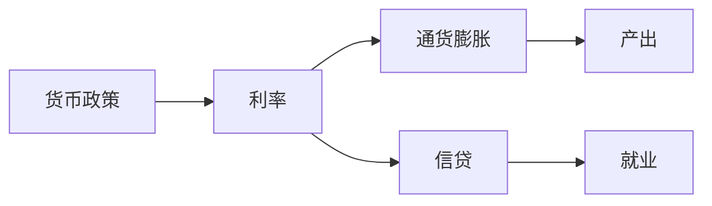
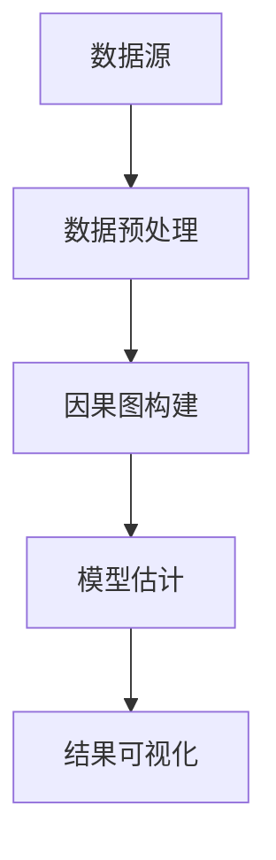
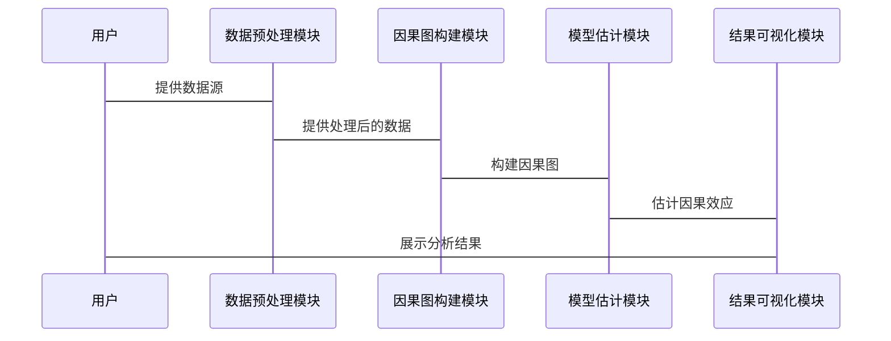

                 


# 《金融领域因果推理在货币政策效果分析中的应用》

**关键词**：金融领域、因果推理、货币政策、因果图、结构方程模型、动态一般均衡模型

**摘要**：本文探讨因果推理在货币政策效果分析中的应用，重点介绍因果图、潜在结果框架和结构方程模型等方法，通过实际案例分析，展示如何利用因果推理解决货币政策效果评估中的因果关系问题，提供系统架构设计和项目实战指导，总结最佳实践和未来研究方向。

---

## 第一部分: 金融领域因果推理的背景与基础

### 第1章: 因果推理的基本概念与背景

#### 1.1 因果推理的定义与核心概念

##### 1.1.1 因果关系的定义
因果关系是描述两个变量之间的一种关系，其中一个变量（原因）导致另一个变量（结果）的发生。因果关系可以通过干预或观察来验证，但不同于相关关系，因果关系强调方向性和可传递性。

##### 1.1.2 因果推理的核心要素
- **原因（Cause）**：能够引起结果变化的因素。
- **结果（Effect）**：因原因发生而产生的变化。
- **中介变量（Mediator）**：连接原因和结果的中间变量。
- **混杂变量（Confounder）**：可能混淆因果关系的变量。

##### 1.1.3 因果关系与相关关系的区别
- 相关关系只表示变量之间的关联，不考虑因果方向。
- 因果关系强调变量之间的因果关系，需要考虑时间顺序和干预实验。

#### 1.2 金融领域中的因果关系

##### 1.2.1 金融变量的因果关系特点
- 金融市场中的变量具有高度的相互依赖性。
- 因果关系可能受到市场参与者的预期和行为影响。
- 因果关系可能随时间变化而变化。

##### 1.2.2 金融市场的复杂性与因果推理的必要性
- 金融市场参与者的行为复杂，难以通过相关关系准确描述。
- 政策干预可能通过多个渠道影响经济变量，需要因果推理来分解这些影响。
- 金融数据的高维性和时间依赖性要求因果推理方法具备灵活性和适应性。

##### 1.2.3 金融领域因果推理的应用场景
- 资产定价：分析影响资产价格的因素。
- 风险管理：评估风险事件的因果关系。
- 市场结构分析：理解不同市场参与者的影响力。
- 政策效果分析：评估货币政策对经济变量的影响。

#### 1.3 货币政策的基本机制与效果分析

##### 1.3.1 货币政策的定义与目标
- 货币政策是由中央银行通过调整货币供应量和利率等工具来影响经济活动的政策。
- 目标通常包括控制通货膨胀、促进就业和维持经济增长。

##### 1.3.2 货币政策的传导机制
- **利率渠道**：通过调整利率影响企业和个人的借贷成本，进而影响投资和消费。
- **资产价格渠道**：通过影响资产价格（如股票和房地产）间接影响经济活动。
- **信贷渠道**：通过影响银行信贷供给影响企业和个人的借贷行为。
- **汇率渠道**：通过影响汇率影响出口和进口。

##### 1.3.3 货币政策效果的多维度分析
- 需要同时考虑短期和长期效果。
- 需要分析对不同经济部门（如企业和个人）的影响。
- 需要考虑政策的滞后效应和时滞问题。

#### 1.4 因果推理在货币政策分析中的重要性

##### 1.4.1 货币政策效果分析的挑战
- **反事实推理**：需要分析在不同政策干预下的结果。
- **混杂变量控制**：需要排除其他变量的干扰。
- **内生性问题**：经济变量之间可能存在双向因果关系。

##### 1.4.2 因果推理在货币政策分析中的作用
- 帮助识别货币政策的真正影响因素。
- 控制混杂变量，减少估计偏误。
- 提供反事实推理框架，评估不同政策的效果。

##### 1.4.3 本书的研究目标与意义
- 探讨因果推理在货币政策效果分析中的具体应用。
- 提供系统化的分析框架和方法论。
- 为政策制定者和研究人员提供理论支持和实践指导。

---

### 第2章: 因果推理的理论基础

#### 2.1 因果图与因果关系的表示

##### 2.1.1 因果图的基本概念
- 因果图是一种用图表示因果关系的工具，由节点和边组成，节点代表变量，边代表因果关系。

##### 2.1.2 D-separation与独立性
- D-separation是一种在因果图中判断变量之间是否独立的方法。
- 通过D-separation可以识别出哪些变量在给定条件下独立。

##### 2.1.3 贝叶斯网络与因果推理
- 贝叶斯网络是一种概率图模型，可以用来表示变量之间的条件概率关系。
- 在因果推理中，贝叶斯网络可以用来计算干预后的概率分布。

##### 2.1.4 因果图的构建步骤
1. 确定变量：明确需要分析的变量。
2. 确定因果关系：根据背景知识和数据确定变量之间的因果关系。
3. 绘制因果图：将变量和因果关系用图表示出来。

##### 2.1.5 因果图的数学表示
- 使用有向无环图（DAG）表示因果关系，节点为变量，边为因果关系。

**示例**：
假设我们研究货币政策对通货膨胀的影响，考虑中间变量为利率。因果图如下：

```mermaid
graph LR
    A[货币政策] -> B[利率]
    B -> C[通货膨胀]
```

---

#### 2.2 潜在结果框架（Potential Outcome Framework）

##### 2.2.1 潜在结果的定义
- 潜在结果是指在给定一组变量的情况下，某个变量在干预后的可能结果。

##### 2.2.2 平均处理效应（Average Treatment Effect, ATE）
- ATE是干预组和对照组之间平均结果的差异。
- 数学表示：
  $$ATE = E[Y^{treated}] - E[Y{control}]$$

##### 2.2.3 因果效应的估计方法
1. **倾向评分匹配（Propensity Score Matching, PSM）**：通过匹配具有相似倾向评分的样本，减少混杂变量的影响。
2. **双重差分法（Differences in Differences, DiD）**：通过比较干预前后的变化，控制固定效应。
3. **工具变量法（Instrumental Variables, IV）**：通过工具变量解决内生性问题。

##### 2.2.4 潜在结果框架在货币政策分析中的应用
- **反事实推理**：评估在不同货币政策干预下的效果。
- **平均处理效应**：估计货币政策对整体经济变量的平均影响。

---

#### 2.3 时间序列分析与因果推理

##### 2.3.1 时间序列分析的基本概念
- 时间序列分析是研究变量随时间变化的模式和关系。
- 常见方法包括自回归积分滑动平均模型（ARIMA）和格兰杰因果检验。

##### 2.3.2 格兰杰因果检验
- 格兰杰因果检验是一种统计检验方法，用于判断一个时间序列是否可以预测另一个时间序列。
- 如果序列A可以预测序列B，则认为A是B的格兰杰原因。

##### 2.3.3 时间序列分析的局限性
- 格兰杰因果检验只能检测线性关系，可能忽略非线性因果关系。
- 时间序列分析需要假设平稳性，实际金融数据可能具有波动性。

---

### 第3章: 金融领域中的因果推理应用

#### 3.1 资产定价

##### 3.1.1 资产定价的因果关系
- 资产价格受多种因素影响，如宏观经济指标、公司基本面等。
- 需要识别哪些因素是真正影响资产价格的原因。

##### 3.1.2 因果推理在资产定价中的应用
- 使用因果图识别影响资产价格的关键因素。
- 通过潜在结果框架评估不同因素的因果效应。

##### 3.1.3 实例分析
- 分析货币政策对股票价格的影响。
- 使用因果图构建变量之间的因果关系。
- 计算平均处理效应，评估货币政策对股票价格的影响。

---

#### 3.2 风险管理

##### 3.2.1 风险管理中的因果关系
- 风险事件的发生可能受多种因素影响，如市场波动、政策变化等。
- 需要识别哪些因素是风险事件的真正原因。

##### 3.2.2 因果推理在风险管理中的应用
- 使用因果图分析风险事件的因果关系。
- 通过潜在结果框架评估不同因素的因果效应。
- 提供风险预警机制，提前识别潜在风险。

##### 3.2.3 实例分析
- 分析金融危机的成因。
- 使用因果图识别关键风险因素。
- 评估不同政策干预对风险管理的效果。

---

#### 3.3 市场结构分析

##### 3.3.1 市场结构的因果关系
- 市场结构的变化可能受政策、技术、参与者行为等多种因素影响。
- 需要识别哪些因素是市场结构变化的原因。

##### 3.3.2 因果推理在市场结构分析中的应用
- 使用因果图分析市场结构的变化。
- 通过潜在结果框架评估不同因素的因果效应。
- 提供市场结构优化的建议。

##### 3.3.3 实例分析
- 分析市场集中度的变化。
- 使用因果图识别影响市场集中度的因素。
- 评估不同政策干预对市场结构的影响。

---

#### 3.4 货币政策效果分析

##### 3.4.1 货币政策效果的因果关系
- 货币政策通过多种渠道影响经济变量，如利率、资产价格、信贷等。
- 需要识别这些渠道中的因果关系。

##### 3.4.2 因果推理在货币政策效果分析中的应用
- 使用因果图分析货币政策的传导机制。
- 通过潜在结果框架评估不同政策干预的效果。
- 提供反事实推理框架，评估不同政策的可能效果。

##### 3.4.3 实例分析
- 分析货币政策对通货膨胀的影响。
- 使用因果图构建货币政策传导机制。
- 计算平均处理效应，评估货币政策对通货膨胀的影响。

---

### 第4章: 货币政策效果分析的因果推理方法

#### 4.1 结构方程模型（SEM）

##### 4.1.1 结构方程模型的基本概念
- 结构方程模型是一种用于分析变量之间因果关系的统计方法。
- 包括结构方程和测量方程两部分。

##### 4.1.2 结构方程模型的构建步骤
1. 确定变量和因果关系。
2. 构建结构方程和测量方程。
3. 估计模型参数。
4. 检验模型拟合度。

##### 4.1.3 结构方程模型在货币政策分析中的应用
- 分析货币政策对多个经济变量的影响。
- 识别货币政策的中介变量和外生变量。

##### 4.1.4 实例分析
- 分析货币政策对GDP、通货膨胀和就业的影响。
- 使用结构方程模型构建因果关系。
- 估计模型参数，评估货币政策效果。

---

#### 4.2 工具变量法（Instrumental Variables, IV）

##### 4.2.1 工具变量法的基本概念
- 工具变量法是一种用于解决内生性问题的统计方法。
- 工具变量需要满足相关性和排他性条件。

##### 4.2.2 工具变量法的实现步骤
1. 选择工具变量。
2. 估计工具变量与因变量的关系。
3. 估计工具变量与解释变量的关系。
4. 使用工具变量估计因果效应。

##### 4.2.3 工具变量法在货币政策分析中的应用
- 分析货币政策对通货膨胀的影响。
- 解决内生性问题，提高估计的准确性。

##### 4.2.4 实例分析
- 分析货币政策对信贷的影响。
- 选择合适的工具变量。
- 使用工具变量法估计因果效应。

---

#### 4.3 断点回归（Regression Discontinuity, RD）

##### 4.3.1 断点回归的基本概念
- 断点回归是一种用于估计处理效果的准实验方法。
- 基于连续变量的分组规则，将样本分为处理组和对照组。

##### 4.3.2 断点回归的实现步骤
1. 确定分组变量和处理阈值。
2. 估计分组变量与结果的关系。
3. 估计断点处的处理效果。

##### 4.3.3 断点回归在货币政策分析中的应用
- 分析货币政策对特定经济部门的影响。
- 提供准实验环境下的政策效果估计。

##### 4.3.4 实例分析
- 分析货币政策对中小企业贷款的影响。
- 确定贷款规模的分组变量。
- 估计断点处的处理效果。

---

#### 4.4 动态一般均衡模型（Dynamic Stochastic General Equilibrium, DSGE）

##### 4.4.1 动态一般均衡模型的基本概念
- DSGE模型是一种宏观经济模型，用于分析经济系统在动态环境下的均衡状态。
- 包括消费者、企业、政府等多个主体的互动关系。

##### 4.4.2 DSGE模型的构建步骤
1. 确定模型的基本假设和参数。
2. 构建模型的动态方程。
3. 求解模型的均衡解。
4. 进行数值模拟和政策分析。

##### 4.4.3 DSGE模型在货币政策分析中的应用
- 分析货币政策对整体经济的影响。
- 提供政策模拟和预测的工具。

##### 4.4.4 实例分析
- 分析货币政策对通货膨胀和产出的影响。
- 使用DSGE模型构建动态均衡。
- 进行政策模拟，预测政策效果。

---

### 第5章: 系统分析与架构设计

#### 5.1 问题场景介绍

##### 5.1.1 问题背景
- 货币政策效果分析需要综合考虑多种因素。
- 需要构建一个系统化的分析框架。

##### 5.1.2 问题目标
- 提供一个系统化的分析框架。
- 提供具体的实现方法和工具。

---

#### 5.2 项目介绍

##### 5.2.1 项目目标
- 构建一个货币政策效果分析的系统。
- 提供因果推理的方法和工具。

##### 5.2.2 项目范围
- 聚焦于因果推理在货币政策分析中的应用。
- 包括理论分析和实际案例。

##### 5.2.3 项目约束
- 数据获取和处理的难度。
- 模型复杂性和计算资源需求。

##### 5.2.4 项目假设
- 数据的完整性和可靠性。
- 模型的适用性和有效性。

---

#### 5.3 系统功能设计

##### 5.3.1 系统功能模块
1. 数据收集模块：收集相关经济数据。
2. 模型构建模块：构建因果图和结构方程模型。
3. 分析模块：计算因果效应和政策效果。
4. 可视化模块：展示分析结果。

##### 5.3.2 领域模型（ER实体关系图）



##### 5.3.3 系统架构设计



##### 5.3.4 系统接口设计
- 数据接口：与数据库或API对接，获取经济数据。
- 模型接口：与其他工具和库对接，进行因果推理。
- 结果接口：输出分析结果，供用户查看。

##### 5.3.5 系统交互流程



---

#### 5.4 项目实战

##### 5.4.1 环境安装
- 安装Python和必要的库（如pymc、statsmodels、igraph）。
- 安装Jupyter Notebook用于数据分析和可视化。

##### 5.4.2 数据获取
- 使用requests库从公开数据源获取经济数据。
- 数据清洗和预处理，处理缺失值和异常值。

##### 5.4.3 模型实现
- 使用pymc构建结构方程模型。
- 使用statsmodels进行工具变量回归。
- 使用igraph构建因果图。

##### 5.4.4 代码实现

```python
import pandas as pd
import numpy as np
from statsmodels.sandbox.regression import instrumentaliste
import pymc as pm
from graphviz import Digraph

# 数据获取与预处理
data = pd.read_csv('economic_data.csv')
data = data.dropna()

# 因果图构建
def build_causal_graph:variables = ['货币政策', '利率', '通货膨胀']
    graph = Digraph()
    graph.edge('货币政策', '利率')
    graph.edge('利率', '通货膨胀')
    return graph

graph = build_causal_graph()
graph.render('causal_graph')

# 结构方程模型
with pm.Model() as model:
    # 定义模型参数
    beta = pm.Normal('beta', mu=0, sigma=1)
    alpha = pm.Normal('alpha', mu=0, sigma=1)
    # 定义观测数据
    observed = pm.Normal('observed', mu=beta * x + alpha, sigma=1, observed=y)
    # 进行推理
    inference = pm.MCMC(model)
    inference.run(1000, 1000)
```

##### 5.4.5 结果分析
- 展示因果图和结构方程模型的估计结果。
- 分析货币政策对不同经济变量的因果效应。
- 提供政策建议和实际应用的建议。

---

### 第6章: 结论与展望

#### 6.1 结论

##### 6.1.1 核心结论
- 因果推理在货币政策效果分析中具有重要作用。
- 结构方程模型和工具变量法是有效的分析工具。
- 系统化的方法能够提高分析的准确性和可靠性。

##### 6.1.2 经验总结
- 数据的获取和处理是分析的关键。
- 模型的选择和参数设置影响结果的准确性。
- 可视化和解释是提高分析效果的重要手段。

---

#### 6.2 未来展望

##### 6.2.1 理论研究
- 探讨因果推理在非线性模型中的应用。
- 研究因果推理在多变量系统的应用。

##### 6.2.2 实践应用
- 将因果推理方法应用到更多金融领域的问题。
- 开发自动化工具和平台，提高分析效率。

##### 6.2.3 技术创新
- 结合机器学习和因果推理，提高分析的智能化水平。
- 探讨因果推理在大数据环境下的应用。

---

## 作者：AI天才研究院/AI Genius Institute & 禅与计算机程序设计艺术 /Zen And The Art of Computer Programming

