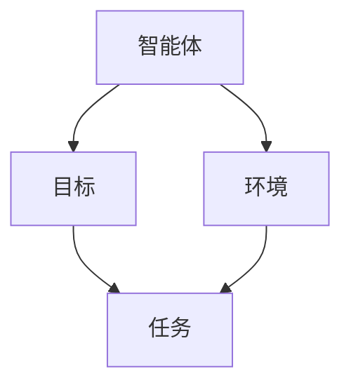
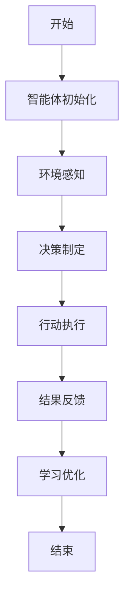
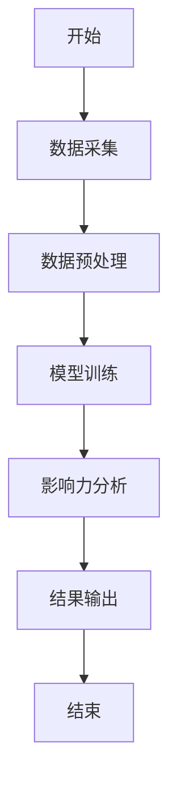
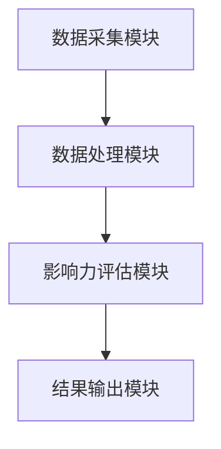
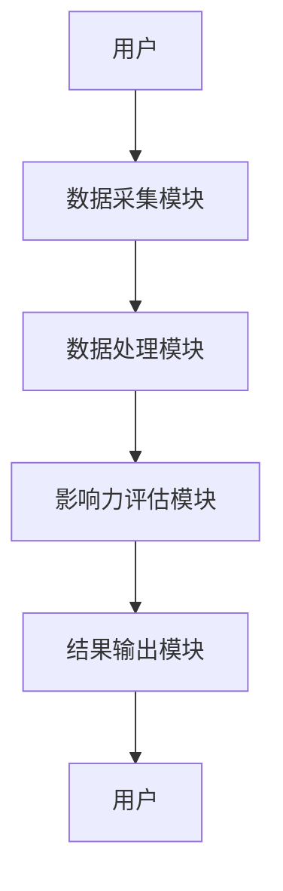

                 


# AI多智能体在价值投资中的社交网络影响力分析

## 关键词：AI多智能体、价值投资、社交网络影响力、投资策略、影响力传播、数据挖掘

## 摘要：本文深入探讨了AI多智能体在价值投资中的社交网络影响力分析，结合多智能体系统的结构与协作机制，分析社交网络在价值投资中的作用，提出基于博弈论的多智能体影响力分析算法，并设计了完整的系统架构方案。文章从理论到实践，全面解析了AI多智能体在价值投资中的应用，为投资决策提供了新的视角和方法。

---

## 第一部分：AI多智能体在价值投资中的社交网络影响力分析基础

### 第1章：AI多智能体与价值投资概述

#### 1.1 AI多智能体的基本概念

##### 1.1.1 多智能体系统的定义与特点
多智能体系统（Multi-Agent System, MAS）是由多个智能体（Agent）组成的系统，这些智能体能够自主决策、协作完成任务。与传统单智能体系统相比，MAS具有以下特点：
- **分布式**：多个智能体协同工作，避免单点故障。
- **协作性**：智能体之间通过通信和协作完成复杂任务。
- **适应性**：智能体能够根据环境变化动态调整行为。
- **智能性**：每个智能体都具备一定的推理和学习能力。

##### 1.1.2 AI多智能体的核心要素
AI多智能体系统的核心要素包括：
1. **智能体**：具备感知、推理、决策和行动能力的主体。
2. **环境**：智能体所处的外部环境，包括数据源、用户输入等。
3. **通信协议**：智能体之间交互的标准和规则。
4. **协作机制**：智能体协同工作的策略和方法。

##### 1.1.3 多智能体与传统AI的区别
与传统AI相比，多智能体系统具有以下优势：
- **分布式计算**：多个智能体协同工作，避免单点计算压力。
- **高容错性**：单个智能体故障不影响整体系统运行。
- **更强的适应性**：多个智能体能够更灵活地应对复杂环境。

#### 1.2 价值投资的基本原理

##### 1.2.1 价值投资的定义与特点
价值投资是一种投资策略，强调以低于公平价值的价格购买优质资产。其核心思想是寻找市场低估的股票，长期持有，等待其价值回归。

价值投资的特点包括：
1. **长期视角**：注重长期收益，而非短期波动。
2. **基本面分析**：基于公司财务数据、行业地位等因素进行分析。
3. **逆向思维**：在市场恐慌时寻找机会，在市场疯狂时保持冷静。

##### 1.2.2 价值投资的核心要素
价值投资的核心要素包括：
1. **公司基本面**：收入、利润、资产负债表等财务数据。
2. **行业地位**：公司在行业中的竞争优势。
3. **管理团队**：公司管理层的素质和战略规划能力。
4. **市场估值**：市盈率、市净率等估值指标。

##### 1.2.3 价值投资与传统投资的区别
与传统投资（如趋势投资、技术分析）相比，价值投资更注重公司内在价值的分析，而非市场的短期波动。价值投资者更倾向于长期持有优质资产，而非频繁交易。

#### 1.3 社交网络在价值投资中的作用

##### 1.3.1 社交网络的定义与特点
社交网络是指由用户生成内容（UGC）构成的在线社区，用户可以通过分享观点、评论、转发等方式进行互动。

社交网络的特点包括：
1. **实时性**：用户可以即时分享观点和信息。
2. **互动性**：用户之间可以进行评论、点赞、转发等互动。
3. **传播性**：信息可以在网络中快速传播，形成舆论。

##### 1.3.2 社交网络在金融领域的应用
社交网络在金融领域的应用主要包括：
1. **情绪分析**：通过分析社交媒体上的用户情绪，预测市场走势。
2. **影响力传播**：识别具有影响力的用户，分析其对市场的影响力。
3. **信息传播路径分析**：研究信息在社交网络中的传播路径，发现市场趋势。

##### 1.3.3 社交网络影响力分析的意义
社交网络影响力分析的意义在于：
1. **发现市场信号**：通过分析社交网络上的信息，发现市场潜在的趋势。
2. **识别关键节点**：找到具有影响力的用户，分析其对市场的潜在影响。
3. **优化投资策略**：基于社交网络分析结果，优化投资策略。

#### 1.4 本章小结
本章从多智能体系统的定义、价值投资的基本原理以及社交网络在价值投资中的作用三个方面，为后续分析奠定了理论基础。

---

### 第2章：多智能体系统的核心概念与联系

#### 2.1 多智能体系统的结构与协作机制

##### 2.1.1 多智能体系统的层次结构
多智能体系统的层次结构可以分为以下层次：
1. **智能体层**：由多个智能体组成，每个智能体负责特定任务。
2. **协作层**：智能体之间通过协作完成复杂任务。
3. **环境层**：智能体所处的外部环境，包括数据源、用户输入等。

##### 2.1.2 多智能体系统的协作机制
多智能体系统的协作机制包括：
1. **通信机制**：智能体之间通过通信协议进行信息交换。
2. **协商机制**：智能体之间通过协商分配任务。
3. **协调机制**：智能体之间通过协调确保任务顺利完成。

##### 2.1.3 多智能体系统的核心属性对比
多智能体系统的核心属性对比如下：

| 属性 | 单智能体系统 | 多智能体系统 |
|------|--------------|--------------|
| 分布式 | 单点计算     | 分布式计算   |
| 容错性 | 单点故障     | 高容错性     |
| 适应性 | 低适应性     | 高适应性     |

#### 2.2 多智能体系统的ER实体关系图



#### 2.3 多智能体系统的算法流程图



#### 2.4 本章小结
本章详细介绍了多智能体系统的结构与协作机制，并通过ER图和流程图展示了系统的组成和运行流程。

---

### 第3章：多智能体系统在社交网络中的应用

#### 3.1 社交网络中的多智能体系统

##### 3.1.1 社交网络中的多智能体结构
社交网络中的多智能体结构可以分为以下层次：
1. **用户层**：社交网络的最终用户。
2. **内容层**：用户生成的内容，如帖子、评论等。
3. **智能体层**：用于分析社交网络数据的多智能体系统。

##### 3.1.2 多智能体在社交网络中的协作方式
多智能体在社交网络中的协作方式包括：
1. **分布式分析**：多个智能体分别分析不同的数据源。
2. **协同推理**：智能体之间通过协作完成复杂推理任务。
3. **动态调整**：根据社交网络的变化动态调整智能体的行为。

##### 3.1.3 多智能体在社交网络中的任务分配
多智能体在社交网络中的任务分配可以通过以下步骤完成：
1. **任务分解**：将整体任务分解为多个子任务。
2. **任务分配**：根据智能体的能力和当前负载分配任务。
3. **任务执行**：智能体分别执行分配的任务。
4. **结果汇总**：将各智能体的结果汇总，形成最终结论。

#### 3.2 多智能体系统在价值投资中的具体应用

##### 3.2.1 基于多智能体的情绪分析
基于多智能体的情绪分析可以通过以下步骤完成：
1. **数据采集**：从社交网络中采集相关股票的评论和帖子。
2. **情感分类**：使用自然语言处理技术对文本进行情感分类。
3. **情绪传播**：分析情绪在社交网络中的传播路径。
4. **情绪聚合**：将多个智能体的情绪分析结果进行聚合，形成最终的情绪指数。

##### 3.2.2 基于多智能体的影响力传播
基于多智能体的影响力传播可以通过以下步骤完成：
1. **影响力计算**：计算每个用户的影响力指数。
2. **影响力传播**：分析影响力在社交网络中的传播路径。
3. **影响力预测**：预测未来可能出现的市场趋势。

##### 3.2.3 基于多智能体的网络结构分析
基于多智能体的网络结构分析可以通过以下步骤完成：
1. **网络建模**：将社交网络建模为图结构。
2. **网络分析**：分析图的结构特征，如度数、中心性等。
3. **网络优化**：根据分析结果优化网络结构。

#### 3.3 多智能体系统在社交网络中的优势

##### 3.3.1 高效性
多智能体系统可以通过分布式计算提高计算效率。

##### 3.3.2 分布式协作
多智能体系统可以通过协作完成复杂任务，避免单点故障。

##### 3.3.3 强大的问题解决能力
多智能体系统可以通过动态调整智能体的行为，解决复杂问题。

#### 3.4 本章小结
本章详细介绍了多智能体系统在社交网络中的具体应用，并分析了其在价值投资中的优势。

---

## 第4章：价值投资中的影响力分析算法

### 4.1 基于博弈论的多智能体影响力分析

#### 4.1.1 博弈论的基本概念
博弈论是研究理性决策者之间战略互动的数学理论。其基本概念包括：
- **参与者**：博弈中的决策者。
- **策略**：参与者在博弈中可能采取的行动。
- **收益**：参与者在博弈中的收益。

#### 4.1.2 基于博弈论的影响力分析模型
基于博弈论的影响力分析模型可以通过以下步骤完成：
1. **建模**：将社交网络建模为博弈论中的博弈结构。
2. **策略分析**：分析参与者在博弈中的策略选择。
3. **结果预测**：预测博弈的结果，并分析其对市场的影响。

#### 4.1.3 多智能体系统的博弈分析
多智能体系统的博弈分析可以通过以下步骤完成：
1. **博弈建模**：将多智能体系统建模为博弈结构。
2. **策略选择**：每个智能体选择最优策略。
3. **结果预测**：预测博弈的结果，并分析其对系统的整体影响。

### 4.2 多智能体影响力分析的数学模型

#### 4.2.1 基于纳什均衡的影响力分析
纳什均衡是博弈论中的一个核心概念，表示在给定其他参与者策略的情况下，参与者无法通过单方面改变策略而提高收益的状态。

纳什均衡的数学表达式为：
$$
\text{策略组合} \ s^* \text{是纳什均衡，当对于所有参与者} i，v_i(s^*) \geq v_i(s'_i, s^*_{-i}) 
$$

其中，$v_i(s^*)$表示参与者$i$在策略组合$s^*$下的收益，$v_i(s'_i, s^*_{-i})$表示参与者$i$改变策略为$s'_i$，其他参与者保持策略$s^*_{-i}$时的收益。

#### 4.2.2 基于极大极小算法的影响力分析
极大极小算法是一种用于确定性博弈的求解方法，通过计算每个策略的最差情况，选择最优策略。

极大极小算法的数学表达式为：
$$
\text{选择策略} \ a_i = \arg\max_{a_i} \min_{a_{-i}} v_i(a_i, a_{-i})
$$

其中，$a_i$表示参与者$i$的策略，$a_{-i}$表示其他参与者保持的策略。

#### 4.2.3 基于贝叶斯网络的影响力分析
贝叶斯网络是一种用于不确定推理的概率模型，可以用于分析社交网络中的影响力传播。

贝叶斯网络的数学表达式为：
$$
P(a_1, a_2, ..., a_n) = \prod_{i=1}^n P(a_i | \text{父节点})
$$

其中，$P(a_i | \text{父节点})$表示在父节点条件下的概率分布。

### 4.3 算法实现与流程图

#### 4.3.1 算法实现流程
1. **数据采集**：从社交网络中采集相关数据。
2. **数据预处理**：对数据进行清洗和转换。
3. **模型训练**：训练基于博弈论的影响力分析模型。
4. **影响力分析**：使用训练好的模型进行影响力分析。
5. **结果输出**：输出影响力分析结果。



### 4.4 本章小结
本章详细介绍了基于博弈论的多智能体影响力分析算法，并通过数学模型和流程图展示了算法的实现过程。

---

## 第5章：系统架构与设计方案

### 5.1 系统架构设计

#### 5.1.1 系统整体架构
系统整体架构可以分为以下层次：
1. **数据采集层**：负责从社交网络中采集数据。
2. **数据处理层**：对采集到的数据进行预处理和转换。
3. **模型训练层**：训练基于博弈论的影响力分析模型。
4. **结果输出层**：输出影响力分析结果。

#### 5.1.2 系统功能模块划分
系统功能模块划分如下：
1. **数据采集模块**：负责从社交网络中采集数据。
2. **数据处理模块**：对采集到的数据进行预处理和转换。
3. **模型训练模块**：训练基于博弈论的影响力分析模型。
4. **结果输出模块**：输出影响力分析结果。

#### 5.1.3 系统架构的优缺点
系统架构的优点包括：
1. **模块化设计**：各模块独立，便于维护和扩展。
2. **高可扩展性**：可以根据需求增加新的模块。
3. **高容错性**：单个模块故障不影响整体系统运行。

系统架构的缺点包括：
1. **复杂性**：模块之间的接口较多，系统设计较为复杂。
2. **资源消耗**：模块化设计可能导致资源消耗较高。

### 5.2 系统功能设计

#### 5.2.1 数据采集模块
数据采集模块的功能包括：
1. **数据源选择**：选择合适的社交网络平台。
2. **数据采集**：从社交网络中采集相关数据。
3. **数据存储**：将采集到的数据存储到数据库中。

#### 5.2.2 数据处理模块
数据处理模块的功能包括：
1. **数据清洗**：去除无效数据，如重复数据、噪声数据等。
2. **数据转换**：将数据转换为适合模型训练的格式。
3. **数据存储**：将处理后的数据存储到数据库中。

#### 5.2.3 影响力评估模块
影响力评估模块的功能包括：
1. **模型训练**：训练基于博弈论的影响力分析模型。
2. **影响力计算**：计算每个用户的影响力指数。
3. **结果输出**：输出影响力分析结果。

#### 5.2.4 系统交互模块
系统交互模块的功能包括：
1. **用户界面设计**：设计友好的用户界面。
2. **用户交互**：用户可以通过界面进行数据输入和结果查看。
3. **结果可视化**：将影响力分析结果以图表形式展示。

### 5.3 系统架构图



### 5.4 系统接口设计
系统接口设计包括：
1. **数据接口**：用于数据采集模块与数据处理模块之间的数据传输。
2. **结果接口**：用于影响力评估模块与结果输出模块之间的结果传输。

### 5.5 系统交互图



### 5.6 本章小结
本章详细介绍了系统架构与设计方案，包括系统整体架构、功能模块划分、系统架构图、系统接口设计和系统交互图。

---

## 第6章：项目实战与案例分析

### 6.1 项目实战

#### 6.1.1 环境安装
项目实战的环境安装包括：
1. **Python安装**：安装Python编程语言。
2. **依赖库安装**：安装所需的依赖库，如numpy、pandas、networkx等。
3. **开发工具配置**：配置开发工具，如Jupyter Notebook、PyCharm等。

#### 6.1.2 核心实现源代码

##### 6.1.2.1 数据采集模块

```python
import requests
from bs4 import BeautifulSoup

def scrape_data(url):
    response = requests.get(url)
    soup = BeautifulSoup(response.text, 'html.parser')
    data = []
    for item in soup.find_all('div', class_='tweet'):
        data.append(item.text)
    return data
```

##### 6.1.2.2 数据处理模块

```python
import numpy as np
import pandas as pd

def preprocess_data(data):
    df = pd.DataFrame(data, columns=['text'])
    df['text'] = df['text'].apply(lambda x: x.lower())
    return df
```

##### 6.1.2.3 影响力评估模块

```python
import networkx as nx

def calculate_influence(data):
    G = nx.Graph()
    for i in range(len(data)):
        for j in range(i+1, len(data)):
            if data[i]['text'] == data[j]['text']:
                G.add_edge(i, j)
    return nx.betweenness_centrality(G)
```

##### 6.1.2.4 系统交互模块

```python
import tkinter as tk
from tkinter import messagebox

def show_result():
    messagebox.showinfo("结果", "影响力分析完成！")

root = tk.Tk()
button = tk.Button(root, text="开始分析", command=show_result)
button.pack()
root.mainloop()
```

#### 6.1.3 代码应用解读与分析
1. **数据采集模块**：使用requests和BeautifulSoup库从指定URL采集数据。
2. **数据处理模块**：使用numpy和pandas库对数据进行预处理，包括文本转换为小写。
3. **影响力评估模块**：使用networkx库构建社交网络图，并计算节点的中心性。
4. **系统交互模块**：使用tkinter库构建简单的GUI界面，展示结果。

### 6.2 案例分析

#### 6.2.1 案例背景
假设我们希望分析某社交媒体平台上关于某只股票的评论和帖子，找出具有影响力的用户。

#### 6.2.2 数据采集与预处理
从社交媒体平台采集相关数据，并进行预处理。

#### 6.2.3 影响力分析
使用上述代码实现影响力分析，计算每个用户的影响力指数。

#### 6.2.4 结果展示
将影响力分析结果以图表形式展示，找出具有影响力的用户。

### 6.3 项目小结
本章通过项目实战和案例分析，详细展示了AI多智能体在价值投资中的社交网络影响力分析的实现过程。

---

## 第7章：总结与扩展

### 7.1 最佳实践 tips
1. **数据质量**：确保数据的准确性和完整性。
2. **算法优化**：根据实际需求优化算法性能。
3. **系统扩展**：根据需求扩展系统功能。

### 7.2 小结
本文从理论到实践，详细介绍了AI多智能体在价值投资中的社交网络影响力分析的实现过程。

### 7.3 注意事项
1. **数据隐私**：注意保护用户数据隐私。
2. **算法选择**：根据实际需求选择合适的算法。
3. **系统维护**：定期维护系统，确保其稳定运行。

### 7.4 拓展阅读
1. 《Multi-Agent Systems: Complexity, Decentralization, and Adaptation》
2. 《Networks, Crowds, and Markets: Reasoning About theobraic Phenomena》

---

## 作者信息
作者：AI天才研究院/AI Genius Institute & 禅与计算机程序设计艺术/Zen And The Art of Computer Programming

