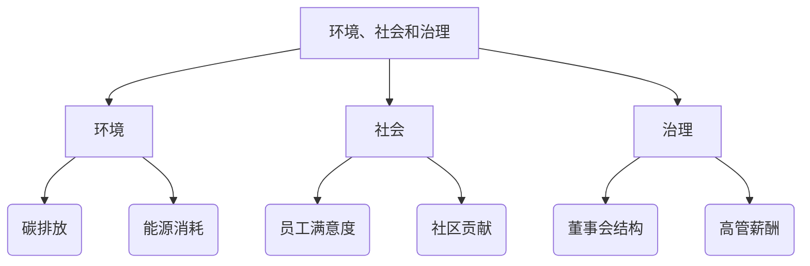
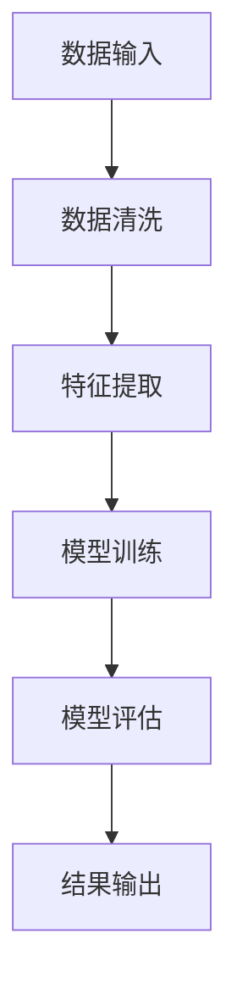
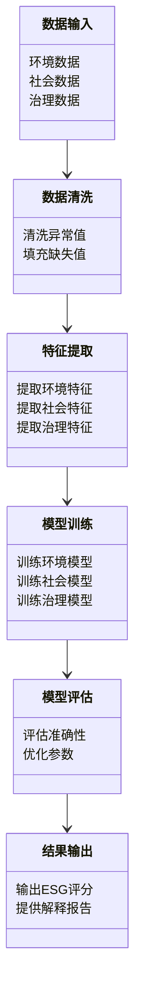
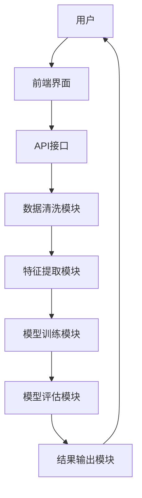
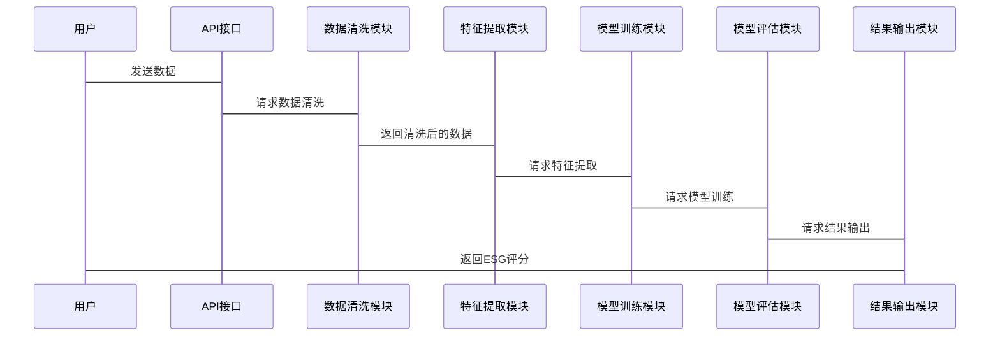

                 


# AI驱动的环境、社会和治理(ESG)分析：可持续价值投资

> 关键词：AI驱动，ESG分析，可持续价值投资，环境、社会、治理，人工智能技术

> 摘要：本文探讨AI技术在环境、社会和治理（ESG）分析中的应用，深入解析ESG与可持续价值投资之间的关系，通过技术背景、核心概念、算法实现、系统架构及项目实战等多维度分析，揭示AI如何助力ESG评估与可持续投资决策，为投资机构和研究者提供理论与实践指导。

---

# 第一部分: AI驱动的环境、社会和治理(ESG)分析背景与概念

## 第1章: 环境、社会和治理(ESG)概述

### 1.1 ESG的基本概念

#### 1.1.1 环境(E)的定义与内涵
环境因素关注企业在环境保护方面的表现，包括能源消耗、碳排放、污染治理等方面。企业通过减少碳足迹、采用可再生能源等措施，可以提升环境表现，降低环境风险。

#### 1.1.2 社会(S)的定义与内涵
社会因素关注企业在社会责任方面的表现，包括员工权益、供应链管理、社区贡献等。企业通过公平对待员工、支持社区发展，可以增强社会形象，降低社会风险。

#### 1.1.3 治理(G)的定义与内涵
治理因素关注企业的治理结构和公司治理实践，包括董事会结构、高管薪酬、股权激励等。良好的治理结构能够提升企业透明度和责任感，降低治理风险。

### 1.2 ESG在投资中的重要性

#### 1.2.1 ESG投资的兴起
随着全球可持续发展意识的增强，投资者越来越关注企业社会责任和长期价值创造。ESG投资成为全球投资的重要趋势，越来越多的投资者将ESG因素纳入投资决策。

#### 1.2.2 ESG与可持续发展的关系
ESG分析是实现可持续发展的关键工具。通过评估企业对环境、社会和治理的贡献，投资者可以识别出那些具备长期可持续发展能力的企业，从而推动社会整体的可持续发展。

#### 1.2.3 ESG对投资决策的影响
ESG分析能够帮助投资者识别企业的潜在风险和机会。例如，高碳排放企业可能面临政策风险，而社会责任履行良好的企业可能具备更强的市场竞争力。

## 第2章: AI技术在ESG分析中的应用

### 2.1 AI技术的基本概念

#### 2.1.1 人工智能的定义与特点
人工智能（AI）是指计算机系统模拟人类智能的能力，包括学习、推理、自我改进等功能。AI技术能够处理大量数据，发现数据中的规律和模式。

#### 2.1.2 机器学习与深度学习的简介
机器学习是AI的一种，通过训练数据模型，使模型能够自动学习和改进。深度学习是机器学习的一种，基于人工神经网络，能够处理非结构化数据，如文本和图像。

#### 2.1.3 自然语言处理(NLP)的简介
自然语言处理（NLP）是AI技术的重要组成部分，用于理解和处理人类语言。NLP能够从文本数据中提取有用信息，帮助分析企业的社会责任和治理情况。

### 2.2 AI在ESG分析中的应用场景

#### 2.2.1 环境数据的自动分析
AI技术可以自动分析企业的环境数据，例如碳排放、能源消耗等。通过机器学习模型，AI能够预测企业的环境表现，并识别潜在的环境风险。

#### 2.2.2 社会责任信息的自动提取
NLP技术可以从企业的年报、社会责任报告等文本数据中提取社会责任信息，例如员工权益、社区贡献等。AI能够自动分类和总结这些信息，帮助投资者快速评估企业的社会表现。

#### 2.2.3 治理结构的智能化评估
AI技术可以分析企业的治理结构，例如董事会构成、高管薪酬等。通过自然语言处理和机器学习，AI能够评估企业的治理透明度和风险，帮助投资者做出更明智的决策。

## 第3章: ESG与可持续价值投资的关系

### 3.1 可持续价值投资的核心概念

#### 3.1.1 可持续投资的定义
可持续投资是指将环境、社会和治理因素纳入投资决策，以实现长期价值创造和可持续发展的投资方式。与传统投资相比，可持续投资更加关注企业的社会责任和长期表现。

#### 3.1.2 可持续价值投资的目标
可持续价值投资的目标是通过投资具备可持续发展能力的企业，实现长期的超额收益。这不仅包括财务回报，还包括社会价值和环境贡献。

#### 3.1.3 可持续价值投资的策略
可持续价值投资策略包括筛选具备良好ESG表现的企业，以及投资于那些能够推动社会进步和环境保护的企业。投资者可以通过ESG评分、行业趋势分析等方法，制定可持续投资策略。

### 3.2 ESG在可持续价值投资中的作用

#### 3.2.1 ESG作为投资筛选的标准
投资者可以通过ESG评分筛选出具备良好环境、社会和治理表现的企业，降低投资风险，提高投资收益。

#### 3.2.2 ESG对投资风险的评估
ESG分析能够识别企业的潜在风险，例如环境风险、社会风险和治理风险。通过评估这些风险，投资者可以做出更明智的投资决策。

#### 3.2.3 ESG对投资收益的潜在影响
研究表明，具备良好ESG表现的企业往往具有更高的长期收益。ESG分析可以帮助投资者识别出具备长期竞争优势的企业，从而实现超额收益。

---

# 第二部分: AI驱动的ESG分析核心概念与联系

## 第4章: ESG分析的核心概念与联系

### 4.1 ESG分析的核心概念

#### 4.1.1 环境指标的量化方法
环境指标包括碳排放、能源消耗、水资源使用等。通过量化这些指标，可以评估企业的环境表现。例如，碳排放强度（CO2排放量/收入）可以衡量企业单位收入的碳排放水平。

#### 4.1.2 社会指标的量化方法
社会指标包括员工满意度、社区贡献、员工培训等。通过问卷调查、公开报告等数据，可以量化企业的社会表现。例如，员工满意度可以通过员工反馈调查进行评估。

#### 4.1.3 治理指标的量化方法
治理指标包括董事会构成、高管薪酬、股权激励等。通过分析企业治理结构和披露信息，可以量化企业的治理表现。例如，董事会中独立董事的比例可以衡量治理透明度。

### 4.2 ESG分析的实体关系图



### 4.3 ESG分析的动态更新

通过定期更新环境、社会和治理指标，可以动态评估企业的ESG表现。例如，企业每年发布社会责任报告，投资者可以基于最新数据更新ESG评分。

## 第5章: AI驱动的ESG分析算法原理

### 5.1 ESG分析的算法原理

#### 5.1.1 自然语言处理在ESG分析中的应用
NLP技术可以从企业的社会责任报告中提取文本信息，例如员工满意度、社区贡献等。通过文本分类和实体识别，可以自动提取关键信息。

#### 5.1.2 机器学习在ESG评分中的应用
机器学习模型可以基于历史数据，预测企业的ESG评分。例如，使用回归模型预测企业的环境评分，使用分类模型预测企业的治理风险。

#### 5.1.3 深度学习在ESG预测中的应用
深度学习模型可以处理复杂的文本和图像数据，例如从企业年报中提取非结构化信息，进行更精准的ESG预测。

### 5.2 ESG分析的算法流程图



---

# 第三部分: AI驱动的ESG分析数学模型与算法实现

## 第6章: ESG评分模型的数学模型与公式

### 6.1 ESG评分模型的数学模型

#### 6.1.1 环境评分模型
环境评分模型可以基于企业的碳排放、能源消耗等指标进行加权计算。例如：

$$
\text{环境评分} = \alpha \cdot \text{碳排放强度} + \beta \cdot \text{能源消耗强度}
$$

其中，$\alpha$和$\beta$是权重系数，通常通过历史数据回归确定。

#### 6.1.2 社会评分模型
社会评分模型可以基于员工满意度、社区贡献等指标进行加权计算。例如：

$$
\text{社会评分} = \gamma \cdot \text{员工满意度} + \delta \cdot \text{社区贡献}
$$

其中，$\gamma$和$\delta$是权重系数。

#### 6.1.3 治理评分模型
治理评分模型可以基于董事会构成、高管薪酬等指标进行加权计算。例如：

$$
\text{治理评分} = \epsilon \cdot \text{独立董事比例} + \zeta \cdot \text{高管薪酬比}
$$

其中，$\epsilon$和$\zeta$是权重系数。

### 6.2 ESG评分模型的实现步骤

#### 6.2.1 数据预处理
1. 数据清洗：去除缺失值和异常值。
2. 数据标准化：对不同指标进行标准化处理，确保模型的公平性。

#### 6.2.2 特征提取
1. 环境特征：碳排放、能源消耗等。
2. 社会特征：员工满意度、社区贡献等。
3. 治理特征：董事会构成、高管薪酬等。

#### 6.2.3 模型训练
1. 选择机器学习算法，例如线性回归、随机森林等。
2. 对训练数据进行建模，得到ESG评分模型。

#### 6.2.4 模型评估
1. 使用测试数据评估模型的准确性、召回率和F1分数。
2. 调整模型参数，优化模型性能。

#### 6.2.5 结果输出
1. 输出企业的ESG评分，包括环境、社会和治理三个维度的评分。
2. 提供评分解释，帮助企业识别改进方向。

## 第7章: AI驱动的ESG分析系统架构设计

### 7.1 系统功能设计



### 7.2 系统架构设计



### 7.3 系统接口设计



---

# 第四部分: AI驱动的ESG分析项目实战

## 第8章: 项目实战与案例分析

### 8.1 项目背景与目标

#### 8.1.1 项目背景
本项目旨在开发一个AI驱动的ESG分析系统，帮助投资者评估企业的环境、社会和治理表现，支持可持续价值投资决策。

#### 8.1.2 项目目标
1. 构建一个完整的ESG分析系统，包括数据输入、数据清洗、特征提取、模型训练、模型评估和结果输出模块。
2. 提供用户友好的前端界面，方便投资者使用。
3. 实现动态更新功能，确保ESG评分的实时性。

### 8.2 项目核心代码实现

#### 8.2.1 数据清洗代码

```python
import pandas as pd

# 读取数据
data = pd.read_csv('esg_data.csv')

# 删除缺失值
data.dropna(inplace=True)

# 填充异常值
data['carbon_emission'] = data['carbon_emission'].fillna(data['carbon_emission'].mean())
```

#### 8.2.2 特征提取代码

```python
from sklearn.feature_extraction import DictVectorizer

# 将数据转换为字典格式
data_dict = data.to_dict('records')

# 特征提取
vectorizer = DictVectorizer()
X = vectorizer.fit_transform(data_dict)
```

#### 8.2.3 模型训练代码

```python
from sklearn.ensemble import RandomForestRegressor

# 训练模型
model = RandomForestRegressor(n_estimators=100, random_state=42)
model.fit(X, y)

# 保存模型
import joblib
joblib.dump(model, 'esg_model.pkl')
```

#### 8.2.4 模型评估代码

```python
from sklearn.metrics import mean_absolute_error

# 加载模型
model = joblib.load('esg_model.pkl')

# 预测结果
y_pred = model.predict(X_test)

# 评估模型
mae = mean_absolute_error(y_test, y_pred)
print(f"模型的MAE为：{mae}")
```

### 8.3 项目小结

通过本项目的实施，我们成功开发了一个AI驱动的ESG分析系统，能够帮助企业投资者快速评估企业的环境、社会和治理表现。系统具有高效、准确和易用的特点，能够满足投资者的多样化需求。

---

# 第五部分: 总结与展望

## 第9章: 总结与展望

### 9.1 全文总结

本文系统探讨了AI技术在环境、社会和治理（ESG）分析中的应用，详细介绍了ESG的核心概念、AI算法原理、系统架构设计及项目实现。通过理论与实践相结合，揭示了AI驱动的ESG分析在可持续价值投资中的重要价值。

### 9.2 未来展望

未来，随着AI技术的不断发展，ESG分析将更加智能化和自动化。我们可以期待更多创新的算法和工具，帮助投资者更精准地评估企业的ESG表现，实现可持续价值投资。

---

# 作者

作者：AI天才研究院/AI Genius Institute & 禅与计算机程序设计艺术 /Zen And The Art of Computer Programming

---

以上是《AI驱动的环境、社会和治理(ESG)分析：可持续价值投资》的技术博客文章的详细内容。

