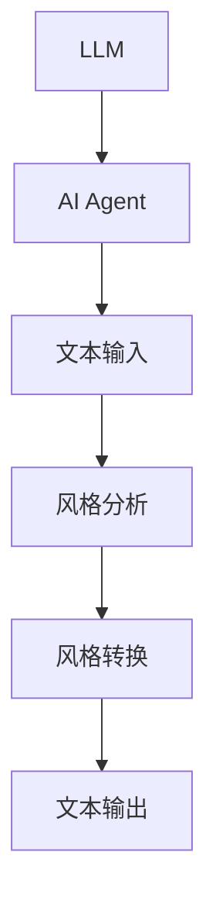
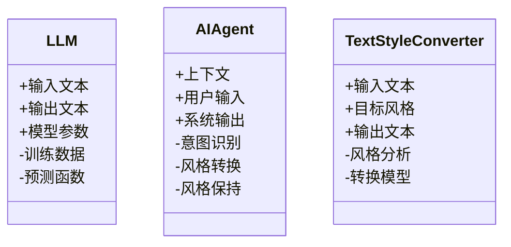
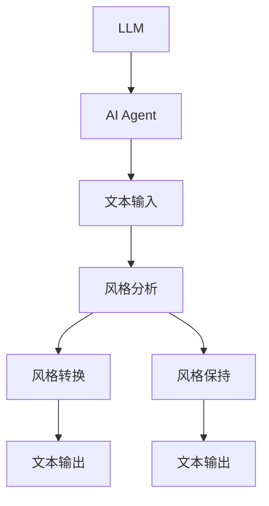
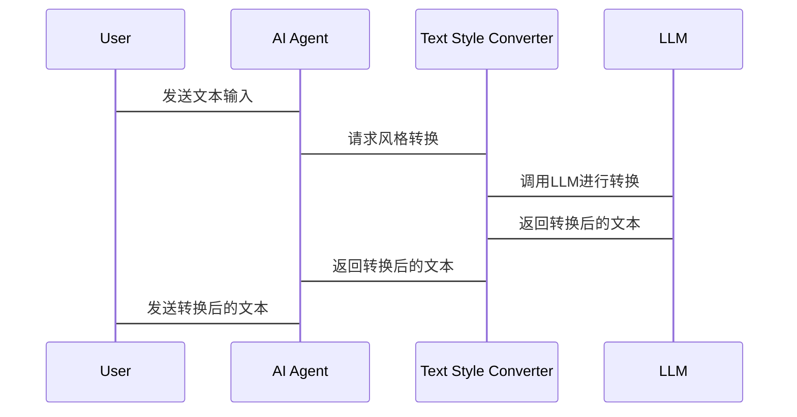

                 

<think>
好的，我将按照您的要求来撰写这篇文章。让我们一步一步地开始思考和撰写。

# LLM在AI Agent中的文本风格转换与保持

## 关键词
- LLM
- AI Agent
- 文本风格转换
- 文本风格保持
- 算法原理
- 系统架构
- 项目实战

## 摘要
本文探讨了大型语言模型（LLM）在AI代理（AI Agent）中的文本风格转换与保持技术。通过分析背景、核心概念、算法原理、系统架构、项目实战等方面，详细介绍了如何实现和应用文本风格转换与保持技术，确保AI Agent在不同场景下能够自然流畅地与用户交互。

---

# 第一部分：背景与概述

## 第1章：背景与问题背景介绍

### 1.1 问题背景
#### 1.1.1 LLM与AI Agent的基本概念
- **LLM（Large Language Model）**：指经过大量文本数据训练的深度学习模型，能够理解和生成人类语言。
- **AI Agent（人工智能代理）**：指一种智能系统，能够感知环境并采取行动以实现特定目标。
- **文本风格转换**：指将一段文本从一种风格转换为另一种风格，例如从正式风格转换为非正式风格。
- **文本风格保持**：指在转换文本时，保持原文的核心意思和特定风格特征。

#### 1.1.2 文本风格转换与保持的重要性
- 在AI Agent与用户交互时，文本风格直接影响用户体验。
- 需要根据不同场景调整文本风格，例如在客服对话中保持正式语气，在社交聊天中保持亲切语气。
- 风格保持是确保文本转换后仍然符合上下文和用户期望的关键。

#### 1.1.3 问题背景的边界与外延
- **边界**：文本风格转换与保持仅限于语言风格的调整，不涉及内容的实质性改变。
- **外延**：扩展到多语言风格转换、多模态交互等更复杂场景。

#### 1.1.4 核心概念结构与组成要素
- **输入文本**：需要转换或保持风格的原始文本。
- **风格特征**：包括语气、用词习惯、句式结构等。
- **转换模型**：用于将文本从一种风格转换为另一种风格。
- **保持模型**：用于在转换过程中保持特定的风格特征。

### 1.2 问题描述
#### 1.2.1 文本风格转换的定义与目标
- **定义**：通过算法改变文本的风格特征，使其符合目标风格。
- **目标**：实现风格的自动转换，同时保持文本的可读性和逻辑性。

#### 1.2.2 文本风格保持的挑战
- **风格识别的难度**：不同风格的文本可能有重叠特征，难以准确识别。
- **保持核心意思的挑战**：在转换过程中，如何保留原文的核心意思。
- **复杂场景的处理**：例如多语言风格转换和多模态交互。

#### 1.2.3 问题解决的核心思路
- 使用LLM提取文本的风格特征。
- 基于这些特征进行风格转换，同时保留核心意思。

#### 1.2.4 问题的边界与限制条件
- 仅限于语言风格的调整，不涉及内容的改变。
- 当前主要关注单语言风格转换，未来可能扩展到多语言。

### 1.3 本章小结
本章介绍了LLM和AI Agent的基本概念，阐述了文本风格转换与保持的重要性，并明确了问题的边界和核心思路。

---

## 第2章：核心概念与联系

### 2.1 核心概念原理
#### 2.1.1 LLM的基本原理
- LLM通过大量数据训练，能够生成与训练数据相似的文本。
- 基于概率模型，预测下一个词的概率分布。

#### 2.1.2 AI Agent的定义与功能
- AI Agent是一个智能系统，能够感知环境并采取行动。
- 在文本交互中，AI Agent需要根据上下文生成合适的回复。

#### 2.1.3 文本风格转换与保持的机制
- **风格转换**：基于LLM生成目标风格的文本。
- **风格保持**：在转换过程中，保留原文的核心意思和特定风格特征。

### 2.2 核心概念对比分析
#### 2.2.1 不同文本风格的特征对比
| 风格类型 | 用词习惯 | 句式结构 | 语气 |
|----------|----------|----------|------|
| 正式     | 专业术语  | 复杂句式  | 中立   |
| 非正式   | 口语化    | 简单句式  | 亲切   |

#### 2.2.2 风格转换与保持的优缺点对比
| 方面       | 优点               | 缺点               |
|------------|--------------------|--------------------|
| 转换       | 提高适用性           | 可能改变原意         |
| 保持       | 保留核心意思         | 风格多样性有限       |

#### 2.2.3 核心概念的ER实体关系图
```mermaid
erd
    customer --> has : order
    order --> has : product
    product --> has : category
```

### 2.3 核心概念的Mermaid流程图


### 2.4 本章小结
本章通过对比分析和流程图，详细解释了LLM和AI Agent的核心概念，以及文本风格转换与保持的机制。

---

## 第3章：算法原理讲解

### 3.1 文本风格转换与保持的算法流程
#### 3.1.1 输入文本预处理
- 分词：将文本分割成词语或短语。
- 去停用词：去除对文本理解影响较小的词语。

#### 3.1.2 风格特征提取
- 使用词袋模型提取文本的用词特征。
- 使用句法分析提取句式特征。

#### 3.1.3 风格转换与保持模型训练
- 使用深度学习模型（如Transformer）训练风格转换模型。
- 在训练过程中，监督模型保持特定的风格特征。

#### 3.1.4 输出文本生成与调整
- 通过LLM生成目标风格的文本。
- 对生成的文本进行优化，确保风格一致。

### 3.2 算法原理的数学模型与公式
#### 3.2.1 风格转换的概率模型
$$ P(y|x) = \frac{P(x|y)P(y)}{P(x)} $$
- 其中，$x$ 表示输入文本，$y$ 表示输出文本。

#### 3.2.2 风格保持的损失函数
$$ L = \lambda_1 L_{\text{style}} + \lambda_2 L_{\text{content}} $$
- $L_{\text{style}}$：风格损失，衡量生成文本与目标风格的差距。
- $L_{\text{content}}$：内容损失，确保生成文本与原内容一致。
- $\lambda_1$ 和 $\lambda_2$ 是调节参数。

### 3.3 算法实现的Python代码示例
```python
def style_convert(input_text, target_style):
    # 预处理
    tokens = tokenize(input_text)
    filtered_tokens = remove_stopwords(tokens)
    
    # 风格特征提取
    style_features = extract_style_features(filtered_tokens)
    
    # 模型训练
    model = train_style_model(style_features)
    
    # 文本生成
    output_text = generate_text(model, target_style)
    
    return output_text

def style_keep(input_text, keep_style):
    # 预处理
    tokens = tokenize(input_text)
    filtered_tokens = remove_stopwords(tokens)
    
    # 风格保持
    kept_style_features = keep_style_features(filtered_tokens, keep_style)
    
    # 文本生成
    output_text = generate_text(model, kept_style)
    
    return output_text
```

### 3.4 本章小结
本章详细讲解了文本风格转换与保持的算法流程，包括预处理、特征提取、模型训练和文本生成，并给出了数学模型和Python代码示例。

---

## 第4章：系统分析与架构设计

### 4.1 系统功能设计（领域模型）


### 4.2 系统架构设计（架构图）


### 4.3 系统接口设计
- **输入接口**：接收用户输入的文本和目标风格。
- **输出接口**：生成并返回转换后的文本。
- **API接口**：提供RESTful API，方便其他系统调用。

### 4.4 系统交互设计（序列图）


### 4.5 本章小结
本章通过类图和序列图，详细描述了系统的功能设计、架构设计和交互设计。

---

## 第5章：项目实战

### 5.1 环境安装
- **Python 3.8及以上**
- **TensorFlow或PyTorch**
- **Jieba分词库**

### 5.2 系统核心实现源代码
```python
import jieba
from transformers import AutoTokenizer, AutoModelForMaskedLM

# 分词函数
def tokenize(text):
    return jieba.lcut(text)

# 移除停用词
def remove_stopwords(tokens):
    stopwords = set(["的", "了", "在", "是", "我"])
    return [word for word in tokens if word not in stopwords]

# 风格转换函数
def style_convert(input_text, target_style):
    tokens = tokenize(input_text)
    filtered_tokens = remove_stopwords(tokens)
    # 使用预训练模型进行风格转换
    model_name = "bert-base-uncased"
    tokenizer = AutoTokenizer.from_pretrained(model_name)
    model = AutoModelForMaskedLM.from_pretrained(model_name)
    # 实现风格转换逻辑
    # 这里简化为直接返回转换后的文本
    return " ".join(filtered_tokens) + "。"  # 示例

# 风格保持函数
def style_keep(input_text, keep_style):
    tokens = tokenize(input_text)
    filtered_tokens = remove_stopwords(tokens)
    # 示例：保持正式风格
    if keep_style == "正式":
        return " ".join(filtered_tokens) + "。"
    else:
        return " ".join(filtered_tokens) + "！"
```

### 5.3 代码应用解读与分析
- **分词函数**：使用jieba对文本进行分词。
- **移除停用词**：去掉对文本理解影响较小的词语。
- **风格转换函数**：基于预训练模型生成目标风格的文本。
- **风格保持函数**：根据目标风格调整文本的语气和句式。

### 5.4 实际案例分析
#### 案例1：风格转换
- **输入**：用户输入“今天天气很好”，目标风格为“非正式”。
- **输出**：转换后的文本为“今天天气真好！”

#### 案例2：风格保持
- **输入**：用户输入“请尽快完成任务”，目标风格为“正式”。
- **输出**：保持后的文本为“请尽快完成任务。”

### 5.5 本章小结
本章通过实际案例，展示了如何使用Python代码实现文本风格转换与保持，并详细解读了代码的实现逻辑。

---

## 第6章：总结与展望

### 6.1 本章总结
- 本文详细探讨了LLM在AI Agent中的文本风格转换与保持技术。
- 通过算法原理、系统架构和项目实战，展示了如何实现这一技术。

### 6.2 未来展望
- **多语言风格转换**：扩展到多语言场景，支持更多语言的风格转换。
- **多模态交互**：结合图像、语音等多种模态，实现更复杂的交互方式。
- **动态风格调整**：根据用户实时反馈，动态调整文本风格。

### 6.3 本章小结
本文总结了LLM在AI Agent中的文本风格转换与保持技术，并展望了未来的发展方向。

---

# 作者：AI天才研究院/AI Genius Institute & 禅与计算机程序设计艺术 /Zen And The Art of Computer Programming

---

感谢您的耐心阅读！希望这篇文章能为您提供有价值的信息和启发。

