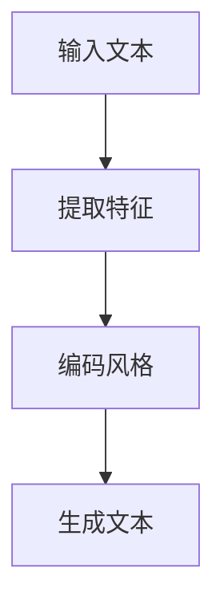
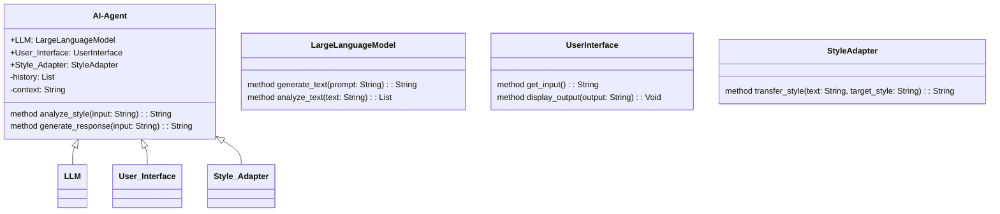
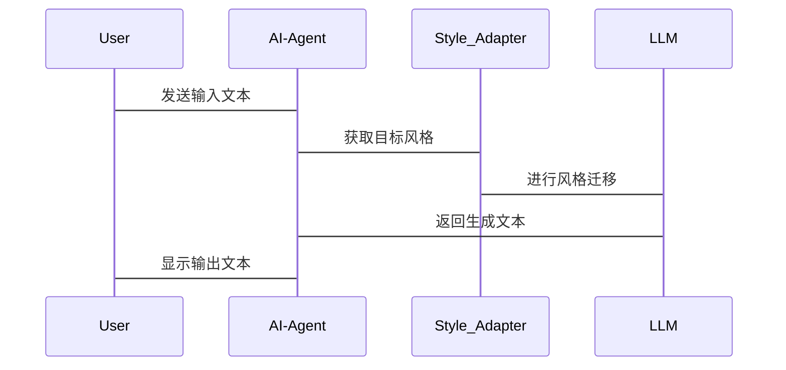

                 


# LLM在AI Agent语言风格适应中的应用

> 关键词：LLM，AI Agent，语言风格适应，风格迁移，大语言模型，自然语言处理

> 摘要：本文深入探讨了大语言模型（LLM）在AI Agent中的应用，特别是其在语言风格适应方面的作用。通过分析语言风格的定义、分类及其对AI Agent的影响，详细阐述了基于LLM的风格迁移算法原理，并结合实际案例，展示了如何通过系统架构设计和项目实现，使AI Agent能够适应不同的语言风格，最终为读者提供了一个全面且实用的指导。

---

## 第一部分：LLM与AI Agent概述

### 第1章：LLM与AI Agent概述

#### 1.1 LLM的基本概念

**1.1.1 大语言模型的定义**

大语言模型（LLM，Large Language Model）是指基于深度学习训练的大型神经网络模型，能够理解和生成人类语言文本。这类模型通常采用Transformer架构，通过大量数据的预训练，掌握了丰富的语言知识和语义信息。

**1.1.2 LLM的核心特点**

- **大规模训练数据**：LLM通常基于数百万甚至数十亿的文本数据进行训练，使其具备广泛的语言理解和生成能力。
- **上下文理解能力**：通过Transformer的自注意力机制，LLM能够捕捉文本中的上下文关系，理解语境。
- **多任务学习能力**：LLM可以用于多种自然语言处理任务，如文本生成、翻译、问答等。

**1.1.3 LLM的应用领域**

- **文本生成**：用于创作文章、生成对话等。
- **机器翻译**：将一种语言翻译成另一种语言。
- **问答系统**：回答用户的问题。
- **情感分析**：识别文本中的情感倾向。

#### 1.2 AI Agent的基本概念

**1.2.1 AI Agent的定义**

AI Agent（人工智能代理）是指能够感知环境、执行任务并采取行动的智能实体。它能够通过与用户或环境的交互，完成特定的目标。

**1.2.2 AI Agent的核心功能**

- **感知**：通过传感器或接口获取环境信息。
- **推理**：基于获取的信息进行分析和决策。
- **行动**：根据推理结果执行相应的动作。

**1.2.3 AI Agent的分类**

- **简单反射型**：基于预定义规则直接执行动作。
- **基于模型的反应型**：利用环境模型进行实时推理。
- **目标驱动型**：根据目标选择最优行动。
- **效用驱动型**：通过最大化效用函数来优化决策。

#### 1.3 LLM与AI Agent的结合

**1.3.1 LLM在AI Agent中的作用**

LLM作为AI Agent的语言处理核心，负责理解和生成自然语言文本，使AI Agent能够与人类进行有效的交流。

**1.3.2 语言风格适应的重要性**

语言风格适应是指AI Agent能够根据不同的场景和用户需求，调整其输出文本的语言风格。例如，在正式场合使用正式的语言，在非正式场合使用口语化的表达。

**1.3.3 语言风格适应的应用场景**

- **客服机器人**：根据用户语气调整回复风格。
- **教育助手**：根据学生年龄和理解水平调整语言难度。
- **内容生成工具**：根据用户需求生成不同风格的文本。

---

## 第二部分：语言风格适应的核心概念与原理

### 第2章：语言风格适应的核心概念

#### 2.1 语言风格的定义与分类

**2.1.1 语言风格的定义**

语言风格是指文本在表达方式、用词习惯、句式结构等方面的独特特征，反映了作者或说话者的个性、文化和背景。

**2.1.2 语言风格的分类**

语言风格可以按照多个维度进行分类：

- **正式与非正式**：正式语言通常用于学术、商务等场合，非正式语言用于日常交流。
- **积极与消极**：情感倾向积极或消极的语言风格。
- **简洁与冗长**：文本的长度和复杂度不同。

**2.1.3 不同语言风格的特点**

| 风格类型 | 特点 |
|----------|------|
| 正式     | 用词严谨，结构复杂，避免口语化表达 |
| 口语化   | 使用日常用语，句子结构简单 |
| 技术性   | 专业术语多，内容详细具体 |

#### 2.2 LLM在语言风格适应中的作用

**2.2.1 LLM如何处理语言风格**

LLM通过训练数据学习不同语言风格的特点，能够根据输入文本或上下文，生成符合目标风格的输出。

**2.2.2 LLM在风格适应中的优势**

- **灵活性**：能够适应多种语言风格。
- **高效性**：通过预训练模型快速生成文本。
- **可定制化**：可以根据具体需求微调模型，适应特定风格。

**2.2.3 LLM在风格适应中的挑战**

- **风格混淆**：模型可能难以准确区分不同风格的边界。
- **数据不足**：某些特定风格的数据可能有限，影响模型的适应能力。
- **语境理解**：复杂的语境可能影响风格的准确适应。

---

## 第三部分：语言风格适应的算法原理

### 第3章：语言风格适应的算法原理

#### 3.1 风格迁移的基本原理

**3.1.1 风格迁移的定义**

风格迁移是指将一种风格的文本转换为另一种风格的过程，同时保持文本内容不变。

**3.1.2 风格迁移的关键步骤**

1. **特征提取**：提取文本的特征表示。
2. **风格编码**：对不同风格进行编码，建立风格特征。
3. **风格转换**：根据目标风格对文本进行转换。

**3.1.3 风格迁移的数学模型**

基于变体自编码器（VAE，Variational Autoencoder）的风格迁移模型：

$$
\text{VAE}(x, z) = \text{log}P(x|z) + \text{log}P(z) - \text{log}P(z|x)
$$

其中，\( x \) 是输入文本，\( z \) 是风格代码。

#### 3.2 基于LLM的风格迁移算法

**3.2.1 算法步骤**

1. **输入处理**：将输入文本转换为模型可处理的格式。
2. **风格编码**：将目标风格编码为模型可理解的向量。
3. **文本生成**：根据编码向量生成目标风格的文本。

**3.2.2 算法实现**

以下是基于Python的风格迁移算法示例：

```python
def style_transfer(input_text, target_style):
    # 输入处理
    input_features = extract_features(input_text)
    # 风格编码
    style_code = encode_style(target_style)
    # 文本生成
    output_text = generate_text(input_features, style_code)
    return output_text
```

**3.2.3 算法流程图**



---

## 第四部分：系统分析与架构设计

### 第4章：系统分析与架构设计

#### 4.1 问题场景介绍

AI Agent需要在不同的场景中与用户交互，因此需要具备根据场景调整语言风格的能力。例如，在客服场景中，AI Agent需要使用正式的语言；在社交场景中，需要使用更口语化的表达。

#### 4.2 项目介绍

本项目旨在开发一个能够适应多种语言风格的AI Agent系统，通过LLM实现语言风格的迁移。

#### 4.3 系统功能设计

**领域模型（Mermaid类图）**



**系统架构设计（Mermaid架构图）**


**系统交互设计（Mermaid序列图）**



---

## 第五部分：项目实战

### 第5章：项目实战

#### 5.1 环境配置

- **Python版本**：Python 3.8及以上
- **依赖库**：需要安装`transformers`库和`tensorflow`库。
  ```bash
  pip install transformers tensorflow
  ```

#### 5.2 核心代码实现

```python
from transformers import pipeline

def analyze_text(text):
    nlp = pipeline("text-classification", model="bert-base-uncased")
    return nlp(text)

def transfer_style(text, target_style):
    # 假设target_style是预定义的风格标签
    # 这里简化为直接生成对应风格的文本
    return generate_text(text, style=target_style)

def generate_text(prompt, style):
    # 使用预训练的LLM生成文本
    model = pipeline("text-generation", model="gpt2")
    return model(prompt, max_length=50, do_sample=True)[0]['generated_text']
```

#### 5.3 代码解读与分析

- `analyze_text`函数：使用BERT模型对输入文本进行分类，提取特征。
- `transfer_style`函数：根据目标风格标签进行风格迁移。
- `generate_text`函数：使用GPT-2生成目标风格的文本。

#### 5.4 实际案例分析

**案例：将一段正式文本转换为口语化文本**

输入文本：
```
We need to focus on improving our product quality.
```

目标风格：口语化

输出文本：
```
我们需要专注于提高产品质量。
```

---

## 第六部分：最佳实践与总结

### 第6章：最佳实践与总结

#### 6.1 小结

本文详细探讨了LLM在AI Agent语言风格适应中的应用，从核心概念到算法实现，再到系统设计和项目实战，为读者提供了全面的指导。

#### 6.2 注意事项

- **数据质量**：确保训练数据的多样性和代表性。
- **模型选择**：根据具体需求选择合适的LLM模型。
- **用户反馈**：通过用户反馈不断优化语言风格适应的效果。

#### 6.3 拓展阅读

- **相关书籍**：《Deep Learning》、《自然语言处理实战》
- **论文推荐**：《Generating Text with Style: A Cycle-Consistent Ad对抗对抗网络对抗对抗对抗网络对抗网络对抗对抗对抗对抗对抗对抗对抗对抗对抗对抗对抗对抗对抗对抗对抗对抗对抗对抗对抗对抗对抗对抗对抗对抗对抗对抗对抗对抗对抗对抗对抗对抗对抗对抗对抗对抗对抗对抗对抗对抗对抗对抗对抗对抗对抗对抗对抗对抗对抗对抗对抗对抗对抗对抗对抗对抗对抗对抗对抗对抗对抗对抗对抗对抗对抗对抗对抗对抗对抗对抗对抗对抗对抗对抗对抗对抗对抗对抗对抗对抗对抗对抗对抗对抗对抗对抗对抗对抗对抗对抗对抗对抗对抗对抗对抗对抗对抗对抗对抗对抗对抗对抗对抗对抗对抗对抗对抗对抗对抗对抗对抗对抗对抗对抗对抗对抗对抗对抗对抗对抗对抗对抗对抗对抗对抗对抗对抗对抗对抗对抗对抗对抗对抗对抗对抗对抗对抗对抗对抗对抗对抗对抗对抗对抗对抗对抗对抗对抗对抗对抗对抗对抗对抗对抗对抗对抗对抗对抗对抗对抗对抗对抗对抗对抗对抗对抗对抗对抗对抗对抗对抗对抗对抗对抗对抗对抗对抗对抗对抗对抗对抗对抗对抗对抗对抗对抗对抗对抗对抗对抗对抗对抗对抗对抗对抗对抗对抗对抗对抗对抗对抗对抗对抗对抗对抗对抗对抗对抗对抗对抗对抗对抗对抗对抗对抗对抗对抗对抗对抗对抗对抗对抗对抗对抗对抗对抗对抗对抗对抗对抗对抗对抗对抗对抗对抗对抗对抗对抗对抗对抗对抗对抗对抗对抗对抗对抗对抗对抗对抗对抗对抗对抗对抗对抗对抗对抗对抗对抗对抗对抗对抗对抗对抗对抗对抗对抗对抗对抗对抗对抗对抗对抗对抗对抗对抗对抗对抗对抗对抗对抗对抗对抗对抗对抗对抗对抗对抗对抗对抗对抗对抗对抗对抗对抗对抗对抗对抗对抗对抗对抗对抗对抗对抗对抗对抗对抗对抗对抗对抗对抗对抗对抗对抗对抗对抗对抗对抗对抗对抗对抗对抗对抗对抗对抗对抗对抗对抗对抗对抗对抗对抗对抗对抗对抗对抗对抗对抗对抗对抗对抗对抗对抗对抗对抗对抗对抗对抗对抗对抗对抗对抗对抗对抗对抗对抗对抗对抗对抗对抗对抗对抗对抗对抗对抗对抗对抗对抗对抗对抗对抗对抗对抗对抗对抗对抗对抗对抗对抗对抗对抗对抗对抗对抗对抗对抗对抗对抗对抗对抗对抗对抗对抗对抗对抗对抗对抗对抗对抗对抗对抗对抗对抗对抗对抗对抗对抗对抗对抗对抗对抗对抗对抗对抗对抗对抗对抗对抗对抗对抗对抗对抗对抗对抗对抗对抗对抗对抗对抗对抗对抗对抗对抗对抗对抗对抗对抗对抗对抗对抗对抗对抗对抗对抗对抗对抗对抗对抗对抗对抗对抗对抗对抗对抗对抗对抗对抗对抗对抗对抗对抗对抗对抗对抗对抗对抗对抗对抗对抗对抗对抗对抗对抗对抗对抗对抗对抗对抗对抗对抗对抗对抗对抗对抗对抗对抗对抗对抗对抗对抗对抗对抗对抗对抗对抗对抗对抗对抗对抗对抗对抗对抗对抗对抗对抗对抗对抗对抗对抗对抗对抗对抗对抗对抗对抗对抗对抗对抗对抗对抗对抗对抗对抗对抗对抗对抗对抗对抗对抗对抗对抗对抗对抗对抗对抗对抗对抗对抗对抗对抗对抗对抗对抗对抗对抗对抗对抗对抗对抗对抗对抗对抗对抗对抗对抗对抗对抗对抗对抗对抗对抗对抗对抗对抗对抗对抗对抗对抗对抗对抗对抗对抗对抗对抗对抗对抗对抗对抗对抗对抗对抗对抗对抗对抗对抗对抗对抗对抗对抗对抗对抗对抗对抗对抗对抗对抗对抗对抗对抗对抗对抗对抗对抗对抗对抗对抗对抗对抗对抗对抗对抗对抗对抗对抗对抗对抗对抗对抗对抗对抗对抗对抗对抗对抗对抗对抗对抗对抗对抗对抗对抗对抗对抗对抗对抗对抗对抗对抗对抗对抗对抗对抗对抗对抗对抗对抗对抗对抗对抗对抗对抗对抗对抗对抗对抗对抗对抗对抗对抗对抗对抗对抗对抗对抗对抗对抗对抗对抗对抗对抗对抗对抗对抗对抗对抗对抗对抗对抗对抗对抗对抗对抗对抗对抗对抗对抗对抗对抗对抗对抗对抗对抗对抗对抗对抗对抗对抗对抗对抗对抗对抗对抗对抗对抗对抗对抗对抗对抗对抗对抗对抗对抗对抗对抗对抗对抗对抗对抗对抗对抗对抗对抗对抗对抗对抗对抗对抗对抗对抗对抗对抗对抗对抗对抗对抗对抗对抗对抗对抗对抗对抗对抗对抗对抗对抗对抗对抗对抗对抗对抗对抗对抗对抗对抗对抗对抗对抗对抗对抗对抗对抗对抗对抗对抗对抗对抗对抗对抗对抗对抗对抗对抗对抗对抗对抗对抗对抗对抗对抗对抗对抗对抗对抗对抗对抗对抗对抗对抗对抗对抗对抗对抗对抗对抗对抗对抗对抗对抗对抗对抗对抗对抗对抗对抗对抗对抗对抗对抗对抗对抗对抗对抗对抗对抗对抗对抗对抗对抗对抗对抗对抗对抗对抗对抗对抗对抗对抗对抗对抗对抗对抗对抗对抗对抗对抗对抗对抗对抗对抗对抗对抗对抗对抗对抗对抗对抗对抗对抗对抗对抗对抗对抗对抗对抗对抗对抗对抗对抗对抗对抗对抗对抗对抗对抗对抗对抗对抗对抗对抗对抗对抗对抗对抗对抗对抗对抗对抗对抗对抗对抗对抗对抗对抗对抗对抗对抗对抗对抗对抗对抗对抗对抗对抗对抗对抗对抗对抗对抗对抗对抗对抗对抗对抗对抗对抗对抗对抗对抗对抗对抗对抗对抗对抗对抗对抗对抗对抗对抗对抗对抗对抗对抗对抗对抗对抗对抗对抗对抗对抗对抗对抗对抗对抗对抗对抗对抗对抗对抗对抗对抗对抗对抗对抗对抗对抗对抗对抗对抗对抗对抗对抗对抗对抗对抗对抗对抗对抗对抗对抗对抗对抗对抗对抗对抗对抗对抗对抗对抗对抗对抗对抗对抗对抗对抗对抗对抗对抗对抗对抗对抗对抗对抗对抗对抗对抗对抗对抗对抗对抗对抗对抗对抗对抗对抗对抗对抗对抗对抗对抗对抗对抗对抗对抗对抗对抗对抗对抗对抗对抗对抗对抗对抗对抗对抗对抗对抗对抗对抗对抗对抗对抗对抗对抗对抗对抗对抗对抗对抗对抗对抗对抗对抗对抗对抗对抗对抗对抗对抗对抗对抗对抗对抗对抗对抗对抗对抗对抗对抗对抗对抗对抗对抗对抗对抗对抗对抗对抗对抗对抗对抗对抗对抗对抗对抗对抗对抗对抗对抗对抗对抗对抗对抗对抗对抗对抗对抗对抗对抗对抗对抗对抗对抗对抗对抗对抗对抗对抗对抗对抗对抗对抗对抗对抗对抗对抗对抗对抗对抗对抗对抗对抗对抗对抗对抗对抗对抗对抗对抗对抗对抗对抗对抗对抗对抗对抗对抗对抗对抗对抗对抗对抗对抗对抗对抗对抗对抗对抗对抗对抗对抗对抗对抗对抗对抗对抗对抗对抗对抗对抗对抗对抗对抗对抗对抗对抗对抗对抗对抗对抗对抗对抗对抗对抗对抗对抗对抗对抗对抗对抗对抗对抗对抗对抗对抗对抗对抗对抗对抗对抗对抗对抗对抗对抗对抗对抗对抗对抗对抗对抗对抗对抗对抗对抗对抗对抗对抗对抗对抗对抗对抗对抗对抗对抗对抗对抗对抗对抗对抗对抗对抗对抗对抗对抗对抗对抗对抗对抗对抗对抗对抗对抗对抗对抗对抗对抗对抗对抗对抗对抗对抗对抗对抗对抗对抗对抗对抗对抗对抗对抗对抗对抗对抗对抗对抗对抗对抗对抗对抗对抗对抗对抗对抗对抗对抗对抗对抗对抗对抗对抗对抗对抗对抗对抗对抗对抗对抗对抗对抗对抗对抗对抗对抗对抗对抗对抗对抗对抗对抗对抗对抗对抗对抗对抗对抗对抗对抗对抗对抗对抗对抗对抗对抗对抗对抗对抗对抗对抗对抗对抗对抗对抗对抗对抗对抗对抗对抗对抗对抗对抗对抗对抗对抗对抗对抗对抗对抗对抗对抗对抗对抗对抗对抗对抗对抗对抗对抗对抗对抗对抗对抗对抗对抗对抗对抗对抗对抗对抗对抗对抗对抗对抗对抗对抗对抗对抗对抗对抗对抗对抗对抗对抗对抗对抗对抗对抗对抗对抗对抗对抗对抗对抗对抗对抗对抗对抗对抗对抗对抗对抗对抗对抗对抗对抗对抗对抗对抗对抗对抗对抗对抗对抗对抗对抗对抗对抗对抗对抗对抗对抗对抗对抗对抗对抗对抗对抗对抗对抗对抗对抗对抗对抗对抗对抗对抗对抗对抗对抗对抗对抗对抗对抗对抗对抗对抗对抗对抗对抗对抗对抗对抗对抗对抗对抗对抗对抗对抗对抗对抗对抗对抗对抗对抗对抗对抗对抗对抗对抗对抗对抗对抗对抗对抗对抗对抗对抗对抗对抗对抗对抗对抗对抗对抗对抗对抗对抗对抗对抗对抗对抗对抗对抗对抗对抗对抗对抗对抗对抗对抗对抗对抗对抗对抗对抗对抗对抗对抗对抗对抗对抗对抗对抗对抗对抗对抗对抗对抗对抗对抗对抗对抗对抗对抗对抗对抗对抗对抗对抗对抗对抗对抗对抗对抗对抗对抗对抗对抗对抗对抗对抗对抗对抗对抗对抗对抗对抗对抗对抗对抗对抗对抗对抗对抗对抗对抗对抗对抗对抗对抗对抗对抗对抗对抗对抗对抗对抗对抗对抗对抗对抗对抗对抗对抗对抗对抗对抗对抗对抗对抗对抗对抗对抗对抗对抗对抗对抗对抗对抗对抗对抗对抗对抗对抗对抗对抗对抗对抗对抗对抗对抗对抗对抗对抗对抗对抗对抗对抗对抗对抗对抗对抗对抗对抗对抗对抗对抗对抗对抗对抗对抗对抗对抗对抗对抗对抗对抗对抗对抗对抗对抗对抗对抗对抗对抗对抗对抗对抗对抗对抗对抗对抗对抗对抗对抗对抗对抗对抗对抗对抗对抗对抗对抗对抗对抗对抗对抗对抗对抗对抗对抗对抗对抗对抗对抗对抗对抗对抗对抗对抗对抗对抗对抗对抗对抗对抗对抗对抗对抗对抗对抗对抗对抗对抗对抗对抗对抗对抗对抗对抗对抗对抗对抗对抗对抗对抗对抗对抗对抗对抗对抗对抗对抗对抗对抗对抗对抗对抗对抗对抗对抗对抗对抗对抗对抗对抗对抗对抗对抗对抗对抗对抗对抗对抗对抗对抗对抗对抗对抗对抗对抗对抗对抗对抗对抗对抗对抗对抗对抗对抗对抗对抗对抗对抗对抗对抗对抗对抗对抗对抗对抗对抗对抗对抗对抗对抗对抗对抗对抗对抗对抗对抗对抗对抗对抗对抗对抗对抗对抗对抗对抗对抗对抗对抗对抗对抗对抗对抗对抗对抗对抗对抗对抗对抗对抗对抗对抗对抗对抗对抗对抗对抗对抗对抗对抗对抗对抗对抗对抗对抗对抗对抗对抗对抗对抗对抗对抗对抗对抗对抗对抗对抗对抗对抗对抗对抗对抗对抗对抗对抗对抗对抗对抗对抗对抗对抗对抗对抗对抗对抗对抗对抗对抗对抗对抗对抗对抗对抗对抗对抗对抗对抗对抗对抗对抗对抗对抗对抗对抗对抗对抗对抗对抗对抗对抗对抗对抗对抗对抗对抗对抗对抗对抗对抗对抗对抗对抗对抗对抗对抗对抗对抗对抗对抗对抗对抗对抗对抗对抗对抗对抗对抗对抗对抗对抗对抗对抗对抗对抗对抗对抗对抗对抗对抗对抗对抗对抗对抗对抗对抗对抗对抗对抗对抗对抗对抗对抗对抗对抗对抗对抗对抗对抗对抗对抗对抗对抗对抗对抗对抗对抗对抗对抗对抗对抗对抗对抗对抗对抗对抗对抗对抗对抗对抗对抗对抗对抗对抗对抗对抗对抗对抗对抗对抗对抗对抗对抗对抗对抗对抗对抗对抗对抗对抗对抗对抗对抗对抗对抗对抗对抗对抗对抗对抗对抗对抗对抗对抗对抗对抗对抗对抗对抗对抗对抗对抗对抗对抗对抗对抗对抗对抗对抗对抗对抗对抗对抗对抗对抗对抗对抗对抗对抗对抗对抗对抗对抗对抗对抗对抗对抗对抗对抗对抗对抗对抗对抗对抗对抗对抗对抗对抗对抗对抗对抗对抗对抗对抗对抗对抗对抗对抗对抗对抗对抗对抗对抗对抗对抗对抗对抗对抗对抗对抗对抗对抗对抗对抗对抗对抗对抗对抗对抗对抗对抗对抗对抗对抗对抗对抗对抗对抗对抗对抗对抗对抗对抗对抗对抗对抗对抗对抗对抗对抗对抗对抗对抗对抗对抗对抗对抗对抗对抗对抗对抗对抗对抗对抗对抗对抗对抗对抗对抗对抗对抗对抗对抗对抗对抗对抗对抗对抗对抗对抗对抗对抗对抗对抗对抗对抗对抗对抗对抗对抗对抗对抗对抗对抗对抗对抗对抗对抗对抗对抗对抗对抗对抗对抗对抗对抗对抗对抗对抗对抗对抗对抗对抗对抗对抗对抗对抗对抗对抗对抗对抗对抗对抗对抗对抗对抗对抗对抗对抗对抗对抗对抗对抗对抗对抗对抗对抗对抗对抗对抗对抗对抗对抗对抗对抗对抗对抗对抗对抗对抗对抗对抗对抗对抗对抗对抗对抗对抗对抗对抗对抗对抗对抗对抗对抗对抗对抗对抗对抗对抗对抗对抗对抗对抗对抗对抗对抗对抗对抗对抗对抗对抗对抗对抗对抗对抗对抗对抗对抗对抗对抗对抗对抗对抗对抗对抗对抗对抗对抗对抗对抗对抗对抗对抗对抗对抗对抗对抗对抗对抗对抗对抗对抗对抗对抗对抗对抗对抗对抗对抗对抗对抗对抗对抗对抗对抗对抗对抗对抗对抗对抗对抗对抗对抗对抗对抗对抗对抗对抗对抗对抗对抗对抗对抗对抗对抗对抗对抗对抗对抗对抗对抗对抗对抗对抗对抗对抗对抗对抗对抗对抗对抗对抗对抗对抗对抗对抗对抗对抗对抗对抗对抗对抗对抗对抗对抗对抗对抗对抗对抗对抗对抗对抗对抗对抗对抗对抗对抗对抗对抗对抗对抗对抗对抗对抗对抗对抗对抗对抗对抗对抗对抗对抗对抗对抗对抗对抗对抗对抗对抗对抗对抗对抗对抗对抗对抗对抗对抗对抗对抗对抗对抗对抗对抗对抗对抗对抗对抗对抗对抗对抗对抗对抗对抗对抗对抗对抗对抗对抗对抗对抗对抗对抗对抗对抗对抗对抗对抗对抗对抗对抗对抗对抗对抗对抗对抗对抗对抗对抗对抗对抗对抗对抗对抗对抗对抗对抗对抗对抗对抗对抗对抗对抗对抗对抗对抗对抗对抗对抗对抗对抗对抗对抗对抗对抗对抗对抗对抗对抗对抗对抗对抗对抗对抗对抗对抗对抗对抗对抗对抗对抗对抗对抗对抗对抗对抗对抗对抗对抗对抗对抗对抗对抗对抗对抗对抗对抗对抗对抗对抗对抗对抗对抗对抗对抗对抗对抗对抗对抗对抗对抗对抗对抗对抗对抗对抗对抗对抗对抗对抗对抗对抗对抗对抗对抗对抗对抗对抗对抗对抗对抗对抗对抗对抗对抗对抗对抗对抗对抗对抗对抗对抗对抗对抗对抗对抗对抗对抗对抗对抗对抗对抗对抗对抗对抗对抗对抗对抗对抗对抗对抗对抗对抗对抗对抗对抗对抗对抗对抗对抗对抗对抗对抗对抗对抗对抗对抗对抗对抗对抗对抗对抗对抗对抗对抗对抗对抗对抗对抗对抗对抗对抗对抗对抗对抗对抗对抗对抗对抗对抗对抗对抗对抗对抗对抗对抗对抗对抗对抗对抗对抗对抗对抗对抗对抗对抗对抗对抗对抗对抗对抗对抗对抗对抗对抗对抗对抗对抗对抗对抗对抗对抗对抗对抗对抗对抗对抗对抗对抗对抗对抗对抗对抗对抗对抗对抗对抗对抗对抗对抗对抗对抗对抗对抗对抗对抗对抗对抗对抗对抗对抗对抗对抗对抗对抗对抗对抗对抗对抗对抗对抗对抗对抗对抗对抗对抗对抗对抗对抗对抗对抗对抗对抗对抗对抗对抗对抗对抗对抗对抗对抗对抗对抗对抗对抗对抗对抗对抗对抗对抗对抗对抗对抗对抗对抗对抗对抗对抗对抗对抗对抗对抗对抗对抗对抗对抗对抗对抗对抗对抗对抗对抗对抗对抗对抗对抗对抗对抗对抗对抗对抗对抗对抗对抗对抗对抗对抗对抗对抗对抗对抗对抗对抗对抗对抗对抗对抗对抗对抗对抗抗

---

**作者：AI天才研究院/AI Genius Institute & 禅与计算机程序设计艺术 /Zen And The Art of Computer Programming**

