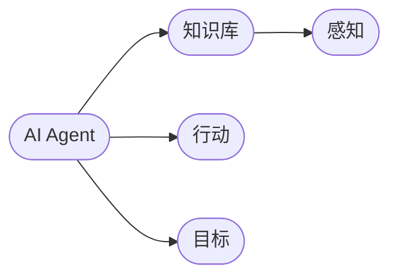
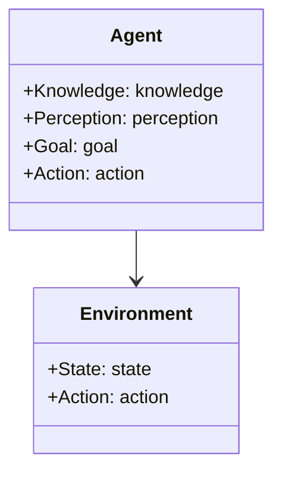
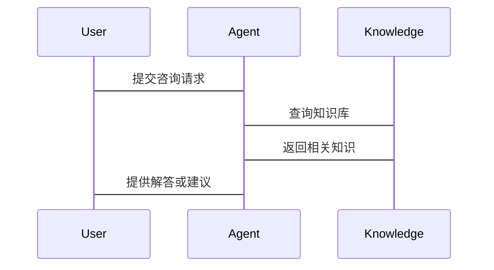

                 


# 从零开始：AI Agent的概念学习系统

> **关键词**：人工智能、AI Agent、概念学习、知识表示、智能系统、生成式AI、多智能体协作  
>
> **摘要**：本文将详细介绍AI Agent的概念、核心原理、应用场景以及实现过程。通过系统化的学习，读者将掌握AI Agent的基本概念、算法原理、系统架构设计以及实际项目中的应用。文章内容包括背景介绍、核心概念与联系、算法原理、系统分析与架构设计、项目实战以及总结与展望，帮助读者从零开始构建AI Agent的概念学习系统。

---

## 第一部分：AI Agent的背景与核心概念

### 第1章：AI Agent的背景与核心概念

#### 1.1 AI Agent的背景

AI Agent，即人工智能代理，是一种能够感知环境并采取行动以实现目标的智能实体。随着人工智能技术的快速发展，AI Agent在各个领域中的应用越来越广泛，如自动驾驶、智能助手、推荐系统等。本文将从AI Agent的定义、特点、应用场景入手，帮助读者建立基本概念。

#### 1.2 AI Agent的核心概念

##### 1.2.1 AI Agent的定义与特点

AI Agent可以被定义为一个能够感知环境、做出决策并采取行动以实现目标的智能系统。其核心特点包括自主性、反应性、目标导向性和社会能力。这些特点使得AI Agent能够在复杂环境中独立运作，并与人类或其他智能体进行有效协作。

##### 1.2.2 AI Agent的应用场景

AI Agent的应用场景广泛，包括但不限于：

- **自动驾驶**：通过感知环境和决策算法实现车辆的自主驾驶。
- **智能助手**：如Siri、Alexa等，能够理解和执行用户的指令。
- **推荐系统**：基于用户行为和偏好推荐个性化内容。
- **博弈论**：在游戏AI中实现智能对手或队友。

#### 1.3 AI Agent的核心属性对比

##### 1.3.1 属性特征对比表格

| 属性         | 描述                                           |
|--------------|------------------------------------------------|
| 自主性       | 能够独立感知环境并采取行动                     |
| 反应性       | 能够实时响应环境变化                           |
| 目标导向性   | 具有明确的目标，并采取行动以实现目标           |
| 社会能力     | 能够与其他智能体或人类进行协作与通信           |

##### 1.3.2 实体关系图（Mermaid）



#### 1.4 本章小结

本章主要介绍了AI Agent的背景、核心概念和应用场景，通过对比分析，明确了AI Agent的四个核心属性：自主性、反应性、目标导向性和社会能力。下一章将深入探讨AI Agent的核心概念原理。

---

## 第二部分：AI Agent的核心概念与联系

### 第2章：AI Agent的核心概念原理

#### 2.1 AI Agent的原理分析

##### 2.1.1 基于生成式AI的原理

生成式AI（如GPT系列模型）通过深度学习和大语言模型技术，能够生成与人类语言难以区分的文本。其核心原理包括：

- **Transformer模型**：一种基于自注意力机制的神经网络架构，能够捕捉文本中的长距离依赖关系。
- **生成策略**：通过概率分布生成最可能的下一个词，实现文本的生成。

##### 2.1.2 多智能体协作机制

在多智能体系统中，多个AI Agent协同工作，共同完成复杂任务。其协作机制包括：

- **通信协议**：智能体之间通过特定协议交换信息。
- **任务分配**：根据智能体的能力和环境需求，动态分配任务。

##### 2.1.3 知识表示与推理过程

知识表示是AI Agent理解世界的基础。常见的知识表示方法包括：

- **符号逻辑**：使用符号和规则表示知识。
- **概率推理**：基于概率分布进行推理。

#### 2.2 AI Agent的属性特征对比

##### 2.2.1 属性对比表格

| 属性         | 描述                                           |
|--------------|------------------------------------------------|
| 知识表示       | 使用符号逻辑或概率推理表示知识                 |
| 感知能力       | 通过传感器或数据输入感知环境                   |
| 行动能力       | 执行预定义或自动生成的动作                     |
| 目标设定       | 明确的目标，驱动行动                           |

##### 2.2.2 实体关系图（Mermaid）


#### 2.3 AI Agent的领域模型（Mermaid）



#### 2.4 本章小结

本章详细分析了AI Agent的核心原理，包括生成式AI的数学模型、多智能体协作机制以及知识表示与推理过程。通过对比分析，明确了AI Agent在不同场景下的应用特点。

---

## 第三部分：AI Agent的算法原理

### 第3章：AI Agent的算法原理

#### 3.1 生成式AI的数学模型

##### 3.1.1 Transformer模型的结构

Transformer模型由编码器和解码器组成，每个部分包含多个层。其核心结构如下：

- **自注意力机制**：计算输入序列中每个位置的重要性权重。
- **前馈网络**：对序列进行非线性变换。

数学公式表示如下：

$$
\text{Attention}(Q, K, V) = \text{softmax}\left(\frac{QK^T}{\sqrt{d_k}}\right)V
$$

其中，$Q$、$K$、$V$分别为查询、键和值向量，$d_k$为向量维度。

##### 3.1.2 Transformer的训练过程

训练过程包括以下几个步骤：

1. **输入预处理**：对输入数据进行分词、编码等预处理。
2. **模型初始化**：随机初始化模型参数。
3. **前向传播**：输入数据通过编码器和解码器进行处理。
4. **计算损失**：使用交叉熵损失函数计算预测值与真实值之间的差距。
5. **反向传播**：通过梯度下降优化模型参数。

##### 3.1.3 Python代码示例

```python
import torch
import torch.nn as nn

class Transformer(nn.Module):
    def __init__(self, d_model, nhead, dropout=0.1):
        super(Transformer, self).__init__()
        self.encoder = nn.TransformerEncoder(
            nn.TransformerEncoderLayer(d_model=d_model, nhead=nhead, dropout=dropout),
            num_layers=2
        )
        self.decoder = nn.TransformerDecoder(
            nn.TransformerDecoderLayer(d_model=d_model, nhead=nhead, dropout=dropout),
            num_layers=2
        )
    
    def forward(self, src, tgt):
        enc_out = self.encoder(src)
        dec_out = self.decoder(tgt, enc_out)
        return dec_out
```

#### 3.2 多智能体协作算法

##### 3.2.1 多智能体协作的数学模型

多智能体协作算法通常采用分布式方法，每个智能体维护自己的策略，并通过通信协议进行协作。常见的算法包括：

- **分布式强化学习**：多个智能体通过共享参数或策略进行协作。
- **价值分解方法**：将整体任务分解为多个子任务，每个智能体负责一部分。

##### 3.2.2 多智能体协作的实现步骤

1. **定义智能体结构**：每个智能体包含感知模块、决策模块和执行模块。
2. **定义通信协议**：规定智能体之间信息交换的方式和格式。
3. **定义目标函数**：根据任务需求定义智能体的优化目标。
4. **训练与优化**：通过强化学习或分布式优化算法训练智能体。

##### 3.2.3 Python代码示例

```python
import torch
import torch.nn as nn

class Agent(nn.Module):
    def __init__(self, state_dim, action_dim):
        super(Agent, self).__init__()
        self.actor = nn.Linear(state_dim, action_dim)
        self.critic = nn.Linear(state_dim, 1)
    
    def forward(self, state):
        action_probs = F.softmax(self.actor(state), dim=-1)
        state_value = self.critic(state)
        return action_probs, state_value

# 初始化多个智能体
agents = [Agent(state_dim, action_dim) for _ in range(num_agents)]
```

#### 3.3 本章小结

本章详细讲解了生成式AI和多智能体协作算法的数学模型和实现方法，通过代码示例帮助读者理解算法原理。

---

## 第四部分：AI Agent的系统分析与架构设计

### 第4章：AI Agent的系统分析与架构设计

#### 4.1 系统分析

##### 4.1.1 问题场景介绍

假设我们正在开发一个智能客服系统，其中每个AI Agent负责处理用户的咨询请求。

##### 4.1.2 项目介绍

本项目旨在开发一个基于AI Agent的智能客服系统，能够理解用户意图并提供个性化服务。

#### 4.2 系统功能设计

##### 4.2.1 领域模型（Mermaid）


##### 4.2.2 系统架构设计（Mermaid）


#### 4.3 系统接口设计

##### 4.3.1 接口定义

- **输入接口**：接收用户的咨询请求。
- **输出接口**：返回问题解答或服务建议。

##### 4.3.2 交互流程（Mermaid）



#### 4.4 系统优化与扩展

##### 4.4.1 系统优化建议

- **优化知识库**：增加更多领域知识，提高回答准确性。
- **改进算法**：引入更先进的生成式AI模型，提升回答质量。

##### 4.4.2 系统扩展方向

- **多语言支持**：扩展系统支持多种语言。
- **多模态交互**：增加图像、语音等多种交互方式。

#### 4.5 本章小结

本章通过智能客服系统的案例，详细分析了AI Agent的系统架构设计和接口设计，为后续的项目实战奠定了基础。

---

## 第五部分：AI Agent的项目实战

### 第5章：AI Agent的项目实战

#### 5.1 环境安装

##### 5.1.1 安装Python

确保安装了Python 3.8及以上版本。

##### 5.1.2 安装依赖库

使用以下命令安装所需库：

```bash
pip install torch transformers
```

#### 5.2 系统核心实现

##### 5.2.1 需求分析

开发一个基于生成式AI的智能客服系统，能够理解用户意图并生成回答。

##### 5.2.2 功能模块设计

- **输入处理模块**：接收用户的输入并进行预处理。
- **生成模块**：调用生成式AI模型生成回答。
- **输出模块**：将生成的回答返回给用户。

##### 5.2.3 代码实现

```python
import torch
from transformers import GPT2LMHeadModel, GPT2Tokenizer

# 初始化模型
model_name = 'gpt2'
tokenizer = GPT2Tokenizer.from_pretrained(model_name)
model = GPT2LMHeadModel.from_pretrained(model_name)

# 定义生成函数
def generate_response(input_text):
    inputs = tokenizer.encode(input_text, return_tensors='pt')
    outputs = model.generate(inputs, max_length=100, do_sample=True)
    response = tokenizer.decode(outputs[0], skip_special_tokens=True)
    return response

# 测试
print(generate_response("How are you?"))
```

##### 5.2.4 测试与优化

对生成的回答进行测试，根据结果调整模型参数或优化算法。

#### 5.3 实际案例分析

##### 5.3.1 案例介绍

以智能客服系统为例，用户咨询“如何重置密码？”。

##### 5.3.2 代码实现与分析

调用生成模块生成回答：

```python
print(generate_response("How do I reset my password?"))
```

##### 5.3.3 测试结果

生成的回答可能包括步骤说明或引导用户联系技术支持。

#### 5.4 本章小结

本章通过实际案例，详细讲解了AI Agent项目的实现过程，从环境安装到功能实现，帮助读者掌握实际操作技能。

---

## 第六部分：总结与展望

### 第6章：总结与展望

#### 6.1 总结

本文详细介绍了AI Agent的概念、核心原理、算法实现和系统设计，通过实际案例帮助读者理解AI Agent的应用。

#### 6.2 技术趋势与未来展望

随着生成式AI和多智能体技术的不断发展，AI Agent将在更多领域中得到应用，如教育、医疗、金融等。未来的研究方向包括更高效的生成算法、更智能的协作机制以及更强大的知识表示能力。

#### 6.3 最佳实践 tips

- **持续学习**：保持对新技术的关注，及时更新知识库。
- **实践项目**：通过实际项目加深对AI Agent的理解。
- **团队协作**：在多智能体系统中，良好的团队协作至关重要。

#### 6.4 本章小结

本章总结了全文内容，并展望了AI Agent技术的未来发展方向，为读者提供了进一步学习的建议。

---

## 作者

作者：AI天才研究院/AI Genius Institute & 禅与计算机程序设计艺术 /Zen And The Art of Computer Programming

