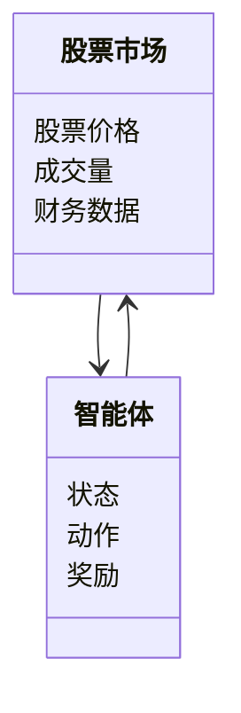
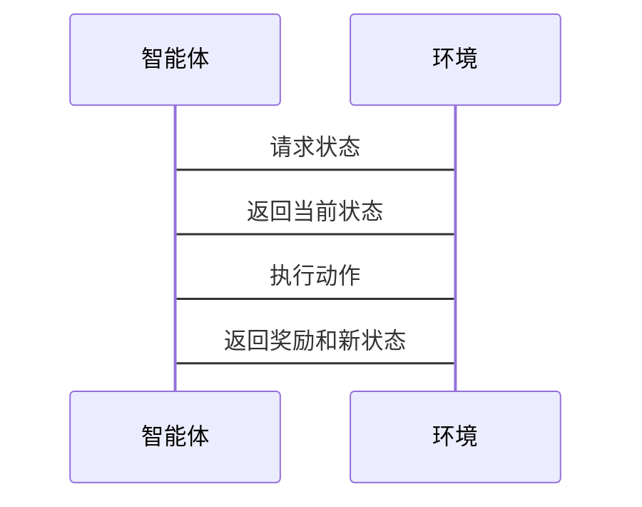

                 


# 多智能体强化学习在股票市场价值发现中的应用

> 关键词：多智能体强化学习，股票市场，价值发现，算法原理，系统设计，项目实战

> 摘要：本文系统地探讨了多智能体强化学习在股票市场价值发现中的应用。首先，文章介绍了多智能体强化学习的基本概念和股票市场价值发现的定义与挑战。然后，详细讲解了多智能体强化学习的核心原理，包括其基本框架、关键算法以及与传统强化学习的对比。接着，分析了多智能体强化学习在股票市场中的具体应用，如策略设计和风险管理。最后，通过一个完整的项目实战，展示了如何利用多智能体强化学习系统来实现股票市场价值发现，并给出了系统的数学模型、算法实现和最佳实践建议。

---

## 第1章: 多智能体强化学习与股票市场价值发现概述

### 1.1 多智能体强化学习的基本概念

#### 1.1.1 多智能体强化学习的定义
多智能体强化学习（Multi-Agent Reinforcement Learning, MARL）是指多个智能体在同一个环境中通过相互协作或竞争，以最大化各自或整体的累积奖励的过程。与传统单智能体强化学习不同，MARL涉及多个智能体之间的交互，每个智能体可以独立学习并做出决策。

#### 1.1.2 多智能体强化学习的核心特点
- **多智能体协作**：多个智能体通过协作完成复杂任务。
- **异构性**：智能体可以有不同的目标、策略和角色。
- **分布式学习**：智能体在分布式环境中独立学习，但通过交互影响彼此的决策。
- **复杂性高**：多个智能体之间的交互增加了问题的复杂性。

#### 1.1.3 多智能体强化学习与传统强化学习的区别
| 对比维度 | 单智能体强化学习 | 多智能体强化学习 |
|----------|------------------|------------------|
| 智能体数量 | 1                | ≥2               |
| 交互方式  | 无               | 协作或竞争        |
| 学习难度  | 较低             | 较高             |

### 1.2 股票市场价值发现的定义与挑战

#### 1.2.1 股票市场价值发现的定义
股票市场价值发现是指通过分析市场信息，识别出被市场低估或高估的股票，从而为投资者提供投资决策的依据。价值发现的核心在于识别市场的非理性波动和挖掘潜在的投资机会。

#### 1.2.2 股票市场价值发现的核心要素
- **市场信息**：包括股价、成交量、财务数据等。
- **市场情绪**：投资者的心理和行为对市场的影响。
- **市场结构**：市场的参与者、交易规则等。

#### 1.2.3 股票市场价值发现的常见挑战
- **信息不对称**：市场参与者掌握的信息不一致。
- **市场波动**：股票价格受多种因素影响，具有不确定性。
- **计算复杂性**：需要处理海量数据和复杂关系。

### 1.3 多智能体强化学习在股票市场中的应用前景

#### 1.3.1 多智能体强化学习在股票市场的优势
- **分布式决策**：多个智能体可以分别关注不同的市场信息，提高决策效率。
- **协同优化**：通过协作，智能体可以共同优化投资策略。
- **适应性高**：能够适应市场的动态变化。

#### 1.3.2 多智能体强化学习在股票市场中的典型应用场景
- **协同投资**：多个智能体协作完成投资组合优化。
- **风险控制**：通过协作降低投资风险。
- **市场预测**：利用多智能体的协同预测市场趋势。

#### 1.3.3 多智能体强化学习在股票市场中的未来发展趋势
- **智能化**：进一步提升智能体的自主决策能力。
- **分布式计算**：利用分布式计算技术提高处理效率。
- **人机协作**：结合人类专家的判断，提升投资效果。

### 1.4 本章小结
本章介绍了多智能体强化学习的基本概念和股票市场价值发现的核心要素，分析了两者在股票市场中的结合应用，为后续章节的深入探讨奠定了基础。

---

## 第2章: 多智能体强化学习的核心原理

### 2.1 多智能体强化学习的基本框架

#### 2.1.1 多智能体系统的组成
- **环境（Environment）**：市场环境，包括股票价格、成交量等。
- **智能体（Agent）**：独立决策的智能体，每个智能体负责不同的任务。
- **交互（Interaction）**：智能体与环境之间的信息交换。

#### 2.1.2 多智能体强化学习的基本流程
1. **状态感知**：智能体感知当前环境状态。
2. **决策制定**：智能体基于状态信息做出决策。
3. **动作执行**：智能体执行决策动作。
4. **奖励反馈**：环境给予智能体奖励或惩罚。
5. **策略优化**：智能体根据奖励调整策略。

#### 2.1.3 多智能体强化学习的挑战与解决方案
- **协调问题**：智能体之间需要协调以避免冲突。
- **信息共享**：如何高效地共享信息是关键。
- **计算效率**：多智能体系统需要高效的计算能力。

### 2.2 多智能体强化学习的关键算法

#### 2.2.1 Q-learning算法
Q-learning是一种经典的强化学习算法，适用于单智能体。其核心是通过Q值表记录状态-动作对的期望奖励。

#### 2.2.2 多智能体DQN算法
多智能体DQN（Deep Q-Network）扩展了单智能体DQN，适用于多个智能体协作的场景。每个智能体维护自己的Q值网络。

#### 2.2.3 其他典型算法介绍
- **VAN（Value-based Actor-Critic）**：基于价值的Actor-Critic算法。
- **MA2C（Multi-Agent Actor-Critic）**：多智能体Actor-Critic算法。

### 2.3 多智能体强化学习与传统强化学习的对比

#### 2.3.1 算法目标的差异
- 单智能体：最大化个体奖励。
- 多智能体：最大化整体或个体奖励。

#### 2.3.2 算法实现的差异
- 单智能体：单一决策过程。
- 多智能体：分布式决策过程。

#### 2.3.3 算法效果的对比分析
- 单智能体：简单但可能无法处理复杂场景。
- 多智能体：能够处理复杂场景，但实现难度大。

### 2.4 本章小结
本章详细讲解了多智能体强化学习的核心原理，分析了典型算法及其在股票市场中的应用潜力。

---

## 第3章: 股票市场价值发现中的强化学习应用

### 3.1 股票市场价值发现的基本原理

#### 3.1.1 股票市场价值的定义与计算
股票价值通常基于公司的基本面和市场情绪进行评估。常见的价值指标包括市盈率（P/E）、市净率（P/B）等。

#### 3.1.2 股票市场价值发现的关键因素
- **公司基本面**：收入、利润、资产负债情况。
- **市场情绪**：投资者的心理和行为。
- **市场趋势**：历史价格走势。

#### 3.1.3 股票市场价值发现的常见方法
- **基本面分析**：分析公司的财务数据。
- **技术分析**：分析股票价格走势。
- **情绪分析**：分析市场情绪。

### 3.2 强化学习在股票市场中的应用

#### 3.2.1 强化学习在股票交易中的典型应用
- **自动交易系统**：利用强化学习算法进行自动交易。
- **风险管理**：通过强化学习优化风险控制策略。

#### 3.2.2 多智能体强化学习在股票市场中的优势
- **协作能力**：多个智能体可以分别关注不同的市场信息。
- **适应性**：能够快速适应市场的变化。

#### 3.2.3 多智能体强化学习在股票市场中的实际案例
- **协同投资**：多个智能体协作完成投资组合优化。
- **市场预测**：利用多智能体协同预测市场趋势。

### 3.3 多智能体强化学习在股票市场价值发现中的具体应用

#### 3.3.1 多智能体强化学习在股票市场中的策略设计
- **分散投资**：多个智能体分别投资不同的股票。
- **风险分散**：通过协作降低投资风险。

#### 3.3.2 多智能体强化学习在股票市场中的协同优化
- **策略优化**：通过协作优化投资策略。
- **风险管理**：通过协作降低投资风险。

#### 3.3.3 多智能体强化学习在股票市场中的风险管理
- **风险预警**：通过智能体的协作，及时发现市场风险。
- **风险控制**：通过智能体的协作，制定有效的风险管理策略。

### 3.4 本章小结
本章分析了多智能体强化学习在股票市场价值发现中的具体应用，探讨了其在策略设计、协同优化和风险管理中的作用。

---

## 第4章: 多智能体强化学习的数学模型与算法实现

### 4.1 多智能体强化学习的数学模型

#### 4.1.1 状态空间的定义与表示
状态空间表示智能体所处的环境状态，例如股票价格、成交量等。

#### 4.1.2 动作空间的定义与表示
动作空间表示智能体可以执行的动作，例如买入、卖出、持有等。

#### 4.1.3 奖励函数的定义与表示
奖励函数定义智能体在执行动作后的奖励或惩罚，例如利润增加给予奖励，亏损给予惩罚。

#### 4.1.4 转移概率模型的定义与表示
转移概率模型描述智能体动作导致的状态转移概率。

#### 4.1.5 Q值函数的定义与表示
Q值函数表示状态-动作对的期望奖励。

### 4.2 多智能体强化学习的关键算法实现

#### 4.2.1 Q-learning算法的实现
Q-learning算法通过不断更新Q值表，找到最优策略。

#### 4.2.2 多智能体DQN算法的实现
多智能体DQN算法通过分布式Q值网络，实现多个智能体的协同学习。

#### 4.2.3 其他算法的实现
- **VAN算法**：基于价值的Actor-Critic算法。
- **MA2C算法**：多智能体Actor-Critic算法。

### 4.3 本章小结
本章详细讲解了多智能体强化学习的数学模型与算法实现，为后续章节的系统设计奠定了基础。

---

## 第5章: 多智能体强化学习系统应用于股票市场价值发现的方案设计

### 5.1 问题场景介绍

#### 5.1.1 问题背景
股票市场中的价值发现需要处理海量数据和复杂关系。

#### 5.1.2 问题目标
通过多智能体强化学习，实现股票市场价值发现。

#### 5.1.3 问题约束
- 数据量大。
- 市场波动剧烈。
- 计算资源有限。

### 5.2 系统功能设计

#### 5.2.1 领域模型（Mermaid 类图）


#### 5.2.2 系统架构设计（Mermaid 架构图）


#### 5.2.3 系统接口设计
- 数据接口：从数据源获取股票数据。
- 智能体接口：智能体与环境交互的接口。
- 策略接口：策略优化模块的接口。

#### 5.2.4 系统交互流程（Mermaid 序列图）


### 5.3 本章小结
本章设计了多智能体强化学习系统应用于股票市场价值发现的方案，包括系统架构、功能模块和交互流程。

---

## 第6章: 多智能体强化学习在股票市场价值发现中的项目实战

### 6.1 环境安装

#### 6.1.1 安装Python环境
安装Python 3.8以上版本。

#### 6.1.2 安装依赖库
安装numpy、pandas、keras、tensorflow等库。

#### 6.1.3 数据集准备
准备股票历史数据，包括股票价格、成交量等。

### 6.2 系统核心实现源代码

#### 6.2.1 智能体类
```python
class Agent:
    def __init__(self, state_dim, action_dim):
        self.state_dim = state_dim
        self.action_dim = action_dim
        # 初始化Q值网络
        self.q_network = self.build_network()

    def build_network(self):
        # 定义神经网络结构
        pass

    def act(self, state):
        # 根据状态选择动作
        pass

    def update(self, state, action, reward, next_state):
        # 更新Q值网络
        pass
```

#### 6.2.2 多智能体类
```python
class MultiAgentSystem:
    def __init__(self, num_agents, state_dim, action_dim):
        self.num_agents = num_agents
        self.state_dim = state_dim
        self.action_dim = action_dim
        self.agents = [Agent(state_dim, action_dim) for _ in range(num_agents)]

    def step(self, state):
        # 所有智能体执行动作
        actions = [agent.act(state) for agent in self.agents]
        # 所有智能体更新Q值网络
        for agent in self.agents:
            agent.update(state, action, reward, next_state)
```

#### 6.2.3 训练过程
```python
def train():
    # 初始化多智能体系统
    system = MultiAgentSystem(num_agents=5, state_dim=5, action_dim=3)
    # 训练循环
    for episode in range(num_episodes):
        state = get_initial_state()
        while not episode_done:
            actions = system.step(state)
            next_state = get_next_state(state, actions)
            rewards = get_rewards(state, actions)
            system.update(rewards)
            state = next_state
```

### 6.3 代码应用解读与分析
- **智能体类**：定义了单个智能体的行为和学习机制。
- **多智能体类**：管理多个智能体的协作与交互。
- **训练过程**：定义了整个系统的训练流程。

#### 6.3.1 代码实现细节
- **神经网络结构**：使用深度神经网络进行状态-动作价值评估。
- **奖励机制**：根据智能体的投资收益给予奖励或惩罚。

#### 6.3.2 算法的数学模型
智能体的Q值更新公式：
$$ Q(s, a) = Q(s, a) + \alpha (r + \gamma \max Q(s', a') - Q(s, a)) $$

#### 6.3.3 代码实现的注意事项
- **数据预处理**：对股票数据进行标准化处理。
- **模型训练**：设置合适的训练参数，如学习率、折扣因子等。
- **性能优化**：使用并行计算加速训练过程。

### 6.4 实际案例分析与详细讲解

#### 6.4.1 案例背景
假设我们有一个包含5只股票的组合，每个智能体负责一只股票。

#### 6.4.2 案例分析
- **智能体分配**：每个智能体负责一只股票的交易决策。
- **协同优化**：通过协作优化投资组合。
- **风险管理**：通过协作降低投资风险。

#### 6.4.3 代码实现的具体步骤
1. **数据采集**：从数据源获取5只股票的历史数据。
2. **系统初始化**：初始化5个智能体，每个智能体负责一只股票。
3. **训练过程**：智能体通过强化学习优化各自的交易策略。
4. **测试与验证**：在测试数据上验证系统的性能。

### 6.5 项目小结
本章通过一个具体的项目实战，展示了如何利用多智能体强化学习实现股票市场价值发现，包括环境安装、代码实现、案例分析和项目总结。

---

## 第7章: 多智能体强化学习在股票市场价值发现中的最佳实践

### 7.1 总结

#### 7.1.1 核心知识点回顾
- 多智能体强化学习的基本概念。
- 股票市场价值发现的核心要素。
- 多智能体强化学习的数学模型与算法实现。

#### 7.1.2 系统设计与实现
- 系统架构设计。
- 系统功能模块。
- 系统交互流程。

### 7.2 注意事项

#### 7.2.1 数据预处理
- 数据清洗：处理缺失值、异常值。
- 数据标准化：对数据进行标准化或归一化处理。

#### 7.2.2 模型调参
- 学习率：调整学习率以优化训练效果。
- 阶数折扣因子：调整折扣因子以平衡当前奖励和未来奖励。

#### 7.2.3 风险管理
- 风险预警：及时发现潜在风险。
- 风险控制：制定有效的风险管理策略。

### 7.3 未来趋势

#### 7.3.1 技术进步
- 算法优化：进一步优化多智能体强化学习算法。
- 计算能力提升：利用更强大的计算能力处理更复杂的任务。

#### 7.3.2 应用扩展
- 更多金融场景：将多智能体强化学习应用于更多金融场景。
- 全球化市场：扩展到全球化市场，考虑更多的市场因素。

#### 7.3.3 人机协作
- 结合人类专家判断：结合人类专家的判断，提升投资效果。
- 人机协作优化：优化人机协作的模式和方法。

### 7.4 拓展阅读
推荐相关领域的书籍和论文，供读者进一步学习和研究。

### 7.5 本章小结
本章总结了全文的主要内容，提出了应用中的注意事项，展望了未来的发展趋势，并给出了最佳实践建议。

---

## 作者：AI天才研究院/AI Genius Institute & 禅与计算机程序设计艺术/Zen And The Art of Computer Programming

---

**感谢您的耐心阅读！**

