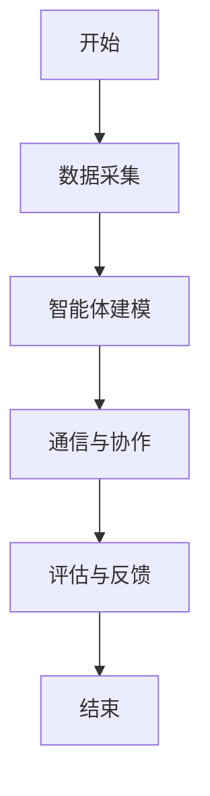
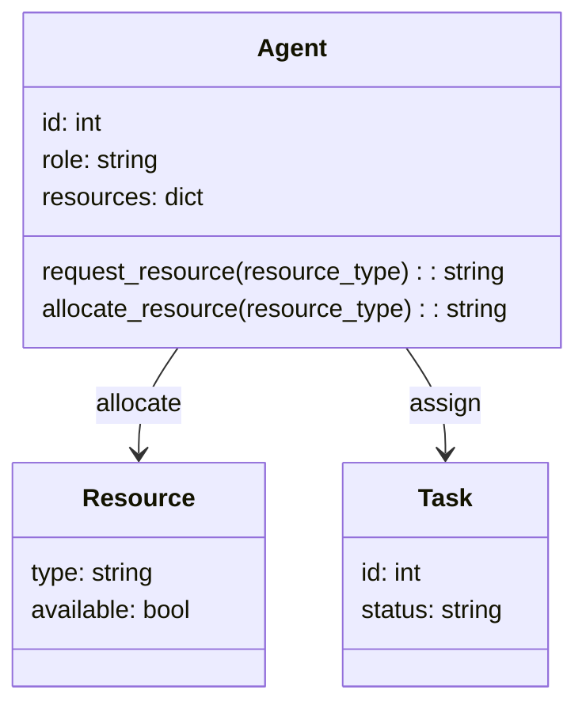

                 


# 多智能体系统在公司创新生态系统评估中的应用

## 关键词：多智能体系统, 公司创新生态系统, 系统评估, 人工智能, 创新管理

## 摘要：  
本文探讨了多智能体系统在公司创新生态系统评估中的应用，从背景、原理、算法、系统设计到实际案例，详细分析了多智能体系统如何助力公司创新管理。通过理论与实践结合，展示了如何利用多智能体技术优化创新资源分配、提升协作效率，并实现创新绩效的智能化评估。

---

# 第一部分: 多智能体系统与公司创新生态系统概述

## 第1章: 多智能体系统的基本概念

### 1.1 多智能体系统的定义与特点

#### 1.1.1 多智能体系统的定义  
多智能体系统（Multi-Agent System, MAS）是由多个智能体组成的分布式系统，每个智能体能够独立感知环境、自主决策并与其他智能体协作完成任务。智能体之间通过通信和协商，实现信息共享与协同行动。

#### 1.1.2 多智能体系统的核心特点  
1. **分布式智能**：多个智能体协同工作，而非单一中心节点控制。  
2. **自主性**：每个智能体具有自主决策能力。  
3. **反应性**：智能体能够实时感知环境变化并做出响应。  
4. **协作性**：智能体之间通过通信与协作完成共同目标。  
5. **动态性**：系统环境和智能体状态具有动态变化特性。

#### 1.1.3 多智能体系统与传统单智能体系统的区别  
| 特性            | 单智能体系统               | 多智能体系统               |
|-----------------|--------------------------|--------------------------|
| 结构            | 单一中心节点               | 分布式多节点               |
| 智能分布        | 集中式智能                 | 分散式智能                 |
| 协作方式        | 单一决策主体               | 多主体协作                 |
| 系统复杂度      | 较低                      | 较高                      |

### 1.2 公司创新生态系统的基本概念

#### 1.2.1 创新生态系统的定义  
公司创新生态系统是指由公司内部的团队、部门、项目以及外部合作伙伴（如供应商、客户、研究机构等）共同构成的复杂系统，旨在通过协同创新实现公司整体的创新能力提升。

#### 1.2.2 创新生态系统的构成要素  
1. **创新主体**：包括研发团队、产品团队、市场团队等。  
2. **创新资源**：如资金、技术、数据、人才等。  
3. **创新过程**：包括需求分析、研发、测试、商业化等阶段。  
4. **创新环境**：包括公司文化、制度、激励机制等。  

#### 1.2.3 创新生态系统的特点与优势  
| 特性            | 描述                      |
|-----------------|--------------------------|
| 多元性           | 包括多种创新主体与资源     |
| 协同性           | 各主体协作完成创新目标     |
| 动态性           | 创新过程具有动态变化特性   |
| 可扩展性         | 系统可扩展性强             |

---

## 第2章: 多智能体系统在公司创新生态系统中的作用

### 2.1 多智能体系统在公司创新生态系统中的应用背景

#### 2.1.1 当前公司创新管理的挑战  
1. **资源分配问题**：如何高效分配创新资源是关键。  
2. **协作效率问题**：部门间协作效率低下，影响创新速度。  
3. **动态变化问题**：创新过程中的需求和技术变化快。  

#### 2.1.2 多智能体系统在创新管理中的优势  
1. **分布式决策**：智能体能够自主决策，减少对中心节点的依赖。  
2. **动态适应性**：智能体能够实时响应环境变化，适应创新过程的动态需求。  
3. **协作能力强**：智能体之间能够高效协作，提升整体创新效率。  

#### 2.1.3 多智能体系统与公司创新生态系统结合的意义  
通过多智能体系统的引入，可以实现公司创新生态系统的智能化管理，提升创新资源的利用效率，优化创新过程，加速创新成果的产出。

### 2.2 多智能体系统在公司创新生态系统中的具体应用

#### 2.2.1 创新资源的优化配置  
多智能体系统可以根据实时需求和资源状态，动态分配创新资源，例如将研发团队分配到最需要技术支持的项目中。

#### 2.2.2 创新过程的协同管理  
智能体可以监控创新过程中的各个阶段，实时反馈进展，并协调各团队的工作，确保创新过程的顺利推进。

#### 2.2.3 创新绩效的评估与反馈  
通过多智能体系统的数据收集与分析功能，可以对创新项目的绩效进行量化评估，并为后续创新活动提供数据支持。

---

# 第二部分: 多智能体系统与创新生态系统的核心概念与联系

## 第3章: 多智能体系统的原理与实现

### 3.1 多智能体系统的原理

#### 3.1.1 分布式智能的基本原理  
多智能体系统通过多个智能体的协作，实现整体智能。每个智能体都有自己的目标和行为规则，通过通信和协商完成共同任务。

#### 3.1.2 多智能体系统的通信机制  
智能体之间通过消息传递进行通信，消息内容包括请求、响应、通知等类型。

#### 3.1.3 多智能体系统的协调与决策  
通过协商算法（如协商协议、拍卖算法等），智能体可以达成一致，完成任务分配和协作。

### 3.2 多智能体系统与创新生态系统的关系

#### 3.2.1 创新生态系统的动态性与多智能体系统的适应性  
创新生态系统具有动态变化的特点，多智能体系统通过分布式智能和动态适应性，能够有效应对这种变化。

#### 3.2.2 多智能体系统的协作机制与创新生态系统的协同创新  
多智能体系统的协作机制可以应用于创新生态系统的协同创新，例如团队间的协作、资源的共享等。

#### 3.2.3 多智能体系统的数据驱动与创新生态系统的数据支持  
多智能体系统通过数据驱动的方式进行决策，而创新生态系统需要实时数据支持，两者可以有机结合，实现高效创新管理。

---

## 第4章: 多智能体系统在创新生态系统评估中的算法原理

### 4.1 多智能体系统评估算法的流程

#### 4.1.1 算法流程概述  
1. 数据采集：收集创新生态系统中的各项数据，包括资源、团队、项目等。  
2. 智能体建模：为每个智能体建立行为模型。  
3. 通信与协作：智能体之间通过通信完成协作任务。  
4. 评估与反馈：根据任务完成情况，评估智能体的性能并提供反馈。  

#### 4.1.2 算法流程图  


### 4.2 多智能体系统评估算法的实现

#### 4.2.1 算法代码示例  
```python
class Agent:
    def __init__(self, id, role):
        self.id = id
        self.role = role
        self.resources = {}

    def request_resource(self, resource_type):
        # 发送请求
        message = f"Request {resource_type}"
        return message

    def allocate_resource(self, resource_type):
        # 分配资源
        self.resources[resource_type] = True
        return f"Allocated {resource_type}"

# 示例用法
agent1 = Agent(1, "研发团队")
agent2 = Agent(2, "产品团队")
message = agent1.request_resource("开发资源")
response = agent2.allocate_resource("开发资源")
print(response)
```

#### 4.2.2 算法的数学模型  
多智能体系统的评估可以基于以下数学模型：  
$$ \text{绩效评估} = \sum_{i=1}^{n} (\text{任务完成度}_i \times \text{协作效率}_i) $$  
其中，$$n$$为智能体的数量，$$\text{任务完成度}$$和$$\text{协作效率}$$分别表示智能体完成任务的效率和协作的紧密程度。

---

## 第5章: 多智能体系统在创新生态系统评估中的系统设计

### 5.1 系统分析与需求分析

#### 5.1.1 问题场景介绍  
公司创新生态系统中的创新资源分配不均、协作效率低下等问题亟待解决。  

#### 5.1.2 系统目标  
通过多智能体系统实现创新资源的动态分配、创新过程的协同管理和创新绩效的智能化评估。

### 5.2 系统功能设计

#### 5.2.1 系统功能模块  
1. **资源管理模块**：负责资源的分配与监控。  
2. **协作管理模块**：协调各智能体的协作任务。  
3. **评估反馈模块**：对创新绩效进行评估并提供反馈。  

#### 5.2.2 系统功能设计类图  


### 5.3 系统架构设计

#### 5.3.1 系统架构图  


#### 5.3.2 接口设计  
1. **资源分配接口**：实现资源的动态分配。  
2. **任务分配接口**：实现任务的动态分配。  
3. **数据接口**：实现数据的采集与传输。  

#### 5.3.3 交互序列图  
```mermaid
sequenceDiagram
    participant A: 研发团队智能体
    participant B: 产品团队智能体
    participant C: 资源管理模块
    A -> C: 请求开发资源
    C -> B: 分配开发资源
    B -> C: 确认资源分配
    C -> A: 资源分配完成
```

---

## 第6章: 项目实战

### 6.1 环境安装与配置

#### 6.1.1 环境要求  
1. Python 3.8及以上版本  
2. Mermaid工具或支持mermaid语法的文本编辑器  

#### 6.1.2 安装依赖  
安装必要的库，如`graphviz`，用于生成mermaid图表。  

### 6.2 系统核心实现

#### 6.2.1 核心代码实现  
```python
def main():
    import random
    class Agent:
        def __init__(self, id, role):
            self.id = id
            self.role = role
            self.resources = {}

        def request_resource(self, resource_type):
            return f"Agent {self.id} requests {resource_type}"

        def allocate_resource(self, resource_type):
            self.resources[resource_type] = True
            return f"Agent {self.id} allocated {resource_type}"

    # 初始化智能体
    agent1 = Agent(1, "研发团队")
    agent2 = Agent(2, "产品团队")
    agent3 = Agent(3, "市场团队")

    # 模拟资源分配
    resource_type = "开发资源"
    request_message = agent1.request_resource(resource_type)
    print(request_message)
    allocate_message = agent2.allocate_resource(resource_type)
    print(allocate_message)

    # 模拟任务分配
    task = "产品开发"
    agent3.allocate_resource(task)
    print(f"Agent {agent3.id} allocated task: {task}")

if __name__ == "__main__":
    main()
```

#### 6.2.2 代码解读  
1. **Agent类**：定义智能体的基本属性和行为方法。  
2. **资源分配逻辑**：通过智能体之间的通信完成资源分配。  
3. **任务分配逻辑**：智能体根据任务需求分配资源并执行任务。  

### 6.3 案例分析与详细解读

#### 6.3.1 案例背景  
某公司需要优化其创新生态系统中的资源分配和协作效率，引入多智能体系统进行管理。

#### 6.3.2 案例分析  
通过上述代码实现的多智能体系统，能够实时分配开发资源，并协调各团队的任务执行，提升创新效率。

#### 6.3.3 实际效果  
1. **资源分配效率提升**：资源分配时间缩短，减少资源浪费。  
2. **协作效率提高**：团队间协作更加高效，创新过程更加顺畅。  
3. **创新绩效显著**：创新成果的产出速度和质量均有所提升。  

### 6.4 项目小结  
通过本项目，我们验证了多智能体系统在公司创新生态系统评估中的有效性，展示了其在资源分配、协作管理等方面的优势。

---

# 第三部分: 总结与展望

## 第7章: 总结与展望

### 7.1 最佳实践 Tips

1. **明确目标**：在引入多智能体系统前，明确创新管理的目标和需求。  
2. **数据准备**：确保系统的数据支持，包括资源、团队、项目等信息。  
3. **系统维护**：定期优化系统，适应公司创新管理的变化需求。  

### 7.2 小结  
本文详细探讨了多智能体系统在公司创新生态系统评估中的应用，从理论到实践，展示了其在创新资源管理、协作优化和绩效评估中的重要作用。

### 7.3 注意事项

1. **数据隐私**：在实际应用中，需注意数据隐私和安全问题。  
2. **系统兼容性**：确保多智能体系统与公司现有系统兼容。  
3. **用户培训**：对相关人员进行培训，确保系统顺利应用。  

### 7.4 未来研究方向

1. **多智能体系统的可扩展性研究**：探索如何在更大规模的公司创新生态系统中应用多智能体系统。  
2. **智能体协同算法优化**：研究更高效的智能体协同算法，提升系统性能。  
3. **创新生态系统动态适应性研究**：探索多智能体系统在动态变化的创新生态系统中的适应性。

---

# 作者：AI天才研究院/AI Genius Institute & 禅与计算机程序设计艺术 /Zen And The Art of Computer Programming

---

以上是《多智能体系统在公司创新生态系统评估中的应用》的技术博客文章的完整目录和内容框架，涵盖从基础概念到实际应用的各个方面，结构清晰，内容详实，适合对多智能体系统和创新管理感兴趣的读者阅读和研究。

