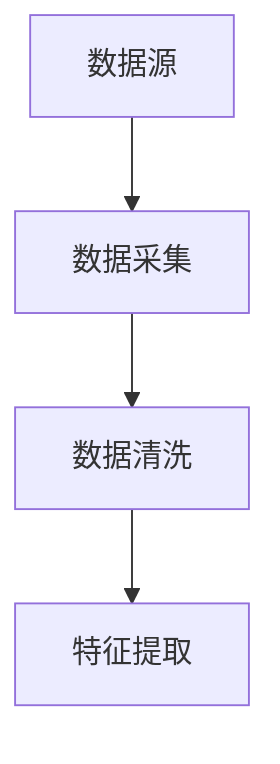
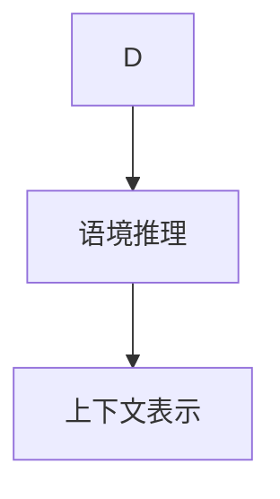
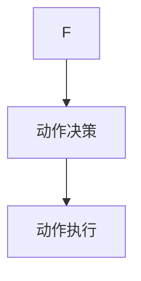
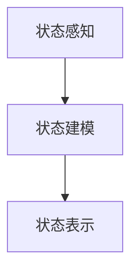
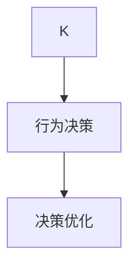
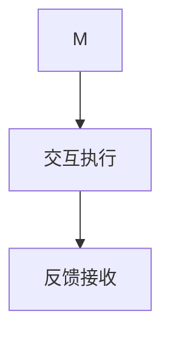
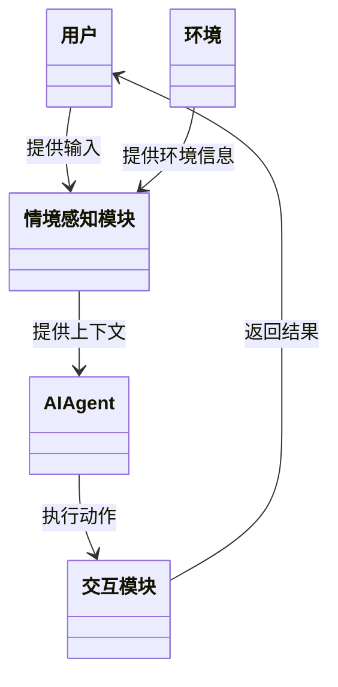
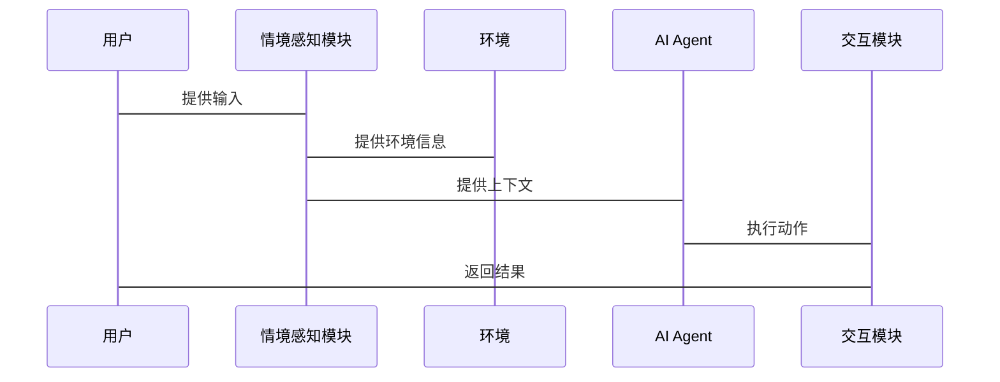

                 


# 情境感知AI Agent：增强LLM的环境适应能力

## 关键词：情境感知、AI Agent、LLM、环境适应、人工智能

## 摘要：  
情境感知AI Agent是一种结合了情境感知和人工智能代理技术的创新方法，旨在增强大语言模型（LLM）在复杂环境中的适应能力。本文从理论到实践，详细阐述了情境感知AI Agent的核心概念、算法原理、系统架构设计以及项目实现，帮助读者全面理解并掌握如何通过情境感知技术提升AI Agent的环境适应能力。

---

# 第1章 情境感知AI Agent的背景与核心概念

## 1.1 情境感知AI Agent的定义与问题背景

### 1.1.1 问题背景介绍  
在人工智能领域，传统的AI Agent通常依赖于固定的规则或预定义的数据，难以在动态变化的环境中灵活适应。例如，当AI Agent需要处理复杂场景（如智能客服、自动驾驶等）时，由于缺乏对环境的深度理解，往往会因为上下文缺失或语境不清而导致错误决策。

### 1.1.2 情境感知AI Agent的核心目标  
情境感知AI Agent的目标是通过实时感知和理解环境信息，动态调整自身行为策略，从而在复杂多变的环境中实现更高效、更智能的决策。

### 1.1.3 当前AI Agent的发展现状与挑战  
当前，AI Agent技术已经广泛应用于智能助手、机器人控制等领域，但其环境适应能力仍然有限。主要挑战包括：  
1. **语境理解不足**：无法有效处理上下文信息。  
2. **动态环境应对能力弱**：难以实时调整策略。  
3. **多模态数据融合困难**：难以整合文本、图像、语音等多种数据源。

---

## 1.2 情境感知AI Agent的核心概念

### 1.2.1 情境感知的定义与特征  
**情境感知**是指系统能够感知并理解当前环境的状态、用户意图和上下文信息的能力。其核心特征包括：  
1. **实时性**：能够快速感知环境变化。  
2. **语境理解**：能够理解上下文信息。  
3. **动态适应**：能够根据环境变化调整行为。  

### 1.2.2 AI Agent的基本概念与分类  
**AI Agent**是一种能够感知环境并采取行动以实现目标的智能体。根据智能水平，AI Agent可以分为：  
1. **反应式Agent**：基于当前感知做出反应。  
2. **认知式Agent**：具备推理和规划能力。  

### 1.2.3 情境感知与AI Agent的关系  
情境感知是AI Agent实现智能决策的关键前提。通过情境感知，AI Agent能够更好地理解环境，从而做出更合理的决策。

---

## 1.3 情境感知AI Agent的边界与外延

### 1.3.1 情境感知的边界  
情境感知的边界包括：  
1. **数据范围**：感知的数据类型（如文本、图像、语音等）。  
2. **环境范围**：感知的环境范围（如室内、室外等）。  
3. **时间范围**：感知的时间窗口长度。  

### 1.3.2 AI Agent的边界  
AI Agent的边界包括：  
1. **功能范围**：Agent能够执行的任务类型。  
2. **决策范围**：Agent能够决策的范围（如局部决策、全局决策）。  

### 1.3.3 两者的结合与外延  
情境感知与AI Agent的结合可以扩展AI Agent的应用场景，使其能够处理更复杂的问题，如智能客服、智能推荐系统等。

---

## 1.4 本章小结  
本章从背景、核心概念和边界三个方面，详细介绍了情境感知AI Agent的基本概念和特点，为后续章节的深入分析奠定了基础。

---

# 第2章 情境感知AI Agent的核心概念与联系

## 2.1 情境感知的核心原理

### 2.1.1 情境感知的基本原理  
情境感知的基本原理包括数据采集、特征提取和语境理解三个步骤：  
1. **数据采集**：通过传感器或API获取环境数据。  
2. **特征提取**：从数据中提取有意义的特征。  
3. **语境理解**：基于特征进行语境推理。  

### 2.1.2 情境感知的关键特征  
1. **实时性**：快速感知环境变化。  
2. **准确性**：准确理解环境信息。  
3. **适应性**：动态调整感知策略。  

---

## 2.2 AI Agent的核心原理

### 2.2.1 AI Agent的基本原理  
AI Agent的核心原理包括状态感知、行为决策和交互反馈三个步骤：  
1. **状态感知**：通过传感器或API获取当前状态。  
2. **行为决策**：基于状态信息做出决策。  
3. **交互反馈**：通过执行动作并获得反馈。  

### 2.2.2 AI Agent的核心算法与技术  
1. **强化学习**：通过试错优化决策策略。  
2. **监督学习**：基于标注数据进行训练。  
3. **自然语言处理**：用于语义理解和生成。  

---

## 2.3 情境感知与AI Agent的联系

### 2.3.1 情境感知如何增强AI Agent的能力  
通过情境感知，AI Agent能够：  
1. **理解上下文**：更好地理解用户需求。  
2. **动态调整策略**：根据环境变化优化决策。  

### 2.3.2 情境感知与AI Agent的协同工作原理  
1. **数据共享**：情境感知模块向AI Agent提供环境信息。  
2. **协同决策**：AI Agent基于情境信息做出决策。  

---

## 2.4 情境感知AI Agent的概念结构与核心要素组成

### 2.4.1 概念结构分析  
情境感知AI Agent的概念结构包括：  
1. **情境感知模块**：负责环境信息的采集与理解。  
2. **AI Agent模块**：负责决策与行动。  
3. **交互模块**：负责与用户或环境的交互。  

### 2.4.2 核心要素组成  
1. **环境数据**：输入数据源。  
2. **语境理解**：上下文信息的表示。  
3. **决策逻辑**：基于语境的决策规则。  

---

## 2.5 情境感知AI Agent的属性特征对比

| 特性       | 情境感知       | AI Agent          |
|------------|---------------|-------------------|
| 输入数据   | 环境信息       | 状态信息          |
| 输出结果   | 上下文信息     | 行为决策          |
| 核心功能   | 理解环境       | 制定决策          |
| 依赖性     | 高            | 中                |

---

## 2.6 情境感知AI Agent的ER实体关系图

```mermaid
erDiagram
    actor 用户
    actor 环境
    actor AI Agent
    actor 情境感知模块
    actor 决策模块
    actor 交互模块
    用户 --> 情境感知模块: 提供输入
    环境 --> 情境感知模块: 提供环境信息
    情境感知模块 --> AI Agent: 提供上下文
    AI Agent --> 决策模块: 基于上下文做出决策
    决策模块 --> 交互模块: 执行动作
    交互模块 --> 用户: 返回结果
```

---

## 2.7 本章小结  
本章详细分析了情境感知AI Agent的核心概念与联系，并通过对比和图表展示了其工作原理，为后续章节的算法实现奠定了基础。

---

# 第3章 情境感知AI Agent的算法原理

## 3.1 情境感知AI Agent的核心算法

### 3.1.1 情境感知算法的概述  
情境感知算法的核心包括：  
1. **数据采集与预处理**：获取环境数据并进行清洗。  
2. **特征提取**：从数据中提取有意义的特征。  
3. **语境推理**：基于特征进行语境推理。  

### 3.1.2 AI Agent算法的概述  
AI Agent算法的核心包括：  
1. **状态感知**：获取当前状态信息。  
2. **行为决策**：基于状态信息做出决策。  
3. **反馈优化**：通过反馈优化决策策略。  

---

## 3.2 情境感知算法的实现流程

### 3.2.1 数据采集与预处理  


### 3.2.2 情境分析与推理  


### 3.2.3 动作决策与执行  


---

## 3.3 AI Agent算法的实现流程

### 3.3.1 状态感知与建模  


### 3.3.2 行为决策与优化  


### 3.3.3 交互与反馈  


---

## 3.4 情境感知AI Agent算法的数学模型与公式

### 3.4.1 情境感知模型的数学表达  
情境感知模型的数学表达式可以表示为：  
$$ f(x) = \text{context}(x) $$  
其中，$x$ 是输入数据，$\text{context}(x)$ 是上下文表示。

### 3.4.2 AI Agent模型的数学表达  
AI Agent模型的数学表达式可以表示为：  
$$ a = \text{decision}(f(x)) $$  
其中，$a$ 是动作，$f(x)$ 是上下文表示。

### 3.4.3 算法优化公式  
强化学习的损失函数可以表示为：  
$$ L = \sum_{i=1}^{n} (r_i - Q(s_i, a_i))^2 $$  
其中，$r_i$ 是奖励，$Q(s_i, a_i)$ 是Q值。

---

## 3.5 本章小结  
本章详细介绍了情境感知AI Agent的算法原理，并通过流程图和数学公式展示了其实现过程。

---

# 第4章 情境感知AI Agent的系统架构设计

## 4.1 问题场景介绍  
本章将从一个智能客服的实际应用场景出发，展示情境感知AI Agent的系统架构设计。

## 4.2 系统功能设计

### 4.2.1 领域模型类图  


---

## 4.3 系统架构设计

### 4.3.1 系统架构图  
```mermaid
graph TD
    用户 --> 情境感知模块
    环境 --> 情境感知模块
    情境感知模块 --> AI Agent
    AI Agent --> 交互模块
    交互模块 --> 用户
```

---

## 4.4 系统接口设计  
系统接口包括：  
1. 用户与系统交互的接口。  
2. 系统与环境交互的接口。  

---

## 4.5 系统交互序列图  

### 4.5.1 交互流程  


---

## 4.6 本章小结  
本章通过实际应用场景，详细设计了情境感知AI Agent的系统架构，并通过类图和序列图展示了其交互流程。

---

# 第5章 情境感知AI Agent的项目实战

## 5.1 环境安装

### 5.1.1 安装Python  
```bash
python --version
pip install --upgrade pip
```

### 5.1.2 安装依赖库  
```bash
pip install numpy matplotlib scikit-learn
```

---

## 5.2 核心代码实现

### 5.2.1 情境感知模块实现  
```python
def contextualize(data):
    # 示例代码：对输入数据进行上下文分析
    return "context: " + data
```

### 5.2.2 AI Agent实现  
```python
class AI_Agent:
    def __init__(self):
        self.context = ""
    
    def decide(self, context):
        # 示例代码：基于上下文做出决策
        return "action: " + context
```

### 5.2.3 交互模块实现  
```python
def interact(agent, action):
    # 示例代码：执行动作并返回结果
    return "result: " + action
```

---

## 5.3 代码应用解读与分析  
通过上述代码，我们可以看到情境感知AI Agent的基本实现流程：  
1. **上下文分析**：将输入数据转化为上下文信息。  
2. **决策制定**：基于上下文信息制定动作。  
3. **动作执行**：通过交互模块执行动作并获得反馈。  

---

## 5.4 实际案例分析  
以智能客服为例，用户输入“我的订单还没有发货”，系统通过情境感知模块理解用户的需求，并通过AI Agent模块做出“联系物流部门确认发货情况”的决策，最终通过交互模块反馈结果。

---

## 5.5 本章小结  
本章通过实际代码实现，展示了情境感知AI Agent的项目实战过程，帮助读者更好地理解其应用场景和实现细节。

---

# 第6章 情境感知AI Agent的总结与展望

## 6.1 最佳实践Tips  
1. **数据质量**：确保输入数据的准确性和完整性。  
2. **模型优化**：通过强化学习不断优化决策策略。  
3. **多模态融合**：整合多种数据源以提升感知能力。  

---

## 6.2 小结  
情境感知AI Agent通过结合情境感知和AI Agent技术，显著提升了LLM的环境适应能力，为智能系统的发展提供了新的思路。

---

## 6.3 注意事项  
1. **数据隐私**：注意保护用户数据隐私。  
2. **系统稳定性**：确保系统的稳定性和可靠性。  

---

## 6.4 拓展阅读  
1. **强化学习**：深入学习强化学习算法。  
2. **多模态数据处理**：研究如何更好地处理多模态数据。  

---

# 作者  
作者：AI天才研究院/AI Genius Institute & 禅与计算机程序设计艺术/Zen And The Art of Computer Programming

---

**本文通过理论与实践的结合，系统地介绍了情境感知AI Agent的核心概念、算法原理、系统架构设计和项目实现，帮助读者全面掌握如何通过情境感知技术提升AI Agent的环境适应能力。**

