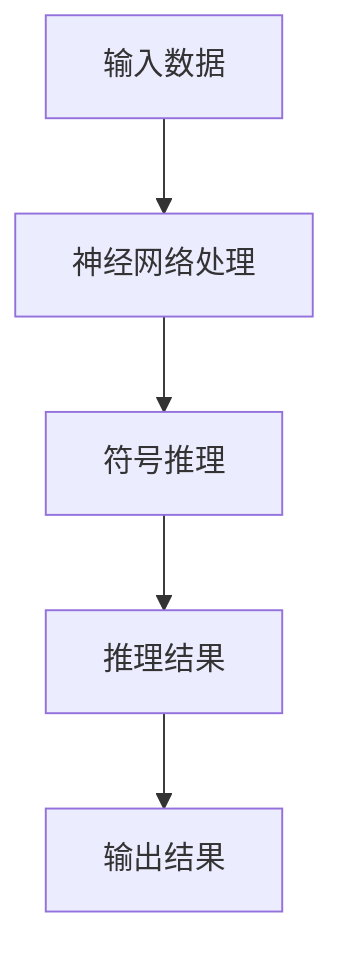
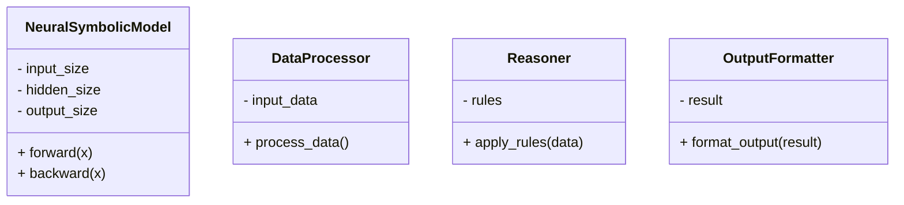
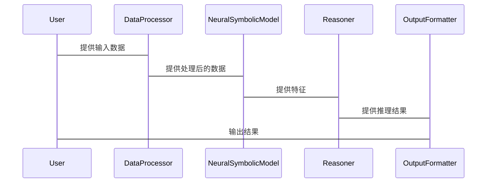

                 


# 神经符号推理：增强AI Agent的逻辑分析能力

> 关键词：神经符号推理，AI Agent，逻辑分析，符号逻辑，神经网络

> 摘要：神经符号推理是一种结合符号逻辑和神经网络的技术，旨在增强AI Agent的逻辑分析能力。本文从背景、核心概念、算法原理、系统设计、项目实战和应用展望等多方面详细探讨神经符号推理的理论与实践，帮助读者全面理解其原理和应用。

---

## 第一部分: 背景介绍

### 第1章: 神经符号推理概述

#### 1.1 神经符号推理的背景与问题背景
- 1.1.1 人工智能发展的现状与挑战
  - 当前AI技术在感知（如图像识别、语音识别）和简单决策任务中表现出色，但在复杂逻辑推理和符号化任务中仍存在明显局限性。
  - 例如，传统神经网络难以处理需要精确逻辑推理的任务，如法律文书分析、医疗诊断推理等。

- 1.1.2 符号逻辑推理的局限性
  - 符号逻辑推理（如基于规则的专家系统）在处理非结构化数据（如自然语言文本、图像）时表现较差。
  - 规则系统难以扩展和自适应，缺乏对复杂数据模式的学习能力。

- 1.1.3 神经网络的局限性与符号推理的互补性
  - 神经网络擅长处理非结构化数据，但缺乏逻辑推理能力。
  - 神经符号推理通过结合两者的优势，实现了对复杂数据的处理和逻辑推理的结合。

- 1.1.4 神经符号推理的定义与目标
  - 神经符号推理是一种结合符号逻辑和神经网络的技术，旨在通过神经网络处理非结构化数据，同时利用符号逻辑进行推理和决策。
  - 其目标是增强AI Agent的逻辑分析能力，使其能够处理复杂的符号化任务和非结构化数据。

#### 1.2 问题描述与解决思路
- 1.2.1 传统符号推理的局限性
  - 需要手动编写规则，难以应对复杂和动态变化的场景。
  - 缺乏对非结构化数据的处理能力，无法直接从数据中学习模式。

- 1.2.2 神经网络在非结构化数据处理中的优势
  - 神经网络能够从大量数据中学习特征，适用于图像、文本等非结构化数据的处理。
  - 但神经网络缺乏逻辑推理能力，无法进行符号化的推理任务。

- 1.2.3 神经符号推理的核心问题与解决思路
  - 核心问题：如何将符号逻辑与神经网络结合，使其能够处理复杂数据并进行逻辑推理。
  - 解决思路：通过神经网络提取特征，符号逻辑进行推理，结合两者的优势，构建混合推理模型。

#### 1.3 神经符号推理的边界与外延
- 1.3.1 神经符号推理的适用范围
  - 适用于需要处理非结构化数据并进行逻辑推理的任务，如自然语言理解、医疗诊断、法律分析等。

- 1.3.2 神经符号推理与其他技术的区分与联系
  - 区分：神经符号推理结合了符号逻辑和神经网络，与其他单一技术（如纯符号推理或纯神经网络）相比具有独特优势。
  - 联系：神经符号推理可以与其他技术（如强化学习、知识图谱）结合，形成更强大的AI系统。

- 1.3.3 神经符号推理的未来发展方向
  - 更高效的神经符号推理算法。
  - 更广泛的应用场景探索。
  - 与强化学习、知识图谱等技术的结合。

---

## 第二部分: 核心概念与联系

### 第2章: 神经符号推理的核心概念与原理

#### 2.1 神经符号推理的核心概念
- 2.1.1 符号逻辑与神经网络的结合
  - 符号逻辑：通过符号表示和规则进行推理，如命题逻辑、谓词逻辑。
  - 神经网络：通过深度学习模型处理非结构化数据。
  - 结合方式：符号逻辑指导神经网络的学习，神经网络增强符号推理的能力。

- 2.1.2 神经符号推理的基本原理
  - 神经符号推理通过符号逻辑对神经网络的输出进行解释和约束，同时利用神经网络对复杂数据的处理能力，实现逻辑推理和数据处理的结合。

- 2.1.3 神经符号推理的核心要素与组成
  - 神经网络模块：负责处理输入数据，提取特征。
  - 符号推理模块：基于符号逻辑对神经网络的输出进行推理和决策。
  - 综合模块：将两者结合，实现混合推理。

#### 2.2 神经符号推理的属性特征对比
- 2.2.1 符号逻辑与神经网络的特征对比

| 特征                | 符号逻辑             | 神经网络             |
|---------------------|----------------------|----------------------|
| 数据处理能力        | 结构化数据            | 非结构化数据          |
| 可解释性            | 高                  | 低                  |
| 自适应能力          | 低                  | 高                  |
| 计算效率            | 高                  | 低                  |
| 任务适用性          | 逻辑推理任务         | 图像识别、自然语言处理|

- 2.2.2 神经符号推理的优缺点分析
  - 优点：
    - 结合了符号逻辑的可解释性和神经网络的自适应性。
    - 能够处理复杂数据并进行逻辑推理。
  - 缺点：
    - 算法复杂，计算成本较高。
    - 现阶段技术仍不够成熟，应用场景有限。

- 2.2.3 神经符号推理与其他推理方法的对比
  - 对比方法：基于规则的推理、基于案例的推理、基于概率的推理。
  - 对比结果：神经符号推理在处理复杂数据和逻辑推理方面具有独特优势。

#### 2.3 神经符号推理的ER实体关系图
```mermaid
graph LR
A[符号逻辑] --> B[神经网络]
C[推理规则] --> B
D[输入数据] --> B
E[推理结果] <-- B
```

---

## 第三部分: 算法原理讲解

### 第3章: 神经符号推理的算法原理

#### 3.1 神经符号推理的算法流程
- 3.1.1 符号逻辑指导神经网络学习
  - 符号逻辑规则用于约束神经网络的学习目标。
  - 例如，规则“如果A，则B”可以转化为神经网络的损失函数约束。

- 3.1.2 神经网络增强符号推理
  - 神经网络用于处理非结构化数据，提取特征。
  - 特征作为符号推理的输入，进行逻辑推理。

- 3.1.3 神经符号推理的典型算法
  - 知识图谱嵌入（Knowledge Graph Embedding）：将符号知识嵌入到向量空间，结合神经网络进行推理。
  - 神经符号逻辑编程（Neural-symbolic Logic Programming）：将逻辑规则嵌入到神经网络中，实现端到端的推理。

- 3.1.4 神经符号推理的数学模型
  - 模型输入：非结构化数据（如文本、图像）。
  - 模型输出：符号化推理结果（如布尔值、类别）。

#### 3.2 神经符号推理的数学模型与公式
- 3.2.1 神经符号推理的损失函数
  $$ L = \lambda_1 L_{\text{CE}} + \lambda_2 L_{\text{KL}} $$
  - $$ L_{\text{CE}} $$：交叉熵损失，用于神经网络的分类任务。
  - $$ L_{\text{KL}} $$：KL散度，用于符号逻辑的约束。

- 3.2.2 神经符号推理的优化过程
  $$ \theta_{t+1} = \theta_t - \eta \nabla_{\theta} L $$
  - $$ \theta $$：模型参数。
  - $$ \eta $$：学习率。

#### 3.3 神经符号推理的算法实现
- 3.3.1 算法流程图


- 3.3.2 Python核心代码实现
  ```python
  import torch
  import torch.nn as nn
  import torch.optim as optim

  class NeuralSymbolicModel(nn.Module):
      def __init__(self, input_size, hidden_size, output_size):
          super(NeuralSymbolicModel, self).__init__()
          self.fc1 = nn.Linear(input_size, hidden_size)
          self.fc2 = nn.Linear(hidden_size, output_size)
          self.relu = nn.ReLU()
          self.sigmoid = nn.Sigmoid()

      def forward(self, x):
          x = self.fc1(x)
          x = self.relu(x)
          x = self.fc2(x)
          x = self.sigmoid(x)
          return x

  # 初始化模型和优化器
  model = NeuralSymbolicModel(input_size, hidden_size, output_size)
  optimizer = optim.Adam(model.parameters(), lr=0.001)
  criterion = nn.BCELoss()

  # 训练循环
  for epoch in range(num_epochs):
      for inputs, labels in dataloader:
          outputs = model(inputs)
          loss = criterion(outputs, labels)
          loss.backward()
          optimizer.step()
          optimizer.zero_grad()
  ```

- 3.3.3 算法数学模型和公式解读
  - 损失函数：$$ L = \text{BCE}(y_{\text{pred}}, y_{\text{true}}) $$
  - 优化器：Adam优化器，参数更新公式为：
    $$ \theta_{t+1} = \theta_t - \eta \nabla_{\theta} L $$

---

## 第四部分: 系统分析与架构设计方案

### 第4章: 神经符号推理系统的分析与设计

#### 4.1 系统设计背景与目标
- 4.1.1 问题场景介绍
  - 一个需要处理复杂逻辑推理和非结构化数据的AI Agent系统。
  - 例如，医疗诊断系统需要结合症状、检查结果和诊断规则进行推理。

- 4.1.2 系统目标
  - 实现神经符号推理的核心功能。
  - 提供可扩展的系统架构，支持多种数据源和推理规则。

#### 4.2 系统功能设计
- 4.2.1 功能模块划分
  - 数据处理模块：接收输入数据，进行预处理。
  - 神经网络模块：处理数据，提取特征。
  - 符号推理模块：基于符号逻辑进行推理，生成结果。
  - 结果输出模块：将推理结果输出给用户或下游系统。

- 4.2.2 领域模型类图


- 4.2.3 系统架构设计
  - 分层架构：数据处理层、神经网络层、符号推理层、结果输出层。
  - 模块之间通过接口进行通信，确保系统的可扩展性和可维护性。

#### 4.3 系统交互设计
- 4.3.1 系统交互流程
  - 用户输入数据。
  - 数据处理模块对数据进行预处理。
  - 神经网络模块处理数据，提取特征。
  - 符号推理模块基于特征进行推理，生成结果。
  - 结果输出模块将结果格式化并输出。

- 4.3.2 系统交互序列图


---

## 第五部分: 项目实战

### 第5章: 神经符号推理的项目实战

#### 5.1 项目介绍
- 5.1.1 项目背景
  - 开发一个基于神经符号推理的医疗诊断系统。
  - 系统需要结合病人的症状、检查结果和医疗知识进行推理，给出诊断建议。

#### 5.2 环境安装与配置
- 5.2.1 环境要求
  - Python 3.8+
  - PyTorch 1.9+
  - transformers库（用于NLP任务）
  - scikit-learn（用于数据处理）

- 5.2.2 安装依赖
  ```bash
  pip install torch transformers scikit-learn
  ```

#### 5.3 核心代码实现
- 5.3.1 数据处理模块
  ```python
  from sklearn.feature_extraction.text import TfidfVectorizer

  class DataProcessor:
      def __init__(self):
          self.vectorizer = TfidfVectorizer()

      def process_data(self, texts):
          return self.vectorizer.fit_transform(texts).toarray()
  ```

- 5.3.2 神经网络模块
  ```python
  import torch
  import torch.nn as nn

  class MedicalDiagnosisModel(nn.Module):
      def __init__(self, input_size, hidden_size, output_size):
          super(MedicalDiagnosisModel, self).__init__()
          self.fc1 = nn.Linear(input_size, hidden_size)
          self.fc2 = nn.Linear(hidden_size, output_size)
          self.sigmoid = nn.Sigmoid()

      def forward(self, x):
          x = self.fc1(x)
          x = self.sigmoid(x)
          x = self.fc2(x)
          return x

  # 初始化模型
  input_size = 50  # 假设TF-IDF向量维度为50
  hidden_size = 20
  output_size = 5
  model = MedicalDiagnosisModel(input_size, hidden_size, output_size)
  ```

- 5.3.3 符号推理模块
  ```python
  from sklearn.metrics import accuracy_score

  class Reasoner:
      def __init__(self):
          self.rules = []

      def apply_rules(self, features, labels):
          # 假设labels是已知的诊断结果
          # features是神经网络的输出
          return accuracy_score(labels, features.argmax(axis=1))
  ```

- 5.3.4 系统交互与测试
  ```python
  # 处理数据
  texts = ["咳嗽，发热", "发热，胸痛", "咳嗽，咳痰"]
  processor = DataProcessor()
  features = processor.process_data(texts)

  # 神经网络推理
  model = MedicalDiagnosisModel(50, 20, 5)
  outputs = model(torch.FloatTensor(features))

  # 符号推理
  reasoner = Reasoner()
  accuracy = reasoner.apply_rules(outputs.detach().numpy(), labels)
  ```

#### 5.4 实际案例分析
- 5.4.1 案例背景
  - 病人症状：咳嗽、发热。
  - 检查结果：血常规、胸片。

- 5.4.2 系统处理流程
  1. 数据处理模块将症状和检查结果转化为向量。
  2. 神经网络模块处理向量，生成特征。
  3. 符号推理模块基于特征和医疗知识进行推理，生成诊断结果。

- 5.4.3 系统输出结果
  - 诊断结果：肺炎。
  - 推理过程：症状符合肺炎的表现，检查结果支持诊断。

#### 5.5 项目总结与优化建议
- 5.5.1 项目小结
  - 成功实现了神经符号推理的医疗诊断系统。
  - 系统在处理复杂症状和检查结果时表现出色。

- 5.5.2 优化建议
  - 增加更多的医疗知识规则。
  - 提升神经网络的特征提取能力。
  - 优化符号推理模块的推理效率。

---

## 第六部分: 应用与展望

### 第6章: 神经符号推理的应用与未来展望

#### 6.1 神经符号推理的应用场景
- 6.1.1 自然语言处理
  - 语义理解、问答系统。
- 6.1.2 计算机视觉
  - 图像描述生成、视频分析。
- 6.1.3 机器人技术
  - 机器人决策、路径规划。

#### 6.2 神经符号推理的未来展望
- 6.2.1 技术发展趋势
  - 算法优化：更高效的神经符号推理算法。
  - 应用场景扩展：更多领域的应用探索。
  - 与其他技术的结合：与强化学习、知识图谱的结合。

- 6.2.2 研究热点与挑战
  - 研究热点：可解释性AI、端到端神经符号推理。
  - 挑战：算法效率、模型可解释性、大规模数据处理能力。

---

## 附录

### 附录A: 参考文献
- 本文参考了以下文献：
  1. Rocktäschel, M., et al. "Neural-symbolic reasoning with neural networks." arXiv preprint arXiv:1904.02658 (2019).
  2. Serafini, L., et al. "Neural-symbolic machine translation with the logic tensor network." arXiv preprint arXiv:1806.09135 (2018).

### 附录B: 开发工具与资源
- 开发工具：
  - PyTorch
  - TensorFlow
  - scikit-learn
- 在线资源：
  - Hugging Face Transformers
  - PyTorch tutorials

---

## 作者信息

作者：AI天才研究院/AI Genius Institute & 禅与计算机程序设计艺术 /Zen And The Art of Computer Programming

