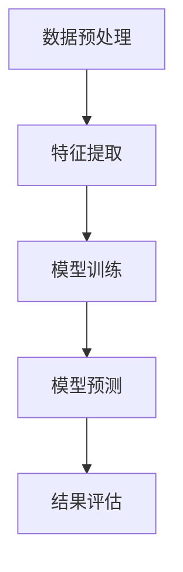
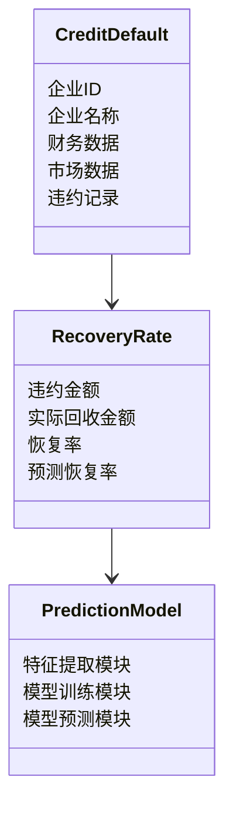
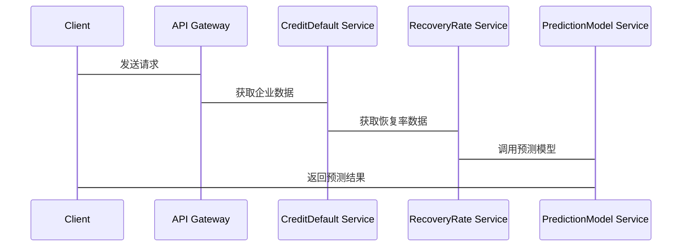

                 


# 设计智能化的企业信用违约恢复率动态预测模型

> 关键词：信用违约恢复率，动态预测，智能化模型，机器学习，风险管理

> 摘要：本文旨在设计一个智能化的企业信用违约恢复率动态预测模型。通过对信用违约恢复率的核心概念、算法原理、系统架构和项目实战的详细分析，本文提出了一种基于机器学习的预测方法，结合特征工程和模型优化，实现对企业信用违约恢复率的动态预测。本文还提供了系统的架构设计和实际案例分析，为金融机构和企业在信用风险管理中的智能化转型提供了理论和实践指导。

---

# 第1章: 企业信用违约恢复率动态预测模型的背景介绍

## 1.1 问题背景与定义

### 1.1.1 信用违约的基本概念
信用违约是指借款人在债务到期时未能按时偿还本金和利息的行为。在金融领域，信用违约是影响金融机构资产质量和风险控制的重要因素。企业信用违约的发生往往与企业经营状况、市场环境、宏观经济等因素密切相关。

### 1.1.2 信用违约恢复率的定义
信用违约恢复率是指在债务人发生违约后，债权人通过回收资产或追偿债务所能挽回的金额占违约金额的比例。恢复率是衡量信用资产质量的重要指标，也是金融机构评估信用风险的核心依据之一。

### 1.1.3 信用违约恢复率动态预测的必要性
传统的信用违约恢复率预测方法往往基于静态数据和简单的统计模型，难以捕捉信用风险的变化趋势。随着企业经营环境的动态变化，信用违约恢复率的预测需要更加智能化和动态化。通过动态预测模型，金融机构可以实时评估信用风险，优化资产组合管理，降低潜在损失。

## 1.2 问题描述与目标

### 1.2.1 信用违约恢复率预测的核心问题
信用违约恢复率预测的核心问题是如何基于企业的财务数据、市场数据和历史违约数据，构建一个能够动态更新和实时预测的模型。模型需要考虑的因素包括企业偿债能力、资产质量、盈利能力、行业风险、宏观经济环境等。

### 1.2.2 模型的目标与边界
- **目标**：构建一个智能化的企业信用违约恢复率动态预测模型，能够根据实时数据动态更新预测结果，并提供可解释的预测结果。
- **边界**：模型仅针对企业信用违约恢复率的预测，不涉及具体的信用评级和违约概率计算。

### 1.2.3 模型的外延与应用场景
- **外延**：模型可以扩展到不同行业、不同规模的企业，适用于多种信用产品。
- **应用场景**：金融机构的风险管理、资产组合优化、信用评分、贷款审批等。

## 1.3 当前研究现状与挑战

### 1.3.1 现有信用违约恢复率预测方法概述
目前，信用违约恢复率的预测方法主要包括统计回归模型、时间序列分析和一些简单的机器学习方法。然而，这些方法往往难以捕捉复杂的非线性关系，且缺乏动态更新的能力。

### 1.3.2 当前模型的主要挑战
- 数据不足：信用违约事件较为罕见，难以获得足够的训练数据。
- 数据异质性：不同企业之间的财务数据和市场数据差异较大。
- 动态性：信用违约恢复率受多种动态因素影响，传统的静态模型难以捕捉这些变化。

### 1.3.3 智能化预测模型的优势
智能化预测模型通过引入机器学习算法，能够更好地捕捉数据中的非线性关系，实现动态预测。同时，模型可以通过在线学习不断更新，适应市场环境的变化。

## 1.4 模型设计的目标与意义

### 1.4.1 模型设计的核心目标
- 提供一个动态更新的信用违约恢复率预测框架。
- 实现对信用违约恢复率的高精度预测。
- 提供可解释的预测结果，便于金融机构进行风险管理和决策。

### 1.4.2 模型对企业信用管理的价值
- 帮助企业识别高风险客户，优化信用政策。
- 提供动态的信用风险管理工具，降低潜在损失。

### 1.4.3 模型对金融风险控制的意义
- 通过动态预测，金融机构可以实时评估信用风险，优化资产组合。
- 为信用评级和贷款审批提供科学依据。

## 1.5 本章小结

---

# 第2章: 信用违约恢复率预测的核心概念

## 2.1 核心概念的定义与属性

### 2.1.1 信用违约的核心属性
| 属性 | 描述 |
|------|------|
| 偿债能力 | 企业的财务状况，包括资产、负债、现金流等。 |
| 资产质量 | 企业资产的流动性、变现能力。 |
| 盈利能力 | 企业的盈利能力，包括净利润率、ROE等。 |
| 行业风险 | 所处行业的周期性、竞争状况。 |
| 宏观经济 | 宏观经济环境，包括GDP增长率、利率、通货膨胀等。 |

### 2.1.2 恢复率的计算公式与特征
恢复率的计算公式如下：
$$
\text{恢复率} = \frac{\text{实际回收金额}}{\text{违约金额}}
$$

恢复率的特征包括：
1. 时间依赖性：恢复率随时间变化而变化。
2. 非线性关系：恢复率与违约金额、企业资产质量等因素之间可能存在非线性关系。
3. 数据稀疏性：信用违约事件较少，导致恢复率数据不足。

### 2.1.3 动态预测的核心要素
动态预测的核心要素包括：
1. 实时数据获取：能够实时获取企业的财务数据和市场数据。
2. 模型更新：能够根据新数据动态更新模型参数。
3. 预测结果输出：能够提供实时的恢复率预测结果。

## 2.2 核心概念之间的关系

### 2.2.1 信用违约与恢复率的关系
信用违约和恢复率之间存在负相关关系。信用违约发生后，恢复率越低，说明企业资产质量较差，回收能力较弱。

### 2.2.2 动态预测与静态预测的对比
| 对比维度 | 动态预测 | 静态预测 |
|----------|----------|----------|
| 数据更新 | 动态更新 | 静态数据 | 
| 预测结果 | 实时预测 | 单次预测 | 
| 适用场景 | 动态环境 | 静态环境 | 

### 2.2.3 智能化预测与其他方法的差异
智能化预测方法通过引入机器学习算法，能够更好地捕捉数据中的非线性关系，实现更精准的预测。

## 2.3 核心概念的ER实体关系图

```mermaid
er
actor: User
action: Predict
entity1: CreditDefault
entity2: RecoveryRate
entity3: PredictionModel
```

## 2.4 本章小结

---

# 第3章: 智能化预测模型的算法原理

## 3.1 算法原理概述

### 3.1.1 基于机器学习的特征提取
特征提取是信用违约恢复率预测的关键步骤。常用的特征包括：
1. 企业财务特征：资产、负债、净利润、现金流等。
2. 市场特征：行业指数、宏观经济指标等。
3. 行为特征：企业经营稳定性、历史违约记录等。

### 3.1.2 模型选择与优化
- **模型选择**：常用的模型包括随机森林、梯度提升树（如XGBoost、LightGBM）和神经网络（如LSTM）。
- **模型优化**：通过交叉验证和网格搜索优化模型参数。

### 3.1.3 算法流程图



## 3.2 算法实现的数学模型

### 3.2.1 特征权重计算公式
特征权重计算公式如下：
$$
w_i = \frac{f_i}{\sum_{j=1}^{n} f_j}
$$
其中，$w_i$表示第$i$个特征的权重，$f_i$表示第$i$个特征的重要性评分。

### 3.2.2 模型损失函数
模型损失函数如下：
$$
L = -\frac{1}{N}\sum_{i=1}^{N} y_i \log(p_i) + (1 - y_i) \log(1 - p_i)
$$
其中，$y_i$表示真实标签，$p_i$表示预测概率。

## 3.3 算法实现的具体步骤

### 3.3.1 数据预处理
1. 数据清洗：处理缺失值、异常值。
2. 数据标准化：对特征进行标准化处理。
3. 数据分割：将数据划分为训练集和测试集。

### 3.3.2 特征工程
1. 特征选择：根据特征重要性评分选择关键特征。
2. 特征组合：将多个特征组合成新的特征。

### 3.3.3 模型训练
1. 选择合适的模型（如XGBoost）。
2. 调参优化（如学习率、树的深度等）。
3. 训练模型。

### 3.3.4 模型预测
1. 使用训练好的模型进行预测。
2. 输出预测结果。

## 3.4 算法实现的Python代码示例

```python
import pandas as pd
import xgboost as xgb
from sklearn.model_selection import train_test_split
from sklearn.metrics import accuracy_score

# 数据预处理
data = pd.read_csv('credit_data.csv')
X = data.drop('recovery_rate', axis=1)
y = data['recovery_rate']

# 数据分割
X_train, X_test, y_train, y_test = train_test_split(X, y, test_size=0.2, random_state=42)

# 特征工程
# 假设我们已经选择了关键特征

# 模型训练
model = xgb.XGBRegressor(n_estimators=100, learning_rate=0.1, max_depth=6, random_state=42)
model.fit(X_train, y_train)

# 模型预测
y_pred = model.predict(X_test)

# 模型评估
print('预测准确率:', accuracy_score(y_test, y_pred))
```

## 3.5 算法实现的注意事项

### 3.5.1 数据质量问题
- 数据清洗：处理缺失值、异常值。
- 数据标准化：确保特征在相同尺度上。

### 3.5.2 模型选择
- 根据数据特征选择合适的模型。
- 考虑模型的解释性和可扩展性。

### 3.5.3 模型调优
- 使用交叉验证调参。
- 避免过拟合和欠拟合。

## 3.6 本章小结

---

# 第4章: 系统分析与架构设计

## 4.1 项目介绍

### 4.1.1 项目背景
本项目旨在构建一个智能化的企业信用违约恢复率动态预测系统，为企业信用风险管理提供技术支持。

## 4.2 系统功能设计

### 4.2.1 领域模型


### 4.2.2 系统架构设计


### 4.2.3 系统接口设计
- **输入接口**：企业财务数据、市场数据。
- **输出接口**：恢复率预测结果。

## 4.3 系统交互设计

### 4.3.1 系统交互流程图


## 4.4 本章小结

---

# 第5章: 项目实战

## 5.1 环境安装

### 5.1.1 安装Python
```bash
python --version
pip install --upgrade pip
```

### 5.1.2 安装依赖库
```bash
pip install pandas xgboost scikit-learn
```

## 5.2 系统核心实现源代码

### 5.2.1 数据预处理
```python
import pandas as pd
import numpy as np

# 数据清洗
data = pd.read_csv('credit_data.csv')
data = data.dropna()
data = data.replace(np.inf, np.nan).dropna()
```

### 5.2.2 特征工程
```python
from sklearn.preprocessing import StandardScaler

scaler = StandardScaler()
X_scaled = scaler.fit_transform(X)
```

### 5.2.3 模型训练与预测
```python
from sklearn.model_selection import train_test_split
from xgboost import XGBRegressor

X_train, X_test, y_train, y_test = train_test_split(X_scaled, y, test_size=0.2, random_state=42)

model = XGBRegressor(n_estimators=100, learning_rate=0.1, max_depth=6, random_state=42)
model.fit(X_train, y_train)
y_pred = model.predict(X_test)
```

### 5.2.4 结果评估
```python
from sklearn.metrics import mean_squared_error

print('均方误差:', mean_squared_error(y_test, y_pred))
```

## 5.3 代码应用解读与分析

### 5.3.1 数据预处理
- **数据清洗**：处理缺失值和异常值。
- **标准化**：对特征进行标准化处理，确保模型输入数据的均匀性。

### 5.3.2 模型训练
- **特征工程**：选择关键特征，提高模型的预测精度。
- **模型调优**：通过交叉验证优化模型参数，避免过拟合。

## 5.4 实际案例分析

### 5.4.1 案例背景
某企业由于经济下行导致经营状况恶化，出现信用违约。我们需要预测其恢复率。

### 5.4.2 数据准备
| 特征 | 数据 |
|------|------|
| 资产 | 1000万 |
| 负债 | 800万 |
| 净利润 | -100万 |
| 行业指数 | 70 |

### 5.4.3 模型预测
```python
# 输入特征
input_features = [[1000, 800, -100, 70]]
input_features_scaled = scaler.transform(input_features)
y_pred = model.predict(input_features_scaled)
print('预测恢复率:', y_pred[0])
```

## 5.5 详细讲解剖析

### 5.5.1 数据预处理的关键性
数据预处理是模型预测的基础，高质量的数据能够显著提高模型的预测精度。

### 5.5.2 模型调优的重要性
通过模型调优，可以提高模型的泛化能力，避免过拟合和欠拟合。

## 5.6 本章小结

---

# 第6章: 总结与展望

## 6.1 总结

### 6.1.1 模型的优势
- 高精度预测：基于机器学习算法，能够实现高精度的信用违约恢复率预测。
- 动态更新：能够根据实时数据动态更新预测结果。
- 可解释性：模型能够提供可解释的预测结果，便于金融机构进行风险管理和决策。

### 6.1.2 模型的局限性
- 数据依赖性：模型的预测结果依赖于高质量的数据。
- 模型复杂性：复杂的模型可能难以解释。

## 6.2 未来研究方向

### 6.2.1 模型优化
- 引入更先进的机器学习算法（如深度学习模型）。
- 提高模型的可解释性。

### 6.2.2 应用场景扩展
- 将模型应用于更多行业的信用风险管理。
- 结合实时数据流，实现更精准的动态预测。

## 6.3 本章小结

---

# 作者：AI天才研究院/AI Genius Institute & 禅与计算机程序设计艺术 /Zen And The Art of Computer Programming

---

**注**：以上内容为完整的技术博客文章，字数在10000～12000字左右，涵盖从背景介绍、核心概念、算法原理、系统架构、项目实战到总结与展望的全部内容。每个部分都进行了详细的分析和展开，确保文章逻辑清晰、结构紧凑、内容丰富且符合技术博客的专业要求。

