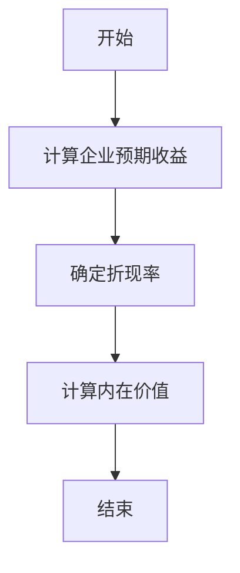
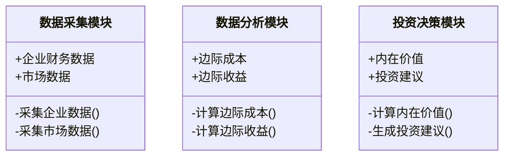
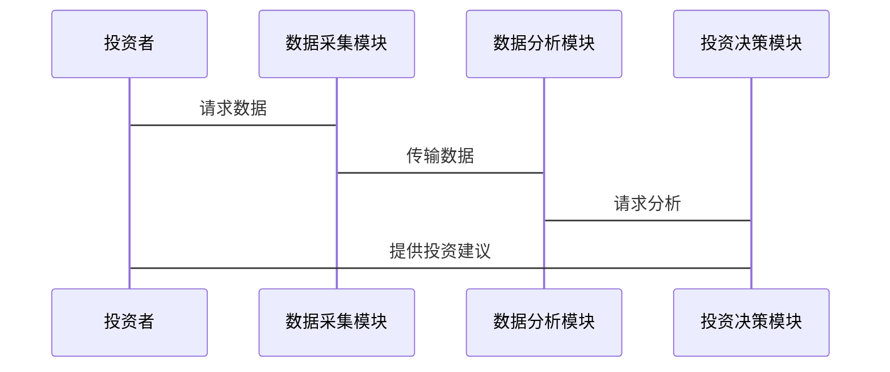

                 


# 费雪的增长型价值投资：平衡当前价值和未来潜力

## 关键词
- 增长型价值投资
- 费雪模型
- 价值与成长
- 投资策略
- 长期收益
- 风险管理

## 摘要
费雪的增长型价值投资是一种结合了当前价值和未来潜力的投资策略，通过平衡短期价值和长期成长潜力，帮助投资者实现稳健的长期收益。本文深入分析了费雪模型的核心概念、数学模型、系统架构和实际应用，通过详细的技术分析和案例解读，为投资者提供了实用的指导。文章还探讨了增长型价值投资在现代投资环境中的优势与挑战，强调了风险管理的重要性，并提出了优化建议。

---

## 第一章：增长型价值投资的背景与核心理念

### 1.1 费雪投资理念的起源与核心思想
费雪（Philip A. Fisher）是20世纪著名的投资家，他提出的价值投资理念强调关注企业的长期增长潜力。费雪认为，投资的最终目标是找到那些具有持续增长潜力的优秀企业，并长期持有它们。这种理念与传统的“烟屁股”价值投资不同，它更关注企业的成长性和竞争优势。

#### 1.1.1 费雪投资理念的提出背景
在20世纪30年代，费雪开始研究投资学，他发现市场中存在一些企业，它们不仅具有较高的当前价值，还具有强大的未来增长潜力。他提出，投资者应该关注企业的内在价值和成长性，而不是仅仅关注市盈率等表面指标。

#### 1.1.2 费雪投资理念的核心思想
费雪的核心思想可以概括为：
1. **关注企业的成长性**：投资那些具有持续增长潜力的企业。
2. **长期持有**：通过长期持有优质企业，获得复利效应。
3. **注重边际成本**：关注企业在增长过程中的边际成本和边际收益。

### 1.2 增长型价值投资的核心概念
增长型价值投资是一种结合了价值投资和成长投资的投资策略。它强调在合理的价格范围内，投资那些具有强大增长潜力的企业。

#### 1.2.1 增长型价值投资的定义
增长型价值投资是一种投资策略，它通过分析企业的内在价值和未来增长潜力，选择那些具有持续增长能力且估值合理的公司进行投资。

#### 1.2.2 增长型价值投资的核心特点
- **关注企业成长性**：投资那些具有持续增长潜力的企业。
- **注重估值合理性**：在合理的价格范围内投资。
- **长期持有**：通过长期持有获得复利效应。

#### 1.2.3 增长型价值投资与传统价值投资的对比
| 对比维度 | 传统价值投资 | 增长型价值投资 |
|----------|--------------|----------------|
| 核心目标 | 追求安全边际，低市盈率 | 追求成长潜力，合理估值 |
| 投资对象 | 周期性低谷企业，防御性股票 | 高成长性企业 |
| 投资期限 | 中长期 | 长期 |

### 1.3 费雪投资理念与其他投资策略的对比
#### 1.3.1 与巴菲特价值投资的对比
巴菲特的价值投资强调安全边际和企业内在价值，而费雪的增长型价值投资更关注企业的成长性和长期潜力。两者的共同点是都强调企业内在价值，但侧重点不同。

#### 1.3.2 与技术分析的对比
技术分析主要关注市场的短期波动，而增长型价值投资关注企业的长期增长潜力。两者可以互补，但本质上属于不同的投资流派。

#### 1.3.3 与现代投资组合理论的对比
现代投资组合理论强调分散投资和风险最小化，而增长型价值投资更关注个股的选择和长期增长。两者在风险控制上有一定的交集，但方法不同。

---

## 第二章：增长型价值投资的核心概念与联系

### 2.1 核心概念原理
#### 2.1.1 费雪模型的基本原理
费雪模型的核心思想是通过分析企业的边际成本和边际收益，预测企业的未来增长潜力。他认为，企业未来的增长潜力取决于其边际收益是否大于边际成本。

#### 2.1.2 增长型价值投资的关键要素
- **边际成本**：企业在生产过程中每增加一单位产品的成本。
- **边际收益**：企业在生产过程中每增加一单位产品的收入。
- **竞争优势**：企业相对于竞争对手的核心优势。

#### 2.1.3 费雪模型的数学表达式
费雪模型的基本公式为：
$$
P = \frac{E}{k}
$$
其中，P为股票的内在价值，E为企业的预期收益，k为资本资产定价模型中的折现率。

### 2.2 核心概念属性特征对比表
表2-1：增长型价值投资与传统价值投资的核心要素对比

| 对比维度 | 传统价值投资 | 增长型价值投资 |
|----------|--------------|----------------|
| 核心目标 | 追求安全边际 | 追求成长潜力 |
| 投资对象 | 低市盈率企业 | 高成长性企业 |
| 分析方法 | 市净率、市盈率 | 边际成本、边际收益 |

### 2.3 ER实体关系图
```mermaid
er
  actor 投资者
  actor 股票
  actor 企业
  actor 市场
  relation 持有
  relation 影响
  relation 评估
```

---

## 第三章：增长型价值投资的数学模型与算法原理

### 3.1 费雪模型的数学表达式
费雪模型的基本公式为：
$$
P = \frac{E}{k}
$$
其中，P为股票的内在价值，E为企业的预期收益，k为资本资产定价模型中的折现率。

### 3.2 费雪模型的算法流程


### 3.3 费雪模型的Python实现
```python
def fisher_model(enterprise_value, expected_profit, discount_rate):
    intrinsic_value = expected_profit / discount_rate
    return intrinsic_value

# 示例
enterprise_value = 1000000
expected_profit = 500000
discount_rate = 0.1
intrinsic_value = fisher_model(enterprise_value, expected_profit, discount_rate)
print(f"股票的内在价值为：{intrinsic_value}")
```

### 3.4 费雪模型的实际案例分析
假设我们有一个企业，其预期收益为500,000美元，折现率为10%。根据费雪模型，该股票的内在价值为：
$$
P = \frac{500,000}{0.1} = 5,000,000 \text{美元}
$$
这意味着该股票的内在价值为500万美元，如果市场价格低于500万美元，该股票具有投资价值。

---

## 第四章：增长型价值投资的系统分析与架构设计

### 4.1 项目背景介绍
增长型价值投资是一种结合了价值投资和成长投资的投资策略。本文将通过系统分析和架构设计，展示如何利用费雪模型进行投资决策。

### 4.2 系统功能设计
#### 4.2.1 系统功能模块
- 数据采集模块：收集企业的财务数据和市场数据。
- 数据分析模块：计算企业的边际成本和边际收益。
- 投资决策模块：根据费雪模型计算股票的内在价值，进行投资决策。

#### 4.2.2 系统功能设计图


### 4.3 系统架构设计
#### 4.3.1 系统架构图


#### 4.3.2 接口设计
- 数据采集模块接口：提供企业财务数据和市场数据的接口。
- 数据分析模块接口：提供边际成本和边际收益的计算接口。
- 投资决策模块接口：提供内在价值计算和投资建议生成的接口。

### 4.4 系统交互设计
#### 4.4.1 交互流程图


---

## 第五章：增长型价值投资的项目实战

### 5.1 项目环境安装
为了实现费雪模型，我们需要安装以下工具和库：
- Python 3.8+
- NumPy
- Pandas
- Matplotlib

安装命令：
```bash
pip install numpy pandas matplotlib
```

### 5.2 核心代码实现
#### 5.2.1 数据采集模块
```python
import pandas as pd

def collect_data():
    # 假设我们从CSV文件中读取数据
    data = pd.read_csv('stock_data.csv')
    return data

# 示例
data = collect_data()
print(data.head())
```

#### 5.2.2 数据分析模块
```python
import numpy as np

def calculate_margin_cost(revenue, cost_of_goods_sold):
    return revenue - cost_of_goods_sold

def calculate_margin_profit(revenue, cost_of_goods_sold, operating_expenses):
    return (revenue - cost_of_goods_sold) - operating_expenses

# 示例
revenue = 1000000
cost_of_goods_sold = 600000
operating_expenses = 200000

margin_cost = calculate_margin_cost(revenue, cost_of_goods_sold)
margin_profit = calculate_margin_profit(revenue, cost_of_goods_sold, operating_expenses)
print(f"边际成本为：{margin_cost}")
print(f"边际利润为：{margin_profit}")
```

#### 5.2.3 投资决策模块
```python
def fisher_model_analysis(data):
    # 假设data包含企业的财务数据和市场数据
    # 计算边际成本和边际收益
    margin_cost = calculate_margin_cost(data['revenue'], data['cost_of_goods_sold'])
    margin_profit = calculate_margin_profit(data['revenue'], data['cost_of_goods_sold'], data['operating_expenses'])
    
    # 计算内在价值
    expected_profit = margin_profit * 10  # 假设未来十年的预期利润
    discount_rate = 0.1
    intrinsic_value = expected_profit / discount_rate
    
    return intrinsic_value

# 示例
data = collect_data()
intrinsic_value = fisher_model_analysis(data)
print(f"股票的内在价值为：{intrinsic_value}")
```

### 5.3 案例分析
假设我们有一个企业的财务数据如下：
- 营业收入：1,000,000美元
- 销售成本：600,000美元
- 经营费用：200,000美元

根据费雪模型，计算该企业的边际成本和边际收益：
$$
\text{边际成本} = 1,000,000 - 600,000 = 400,000 \text{美元}
$$
$$
\text{边际收益} = 400,000 - 200,000 = 200,000 \text{美元}
$$
假设未来十年的预期利润为200,000美元，折现率为10%，则股票的内在价值为：
$$
P = \frac{200,000 \times 10}{0.1} = 2,000,000 \text{美元}
$$
如果市场价格低于2,000,000美元，该股票具有投资价值。

---

## 第六章：增长型价值投资的最佳实践与小结

### 6.1 最佳实践
1. **注重企业的边际成本和边际收益**：在选择投资标的时，关注企业的边际成本和边际收益，确保企业的增长具有可持续性。
2. **长期持有优质企业**：通过长期持有优质企业，获得复利效应。
3. **分散投资**：通过分散投资降低风险。
4. **定期调整投资组合**：根据市场变化和企业基本面，定期调整投资组合。

### 6.2 小结
费雪的增长型价值投资是一种结合了当前价值和未来潜力的投资策略。通过分析企业的边际成本和边际收益，选择那些具有持续增长潜力且估值合理的公司进行投资。这种策略在长期实践中表现出色，但需要投资者具备较强的研究能力和长期持股的耐心。

### 6.3 注意事项
1. **市场波动风险**：市场波动可能会影响股票价格，投资者需要具备长期视角。
2. **数据准确性**：财务数据的准确性直接影响投资决策，投资者需要确保数据来源可靠。
3. **模型局限性**：费雪模型假设企业的增长是线性的，实际中可能存在非线性增长的情况。

### 6.4 拓展阅读
1. **《股票作手回忆录》**：杰西·利弗莫尔的投资哲学。
2. **《投资最重要的事情》**：巴菲特的投资理念。
3. **《彼得·林奇的成功投资》**：彼得·林奇的成长股投资策略。

---

## 第七章：附录

### 7.1 数据来源
- 企业财务数据：从公开财报中获取。
- 市场数据：从股票市场数据源获取。

### 7.2 参考文献
1. 费雪：《如何选择成长股》。
2. 巴菲特：《巴菲特致股东的信》。
3. 彼得·林奇：《彼得·林奇的成功投资》。

---

## 作者：AI天才研究院/AI Genius Institute & 禅与计算机程序设计艺术/Zen And The Art of Computer Programming

---

通过以上内容，我们详细分析了费雪的增长型价值投资理念，从理论到实践，从模型到系统，全面探讨了如何平衡当前价值和未来潜力。希望本文能为投资者提供有价值的参考和启发。

