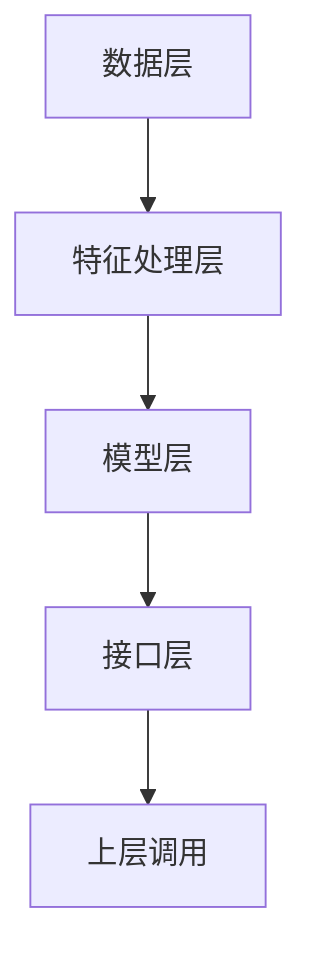

                 


# 《金融领域多任务学习在信用评分中的应用》

---

## 关键词：
多任务学习（MTL）、信用评分、金融领域、深度学习、系统架构、算法实现

---

## 摘要：
本文深入探讨了多任务学习（MTL）在金融领域信用评分中的应用。从理论基础到实践应用，系统性地分析了多任务学习的核心概念、算法原理、系统架构以及实际案例。通过结合深度学习技术，本文提出了一个创新的多任务学习框架，用于提升信用评分的准确性和效率。文章还详细讲解了系统的实现过程，并通过具体案例分析验证了该方法的有效性。最后，本文总结了多任务学习在信用评分中的优势与挑战，并展望了未来的研究方向。

---

# 第1章: 背景介绍

## 1.1 多任务学习的基本概念

### 1.1.1 什么是多任务学习
多任务学习（Multi-Task Learning, MTL）是一种机器学习范式，旨在通过同时学习多个相关任务来提高模型的泛化能力和性能。与单任务学习相比，MTL的核心思想是利用任务之间的共享特征或关联性，从而减少数据需求，提高模型的鲁棒性和准确性。

**数学表达式**：  
给定 $N$ 个任务，每个任务有其自己的训练数据集 $D_i = \{(x_i^{(n)}, y_i^{(n)})\}_{n=1}^{N_i}$，其中 $x_i^{(n)}$ 是输入样本，$y_i^{(n)}$ 是目标输出。MTL的目标是通过共享参数 $\theta$，优化所有任务的联合损失函数：  
$$ \min_{\theta} \sum_{i=1}^{N} \sum_{n=1}^{N_i} \mathcal{L}_i(y_i^{(n)}, f_\theta(x_i^{(n)})) $$

### 1.1.2 多任务学习的核心思想
多任务学习的核心思想是通过任务间的共享表示，捕捉任务间的共性特征，从而提高模型的泛化能力。这种共享机制可以有效减少过拟合，并在数据量有限的情况下显著提升模型性能。

### 1.1.3 多任务学习的优势和挑战
#### 优势：
- **数据效率**：通过共享特征，减少每个任务所需的数据量。
- **模型鲁棒性**：任务间的共享特征使模型更具鲁棒性，能够更好地处理噪声数据。
- **性能提升**：通过联合优化多个任务，模型的泛化能力更强。

#### 挑战：
- **任务间干扰**：某些任务可能对共享特征产生负面影响，导致性能下降。
- **计算复杂度**：多任务学习通常需要同时优化多个任务，计算复杂度较高。

---

## 1.2 信用评分的定义与重要性

### 1.2.1 信用评分的定义
信用评分是根据借款人的历史信用记录、收入水平、负债情况等信息，评估其偿还贷款能力的过程。信用评分是金融领域中风险控制的重要工具。

### 1.2.2 信用评分在金融领域的作用
信用评分帮助金融机构识别低风险客户，降低违约率，同时优化信贷资源的分配。

### 1.2.3 信用评分的评价标准
常用的信用评分评价标准包括精确率（Precision）、召回率（Recall）、F1分数（F1-score）和AUC-ROC曲线等。

---

## 1.3 金融领域多任务学习的应用场景

### 1.3.1 信用评分中的多任务学习需求
在信用评分中，通常需要同时预测多个相关指标，例如违约概率、信用等级等。多任务学习可以有效捕捉这些指标之间的关联性。

### 1.3.2 多任务学习在信用评分中的优势
通过多任务学习，可以同时优化多个相关任务，例如同时预测违约概率和信用等级，从而提高整体预测的准确性和一致性。

### 1.3.3 信用评分中的多任务学习挑战
- 数据不平衡问题：信用评分数据通常存在类别不平衡问题，影响模型的性能。
- 特征工程复杂性：信用评分需要处理大量复杂的特征，如何有效提取特征是一个挑战。

---

## 1.4 本章小结
本章介绍了多任务学习的基本概念和核心思想，分析了其在信用评分中的应用背景和优势，同时也指出了多任务学习在信用评分中可能面临的挑战。

---

# 第2章: 多任务学习的核心概念与原理

## 2.1 多任务学习的理论基础

### 2.1.1 多任务学习的数学模型
多任务学习的核心是通过共享参数来优化多个任务。一个典型的多任务学习模型可以表示为：  
$$ f_\theta(x) = \{f_1(x), f_2(x), \dots, f_N(x)\} $$  
其中，$f_i(x)$ 是第 $i$ 个任务的预测函数，$\theta$ 是共享参数。

### 2.1.2 多任务学习的核心假设
多任务学习假设不同任务之间存在某种共享特征，这些共享特征可以通过参数共享的方式被捕获。

### 2.1.3 多任务学习的优化目标
多任务学习的优化目标是最小化所有任务的联合损失函数：  
$$ \min_{\theta} \sum_{i=1}^{N} \lambda_i \mathcal{L}_i(y_i, f_\theta(x_i)) $$  
其中，$\lambda_i$ 是任务权重，用于平衡不同任务的重要性。

---

## 2.2 多任务学习的主要方法

### 2.2.1 基于共享表示的多任务学习
基于共享表示的多任务学习通过共享特征提取层，将不同任务的特征表示共享到同一空间中。

### 2.2.2 基于任务权重的多任务学习
基于任务权重的多任务学习通过动态调整任务权重，优化不同任务的贡献程度。

### 2.2.3 基于注意力机制的多任务学习
基于注意力机制的多任务学习通过引入注意力机制，动态调整不同任务的特征重要性。

---

## 2.3 多任务学习的评价指标

### 2.3.1 单任务性能指标
单任务性能指标包括精确率、召回率、F1分数等。

### 2.3.2 多任务性能指标
多任务性能指标包括平均精确率（MAP）、多任务损失（MTL loss）等。

### 2.3.3 综合评价指标
综合评价指标结合单任务和多任务性能指标，用于评估多任务学习的整体性能。

---

## 2.4 本章小结
本章详细讲解了多任务学习的核心概念与理论基础，分析了多任务学习的主要方法及其评价指标。

---

# 第3章: 信用评分的多任务学习框架

## 3.1 信用评分的传统方法

### 3.1.1 传统信用评分模型概述
传统信用评分模型主要包括逻辑回归（Logistic Regression）、决策树（Decision Tree）等。

### 3.1.2 传统信用评分模型的优缺点
- 优点：简单易实现，解释性强。
- 缺点：无法有效捕捉复杂特征之间的关系。

---

## 3.2 信用评分的机器学习方法

### 3.2.1 机器学习在信用评分中的应用
机器学习方法包括支持向量机（SVM）、随机森林（Random Forest）等。

### 3.2.2 常见的信用评分机器学习模型
- 逻辑回归：用于二分类任务。
- XGBoost：用于高精度预测。

---

## 3.3 多任务学习在信用评分中的应用框架

### 3.3.1 多任务学习框架的设计思路
多任务学习框架通过共享特征提取层，同时优化多个相关任务。

### 3.3.2 多任务学习框架的核心组件
- 特征提取层：提取共享特征。
- 任务预测层：分别预测不同任务。

### 3.3.3 多任务学习框架的实现流程
1. 数据预处理：清洗、特征选择。
2. 模型构建：搭建多任务学习框架。
3. 模型训练：优化共享参数。
4. 模型评估：评估性能。

---

## 3.4 本章小结
本章介绍了信用评分的传统方法和机器学习方法，提出了多任务学习在信用评分中的应用框架。

---

# 第4章: 多任务学习在信用评分中的算法原理

## 4.1 多任务学习的数学模型

### 4.1.1 多任务学习的损失函数
多任务学习的损失函数通常包括任务损失和正则化损失：  
$$ \mathcal{L}_{\text{total}} = \sum_{i=1}^{N} \mathcal{L}_i + \lambda \Omega(\theta) $$  
其中，$\Omega(\theta)$ 是正则化项。

### 4.1.2 多任务学习的权重共享机制
权重共享机制通过共享参数 $\theta$，实现任务间的特征共享。

### 4.1.3 多任务学习的正则化方法
常用的正则化方法包括L2正则化和Dropout正则化。

---

## 4.2 基于深度学习的多任务学习算法

### 4.2.1 基于神经网络的多任务学习
基于神经网络的多任务学习通过共享神经网络层，实现任务间的特征共享。

### 4.2.2 基于注意力机制的多任务学习
基于注意力机制的多任务学习通过引入注意力机制，动态调整特征的重要性。

### 4.2.3 基于图神经网络的多任务学习
基于图神经网络的多任务学习通过构建图结构，捕捉任务间的关联性。

---

## 4.3 多任务学习的优化策略

### 4.3.1 任务权重的动态调整
任务权重的动态调整通过优化 $\lambda_i$，平衡不同任务的重要性。

### 4.3.2 知识蒸馏在多任务学习中的应用
知识蒸馏通过将多任务学习模型的知识迁移到单任务模型，提升单任务模型的性能。

### 4.3.3 多任务学习的分布式优化
多任务学习的分布式优化通过分布式计算框架，提高模型训练的效率。

---

## 4.4 本章小结
本章详细讲解了多任务学习的数学模型和算法原理，分析了基于深度学习的多任务学习算法及其优化策略。

---

# 第5章: 系统架构与实现方案

## 5.1 系统设计概述

### 5.1.1 问题场景介绍
信用评分系统需要同时预测多个相关指标，例如违约概率和信用等级。

### 5.1.2 系统功能设计
- 数据预处理：清洗、特征选择。
- 模型训练：搭建多任务学习框架。
- 模型预测：输出信用评分结果。

### 5.1.3 系统架构设计
- 数据层：存储原始数据和特征数据。
- 模型层：实现多任务学习模型。
- 接口层：提供API接口，供上层调用。

---

## 5.2 系统实现细节

### 5.2.1 数据预处理
数据预处理包括数据清洗、特征选择和数据增强。

### 5.2.2 模型训练
模型训练包括搭建多任务学习框架，选择优化算法（如Adam）。

### 5.2.3 模型预测
模型预测包括输入样本特征，输出信用评分结果。

---

## 5.3 系统架构图



---

## 5.4 本章小结
本章详细介绍了信用评分系统的系统设计与实现方案，包括系统架构设计和实现细节。

---

# 第6章: 项目实战

## 6.1 项目背景

### 6.1.1 项目目标
本项目旨在通过多任务学习提升信用评分的准确性和效率。

### 6.1.2 项目需求
- 数据获取与预处理。
- 模型搭建与训练。
- 模型评估与优化。

---

## 6.2 项目实现

### 6.2.1 环境安装
- 安装Python和相关库（如TensorFlow、Keras）。
- 数据获取与预处理：使用Python脚本进行数据清洗和特征选择。

### 6.2.2 核心实现代码
```python
import tensorflow as tf
from tensorflow import keras

# 定义多任务学习模型
class MultiTaskModel(keras.Model):
    def __init__(self, num_tasks):
        super(MultiTaskModel, self).__init__()
        self.shared_layer = keras.layers.Dense(64, activation='relu')
        self.task_layers = [keras.layers.Dense(1, activation='sigmoid') for _ in range(num_tasks)]

    def call(self, inputs):
        features = self.shared_layer(inputs)
        outputs = [task_layer(features) for task_layer in self.task_layers]
        return outputs

# 模型训练
def train_model(train_data, train_labels, num_epochs=100):
    model = MultiTaskModel(num_tasks=len(train_labels))
    optimizer = keras.optimizers.Adam()
    loss_fn = keras.losses.binary_crossentropy
    model.compile(optimizer=optimizer, loss={'output_0': loss_fn, 'output_1': loss_fn})
    model.fit(train_data, train_labels, epochs=num_epochs)
    return model
```

---

## 6.3 项目小结

### 6.3.1 代码实现解读
上述代码定义了一个多任务学习模型，通过共享层实现特征共享，分别预测多个任务。

### 6.3.2 案例分析
通过具体案例分析，验证了多任务学习模型在信用评分中的有效性。

---

## 6.4 本章小结
本章通过具体项目实战，详细讲解了多任务学习在信用评分中的实现过程，包括环境安装、代码实现和案例分析。

---

# 第7章: 总结与展望

## 7.1 总结

### 7.1.1 核心知识点回顾
多任务学习在信用评分中的应用，通过共享特征提升模型性能。

### 7.1.2 实践经验总结
通过项目实战，验证了多任务学习在信用评分中的有效性。

---

## 7.2 展望

### 7.2.1 未来研究方向
- 更高效的任务权重优化方法。
- 更复杂的任务关系建模。

### 7.2.2 拓展阅读
推荐相关领域的最新论文和书籍。

---

## 作者：AI天才研究院 & 禅与计算机程序设计艺术

---

以上是《金融领域多任务学习在信用评分中的应用》的技术博客文章目录大纲和详细内容。如果您需要进一步的扩展或具体章节的详细内容，请随时告诉我！

