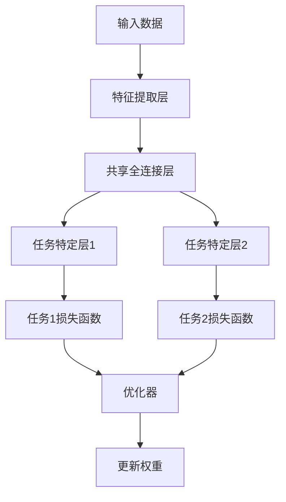
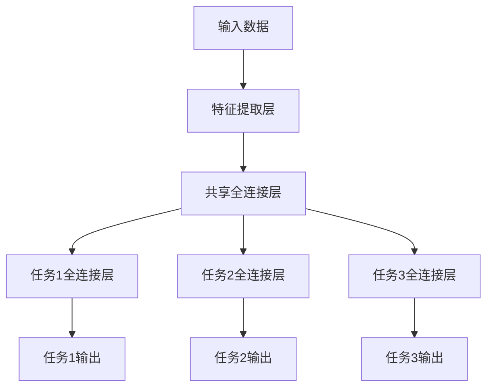
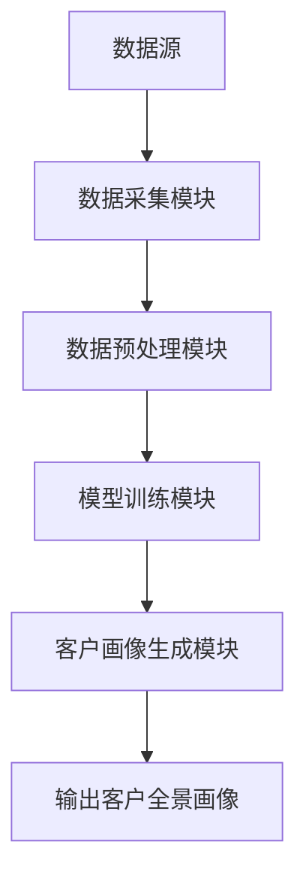
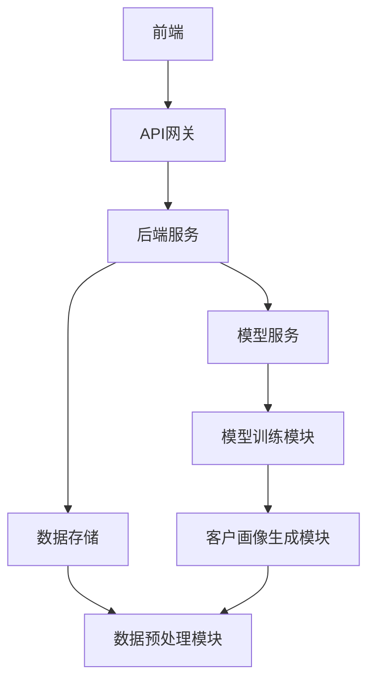
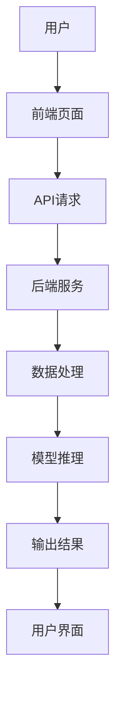

                 


# 《金融领域多任务学习在客户全景画像中的应用》

---

## 关键词：多任务学习, 客户画像, 金融领域, 人工智能, 数据分析

---

## 摘要：本文探讨了多任务学习在金融领域客户全景画像中的应用，分析了多任务学习的核心概念、算法原理以及在金融领域的实际应用场景。通过案例分析和系统设计，本文展示了如何利用多任务学习技术整合多源金融数据，构建高精度客户画像，从而提升金融机构的业务决策效率和客户服务水平。

---

# 第一部分: 金融领域多任务学习的背景与概念

---

## 第1章: 多任务学习的定义与背景

### 1.1 多任务学习的定义与核心概念

#### 1.1.1 多任务学习的基本定义

多任务学习（Multi-Task Learning, MTL）是一种机器学习范式，旨在通过同时学习多个相关任务来提高模型的泛化能力和性能。与传统单一任务学习相比，MTL能够充分利用任务之间的共享特征和数据，从而提升模型的效率和准确性。

#### 1.1.2 多任务学习的核心概念与特点

- **任务相关性**：多个任务之间存在某种内在联系，可以通过共享权重或特征来提高学习效果。
- **权重共享**：MTL通过共享部分权重或参数，使模型能够同时优化多个任务。
- **联合优化**：MTL在训练过程中同时优化多个任务的目标函数，而不是分别优化每个任务。

#### 1.1.3 多任务学习在金融领域的应用背景

金融领域的数据通常具有高维度、多模态的特点，且不同任务之间存在强相关性。例如，客户信用评估、风险预测、投资组合优化等任务都可以通过多任务学习来同时建模。

---

### 1.2 金融领域客户全景画像的必要性

#### 1.2.1 什么是客户全景画像

客户全景画像是指通过整合多源数据（如交易数据、行为数据、社交数据等），构建一个全面、动态的客户信息模型，以便更好地理解客户行为、风险特征和需求。

#### 1.2.2 客户全景画像的重要性

- **精准营销**：通过客户画像可以实现精准的个性化服务。
- **风险管理**：客户画像有助于识别高风险客户，降低金融风险。
- **决策支持**：客户画像是金融机构制定策略的重要依据。

#### 1.2.3 传统客户画像的局限性

传统客户画像通常基于单一数据源或简单统计方法，难以捕捉客户行为的复杂性和多维度特征。

---

### 1.3 多任务学习在客户画像中的优势

#### 1.3.1 多任务学习的优势

- **数据利用率高**：MTL可以充分利用多源数据，提升模型的泛化能力。
- **任务联合优化**：通过同时优化多个任务，MTL能够捕捉任务之间的深层关联。
- **模型表达能力强**：MTL模型能够同时建模多个相关任务，适用于复杂的金融场景。

#### 1.3.2 多任务学习如何解决客户画像中的问题

- **多维度特征建模**：MTL可以同时建模客户的交易行为、信用评分、风险特征等多个维度。
- **任务间关联性利用**：通过任务间的共享特征，MTL能够更好地捕捉客户的隐含特征。

#### 1.3.3 多任务学习在金融领域的应用前景

随着金融数据的复杂化和多样化，MTL在客户画像中的应用前景广阔，尤其是在精准营销、风险管理等领域。

---

## 第2章: 多任务学习的核心概念与联系

---

### 2.1 多任务学习的基本原理

#### 2.1.1 多任务学习的数学模型

多任务学习的核心思想是通过共享部分权重或参数，同时优化多个任务的目标函数。数学上，MTL的目标函数可以表示为：

$$ L = \sum_{i=1}^{n} \lambda_i L_i $$

其中，$\lambda_i$ 是任务 $i$ 的权重系数，$L_i$ 是任务 $i$ 的损失函数。

#### 2.1.2 多任务学习的任务关系分析

任务之间的关系可以分为以下几种：

- **独立任务**：任务之间无明显关联。
- **相关任务**：任务之间存在一定的关联性，可以通过共享特征或权重来提升性能。
- **嵌套任务**：任务之间存在层次结构，例如信用评估和风险预测。

#### 2.1.3 多任务学习的权重共享机制

MTL通过共享部分权重或参数，使模型能够同时优化多个任务。权重共享机制可以通过以下方式实现：

- **共享全连接层**：共享模型的某些全连接层，用于提取共享特征。
- **任务特定层**：在共享层之后添加任务特定层，用于处理任务的独有特征。

---

### 2.2 金融客户画像的实体关系分析

#### 2.2.1 客户画像的实体构成

客户画像通常包括以下实体：

- **客户基本信息**：年龄、性别、职业等。
- **交易数据**：交易金额、交易频率、交易地点等。
- **行为数据**：登录时间、点击行为、浏览记录等。
- **信用评分**：信用评分、违约概率等。

#### 2.2.2 实体关系图（ER图）

以下是客户画像的实体关系图（ER图）：

```mermaid
erd
    顾客
    属性: 顾客ID, 姓名, 性别, 年龄, 职业
    关系: 
        - 交易记录（1:多） -> 交易记录表
        - 行为记录（1:多） -> 行为记录表
        - 信用评分（1:多） -> 信用评分表
```

#### 2.2.3 客户画像的属性特征对比表格

以下是客户画像的属性特征对比表格：

| 属性类别 | 属性描述 | 示例 |
|----------|----------|------|
| 基本信息 | 年龄、性别、职业 | 年龄=30岁，性别=男，职业=金融从业者 |
| 交易数据 | 交易金额、交易频率 | 交易金额=10,000元，交易频率=每周2次 |
| 行为数据 | 登录时间、点击行为 | 登录时间=上午9点，点击行为=浏览理财产品 |
| 信用评分 | 信用评分、违约概率 | 信用评分为750分，违约概率为2% |

---

### 2.3 多任务学习与客户画像的联系

#### 2.3.1 多任务学习如何整合客户画像数据

MTL可以同时建模客户的多个特征维度，例如同时预测客户的信用评分和违约概率。

#### 2.3.2 多任务学习在客户画像中的任务分配

- **任务1**：预测客户信用评分。
- **任务2**：预测客户违约概率。
- **任务3**：分类客户风险等级。

#### 2.3.3 多任务学习如何提升客户画像的准确性

通过共享特征和权重，MTL能够更好地捕捉客户的多维度特征，从而提高客户画像的准确性。

---

## 第3章: 多任务学习的算法原理与数学模型

---

### 3.1 多任务学习的算法原理

#### 3.1.1 基于MTL的算法框架

以下是MTL的算法流程图：



#### 3.1.2 多任务学习的优化目标

MTL的优化目标是通过最小化多个任务的损失函数之和来实现的：

$$ \min_{\theta} \sum_{i=1}^{n} \lambda_i L_i(\theta) $$

其中，$\theta$ 是模型的参数，$L_i$ 是任务 $i$ 的损失函数，$\lambda_i$ 是任务 $i$ 的权重系数。

#### 3.1.3 多任务学习的权重共享策略

MTL通过共享部分权重或参数来实现任务间的特征共享。通常，共享权重可以是共享全连接层的权重或共享某些参数。

---

### 3.2 多任务学习的数学模型与公式

#### 3.2.1 多任务学习的损失函数

以下是MTL的损失函数示例：

$$ L = \lambda_1 L_1 + \lambda_2 L_2 + \lambda_3 L_3 $$

其中，$L_1$ 是任务1的损失函数，$L_2$ 是任务2的损失函数，$L_3$ 是任务3的损失函数，$\lambda_1$、$\lambda_2$、$\lambda_3$ 是任务的权重系数。

#### 3.2.2 多任务学习的权重共享机制

以下是MTL的权重共享机制示意图：



---

### 3.3 多任务学习的代码实现

以下是MTL的Python代码实现示例：

```python
import torch
import torch.nn as nn

class MultiTaskModel(nn.Module):
    def __init__(self, input_dim, hidden_dim, output_dims):
        super(MultiTaskModel, self).__init__()
        self.shared_layer = nn.Linear(input_dim, hidden_dim)
        self.task_layers = nn.ModuleList([
            nn.Linear(hidden_dim, output_dims[i]) for i in range(len(output_dims))
        ])
    
    def forward(self, x):
        x = self.shared_layer(x)
        outputs = []
        for task_layer in self.task_layers:
            outputs.append(task_layer(x))
        return outputs

# 示例输入
input_dim = 10
hidden_dim = 5
output_dims = [1, 1, 1]
model = MultiTaskModel(input_dim, hidden_dim, output_dims)
input_data = torch.randn(1, input_dim)
outputs = model(input_data)
```

---

## 第4章: 金融客户全景画像的系统分析与架构设计

---

### 4.1 系统功能设计

#### 4.1.1 系统功能模块

- **数据采集模块**：负责采集多源数据，包括交易数据、行为数据、社交数据等。
- **数据预处理模块**：对数据进行清洗、特征提取和标准化处理。
- **模型训练模块**：基于MTL框架训练多任务学习模型。
- **客户画像生成模块**：根据模型输出生成客户全景画像。

#### 4.1.2 系统功能流程图

以下是系统功能流程图：



---

### 4.2 系统架构设计

#### 4.2.1 系统架构图

以下是系统架构图：



---

### 4.3 接口与交互设计

#### 4.3.1 系统接口设计

- **输入接口**：接收多源数据输入。
- **输出接口**：输出客户全景画像。

#### 4.3.2 系统交互流程图

以下是系统交互流程图：



---

## 第5章: 项目实战

---

### 5.1 项目环境与数据准备

#### 5.1.1 环境安装

- **Python**：3.8+
- **深度学习框架**：PyTorch 1.9+
- **数据处理工具**：Pandas、NumPy

#### 5.1.2 数据准备

以下是数据准备代码示例：

```python
import pandas as pd
import numpy as np

# 示例数据集
data = {
    '客户ID': [1, 2, 3, 4, 5],
    '年龄': [30, 40, 35, 32, 38],
    '职业': ['金融', 'IT', '教育', '医疗', '法律'],
    '交易金额': [10000, 15000, 8000, 12000, 9000],
    '交易频率': [2, 3, 1, 2, 2]
}
df = pd.DataFrame(data)
```

---

### 5.2 系统核心代码实现

#### 5.2.1 数据预处理代码

```python
from sklearn.preprocessing import StandardScaler

# 数据标准化
scaler = StandardScaler()
X_scaled = scaler.fit_transform(df.drop('客户ID', axis=1))
```

#### 5.2.2 多任务学习模型训练代码

```python
import torch
import torch.nn as nn
from torch.utils.data import DataLoader

# 定义数据集
class CustomerDataset(torch.utils.data.Dataset):
    def __init__(self, X, y):
        self.X = X
        self.y = y
    def __len__(self):
        return len(self.X)
    def __getitem__(self, idx):
        return self.X[idx], self.y[idx]

# 数据加载器
batch_size = 32
train_loader = DataLoader(dataset=CustomerDataset(X_scaled, labels), batch_size=batch_size, shuffle=True)

# 定义模型
class MultiTaskModel(nn.Module):
    def __init__(self, input_dim, hidden_dim, output_dims):
        super(MultiTaskModel, self).__init__()
        self.shared_layer = nn.Linear(input_dim, hidden_dim)
        self.task_layers = nn.ModuleList([
            nn.Linear(hidden_dim, output_dims[i]) for i in range(len(output_dims))
        ])
    
    def forward(self, x):
        x = self.shared_layer(x)
        outputs = []
        for task_layer in self.task_layers:
            outputs.append(task_layer(x))
        return outputs

# 定义损失函数
criterion = nn.MSELoss()
# 定义优化器
optimizer = torch.optim.Adam(model.parameters(), lr=0.001)

# 训练模型
num_epochs = 100
for epoch in range(num_epochs):
    model.train()
    for batch_x, batch_y in train_loader:
        outputs = model(batch_x)
        loss = criterion(outputs[0], batch_y[0]) + criterion(outputs[1], batch_y[1])
        loss.backward()
        optimizer.step()
        optimizer.zero_grad()
```

---

### 5.3 代码应用解读与分析

- **数据预处理**：对数据进行标准化处理，确保模型输入的数据分布一致。
- **模型训练**：使用多任务学习框架训练模型，同时优化多个任务的损失函数。
- **模型评估**：通过验证集评估模型性能，调整超参数以优化模型效果。

---

### 5.4 实际案例分析

假设我们有一个客户数据集，包含客户的交易金额、交易频率、职业等特征，目标是通过多任务学习模型预测客户的信用评分和违约概率。

---

### 5.5 详细讲解剖析

通过实际案例分析，我们可以看到多任务学习在客户全景画像中的应用优势，例如：

- **任务间关联性**：信用评分和违约概率之间存在较强的关联性，MTL能够更好地捕捉这种关系。
- **数据利用率**：MTL充分利用了客户的多维度特征，提高了模型的准确性。

---

## 第6章: 最佳实践与总结

---

### 6.1 小结

通过本文的探讨，我们了解了多任务学习在金融领域客户全景画像中的应用，分析了其核心概念、算法原理以及实际应用场景。通过案例分析和系统设计，我们展示了如何利用多任务学习技术构建高精度客户画像，从而提升金融机构的业务决策效率和客户服务水平。

---

### 6.2 注意事项

- **数据隐私**：在实际应用中，需要特别注意数据隐私和合规性问题。
- **模型解释性**：多任务学习模型的解释性可能较弱，需要结合可解释性方法进行优化。
- **任务权重调整**：不同任务的重要性可能不同，需要根据实际场景调整任务权重。

---

### 6.3 拓展阅读

- **深度学习书籍**：《Deep Learning》（Ian Goodfellow 等著）
- **多任务学习论文**：《A survey on multi-task deep learning》（Zhang et al.）
- **金融数据分析书籍**：《Python金融数据分析》（Yves Hilpisch 著）

---

## 作者：AI天才研究院/AI Genius Institute & 禅与计算机程序设计艺术/Zen And The Art of Computer Programming

--- 

**Note：文章目录大纲已经完成，每个章节的具体内容可以根据上述目录进一步扩展和详细撰写。**

