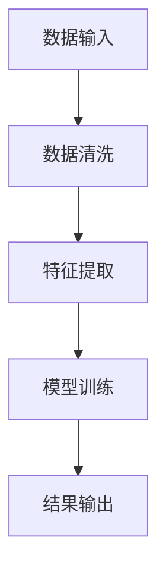
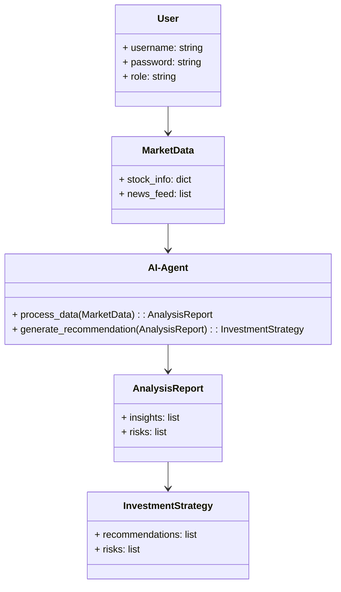
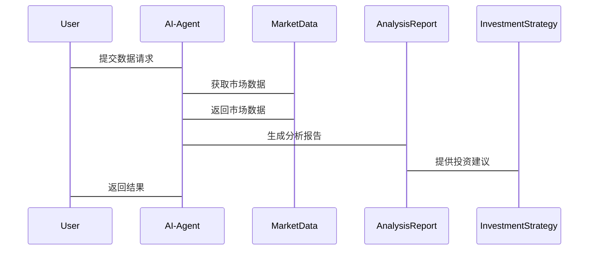

                 


# AI agents辅助价值投资者解读非结构化数据

## 关键词：AI agents, 价值投资, 非结构化数据, 金融分析, 自然语言处理, 机器学习, 投资决策

## 摘要：  
本文探讨了AI agents如何辅助价值投资者解读非结构化数据，通过详细分析AI agents的算法原理、系统架构设计以及实际项目案例，展示了AI技术在金融领域的强大应用潜力。文章首先介绍了AI agents与价值投资的基本概念和问题背景，随后深入探讨了核心算法原理和系统设计，最后通过实际案例展示了AI agents在非结构化数据处理中的应用效果。本文旨在为价值投资者和技术开发者提供一个全面的视角，帮助他们理解并应用AI技术来提升投资决策的效率和准确性。

---

## 第一部分：背景介绍

### 第1章：AI agents与价值投资概述

#### 1.1 问题背景
- **非结构化数据的定义与特点**：  
  非结构化数据是指未经整理、无固定格式的数据，如新闻报道、公司财报、社交媒体评论等。这类数据通常难以直接用于数值分析，但包含丰富的语义信息，对价值投资者的决策至关重要。
  
- **价值投资者的需求与挑战**：  
  价值投资者依赖于对市场、公司和经济趋势的深入分析，而这些分析往往需要处理大量非结构化数据。传统方法依赖人工阅读和分析，效率低下且容易遗漏关键信息。
  
- **AI agents在金融分析中的作用**：  
  AI agents（智能体）通过自然语言处理、机器学习等技术，能够自动提取、分析和解读非结构化数据，为价值投资者提供实时、精准的支持。

#### 1.2 问题描述
- **非结构化数据的复杂性**：  
  非结构化数据的多样性和不一致性使得传统的数据分析方法难以有效处理。
  
- **价值投资者的决策痛点**：  
  价值投资者需要快速获取和分析大量数据，但人工分析效率低，且容易受到主观因素的影响。
  
- **AI agents如何解决这些问题**：  
  AI agents能够自动化处理非结构化数据，提取关键信息，并生成可操作的洞察，帮助投资者做出更明智的决策。

#### 1.3 问题解决
- **AI agents的核心功能**：  
  自动化数据处理、信息提取、语义分析、实时监控和决策支持。
  
- **非结构化数据的处理流程**：  
  数据清洗 → 数据预处理 → 模型训练 → 模型应用 → 结果解读。
  
- **价值投资的决策模型**：  
  通过AI agents提取的关键信息，构建多维度的分析模型，辅助投资者发现潜在投资机会。

#### 1.4 边界与外延
- **AI agents的适用范围**：  
  主要适用于非结构化数据处理、市场趋势分析和投资决策支持，但在复杂市场环境中仍需结合人工判断。
  
- **非结构化数据的边界条件**：  
  数据来源的可信性、数据量的充足性以及数据的实时性。
  
- **价值投资的局限性**：  
  价值投资依赖于长期基本面分析，AI agents只能提供辅助支持，不能完全替代人类的判断。

#### 1.5 核心概念结构
- **AI agents的组成要素**：  
  数据处理模块、自然语言处理模块、机器学习模型、结果解读模块。
  
- **非结构化数据的处理流程**：  
  数据输入 → 数据清洗 → 特征提取 → 模型训练 → 结果输出。
  
- **价值投资的决策模型**：  
  数据分析 → 市场趋势预测 → 投资策略生成 → 风险评估。

---

## 第二部分：核心概念与联系

### 第2章：AI agents的核心原理

#### 2.1 AI agents的定义与特点
- **AI agents的定义**：  
  AI agents是指能够感知环境、执行任务并做出决策的智能实体，能够与用户交互并提供实时支持。
  
- **AI agents的核心特点**：  
  智能性、自主性、适应性和协作性。
  
- **AI agents与传统算法的区别**：  
  AI agents具有更强的自主决策能力和环境适应能力，能够根据实时数据动态调整行为。

#### 2.2 价值投资的定义与特点
- **价值投资的定义**：  
  价值投资是一种以公司基本面分析为基础的投资策略，旨在寻找市场价格低于其内在价值的证券。
  
- **价值投资的核心要素**：  
  公司财务状况、行业地位、管理团队和市场前景。
  
- **价值投资与技术分析的区别**：  
  价值投资注重长期基本面分析，而技术分析侧重于短期价格走势和交易信号。

#### 2.3 非结构化数据的定义与特点
- **非结构化数据的定义**：  
  非结构化数据是指没有固定结构的数据，如文本、图像、音频和视频。
  
- **非结构化数据的类型**：  
  文本数据（如新闻、财报）、社交媒体数据、语音数据等。
  
- **非结构化数据的处理挑战**：  
  数据异构性、语义理解难度大、数据量庞大。

#### 2.4 核心概念对比
- **AI agents与价值投资的对比**：  
  AI agents提供技术手段，价值投资是策略方法；AI agents辅助分析，价值投资依赖于人类判断。
  
- **非结构化数据与结构化数据的对比**：  
  结构化数据具有明确的格式和关系，非结构化数据则缺乏这些特性，但包含丰富的语义信息。
  
- **不同AI模型在金融分析中的应用对比**：  
  基于规则的模型适用于简单的数据处理，而深度学习模型能够捕捉复杂的语义关系。

---

## 第三部分：算法原理讲解

### 第3章：AI agents的算法原理

#### 3.1 算法原理概述
- **算法的基本原理**：  
  AI agents通过自然语言处理技术提取非结构化数据中的关键信息，利用机器学习模型进行分析和预测。
  
- **算法的核心思想**：  
  将非结构化数据转化为结构化信息，通过模型分析生成可操作的决策建议。
  
- **算法的优化方向**：  
  提升语义理解能力、优化模型的泛化能力、降低计算成本。

#### 3.2 算法流程图


#### 3.3 算法实现代码
```python
import pandas as pd
from sklearn.model_selection import train_test_split
from tensorflow.keras import layers

# 数据清洗
def data_cleaning(text):
    import re
    text = re.sub(r'\W+', ' ', text)
    return text.strip()

# 特征提取
def extract_features(text):
    return text.lower()

# 模型训练
def train_model(X_train, y_train):
    model = tf.keras.Sequential([
        layers.Dense(64, activation='relu'),
        layers.Dense(1, activation='sigmoid')
    ])
    model.compile(optimizer='adam', loss='binary_crossentropy')
    model.fit(X_train, y_train, epochs=10, batch_size=32)
    return model

# 测试代码
data = pd.read_csv('input.csv')
data['cleaned'] = data['text'].apply(data_cleaning)
X = data['cleaned'].apply(extract_features)
y = data['label']
X_train, X_test, y_train, y_test = train_test_split(X, y, test_size=0.2)
model = train_model(X_train, y_train)
print("模型训练完成！")
```

#### 3.4 算法的数学模型
- **模型输入**：  
  $x_i$ 表示第i个样本的特征向量。
  
- **模型输出**：  
  $y_i$ 表示第i个样本的标签，取值为0或1。
  
- **损失函数**：  
  $$\text{loss} = -\frac{1}{n}\sum_{i=1}^{n} y_i \log(p_i) + (1 - y_i) \log(1 - p_i)$$
  
- **优化器**：  
  使用Adam优化器，$$\theta_{t+1} = \theta_t - \eta \frac{\partial L}{\partial \theta}$$

---

## 第四部分：系统分析与架构设计

### 第4章：系统架构设计

#### 4.1 问题场景介绍
- **系统目标**：  
  构建一个支持价值投资的AI agents系统，能够实时处理非结构化数据并生成投资建议。
  
- **项目介绍**：  
  本项目旨在利用AI技术辅助价值投资者进行数据处理和决策支持。

#### 4.2 系统功能设计


#### 4.3 系统架构设计


#### 4.4 系统接口设计
- **输入接口**：  
  用户输入非结构化数据或查询请求。
  
- **输出接口**：  
  AI agents生成分析报告和投资建议。
  
- **交互流程图**：  


---

## 第五部分：项目实战

### 第5章：项目实现与案例分析

#### 5.1 环境安装
- **Python 3.8+**
- **TensorFlow 2.0+**
- **NLTK 3.6+**
- **安装命令**：  
  ```bash
  pip install numpy pandas tensorflow nltk scikit-learn
  ```

#### 5.2 核心代码实现
```python
import numpy as np
import pandas as pd
from sklearn.metrics import accuracy_score
from tensorflow.keras.models import Sequential
from tensorflow.keras.layers import Dense, Dropout

# 数据预处理
def preprocess_data(df):
    df['label'] = df['label'].astype(int)
    X = df['text'].values
    y = df['label'].values
    return X, y

# 模型定义
def build_model(input_dim):
    model = Sequential([
        Dense(128, activation='relu', input_dim=input_dim),
        Dropout(0.5),
        Dense(64, activation='relu'),
        Dropout(0.5),
        Dense(1, activation='sigmoid')
    ])
    model.compile(optimizer='adam', loss='binary_crossentropy', metrics=['accuracy'])
    return model

# 训练与评估
def train_and_evaluate(X_train, y_train, X_test, y_test):
    model = build_model(X_train.shape[1])
    model.fit(X_train, y_train, epochs=10, batch_size=32, validation_data=(X_test, y_test))
    y_pred = model.predict(X_test)
    print(f"Accuracy: {accuracy_score(y_test, y_pred.round())}")
```

#### 5.3 代码解读与分析
- **数据预处理**：  
  将文本数据转换为数值特征，通常使用词袋模型或词嵌入。
  
- **模型定义**：  
  构建一个深度神经网络模型，包含多个全连接层和Dropout层用于防止过拟合。
  
- **训练与评估**：  
  使用训练数据训练模型，并在测试数据上评估模型的性能。

#### 5.4 实际案例分析
- **案例背景**：  
  假设某公司发布了一份财报，AI agents需要分析文本内容，提取财务数据并生成投资建议。
  
- **分析过程**：  
  AI agents自动提取关键数据点，生成分析报告，并根据市场趋势预测股票价格走势。
  
- **结果解读**：  
  投资者可以根据AI agents的分析结果，调整投资策略，做出更明智的决策。

#### 5.5 项目小结
- **项目总结**：  
  AI agents能够有效辅助价值投资者处理非结构化数据，提供实时的分析和决策支持。
  
- **项目意义**：  
  通过技术手段提升投资效率，降低人为错误，帮助投资者捕捉更多投资机会。

---

## 第六部分：最佳实践

### 第6章：总结与建议

#### 6.1 小结
- AI agents在非结构化数据处理中的应用潜力巨大，能够显著提升价值投资者的分析效率和决策能力。
  
- 通过技术手段辅助投资决策，是未来金融领域的重要发展方向。

#### 6.2 注意事项
- 数据的准确性和可靠性是AI agents分析的基础，需确保数据来源的可信性。
  
- AI agents的结果应作为辅助工具，投资者需结合市场实际情况进行判断。

#### 6.3 拓展阅读
- 推荐阅读《Python机器学习》和《自然语言处理入门》等书籍，深入理解AI技术在金融领域的应用。

---

## 作者：AI天才研究院 & 禅与计算机程序设计艺术

