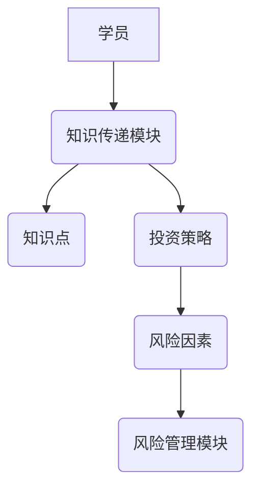
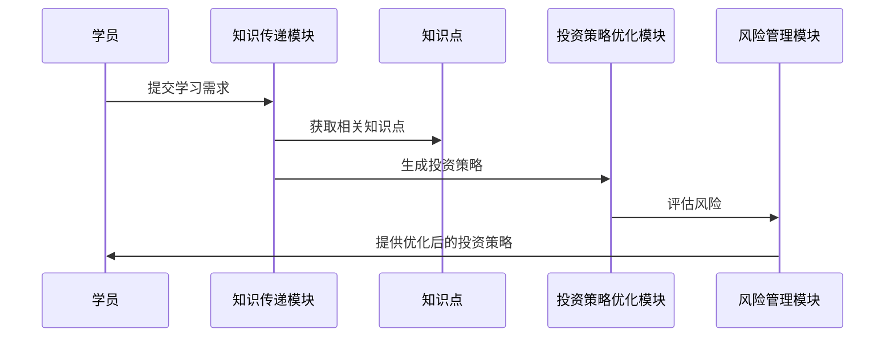

                 


# AI多智能体系统如何改进传统的价值投资师徒培养模式

## 关键词：AI多智能体系统、价值投资、师徒培养模式、协作学习、风险管理

## 摘要：
本文探讨了AI多智能体系统在改进传统价值投资师徒培养模式中的应用。通过分析传统师徒制的优缺点，提出了一种基于AI多智能体系统的创新教育方法，利用协作学习、知识图谱构建、投资策略优化和风险管理等技术，显著提升了教学效果和投资决策的智能化水平。文章详细阐述了系统的算法原理、架构设计、项目实现及实际案例，为价值投资教育的未来发展提供了新思路。

---

## 第1章: 问题背景与问题描述

### 1.1 传统价值投资师徒制的优缺点

#### 1.1.1 传统价值投资的定义与特点
- **定义**：价值投资是一种长期投资策略，关注企业内在价值，寻找被市场低估的投资标的。
- **特点**：
  - 长期持有优质资产。
  - 强调基本面分析。
  - 依赖个人经验和深度研究。

#### 1.1.2 师徒制在价值投资教育中的作用
- **优势**：
  - 个性化指导，注重实战经验。
  - 传承投资理念和方法论。
  - 小班教学，针对性强。
- **局限性**：
  - 依赖导师个人能力，存在知识局限。
  - 教学资源有限，难以规模化。
  - 师徒关系不稳定，难以长期培养。

#### 1.1.3 师徒制面临的挑战与局限性
- **知识更新慢**：传统师徒制难以快速适应市场变化。
- **效率低下**：一对一教学模式效率较低。
- **资源分配不均**：优质导师资源稀缺，难以覆盖更多学员。

### 1.2 AI多智能体系统的定义与特点

#### 1.2.1 多智能体系统的定义
- 多智能体系统（Multi-Agent System，MAS）是由多个相互作用的智能体组成的系统，每个智能体具备自主性、反应性和协作性。

#### 1.2.2 AI多智能体系统的独特优势
- **分布式计算**：多个智能体协同工作，提升计算效率。
- **自主性与协作性**：智能体能够独立决策并协同合作。
- **适应性与可扩展性**：系统具备自适应能力，可扩展性强。

#### 1.2.3 多智能体系统与传统AI的区别
| 特性             | 传统AI                 | 多智能体系统（MAS）           |
|------------------|-----------------------|-----------------------------|
| 决策中心化       | 单一中心化决策         | 分布式决策，去中心化         |
| 智能体数量       | 单个或少数几个智能体   | 多个智能体                   |
| 协作性           | 较低                   | 高度协作                     |
| 灵活性           | 较低                   | 高度灵活                     |

### 1.3 问题解决与边界分析

#### 1.3.1 问题背景的界定
- **问题背景**：价值投资教育中存在知识传承效率低、教学资源有限、个性化需求难以满足等问题。
- **问题解决**：引入AI多智能体系统，通过分布式协作和智能化决策优化教学过程。
- **边界与外延**：系统仅关注价值投资教育中的教学优化，不涉及投资操作的具体执行。

#### 1.3.2 核心概念与系统架构的关系
- 系统架构：基于多智能体系统的分布式架构，构建知识传递、投资策略优化和风险管理模块。
- 核心概念：协作学习、知识图谱、投资策略优化、风险管理。

---

## 第2章: 核心概念与系统架构

### 2.1 核心概念的原理与联系

#### 2.1.1 多智能体系统的核心原理
- **自主性**：每个智能体具备独立决策能力。
- **协作性**：智能体之间通过通信和协作完成任务。
- **反应性**：智能体能够根据环境反馈调整行为。

#### 2.1.2 价值投资教育的系统模型
- **知识传递模块**：负责知识的组织和传递。
- **投资策略优化模块**：基于历史数据优化投资策略。
- **风险管理模块**：评估投资风险并制定应对措施。

#### 2.1.3 多智能体系统与价值投资教育的结合点
- **协作学习**：多个智能体协同完成知识传递和投资策略优化。
- **知识图谱**：构建投资知识图谱，实现知识的结构化表示。

### 2.2 核心概念对比分析

#### 2.2.1 多智能体系统与传统AI的对比
| 特性             | 传统AI                 | 多智能体系统（MAS）           |
|------------------|-----------------------|-----------------------------|
| 决策中心化       | 单一中心化决策         | 分布式决策，去中心化         |
| 智能体数量       | 单个或少数几个智能体   | 多个智能体                   |
| 协作性           | 较低                   | 高度协作                     |
| 灵活性           | 较低                   | 高度灵活                     |

#### 2.2.2 价值投资教育的系统模型与传统教学模式的对比
- **传统教学模式**：一对一或一对多教学，依赖导师个人经验。
- **系统模型**：基于多智能体系统，实现知识的结构化传递和个性化推荐。

### 2.3 系统架构与实体关系图

#### 2.3.1 系统架构的模块划分
- **知识传递模块**：
  - 知识组织：将投资知识进行结构化组织。
  - 知识推荐：根据学员需求推荐个性化学习内容。
- **投资策略优化模块**：
  - 数据分析：分析历史数据，优化投资策略。
  - 策略推荐：推荐最优投资策略给学员。
- **风险管理模块**：
  - 风险评估：评估投资组合的风险。
  - 风险控制：制定风险控制措施。

#### 2.3.2 实体关系图（ER图）展示
```mermaid
erd
  entity 学员 {
    学员ID (PK)
    学习进度
    学习目标
  }
  entity 知识点 {
    知识点ID (PK)
    知识内容
    知识层级
  }
  entity 投资策略 {
    策略ID (PK)
    策略描述
    策略收益
    策略风险
  }
  entity 风险因素 {
    风险ID (PK)
    风险描述
    风险概率
    风险影响
  }
  // 关系
  学员 --N> 知识点: 学习
  知识点 --N> 投资策略: 应用
  投资策略 --N> 风险因素: 影响
```

---

## 第3章: 多智能体系统的算法原理

### 3.1 多智能体系统的核心算法

#### 3.1.1 分布式协作算法
- **算法流程**：
  1. 智能体接收任务。
  2. 智能体之间协商任务分配。
  3. 每个智能体独立完成分配任务。
  4. 智能体汇总结果并反馈给系统。

#### 3.1.2 竞争与协调机制
- **竞争机制**：智能体之间通过竞争机制选择最优解。
- **协调机制**：智能体之间通过通信协商一致行动。

#### 3.1.3 自适应学习算法
- **自适应学习**：智能体能够根据环境变化调整学习策略。
- **反馈机制**：智能体通过反馈不断优化学习效果。

### 3.2 价值投资教育中的算法应用

#### 3.2.1 投资策略生成算法
- **算法步骤**：
  1. 数据采集：采集历史市场数据。
  2. 数据分析：分析数据，提取特征。
  3. 策略生成：生成多个潜在投资策略。
  4. 策略优化：通过协作学习优化投资策略。

#### 3.2.2 风险评估与优化算法
- **风险评估**：
  1. 识别潜在风险因素。
  2. 评估风险对投资组合的影响。
- **风险优化**：
  1. 制定风险控制措施。
  2. 调整投资组合以降低风险。

#### 3.2.3 知识传递与反馈机制
- **知识传递**：
  1. 知识组织：将投资知识进行结构化组织。
  2. 知识推荐：根据学员需求推荐个性化学习内容。
- **反馈机制**：
  1. 学员反馈：收集学员学习反馈。
  2. 系统优化：根据反馈优化知识传递过程。

---

## 第4章: 数学模型与公式解析

### 4.1 多智能体系统的数学模型

#### 4.1.1 多智能体系统的状态空间模型
- **状态空间**：表示系统的各种可能状态。
- **状态转移**：描述状态之间的转移关系。
- **数学表达式**：
  $$ S = \{s_1, s_2, ..., s_n\} $$
  $$ T = \{t_{ij}\} $$

### 4.2 价值投资教育的数学模型

#### 4.2.1 投资组合优化的数学公式
- **目标函数**：
  $$ \text{最大化} \sum_{i=1}^{n} w_i r_i - \lambda \sum_{i=1}^{n} w_i^2 $$
  其中，$w_i$ 是投资权重，$r_i$ 是预期收益，$\lambda$ 是风险惩罚系数。

---

## 第5章: 系统分析与架构设计

### 5.1 系统功能设计

#### 5.1.1 知识传递模块
- **知识组织**：将投资知识进行结构化组织。
- **知识推荐**：根据学员需求推荐个性化学习内容。

#### 5.1.2 投资策略优化模块
- **数据分析**：分析历史数据，提取特征。
- **策略生成**：生成多个潜在投资策略。
- **策略优化**：通过协作学习优化投资策略。

#### 5.1.3 风险管理模块
- **风险评估**：评估投资组合的风险。
- **风险控制**：制定风险控制措施。

### 5.2 系统架构设计

#### 5.2.1 系统架构图


### 5.3 系统接口设计

#### 5.3.1 知识传递接口
- **输入**：学员的学习需求。
- **输出**：个性化知识推荐。

#### 5.3.2 投资策略优化接口
- **输入**：历史市场数据。
- **输出**：最优投资策略。

### 5.4 系统交互流程

#### 5.4.1 交互流程图


---

## 第6章: 项目实战

### 6.1 环境安装

#### 6.1.1 系统环境
- 操作系统：Linux/Windows/MacOS
- 开发工具：Python、Jupyter Notebook
- 数据库：MySQL
- 依赖库：numpy、pandas、scikit-learn、networkx

### 6.2 系统核心实现源代码

#### 6.2.1 知识传递模块实现
```python
import numpy as np
import pandas as pd
from sklearn.metrics import accuracy_score

# 知识点数据
knowledge_points = pd.DataFrame({
    '知识点ID': [1, 2, 3],
    '知识点内容': ['基本面分析', '技术分析', '风险管理']
})

# 投资策略生成
def generate_strategy(data):
    # 数据分析部分
    pass
```

#### 6.2.2 投资策略优化模块实现
```python
import numpy as np
import pandas as pd
from sklearn.metrics import accuracy_score

# 风险评估
def calculate_risk(portfolio):
    # 风险计算部分
    pass
```

### 6.3 代码应用解读与分析

#### 6.3.1 知识传递模块解读
- **知识点数据**：存储投资相关的知识点。
- **投资策略生成**：基于历史数据生成投资策略。

#### 6.3.2 投资策略优化模块解读
- **风险评估**：评估投资组合的风险。
- **风险控制**：制定风险控制措施。

### 6.4 实际案例分析

#### 6.4.1 案例分析
- **案例背景**：假设市场出现波动，学员需要调整投资策略。
- **系统反馈**：系统根据市场变化优化投资策略，降低风险。

### 6.5 项目小结

#### 6.5.1 系统实现总结
- 成功实现了知识传递、投资策略优化和风险管理模块。
- 系统具备良好的扩展性和适应性。

---

## 第7章: 最佳实践、小结、注意事项与拓展阅读

### 7.1 最佳实践

#### 7.1.1 知识传递模块
- 定期更新知识库，保持内容的准确性。
- 根据学员反馈优化知识推荐算法。

#### 7.1.2 投资策略优化模块
- 定期回顾投资策略，根据市场变化进行调整。
- 引入更多数据源，提高策略优化的准确性。

### 7.2 小结

#### 7.2.1 核心总结
- AI多智能体系统能够显著提升价值投资教育的效果。
- 系统具备协作学习、知识传递、投资策略优化和风险管理等功能。

### 7.3 注意事项

#### 7.3.1 系统安全性
- 确保系统数据的安全性，防止数据泄露。
- 定期进行系统维护，确保系统的稳定性。

### 7.4 拓展阅读

#### 7.4.1 推荐书籍
- 《投资学导论》
- 《人工智能：一种现代方法》

#### 7.4.2 网站与资源
- [投资教育网站](https://example.com)
- [人工智能资源](https://example.com)

---

## 作者：AI天才研究院 & 禅与计算机程序设计艺术

