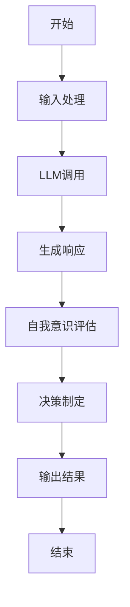
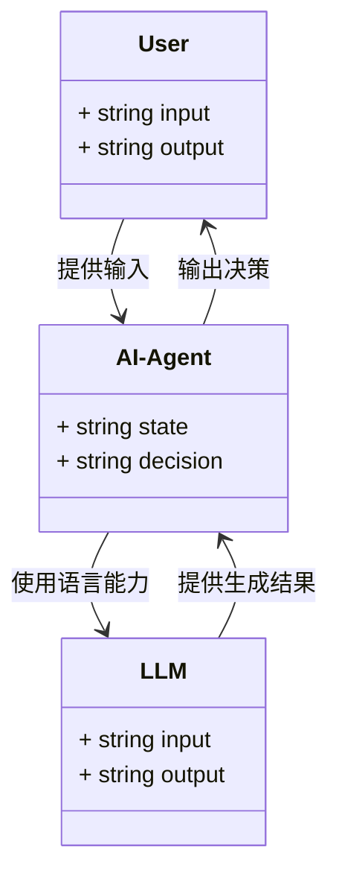
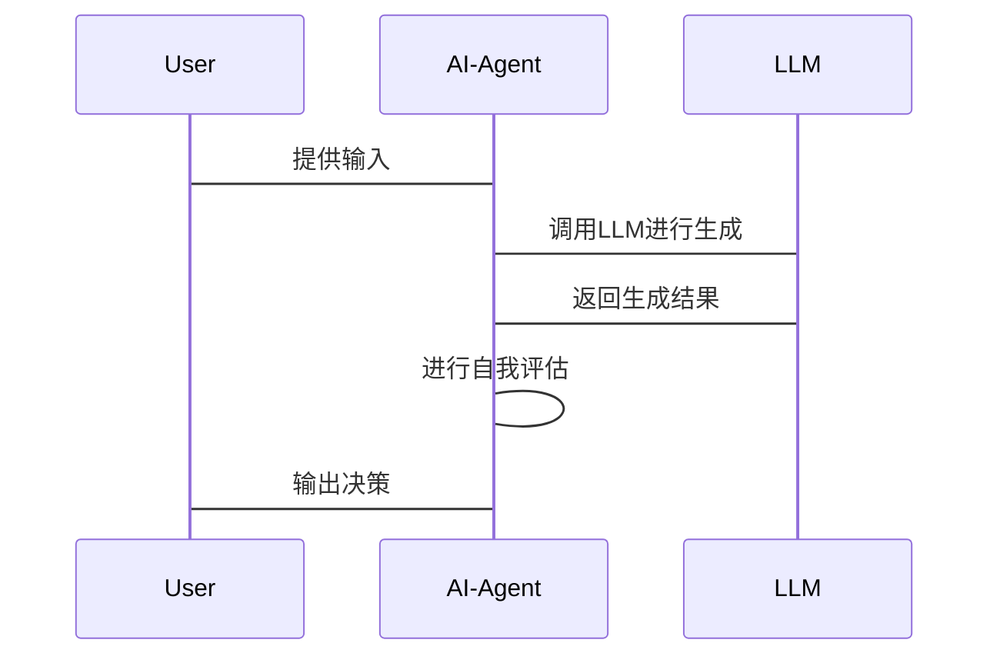

                 


# LLM在AI Agent自我意识模拟中的应用

---

## 关键词

- 大语言模型（LLM）
- AI Agent
- 自我意识
- 模拟技术
- 算法原理
- 系统架构

---

## 摘要

随着人工智能技术的快速发展，大语言模型（LLM）在AI Agent中的应用越来越广泛。本文详细探讨了LLM在AI Agent自我意识模拟中的应用，从核心概念、算法原理、系统架构到项目实战，逐步分析了如何通过LLM实现AI Agent的自我意识模拟。文章结合理论与实践，提供了丰富的案例和详细的代码实现，帮助读者全面理解并掌握这一前沿技术。

---

## 第1章：背景介绍

### 1.1 问题背景

#### 1.1.1 LLM的定义与特点

- **定义**：大语言模型（LLM）是基于深度学习的自然语言处理模型，具有强大的文本理解和生成能力。
- **特点**：
  - 大规模训练数据
  - 预训练微调能力
  - 强大的上下文理解和生成能力
  - 可扩展性

#### 1.1.2 AI Agent的基本概念

- **定义**：AI Agent是一种智能体，能够感知环境、自主决策并执行任务。
- **特点**：
  - 自主性
  - 反应性
  - 目标驱动
  - 学习能力

#### 1.1.3 问题背景：LLM与AI Agent的结合

- LLM为AI Agent提供强大的语言理解和生成能力。
- AI Agent为LLM提供任务目标和环境交互能力。
- 结合两者，可以实现更智能、更自然的交互。

### 1.2 问题描述

#### 1.2.1 LLM在AI Agent中的作用

- 提供语言理解和生成能力。
- 支持对话式交互。
- 通过上下文理解进行决策。

#### 1.2.2 自我意识模拟的核心问题

- AI Agent需要具备自我反思能力。
- 需要理解自身状态和环境。
- 需要具备目标导向的决策能力。

#### 1.2.3 当前技术的局限性

- 现有LLM缺乏对自身状态的明确理解。
- AI Agent的自我意识模拟仍处于初级阶段。
- 需要结合多模态数据进行更复杂的推理。

### 1.3 问题解决

#### 1.3.1 LLM如何模拟AI Agent的自我意识

- 利用LLM的生成能力模拟自我反思。
- 通过上下文理解进行自我状态评估。
- 使用多模态数据进行综合推理。

#### 1.3.2 技术实现的路径与方法

- 结合预训练和微调技术。
- 引入外部知识库增强理解。
- 实现动态交互机制。

#### 1.3.3 现有解决方案的优缺点

- **优点**：
  - 利用现有LLM的强大能力。
  - 简化实现过程。
  - 可快速部署。
- **缺点**：
  - 自我意识模拟的深度有限。
  - 依赖外部数据和模型。
  - 需要大量计算资源。

### 1.4 边界与外延

#### 1.4.1 LLM在AI Agent中的应用边界

- 语言理解和生成的边界。
- 自我意识模拟的边界。
- 任务目标的范围界定。

#### 1.4.2 自我意识模拟的范围界定

- 自我状态评估。
- 自我目标设定。
- 自我反思与优化。

#### 1.4.3 相关领域的交叉与融合

- 与自然语言处理的融合。
- 与机器学习的结合。
- 与人机交互的交叉。

---

## 第2章：核心概念与联系

### 2.1 核心概念原理

#### 2.1.1 LLM的基本原理

- **预训练**：通过大规模数据训练模型，学习语言的结构和语义。
- **微调**：在特定任务上进行优化，提升模型的性能。

#### 2.1.2 AI Agent的自我意识机制

- **自我评估**：评估自身的状态和能力。
- **目标设定**：根据评估结果设定目标。
- **决策制定**：基于目标制定行动计划。

#### 2.1.3 两者结合的理论基础

- **语言作为认知工具**：LLM通过语言理解和生成支持AI Agent的认知过程。
- **自我反思的实现**：AI Agent通过LLM进行自我反思和优化。

### 2.2 概念属性特征对比

#### 2.2.1 LLM的属性特征

| 属性 | 特征 |
|------|------|
| 数据量 | 大规模训练数据 |
| 模型结构 | 基于Transformer架构 |
| 任务能力 | 支持多种自然语言处理任务 |

#### 2.2.2 AI Agent的属性特征

| 属性 | 特征 |
|------|------|
| 自主性 | 能够自主决策 |
| 反应性 | 能够实时响应环境变化 |
| 学习能力 | 能够通过经验改进性能 |

#### 2.2.3 对比分析表

| 属性 | LLM | AI Agent |
|------|------|----------|
| 核心能力 | 语言理解和生成 | 自主决策与交互 |
| 输入 | 文本数据 | 环境感知与任务目标 |
| 输出 | 文本生成 | 行动决策 |

### 2.3 ER实体关系图

```mermaid
er
  %%{init: 'flowchart', background: 'transparent', padding: '0'}%%
  actor User
  actor AI-Agent
  actor LLM
  database LLModel
  database AgentState
  relation LLM_Agent_Communication
  relation User_Input
  relation Agent_Output

  User --> LLM: 提供输入
  LLM --> AI-Agent: 提供语言支持
  AI-Agent --> LLM: 使用语言能力进行决策
  AI-Agent --> User: 输出结果
  LLM --> LLModel: 训练与存储
  AI-Agent --> AgentState: 状态更新
```

---

## 第3章：算法原理讲解

### 3.1 算法流程图



### 3.2 Python源代码实现

#### 3.2.1 环境安装

```bash
pip install transformers
pip install torch
pip install numpy
```

#### 3.2.2 核心代码实现

```python
from transformers import AutoTokenizer, AutoModelForCausalLM
import torch

class AIAgent:
    def __init__(self, model_name):
        self.tokenizer = AutoTokenizer.from_pretrained(model_name)
        self.model = AutoModelForCausalLM.from_pretrained(model_name)
        
    def self_reflection(self, input_text):
        inputs = self.tokenizer.encode(input_text, return_tensors='pt')
        outputs = self.model.generate(inputs, max_length=50, do_sample=True)
        response = self.tokenizer.decode(outputs[0], skip_special_tokens=True)
        return response
    
    def decision_making(self, state):
        # 假设state是当前AI Agent的状态
        reflection = self.self_reflection(f"My current state is {state}. What should I do?")
        # 解析反思结果并制定决策
        return self.analyze_reflection(reflection)
    
    def analyze_reflection(self, reflection):
        # 示例分析逻辑
        if "action A" in reflection:
            return "action A"
        elif "action B" in reflection:
            return "action B"
        else:
            return "action C"
```

#### 3.2.3 算法数学模型

- **损失函数**：交叉熵损失
  $$ L = -\sum_{i=1}^{n} y_i \log(p_i) $$
  
- **概率分布**：生成概率
  $$ P(y|x) = \text{softmax}(h(x)) $$

---

## 第4章：系统分析与架构设计

### 4.1 系统功能设计

#### 4.1.1 领域模型



#### 4.1.2 系统架构设计


### 4.2 接口设计与交互流程图

#### 4.2.1 接口设计

| 接口名称 | 输入 | 输出 |
|---------|------|------|
| self_reflection | input_text | response |
| decision_making | state | decision |

#### 4.2.2 交互流程图



---

## 第5章：项目实战

### 5.1 环境安装

```bash
pip install transformers torch numpy
```

### 5.2 核心代码实现

```python
from transformers import AutoTokenizer, AutoModelForCausalLM
import torch

class AIAgent:
    def __init__(self, model_name):
        self.tokenizer = AutoTokenizer.from_pretrained(model_name)
        self.model = AutoModelForCausalLM.from_pretrained(model_name)
        
    def self_reflection(self, input_text):
        inputs = self.tokenizer.encode(input_text, return_tensors='pt')
        outputs = self.model.generate(inputs, max_length=50, do_sample=True)
        response = self.tokenizer.decode(outputs[0], skip_special_tokens=True)
        return response
    
    def decision_making(self, state):
        reflection = self.self_reflection(f"My current state is {state}. What should I do?")
        if "action A" in reflection:
            return "action A"
        elif "action B" in reflection:
            return "action B"
        else:
            return "action C"
```

### 5.3 实际案例分析

#### 5.3.1 案例分析

假设AI Agent当前状态为“需要帮助用户完成一个数据分析任务”。通过LLM进行自我反思，生成的响应为“我应该引导用户完成数据清洗和分析”。AI Agent根据反思结果，决定执行“action A：指导用户完成数据清洗”。

#### 5.3.2 代码应用解读

```python
agent = AIAgent("gpt2")
state = "需要帮助用户完成数据分析任务"
decision = agent.decision_making(state)
print(decision)  # 输出："action A"
```

---

## 第6章：最佳实践、小结、注意事项和拓展阅读

### 6.1 小结

通过本文的详细讲解，读者可以全面理解LLM在AI Agent自我意识模拟中的应用。从理论到实践，从算法到系统架构，我们逐步探讨了如何利用大语言模型实现AI Agent的自我反思和决策制定。

### 6.2 注意事项

- **数据隐私**：在实际应用中，需注意数据隐私和模型安全。
- **计算资源**：LLM的运行需要大量计算资源，需确保硬件支持。
- **模型调优**：根据具体任务，进行模型的微调和优化。

### 6.3 拓展阅读

- **推荐书籍**：
  - 《Deep Learning》
  - 《自然语言处理入门》
- **推荐论文**：
  - "Attention Is All You Need"
  - "BERT: Pre-training of Deep Bidirectional Transformers for NLP"

---

## 附录

### 附录A：参考文献

1. "Transformers: Pre-training of Deep Bidirectional Transformers for NLP"，2018.
2. "GPT-2: Pre-trained Denoising Model for Text Generation"，2019.
3. "BERT: Pre-training of Deep Bidirectional Transformers for NLP"，2018.

### 附录B：工具资源

- Hugging Face Transformers库：[https://huggingface.co/transformers](https://huggingface.co/transformers)
- PyTorch官方文档：[https://pytorch.org](https://pytorch.org)

---

## 作者

作者：AI天才研究院/AI Genius Institute & 禅与计算机程序设计艺术 /Zen And The Art of Computer Programming

---

通过以上结构，文章详细阐述了LLM在AI Agent自我意识模拟中的应用，从理论到实践，结合丰富的案例和代码示例，帮助读者全面理解和掌握这一技术。

