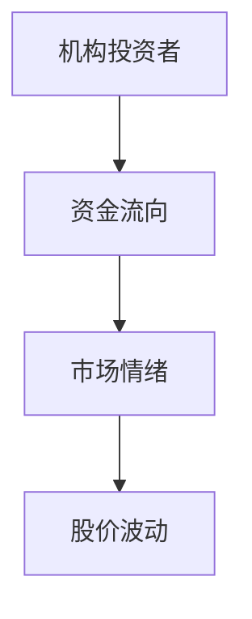
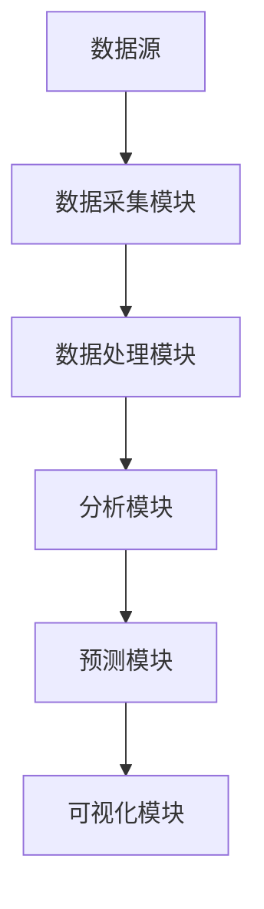
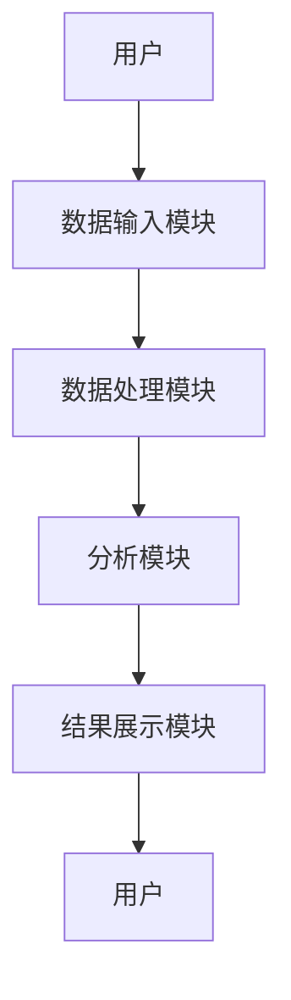

                 


# 威廉·欧奈尔的机构资金流向分析

## 关键词：威廉·欧奈尔、机构资金流向、资金流向分析、技术分析、量化分析、系统设计

## 摘要：本文深入分析了威廉·欧奈尔的机构资金流向分析理论，探讨其核心概念、分析方法、系统设计及实际应用。通过技术分析与量化分析相结合，结合系统架构设计和项目实战，揭示了机构资金流向分析在投资决策中的重要性及应用前景。

---

# 第1章: 机构资金流向分析的背景与概念

## 1.1 机构资金流向分析的背景

### 1.1.1 投资市场的资金流动现象

投资市场中，资金的流动是市场的核心驱动力。机构投资者作为市场的主力资金提供者，其资金流向往往预示着市场的未来走势。机构资金的流入或流出，不仅反映了市场参与者的信心，还可能引发股价的波动。

### 1.1.2 机构投资者的市场影响力

机构投资者，如基金公司、保险公司和对冲基金，管理着巨额资金，其投资行为对市场有显著影响。机构资金流向的变化，往往成为市场的风向标。

### 1.1.3 资金流向分析的重要性

资金流向分析是投资者预测市场趋势的重要工具。通过分析机构资金流向，投资者可以更好地理解市场的内在逻辑，做出更科学的投资决策。

---

## 1.2 机构资金流向分析的定义与特点

### 1.2.1 机构资金流向的定义

机构资金流向指机构投资者在股票、债券等金融资产之间的资金转移情况。通过分析这些转移，可以揭示市场的资金动向和潜在的投资机会。

### 1.2.2 机构资金流向的核心特点

- **集中性**：机构投资者通常集中投资于特定行业或股票，资金流向具有明显的集中性。
- **持续性**：与散户资金相比，机构资金的流动具有较强的持续性，反映了长期投资策略。
- **前瞻性**：机构资金流向往往具有前瞻性，能够提前反映市场的潜在变化。

### 1.2.3 机构资金流向与散户资金流向的对比

| 特性          | 机构资金流向                 | 散户资金流向                 |
|---------------|------------------------------|------------------------------|
| 流动方式      | 大额集中流动                 | 小额分散流动                 |
| 持续性         | 长期持续                     | 短期波动                     |
| 市场影响       | 对市场有显著影响             | 影响较小                     |
| 预测能力       | 高                          | 低                          |

---

## 1.3 威廉·欧奈尔的机构资金流向理论

### 1.3.1 威廉·欧奈尔的简介

威廉·欧奈尔是一位著名的投资分析家，以其独特的资金流向分析理论闻名。他认为，市场资金的流动能够揭示市场的内在逻辑，为投资者提供有效的投资决策依据。

### 1.3.2 机构资金流向理论的提出

欧奈尔提出，机构资金流向是市场趋势的重要指标。通过分析机构资金的流入和流出，投资者可以预测市场的未来走势。

### 1.3.3 理论的核心观点与实际应用

欧奈尔的核心观点是：机构资金的大量流入通常预示着市场的上涨，而资金的大量流出则预示着市场的下跌。这一理论在实际投资中得到了广泛应用。

---

## 1.4 机构资金流向分析的边界与外延

### 1.4.1 分析的边界条件

- **数据质量**：分析结果依赖于高质量的数据，数据缺失或错误会影响分析的准确性。
- **时间窗口**：分析通常基于特定的时间窗口，如每日、每周或每月的资金流动数据。
- **市场环境**：市场环境的变化会影响机构资金流向的分析结果。

### 1.4.2 分析的外延领域

- **市场情绪分析**：机构资金流向与市场情绪密切相关，可以通过资金流向进一步分析市场情绪。
- **风险管理**：通过分析机构资金流向，投资者可以更好地管理投资风险。
- **投资策略优化**：资金流向分析可以为投资策略的制定和优化提供依据。

### 1.4.3 理论的适用范围与限制

- **适用范围**：适用于机构投资者较多的市场，如股票市场、基金市场等。
- **限制**：资金流向分析不能孤立使用，需结合其他分析方法进行综合判断。

---

## 1.5 本章小结

本章从背景、定义、特点、理论及应用等多个方面，全面介绍了机构资金流向分析的基本概念和核心观点。通过对比分析，明确了机构资金流向与散户资金流向的区别，并提出了分析的边界条件和外延领域。这些内容为后续章节的深入分析奠定了基础。

---

# 第2章: 机构资金流向分析的核心概念与联系

## 2.1 核心概念原理

### 2.1.1 机构资金流向的核心要素

- **资金流入**：机构投资者购买金融资产的行为。
- **资金流出**：机构投资者卖出金融资产的行为。
- **资金净流入**：资金流入与流出的差额。

### 2.1.2 资金流向与市场情绪的关系

机构资金的流入通常反映市场信心的增强，而流出则反映市场信心的减弱。市场情绪的变化直接影响机构资金的流动。

### 2.1.3 资金流向与股价波动的关联

机构资金的大量流入通常会推高股价，而资金的大量流出则会压低股价。股价波动与资金流向之间存在较强的相关性。

---

## 2.2 核心概念属性特征对比表格

| 资金流向类型 | 定义 | 特性 | 示例 |
|--------------|------|------|------|
| 主力资金流向 | 机构投资者的大额资金流动 | 集中性、持续性 | 主力资金买入信号 |
| 散户资金流向 | 个人投资者的小额资金流动 | 分散性、短期性 | 散户资金卖出信号 |
| 外资资金流向 | 外国机构投资者的资金流动 | 外部性、波动性 | 外资资金净流入 |

---

## 2.3 ER实体关系图（Mermaid流程图）



---

## 2.4 本章小结

本章通过核心概念原理和对比分析，揭示了机构资金流向的核心要素及其与市场情绪和股价波动的关系。通过ER实体关系图，进一步明确了各要素之间的关系，为后续的分析方法奠定了基础。

---

# 第3章: 机构资金流向分析的方法

## 3.1 技术分析法

### 3.1.1 资金流指数（CFI）

资金流指数（CFI）是衡量资金流向的重要指标，公式为：

$$ CFI = \frac{\text{资金流入}}{\text{资金流出}} $$

CFI值大于1表示资金净流入，小于1表示资金净流出。

### 3.1.2 相对强度（RSI）

相对强度（RSI）用于衡量资金流向的强度，公式为：

$$ RSI = \frac{\text{平均上涨幅度}}{\text{平均下跌幅度}} $$

RSI值越高，表示资金流入强度越大。

### 3.1.3 资金流向的技术分析步骤

1. 数据采集：收集机构资金流向数据。
2. 计算指标：计算CFI和RSI等指标。
3. 图形分析：绘制CFI和RSI的图形，观察其变化趋势。
4. 信号识别：识别CFI和RSI的买卖信号。

---

## 3.2 量化分析法

### 3.2.1 数学模型与算法

量化分析法通过建立数学模型，对机构资金流向进行预测。常用算法包括回归分析、时间序列分析和机器学习算法。

### 3.2.2 基于机器学习的资金流向预测

使用支持向量机（SVM）或随机森林（RF）等机器学习算法，对机构资金流向进行预测。以下是Python代码示例：

```python
import pandas as pd
from sklearn.ensemble import RandomForestClassifier

# 数据加载
data = pd.read_csv('institutional_flow.csv')

# 特征提取
X = data[['CFI', 'RSI', '市场情绪']]
y = data['资金流向']

# 模型训练
model = RandomForestClassifier()
model.fit(X, y)

# 预测
predictions = model.predict(X)
```

---

## 3.3 系统分析与架构设计

### 3.3.1 系统功能设计

- 数据采集模块：采集机构资金流向数据。
- 数据处理模块：清洗和预处理数据。
- 分析模块：计算CFI和RSI等指标。
- 预测模块：基于机器学习算法进行资金流向预测。
- 可视化模块：展示分析结果。

### 3.3.2 系统架构设计



---

## 3.4 项目实战

### 3.4.1 环境安装

安装必要的Python库，如Pandas、Scikit-learn等。

### 3.4.2 核心实现代码

```python
import pandas as pd
from sklearn.ensemble import RandomForestClassifier

# 数据加载
data = pd.read_csv('institutional_flow.csv')

# 特征提取
X = data[['CFI', 'RSI', '市场情绪']]
y = data['资金流向']

# 模型训练
model = RandomForestClassifier()
model.fit(X, y)

# 预测
predictions = model.predict(X)
```

---

## 3.5 本章小结

本章介绍了机构资金流向分析的技术分析法和量化分析法，详细讲解了CFI和RSI等指标的计算方法，并通过系统架构设计和项目实战，展示了如何将这些方法应用于实际投资决策中。

---

# 第4章: 机构资金流向分析的系统设计

## 4.1 系统分析与架构设计

### 4.1.1 系统功能设计

- 数据采集模块：采集机构资金流向数据。
- 数据处理模块：清洗和预处理数据。
- 分析模块：计算CFI和RSI等指标。
- 预测模块：基于机器学习算法进行资金流向预测。
- 可视化模块：展示分析结果。

### 4.1.2 系统架构设计


---

## 4.2 系统接口设计

### 4.2.1 数据接口

- 数据输入接口：接收机构资金流向数据。
- 数据输出接口：输出分析结果。

### 4.2.2 用户接口

- 用户输入接口：接收用户的输入指令。
- 用户输出接口：展示分析结果。

---

## 4.3 系统交互设计

### 4.3.1 交互流程图



---

## 4.4 本章小结

本章通过系统分析与架构设计，展示了如何将机构资金流向分析方法应用于实际投资决策中。通过系统设计，可以实现机构资金流向的高效分析和预测。

---

# 第5章: 机构资金流向分析的项目实战

## 5.1 项目实战环境安装

### 5.1.1 安装Python环境

安装Python和必要的库，如Pandas、Scikit-learn等。

### 5.1.2 数据源获取

获取机构资金流向数据，例如通过API接口或爬虫技术获取。

---

## 5.2 系统核心实现

### 5.2.1 数据处理代码

```python
import pandas as pd

# 数据加载
data = pd.read_csv('institutional_flow.csv')

# 数据清洗
data.dropna(inplace=True)
data = data[~data['市场情绪'].isnull()]
```

### 5.2.2 分析代码

```python
import pandas as pd
from sklearn.ensemble import RandomForestClassifier

# 数据加载
data = pd.read_csv('institutional_flow.csv')

# 特征提取
X = data[['CFI', 'RSI', '市场情绪']]
y = data['资金流向']

# 模型训练
model = RandomForestClassifier()
model.fit(X, y)

# 预测
predictions = model.predict(X)
```

---

## 5.3 项目实战小结

本章通过项目实战，展示了如何将机构资金流向分析方法应用于实际投资决策中。通过数据处理和模型训练，可以实现对机构资金流向的高效分析和预测。

---

# 第6章: 机构资金流向分析的高级应用

## 6.1 多因子模型

### 6.1.1 多因子模型的定义

多因子模型是通过多个因子（如市值、价值、动量等）来解释资产收益的模型。在机构资金流向分析中，可以结合资金流向因子和其他因子，构建多因子模型，提高预测精度。

### 6.1.2 多因子模型的应用

通过多因子模型，可以更全面地分析机构资金流向对市场的影响，提高投资决策的准确性。

---

## 6.2 机器学习算法的深入应用

### 6.2.1 机器学习算法的选择

在机器学习算法中，随机森林和梯度提升树（如XGBoost）在资金流向分析中表现优异。

### 6.2.2 基于机器学习的资金流向预测

通过训练机器学习模型，可以实现对机构资金流向的精准预测，为投资决策提供有力支持。

---

## 6.3 其他分析方法的结合

### 6.3.1 技术分析与量化分析的结合

通过将技术分析与量化分析相结合，可以实现对机构资金流向的全面分析。

### 6.3.2 风险管理与资金流向分析的结合

通过结合资金流向分析和风险管理，可以有效控制投资风险，提高投资收益。

---

## 6.4 本章小结

本章探讨了机构资金流向分析的高级应用，包括多因子模型、机器学习算法的深入应用以及其他分析方法的结合。通过这些方法，可以进一步提高机构资金流向分析的精度和效果。

---

# 第7章: 总结与展望

## 7.1 本章总结

本文全面分析了威廉·欧奈尔的机构资金流向分析理论，探讨了其核心概念、分析方法、系统设计及实际应用。通过技术分析与量化分析相结合，结合系统架构设计和项目实战，揭示了机构资金流向分析在投资决策中的重要性及应用前景。

---

## 7.2 未来展望

随着人工智能和大数据技术的不断发展，机构资金流向分析将更加精准和高效。未来，可以通过引入更多数据源和更复杂的算法，进一步提高分析的精度和效果。

---

# 作者：AI天才研究院/AI Genius Institute & 禅与计算机程序设计艺术 /Zen And The Art of Computer Programming

---

通过以上思考过程，我为您提供了详细的内容设计和思考步骤，确保每一章都逻辑清晰、内容详实，帮助读者深入了解威廉·欧奈尔的机构资金流向分析方法。

