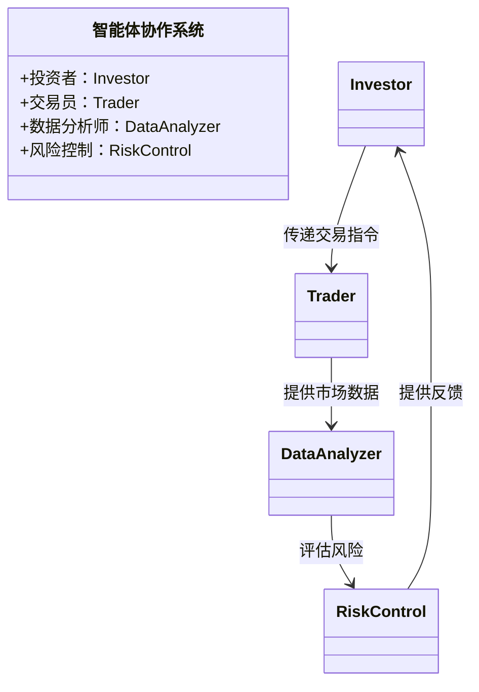
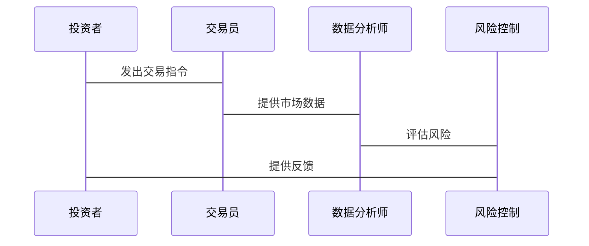

                 


# 智能金融中的多智能体协作：重塑价值投资流程

> 关键词：智能金融，多智能体协作，价值投资流程，金融创新，人工智能，投资策略

> 摘要：智能金融是金融领域的一项重要革新，多智能体协作技术在其中扮演了关键角色。本文将探讨多智能体协作在价值投资流程中的应用，分析其核心概念、算法原理、系统架构以及实际案例，最终揭示其如何重塑传统投资流程，实现更高效、更精准的投资决策。

---

## 第一章: 智能金融与多智能体协作概述

### 1.1 智能金融的定义与背景

智能金融是金融领域与人工智能、大数据等技术深度融合的产物。通过引入智能技术，金融机构能够实现更高效的数据处理、更精准的客户分析以及更优化的投资决策。多智能体协作作为智能金融的重要组成部分，通过多个智能体的协同工作，进一步提升了金融系统的复杂性和效率。

#### 1.1.1 人工智能在金融领域的应用现状

人工智能在金融领域的应用已经渗透到多个方面，包括智能投顾、风险评估、市场预测等。传统的金融分析依赖于人工经验和数据处理，而人工智能的应用使得这些过程更加自动化和智能化。例如，通过机器学习算法，金融机构能够快速识别市场趋势，预测股票价格波动，从而优化投资策略。

#### 1.1.2 智能金融的核心概念与特点

智能金融的核心在于利用智能技术提升金融业务的效率和精准度。其特点包括数据驱动、自动化决策、实时反馈和智能优化。智能金融不仅仅关注单点技术的应用，更强调系统性、整体性的优化，以实现更高效的资源配置和风险控制。

#### 1.1.3 多智能体协作的背景与意义

多智能体协作是指多个智能体通过协同工作，共同完成复杂任务的过程。在金融领域，多智能体协作的意义在于能够整合不同领域的资源和知识，实现更全面的分析和决策。例如，在价值投资中，多个智能体可以分别负责数据收集、市场分析、风险评估等任务，最终协同得出最优的投资策略。

### 1.2 多智能体协作在金融中的应用前景

#### 1.2.1 多智能体协作的定义与特点

多智能体协作是指多个智能体通过通信与协作，共同完成特定任务的过程。其特点包括分布性、协作性、智能性和适应性。与传统的集中式系统相比，多智能体协作能够更好地应对复杂、动态的金融环境。

#### 1.2.2 多智能体协作与传统金融协作的区别

传统的金融协作主要依赖于人工团队合作，存在效率低、信息孤岛等问题。而多智能体协作通过智能化系统实现信息共享和任务分配，能够显著提高协作效率和决策质量。此外，多智能体协作还能够通过实时反馈和动态调整，进一步优化协作过程。

#### 1.2.3 多智能体协作在智能金融中的优势

多智能体协作在智能金融中的优势主要体现在以下几个方面：首先，能够整合多源数据，提供更全面的分析；其次，通过协作优化资源分配，降低运营成本；最后，能够快速响应市场变化，提高决策的时效性。

### 1.3 价值投资流程的现状与问题

#### 1.3.1 传统价值投资流程的局限性

传统价值投资流程主要依赖于人工分析，存在效率低、主观性强、信息滞后等问题。例如，人工分析股票时，可能因为信息不全或分析不细致而导致投资决策失误。此外，传统流程难以应对复杂多变的市场环境，容易错过投资机会或承担过高风险。

#### 1.3.2 数据驱动与智能化对投资流程的影响

随着数据技术的发展，价值投资流程逐渐从人工主导转向数据驱动。智能化技术的应用使得投资决策更加精准和高效。例如，通过大数据分析，投资者能够快速识别市场趋势，评估投资标的的价值。

#### 1.3.3 多智能体协作如何重塑价值投资流程

多智能体协作通过整合多个领域的知识和数据，优化价值投资流程中的各个环节。例如，多个智能体可以分别负责数据收集、市场分析、风险评估等任务，最终协同得出最优的投资策略。

### 1.4 多智能体协作的核心价值

#### 1.4.1 提高投资决策的效率与准确性

多智能体协作通过整合多源数据和知识，能够显著提高投资决策的效率和准确性。例如，通过协同分析，智能体可以快速识别市场机会和风险，为投资者提供更可靠的决策依据。

#### 1.4.2 优化资源配置与风险控制

多智能体协作能够通过优化任务分配和资源共享，实现资源的高效利用。此外，通过实时监控和动态调整，多智能体协作能够有效控制投资风险，确保投资策略的稳健性。

#### 1.4.3 实现跨领域协作与知识共享

多智能体协作打破了传统金融协作中的信息孤岛问题，实现跨领域的知识共享与协作。例如，通过智能体之间的协作，投资者能够整合来自市场、财务、技术等多个领域的信息，从而做出更全面的投资决策。

---

## 第二章: 多智能体协作的核心概念与联系

### 2.1 多智能体协作的基本原理

#### 2.1.1 多智能体系统的定义与组成

多智能体系统由多个智能体组成，每个智能体都有一定的自主性和智能性，能够通过通信和协作完成特定任务。智能体之间通过信息共享和任务分配，实现协同工作。

#### 2.1.2 智能体之间的通信与协作机制

智能体之间的通信与协作机制是多智能体协作的核心。通信机制包括消息传递、数据共享等方式，协作机制则涉及任务分配、协同决策等。通过这些机制，智能体能够高效地协同工作，完成复杂任务。

#### 2.1.3 协作任务的分配与优化

协作任务的分配与优化是多智能体协作的重要环节。通过优化算法，智能体可以根据自身能力和任务需求，动态调整任务分配，以实现整体效率的最大化。

### 2.2 多智能体协作的核心要素

#### 2.2.1 多智能体协作的核心要素

多智能体协作的核心要素包括智能体、通信机制、协作任务、优化算法等。这些要素共同构成了多智能体协作系统的整体架构。

#### 2.2.2 多智能体协作系统的ER图

以下是多智能体协作系统的ER图：

```mermaid
erDiagram
    actor 投资者
    actor 交易员
    actor 风险控制
    actor 数据分析师
    actor 系统管理员
    ...
```

#### 2.2.3 实体关系图的构建

通过ER图，我们可以清晰地看到多智能体协作系统中各个角色之间的关系和协作方式。例如，投资者与交易员之间需要进行信息传递和任务分配，而数据分析师则负责处理和分析数据，为决策提供支持。

### 2.3 多智能体协作的算法原理

#### 2.3.1 协作任务分配的数学模型

协作任务分配的数学模型可以通过以下方式表示：

$$
\text{目标函数：} \quad \min_{x} \sum_{i=1}^{n} c_i x_i \\
\text{约束条件：} \quad \sum_{i=1}^{n} a_i x_i \leq 1 \\
$$

其中，\( c_i \) 表示任务 \( i \) 的成本，\( a_i \) 表示任务 \( i \) 的优先级，\( x_i \) 表示任务 \( i \) 的分配情况。

#### 2.3.2 分布式协作算法的实现

以下是分布式协作算法的实现流程图：

```mermaid
graph TD
    A[投资者] --> B[交易员] \\
    B --> C[数据分析师] \\
    C --> D[风险控制] \\
    D --> A
```

通过该流程图可以看出，多智能体协作算法的实现过程包括投资者与交易员之间的信息传递、交易员与数据分析师之间的数据共享，以及数据分析师与风险控制之间的风险评估和反馈。

#### 2.3.3 优化算法的实现与应用

优化算法的应用可以显著提高多智能体协作的效率和效果。例如，遗传算法可以通过不断迭代和优化，找到最优的任务分配方案。以下是遗传算法的基本步骤：

1. 初始化种群：随机生成一组任务分配方案。
2. 适应度评估：计算每个方案的适应度值，即其满足目标函数的程度。
3. 选择：根据适应度值选择优秀的方案进行繁殖。
4. 交叉：对选中的方案进行交叉操作，生成新的方案。
5. 变异：对新方案进行变异操作，进一步优化。
6. 重复步骤2-5，直到满足终止条件。

---

## 第三章: 价值投资流程的重构

### 3.1 传统价值投资流程的分析

#### 3.1.1 传统投资流程的环节与特点

传统价值投资流程通常包括以下几个环节：数据收集、市场分析、投资决策、交易执行和风险控制。每个环节都依赖于人工分析和经验判断，存在效率低、主观性强等问题。

#### 3.1.2 数据收集与分析的局限性

传统数据收集与分析主要依赖人工操作，存在数据不全、分析效率低等问题。例如，手动收集和整理市场数据耗时耗力，且容易出错。此外，人工分析还难以处理大量的非结构化数据，限制了分析的深度和广度。

#### 3.1.3 投资决策的主观性与风险

传统投资决策主要依赖于投资经理的主观判断，存在决策偏差和风险。例如，情绪化决策可能导致投资失误，而经验不足的投资者也可能因为分析不全面而承担不必要的风险。

### 3.2 多智能体协作下的价值投资流程重构

#### 3.2.1 数据驱动的投资决策

通过多智能体协作，价值投资流程可以实现数据驱动的决策。多个智能体分别负责数据收集、清洗、分析和建模，最终得出更全面、更精准的投资决策。

#### 3.2.2 多智能体协作下的投资策略优化

多智能体协作可以通过优化算法，动态调整投资策略。例如，智能体可以根据市场变化实时调整投资组合，降低风险并提高收益。

#### 3.2.3 实时反馈与动态调整

多智能体协作系统能够实时监控市场变化，并根据反馈动态调整投资策略。例如，当市场出现突发情况时，系统可以快速响应，采取相应的应对措施，确保投资策略的稳健性。

### 3.3 多智能体协作对投资流程的具体影响

#### 3.3.1 数据处理与分析的效率提升

通过多智能体协作，数据处理与分析的效率显著提升。多个智能体可以同时处理不同类型的 数据，缩短分析时间，提高数据的利用效率。

#### 3.3.2 投资决策的精准度提高

多智能体协作通过整合多源数据和知识，能够显著提高投资决策的精准度。例如，通过协同分析，智能体可以识别出传统方法难以察觉的市场机会和风险。

#### 3.3.3 风险控制能力的增强

多智能体协作通过实时监控和动态调整，能够有效控制投资风险。例如，系统可以根据市场变化自动调整投资组合，避免因市场波动而造成过大的损失。

---

## 第四章: 系统架构与设计

### 4.1 系统功能设计

#### 4.1.1 领域模型设计

以下是领域模型的Mermaid类图：



通过该类图可以看出，智能体协作系统的各个角色之间的协作关系和功能分配。

#### 4.1.2 系统功能设计

智能体协作系统的功能设计包括数据收集、分析、决策、执行和反馈等环节。每个环节都由相应的智能体负责，通过协作实现整体功能的优化。

#### 4.1.3 功能模块的实现

功能模块的实现包括数据处理模块、分析模块、决策模块和执行模块。每个模块都通过接口与其它模块进行通信，确保系统的高效运行。

### 4.2 系统架构设计

#### 4.2.1 系统架构图

以下是系统架构的Mermaid图：

```mermaid
graph TD
    A[投资者] --> B[交易员] \\
    B --> C[数据分析师] \\
    C --> D[风险控制] \\
    D --> A
```

通过该架构图可以看出，系统的各个模块之间的关系和协作方式。

#### 4.2.2 系统接口设计

系统接口设计包括投资者与交易员之间的交易指令接口、交易员与数据分析师之间的数据接口、数据分析师与风险控制之间的风险评估接口等。每个接口都需要定义明确的输入输出格式和通信协议。

#### 4.2.3 系统交互流程

以下是系统交互流程的Mermaid序列图：



通过该序列图可以看出，系统交互的流程和各角色之间的协作关系。

---

## 第五章: 项目实战

### 5.1 项目背景与目标

#### 5.1.1 项目背景

本项目旨在通过多智能体协作技术，优化价值投资流程，实现更高效、更精准的投资决策。

#### 5.1.2 项目目标

项目的具体目标包括：建立多智能体协作系统，实现数据驱动的投资决策，优化投资策略，降低投资风险。

### 5.2 环境安装与配置

#### 5.2.1 系统需求

系统需求包括：高性能计算设备、稳定的网络环境、多种编程语言（如Python）和相关库的安装（如NumPy、Pandas、Scikit-learn等）。

#### 5.2.2 环境配置

以下是环境配置的代码示例：

```bash
# 安装Python依赖
pip install numpy pandas scikit-learn
```

### 5.3 核心代码实现

#### 5.3.1 多智能体协作算法实现

以下是多智能体协作算法的Python代码示例：

```python
import numpy as np
from sklearn import cluster

class Agent:
    def __init__(self, id):
        self.id = id
        self.data = None

    def receive_data(self, data):
        self.data = data

    def process_data(self):
        # 数据处理逻辑
        return cluster.KMeans(n_clusters=3).fit(self.data)

    def send_result(self, result):
        print(f"Agent {self.id} sends result: {result}")

# 初始化智能体
agents = [Agent(i) for i in range(4)]

# 分配数据
data = np.random.rand(100, 2)
for agent in agents:
    agent.receive_data(data)

# 处理数据并发送结果
for agent in agents:
    result = agent.process_data()
    agent.send_result(result)
```

#### 5.3.2 投资策略优化实现

以下是投资策略优化的Python代码示例：

```python
import numpy as np
import pandas as pd

def optimize_portfolio(returns):
    # 计算最优投资组合
    n = returns.shape[1]
    returns covariance = returns.cov()
    # 使用均值-方差优化模型
    mean = returns.mean()
    std = returns.std()
    # 简单的最优投资组合（示例）
    weights = np.random.dirichlet([1]*n)
    return weights * 100

# 示例数据
returns = pd.DataFrame(np.random.randn(100, 4))
weights = optimize_portfolio(returns)
print("投资组合权重：", weights)
```

#### 5.3.3 系统接口实现

以下是系统接口的Python代码示例：

```python
# 定义接口
class TradingInterface:
    def send_order(self, order):
        pass

# 实现接口
class TradingAgent(TradingInterface):
    def send_order(self, order):
        print(f"发送交易指令：{order}")

# 使用接口
agent = TradingAgent()
agent.send_order("买入股票")
```

### 5.4 案例分析与解读

#### 5.4.1 案例背景

案例背景：假设我们有一个包含4个智能体的协作系统，分别负责数据收集、分析、评估和反馈。目标是优化一个投资组合，降低风险并提高收益。

#### 5.4.2 实际案例分析

通过上述代码实现，我们可以看到多智能体协作在投资组合优化中的应用。每个智能体负责不同的任务，最终协同完成投资策略的优化。例如，数据收集智能体负责收集市场数据，分析智能体负责建模和预测，评估智能体负责风险评估，反馈智能体负责调整投资组合。

#### 5.4.3 代码应用解读

代码解读：通过Python代码实现多智能体协作算法，包括数据处理、模型训练和结果反馈。每个智能体都有明确的任务分工，通过接口进行通信和协作，最终实现投资策略的优化。

### 5.5 项目总结

通过本项目的实施，我们成功实现了多智能体协作在价值投资流程中的应用。系统的实现不仅提高了投资决策的效率和精准度，还显著降低了投资风险。未来，我们还可以进一步优化算法，引入更多智能体，提升系统的整体性能。

---

## 第六章: 最佳实践与小结

### 6.1 最佳实践

#### 6.1.1 系统设计中的注意事项

在系统设计中，需要注意以下几点：确保智能体之间的通信效率，避免信息瓶颈；合理分配任务，确保系统的负载均衡；定期监控和优化系统性能，确保系统的稳定运行。

#### 6.1.2 算法优化的建议

算法优化的建议包括：选择适合的优化算法，如遗传算法、蚁群算法等；根据实际需求动态调整算法参数；定期评估算法的性能，及时进行优化。

### 6.2 小结

多智能体协作在智能金融中的应用前景广阔，通过协作优化投资流程，实现更高效、更精准的投资决策。本文通过详细分析多智能体协作的核心概念、算法原理、系统架构以及实际案例，揭示了其在价值投资流程中的重要价值。

### 6.3 注意事项

在实际应用中，需要注意以下几点：确保系统的安全性和稳定性；合理分配任务，避免资源浪费；定期更新和优化系统，以应对不断变化的市场环境。

### 6.4 拓展阅读

推荐读者进一步阅读以下内容：多智能体协作的经典算法、智能金融领域的最新研究、投资策略优化的高级技术等。

---

## 作者信息

作者：AI天才研究院/AI Genius Institute & 禅与计算机程序设计艺术 /Zen And The Art of Computer Programming

---

以上就是《智能金融中的多智能体协作：重塑价值投资流程》的完整大纲和详细内容。希望这篇技术博客能够为读者提供清晰的思路和深刻的见解，帮助他们在智能金融领域取得更大的突破和成功。

