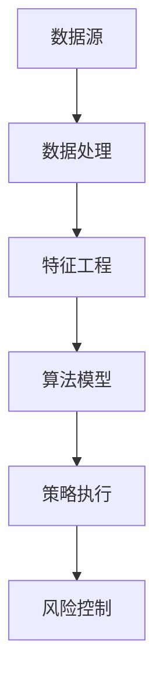
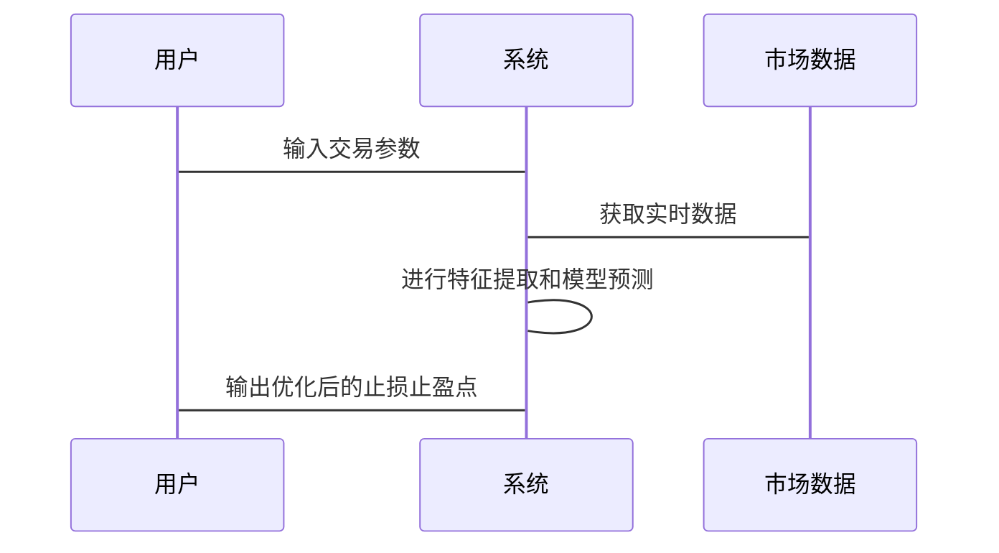

                 


# 《机器学习优化止损止盈策略》

> 关键词：机器学习、止损止盈、风险管理、金融交易、算法优化

> 摘要：本文深入探讨了机器学习在优化金融交易中的止损和止盈策略的应用。通过分析传统策略的局限性，结合现代机器学习算法，提出了一种基于数据驱动的动态风险管理方法。文章从基础概念到高级算法，再到实际项目实现，全面解析了如何利用机器学习技术优化交易决策，降低风险，提高收益。

---

## 第1章: 机器学习优化止损止盈策略概述

### 1.1 机器学习在金融交易中的应用
- **1.1.1 机器学习的基本概念**  
  机器学习是一种人工智能技术，通过数据训练模型，使其能够自动学习和改进。在金融交易中，机器学习可以用于预测价格走势、识别市场模式、优化交易策略等。

- **1.1.2 机器学习在金融交易中的作用**  
  机器学习能够处理海量数据，发现人类难以察觉的市场规律，从而为交易决策提供支持。例如，可以通过算法交易实现快速决策，或通过风险模型预测市场波动。

- **1.1.3 优化止损止盈策略的意义**  
  止损和止盈是风险管理的核心工具，传统策略依赖固定规则，而机器学习可以通过动态分析市场环境，实时调整止损和止盈点，从而提高交易收益并降低风险。

### 1.2 金融交易中的风险管理
- **1.2.1 什么是止损和止盈**  
  - 止损：设定一个价格点，当价格下跌到该点时，立即卖出以限制损失。  
  - 止盈：设定一个价格点，当价格上涨到该点时，立即卖出以锁定收益。  

- **1.2.2 传统止损止盈策略的局限性**  
  - 固定比例的止损可能导致频繁止损，特别是在市场波动剧烈时。  
  - 固定比例的止盈可能错过更大的收益空间，或在市场反转时被截断收益。  

- **1.2.3 机器学习在风险管理中的优势**  
  - 动态调整：根据市场环境实时优化止损止盈点。  
  - 数据驱动：基于历史数据和市场信号，识别潜在风险和机会。  
  - 高效决策：通过算法快速响应市场变化，减少人为干预。  

### 1.3 机器学习优化止损止盈策略的核心思想
- **1.3.1 数据驱动的交易决策**  
  利用历史交易数据和市场数据，训练模型预测未来的市场走势，并据此优化止损止盈策略。  

- **1.3.2 动态调整策略的原理**  
  通过机器学习模型实时监控市场变化，根据当前市场状态调整止损和止盈点，以适应不同的市场环境。  

- **1.3.3 算法选择与模型构建**  
  根据具体需求选择合适的算法（如回归、分类、聚类等），并构建模型实现动态风险管理。  

### 1.4 本章小结
本章从机器学习的基本概念出发，介绍了其在金融交易中的应用，并重点分析了传统止损止盈策略的局限性。通过对比，提出了机器学习在优化止损止盈策略中的独特优势和核心思想。

---

## 第2章: 机器学习算法基础

### 2.1 监督学习
- **2.1.1 线性回归**  
  - **数学公式**：  
  $$ y = \beta_0 + \beta_1x + \epsilon $$
  - **应用**：用于预测连续型变量，如股票价格。  

- **2.1.2 支持向量机（SVM）**  
  - **原理**：通过找到一个超平面，将数据点分为两类。  
  - **应用**：用于分类问题，如判断股票是上涨还是下跌。  

- **2.1.3 决策树与随机森林**  
  - **决策树**：通过特征分裂构建树状结构，用于分类和回归。  
  - **随机森林**：集成多个决策树，提高模型鲁棒性。  

### 2.2 非监督学习
- **2.2.1 聚类分析**  
  - **K-means算法**：将数据点分为K个簇。  
  - **应用**：识别市场状态，如牛市、熊市等。  

- **2.2.2 主成分分析（PCA）**  
  - **原理**：降维技术，提取数据的主要特征。  
  - **应用**：减少特征维度，提高模型效率。  

### 2.3 神经网络与深度学习
- **2.3.1 多层感知机（MLP）**  
  - **结构**：由输入层、隐藏层和输出层组成，通过非线性激活函数实现复杂特征提取。  
  - **应用**：用于非线性回归和分类问题。  

- **2.3.2 卷积神经网络（CNN）**  
  - **原理**：通过卷积操作提取局部特征，常用于图像识别。  
  - **应用**：在金融时间序列分析中，CNN可以用于识别模式。  

- **2.3.3 循环神经网络（RNN）**  
  - **原理**：通过循环结构处理序列数据，如时间序列预测。  
  - **应用**：用于股票价格预测和市场趋势分析。  

### 2.4 算法选择与优化
- **2.4.1 算法性能对比**  
  | 算法类型 | 优点 | 缺点 | 应用场景 |
  |----------|------|------|----------|
  | 线性回归 | 简单、可解释性高 | 无法处理非线性关系 | 股票价格预测 |
  | SVM      | 高准确性 | 对特征工程要求高 | 股票涨跌分类 |
  | 随机森林 | 鲁棒性高 | 计算资源消耗大 | 市场状态分类 |
  | RNN      | 能处理时间序列 | �易过拟合 | 股票价格预测 |

- **2.4.2 超参数优化**  
  - 使用网格搜索或随机搜索优化模型参数（如学习率、正则化系数等）。  

- **2.4.3 模型评估与验证**  
  - 利用交叉验证评估模型性能，防止过拟合。  

---

## 第3章: 金融数据特征分析

### 3.1 金融数据的特征提取
- **3.1.1 时间序列特征**  
  - 均值、方差、标准差、波动率等统计指标。  

- **3.1.2 市场情绪特征**  
  - 利用新闻情感分析提取市场情绪指标。  

- **3.1.3 技术指标特征**  
  - 移动平均线（MA）、相对强弱指数（RSI）、MACD等。  

### 3.2 数据预处理与特征工程
- **3.2.1 数据清洗与标准化**  
  - 去除缺失值、异常值，标准化或归一化数据。  

- **3.2.2 特征选择与降维**  
  - 使用PCA或Lasso回归选择重要特征。  

- **3.2.3 时间序列数据的处理**  
  - 利用滑动窗口方法提取时序特征。  

### 3.3 特征与目标的关系分析
- **3.3.1 相关性分析**  
  - 使用相关系数矩阵或热图分析特征与目标变量的关系。  

- **3.3.2 可视化展示**  
  - 通过折线图、柱状图等可视化工具展示特征分布。  

- **3.3.3 特征重要性排序**  
  - 使用特征重要性评分（如随机森林的特征重要性）排序特征。  

---

## 第4章: 算法实现与代码示例

### 4.1 线性回归模型
- **代码示例**：使用Python实现简单线性回归  
```python
import numpy as np
from sklearn.linear_model import LinearRegression

# 生成数据
X = np.array([1, 2, 3, 4, 5]).reshape(-1, 1)
y = np.array([2, 4, 5, 4, 6])

# 训练模型
model = LinearRegression()
model.fit(X, y)

# 预测
print(model.predict([[6]]))  # 输出：[[7.8]]
```

### 4.2 时间序列分析
- **ARIMA模型**  
  - **数学公式**：  
  $$ y_t = \phi_1 y_{t-1} + \theta_1 \epsilon_{t-1} + \epsilon_t $$
  - **应用**：用于预测股票价格走势。  

### 4.3 算法实现与代码示例
- **神经网络实现**  
  ```python
  import numpy as np
  import matplotlib.pyplot as plt

  # 生成数据
  X = np.linspace(0, 10, 100)
  y = np.sin(X) + np.random.normal(0, 0.1, 100)

  # 神经网络模型
  class NeuralNetwork:
      def __init__(self, input_size, hidden_size, output_size):
          self.W1 = np.random.randn(input_size, hidden_size)
          self.b1 = np.zeros((1, hidden_size))
          self.W2 = np.random.randn(hidden_size, output_size)
          self.b2 = np.zeros((1, output_size))
      
      def forward(self, X):
          self.z1 = np.dot(X, self.W1) + self.b1
          self.a1 = np.tanh(self.z1)
          self.z2 = np.dot(self.a1, self.W2) + self.b2
          return self.z2
      
      def loss(self, y_pred, y_true):
          return np.mean((y_pred - y_true)**2)

  # 训练模型
  model = NeuralNetwork(1, 10, 1)
  optimizer = np.array([1e-3])
  for _ in range(100):
      y_pred = model.forward(X)
      loss = model.loss(y_pred, y)
      dL_dy = 2 * (y_pred - y)
      dW2 = model.a1.T.dot(dL_dy)
      dW1 = X.T.dot(dL_dy.dot(model.W2.T)) * (1 - model.a1**2)
      model.W2 -= optimizer * dW2
      model.W1 -= optimizer * dW1

  # 可视化
  plt.plot(X, y, label='True')
  plt.plot(X, model.forward(X), label='Predict')
  plt.legend()
  plt.show()
  ```

---

## 第5章: 系统分析与架构设计

### 5.1 问题场景介绍
- 优化止损止盈策略需要考虑市场波动、交易成本、模型延迟等多个因素。

### 5.2 系统功能设计
- **领域模型**  
  ```mermaid
  classDiagram
      class 金融数据 {
          收盘价
          开盘价
          最高价
          最低价
          成交量
      }
      class 特征工程 {
          时间特征
          技术指标
          市场情绪
      }
      class 算法模型 {
          线性回归
          支持向量机
          神经网络
      }
      class 策略执行 {
          止损点
          止盈点
          交易信号
      }
      class 风险控制 {
          最大回撤
          风险价值
          风险调整后收益
      }
  ```

### 5.3 系统架构设计


### 5.4 系统交互设计


---

## 第6章: 项目实战

### 6.1 环境安装
- 安装必要的库：`numpy`, `pandas`, `scikit-learn`, `tensorflow`, `matplotlib`。

### 6.2 核心实现
- **数据处理与特征工程**  
  ```python
  import pandas as pd
  import numpy as np

  # 数据加载
  df = pd.read_csv('stock_data.csv')
  df['日期'] = pd.to_datetime(df['日期'])
  df.set_index('日期', inplace=True)

  # 特征提取
  df['移动平均线'] = df['收盘价'].rolling(window=5).mean()
  df['相对强弱指数'] = ta.RSI(df['收盘价'], window=14)
  ```

- **模型训练与预测**  
  ```python
  from sklearn.ensemble import RandomForestRegressor

  # 特征矩阵
  X = df[['移动平均线', '相对强弱指数', '成交量']]
  y = df['收盘价']

  # 训练模型
  model = RandomForestRegressor(n_estimators=100, max_depth=10)
  model.fit(X, y)

  # 预测
  y_pred = model.predict(X)
  ```

### 6.3 实际案例分析
- 使用历史数据训练模型，预测未来的价格走势，并根据模型输出动态调整止损和止盈点。

### 6.4 代码应用解读与分析
- 通过具体代码实现，展示如何利用机器学习模型优化交易策略。

### 6.5 项目小结
本章通过实际案例展示了如何将机器学习应用于止损止盈策略优化，从数据处理到模型训练，再到策略执行，完整地实现了优化过程。

---

## 第7章: 最佳实践、小结与注意事项

### 7.1 最佳实践
- **数据质量**：确保数据准确性和完整性。  
- **模型选择**：根据具体问题选择合适的算法。  
- **风险控制**：避免过度依赖模型，结合人工判断。  

### 7.2 小结
本文从理论到实践，详细讲解了如何利用机器学习优化止损止盈策略。通过算法选择、特征工程和系统设计，构建了一个完整的交易优化系统。

### 7.3 注意事项
- **模型解释性**：复杂的模型可能难以解释，需权衡模型复杂度与可解释性。  
- **实时性**：交易系统需要实时响应，需考虑计算效率和延迟。  
- **市场适应性**：模型需适应不同市场环境，避免过拟合特定市场。  

---

## 第8章: 拓展阅读

### 8.1 相关书籍
- 《机器学习实战》  
- 《算法交易： fatalities of quantitative investing》  

### 8.2 在线资源
- [Kaggle金融数据集](https://www.kaggle.com/datasets)  
- [QuantInstinct的交易策略博客](https://www.quantinstinct.com)  

---

## 作者：AI天才研究院/AI Genius Institute & 禅与计算机程序设计艺术 /Zen And The Art of Computer Programming

