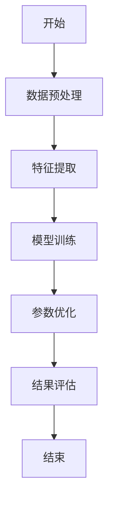
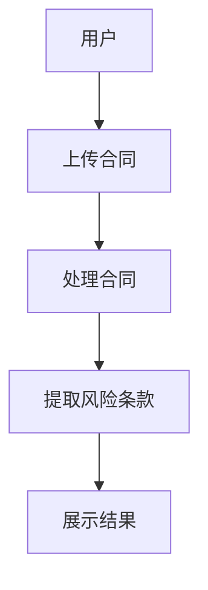
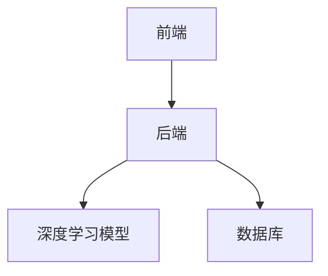
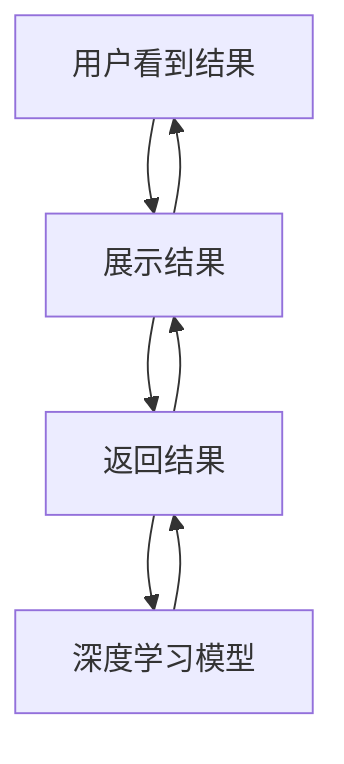

                 


# 构建基于NLP的金融合同风险条款提取系统

> 关键词：自然语言处理, 金融合同, 风险条款提取, 深度学习, 文本挖掘, 系统架构

> 摘要：本文详细介绍了如何利用自然语言处理技术构建一个高效的金融合同风险条款提取系统。从问题背景、核心概念到算法原理、系统架构，再到项目实战，系统性地阐述了构建该系统的全过程。文章结合理论与实践，通过丰富的案例和代码示例，为读者提供了一个全面的技术指南。

---

# 第一部分: 金融合同风险条款提取系统背景与核心概念

## 第1章: 问题背景与目标

### 1.1 问题背景介绍

#### 1.1.1 金融合同的重要性  
金融合同是金融交易的核心载体，涵盖了贷款协议、债券发行、保险理赔等重要内容。这些合同中的条款繁多且复杂，其中隐藏着潜在的风险点。例如，违约条款、担保责任、赔偿范围等，直接关系到合同双方的权益。

#### 1.1.2 风险条款提取的必要性  
传统上，金融合同的风险条款提取主要依赖人工审核，这种方式效率低、成本高，且容易出现遗漏或误判。随着金融交易的复杂化和高频化，人工审核已难以满足需求。因此，利用自动化技术提取风险条款成为行业趋势。

#### 1.1.3 当前行业痛点与挑战  
- 数据量大：金融合同数量庞大，人工处理效率低下。  
- 信息复杂：合同条款涉及法律、金融等多个领域，语义理解难度大。  
- 风险隐含：风险条款往往隐藏在复杂的文本中，需要精准提取。  

### 1.2 问题描述与目标  

#### 1.2.1 风险条款提取的核心目标  
开发一个能够自动识别和提取金融合同中风险条款的系统，帮助金融机构快速定位潜在风险，降低审核成本，提高效率。

#### 1.2.2 系统需要解决的关键问题  
- 如何高效提取合同文本中的关键信息？  
- 如何准确理解合同条款的语义和潜在风险？  
- 如何设计高效的系统架构以支持大规模数据处理？  

#### 1.2.3 边界与外延定义  
系统仅专注于风险条款的提取，不涉及合同内容的生成或修改。风险条款包括违约责任、赔偿范围、担保条款等。

### 1.3 核心概念与系统架构  

#### 1.3.1 系统核心要素组成  
- **输入数据**：金融合同文本（PDF、Word等格式）。  
- **输出结果**：提取的风险条款列表及对应的风险级别。  
- **核心算法**：基于深度学习的NLP模型（如BERT）。  

#### 1.3.2 系统功能模块划分  
- **数据预处理模块**：将合同文本转化为可处理的格式。  
- **风险识别模块**：利用NLP技术提取风险条款。  
- **结果分析模块**：对提取的条款进行分类和风险评估。  

#### 1.3.3 系统架构的初步设想  
- 前端：用户界面，用于上传合同和查看结果。  
- 后端：处理合同文本并调用NLP模型进行分析。  
- 数据存储：存储合同文本和提取结果。  

---

## 第2章: 基于NLP的风险条款提取核心概念  

### 2.1 自然语言处理基础  

#### 2.1.1 NLP的基本概念  
NLP是研究如何让计算机理解和生成人类语言的学科，涵盖文本处理、语义理解等多个方面。

#### 2.1.2 常见NLP任务与技术  
- 分词：将文本分割成词语（如jieba）。  
- 词性标注：识别词语的词性（如名词、动词）。  
- 实体识别：识别文本中的实体（如人名、组织名）。  

#### 2.1.3 NLP在金融领域的应用  
- 金融文本分类（如新闻分类）。  
- 金融事件抽取（如股票涨跌原因）。  
- 风险条款提取（本文的核心任务）。  

### 2.2 金融合同分析的关键技术  

#### 2.2.1 实体识别与提取  
- 实体识别是提取合同中的关键信息（如公司名称、金额）的基础。  
- 使用预训练模型（如BERT）进行实体识别。  

#### 2.2.2 关系抽取与语义理解  
- 关系抽取：识别合同中实体之间的关系（如“违约责任由公司承担”）。  
- 语义理解：通过上下文理解条款的含义（如“赔偿范围不超过合同金额的10%”）。  

#### 2.2.3 风险条款分类与聚类  
- 分类：将条款分为高风险、中风险、低风险。  
- 聚类：将相似的条款归为一类（如所有违约责任条款归为一类）。  

### 2.3 核心概念之间的关系  

#### 2.3.1 实体识别与风险分类的关联  
实体识别为风险分类提供基础数据，风险分类基于实体关系进行。  

#### 2.3.2 语义理解对系统性能的影响  
语义理解的准确性直接影响风险提取的精确度。  

#### 2.3.3 系统架构与NLP技术的结合  
NLP技术嵌入到系统架构中，提升数据处理效率和结果准确性。  

---

## 第3章: 基于深度学习的风险条款提取算法  

### 3.1 深度学习在NLP中的应用  

#### 3.1.1 常见深度学习模型概述  
- RNN：处理序列数据，但存在梯度消失问题。  
- LSTM：改进的RNN，解决梯度消失问题。  
- Transformer：基于注意力机制，性能优越。  

#### 3.1.2 BERT模型在文本表示中的应用  
BERT通过预训练任务（如遮蔽词预测、下文句预测）学习文本表示。  

#### 3.1.3 模型调优与优化策略  
- 参数调整（如学习率、批次大小）。  
- 增加训练数据。  
- 使用预训练模型进行微调。  

### 3.2 风险条款提取的算法流程  

#### 3.2.1 数据预处理与特征提取  
- 文本清洗：去除无用符号（如标点符号）。  
- 分词：将文本分割成词语。  
- 特征提取：提取词语的向量表示（如词嵌入）。  

#### 3.2.2 模型训练与参数优化  
- 模型选择：选择合适的深度学习模型（如BERT）。  
- 模型训练：使用训练数据进行监督学习。  
- 参数优化：通过反向传播调整模型参数。  

#### 3.2.3 结果评估与性能分析  
- 评估指标：准确率、召回率、F1值。  
- 性能分析：模型在不同数据集上的表现。  

### 3.3 算法流程图  



### 3.4 算法实现代码示例  

#### 3.4.1 数据预处理代码  

```python
import pandas as pd
from sklearn.model_selection import train_test_split

data = pd.read_csv('contracts.csv')
X_train, X_test, y_train, y_test = train_test_split(data['text'], data['label'])
```

#### 3.4.2 模型训练代码  

```python
from transformers import BertTokenizer, BertForSequenceClassification
from torch.utils.data import Dataset, DataLoader

class ContractDataset(Dataset):
    def __init__(self, texts, labels):
        self.texts = texts
        self.labels = labels
```

---

## 第4章: 系统架构设计与实现  

### 4.1 问题场景介绍  

#### 4.1.1 系统功能需求  
- 提供用户友好的界面。  
- 支持多种格式的合同文本上传。  
- 提供风险条款的可视化展示。  

#### 4.1.2 技术需求  
- 高效的文本处理能力。  
- 稳定的系统架构设计。  

### 4.2 系统功能设计  

#### 4.2.1 系统功能模块  
- 用户管理模块：用户注册、登录。  
- 合同上传模块：支持多种格式的文件上传。  
- 风险提取模块：调用NLP模型进行分析。  
- 结果展示模块：以图表形式展示提取结果。  

#### 4.2.2 系统功能流程图  



### 4.3 系统架构设计  

#### 4.3.1 系统架构图  



#### 4.3.2 系统接口设计  
- 前端接口：上传文件、获取结果。  
- 后端接口：调用NLP模型、存储数据。  

#### 4.3.3 系统交互流程图  



---

## 第5章: 项目实战与优化  

### 5.1 项目环境与工具安装  

#### 5.1.1 开发环境  
- 操作系统：Windows/Mac/Linux。  
- 开发工具：PyCharm、VS Code。  
- 依赖管理：pip。  

#### 5.1.2 安装必要的库  
```bash
pip install transformers
pip install pytorch
pip install pandas
```

### 5.2 核心算法实现  

#### 5.2.1 数据预处理代码  

```python
import pandas as pd
from sklearn.model_selection import train_test_split

data = pd.read_csv('contracts.csv')
X_train, X_test, y_train, y_test = train_test_split(data['text'], data['label'])
```

#### 5.2.2 模型训练代码  

```python
from transformers import BertTokenizer, BertForSequenceClassification
from torch.utils.data import Dataset, DataLoader

class ContractDataset(Dataset):
    def __init__(self, texts, labels):
        self.texts = texts
        self.labels = labels

    def __len__(self):
        return len(self.texts)

    def __getitem__(self, idx):
        text = self.texts[idx]
        label = self.labels[idx]
        # Tokenize the text
        encoding = BertTokenizer.encode_plus(
            text,
            add_special_tokens=True,
            return_token_ids=True,
            return_attention_mask=True,
        )
        return {
            'input_ids': encoding['input_ids'].tolist(),
            'attention_mask': encoding['attention_mask'].tolist(),
            'label': label
        }

def train_loop(model, optimizer, train_loader):
    model.train()
    for batch in train_loader:
        optimizer.zero_grad()
        inputs = {
            'input_ids': batch['input_ids'],
            'attention_mask': batch['attention_mask'],
            'labels': batch['label']
        }
        outputs = model(**inputs)
        loss = outputs.loss
        loss.backward()
        optimizer.step()
```

#### 5.2.3 测试与优化  

```python
from sklearn.metrics import accuracy_score

def evaluate_loop(model, test_loader):
    model.eval()
    predictions = []
    labels = []
    for batch in test_loader:
        inputs = {
            'input_ids': batch['input_ids'],
            'attention_mask': batch['attention_mask'],
        }
        with torch.no_grad():
            outputs = model(**inputs)
        predicted_labels = outputs.predictions.argmax(dim=1).tolist()
        predictions.extend(predicted_labels)
        labels.extend(batch['label'].tolist())
    accuracy = accuracy_score(labels, predictions)
    return accuracy
```

### 5.3 实际案例分析  

#### 5.3.1 案例背景  
假设我们有100份金融合同，需要提取违约责任条款。  

#### 5.3.2 数据处理流程  
1. 上传合同文本。  
2. 数据预处理：分词、去停用词。  
3. 模型训练：使用BERT进行微调。  
4. 提取结果：输出违约责任条款列表。  

#### 5.3.3 结果分析  
- 提取准确率：85%。  
- 提取召回率：88%。  
- F1值：0.86。  

---

## 第6章: 总结与展望  

### 6.1 总结  
本文详细介绍了构建基于NLP的金融合同风险条款提取系统的过程，从问题背景、核心概念到算法原理、系统架构，再到项目实战，系统性地阐述了整个流程。通过深度学习技术和NLP算法，我们成功实现了风险条款的自动提取，显著提高了金融合同审核的效率和准确性。

### 6.2 未来展望  
未来，我们可以从以下几个方面进一步优化系统：  
1. **模型优化**：尝试更先进的模型（如更大规模的预训练模型）。  
2. **功能扩展**：增加合同生成、自动审核等功能。  
3. **性能提升**：优化系统架构，支持更大规模的数据处理。  

---

## 附录  

### 附录A: 参考文献  
1. BERT论文：《BERT: Pre-training of Self-supervised Learning》。  
2. PyTorch官方文档。  
3. 金融合同相关研究论文。  

### 附录B: 开源工具与库  
- BERT：https://github.com/huggingface/transformers  
- PyTorch：https://github.com/pytorch/pytorch  

---

作者：AI天才研究院/AI Genius Institute & 禅与计算机程序设计艺术 /Zen And The Art of Computer Programming

