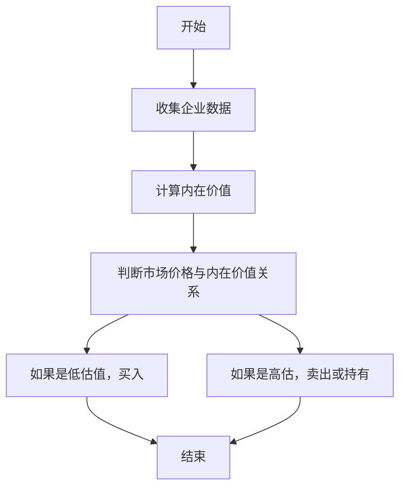
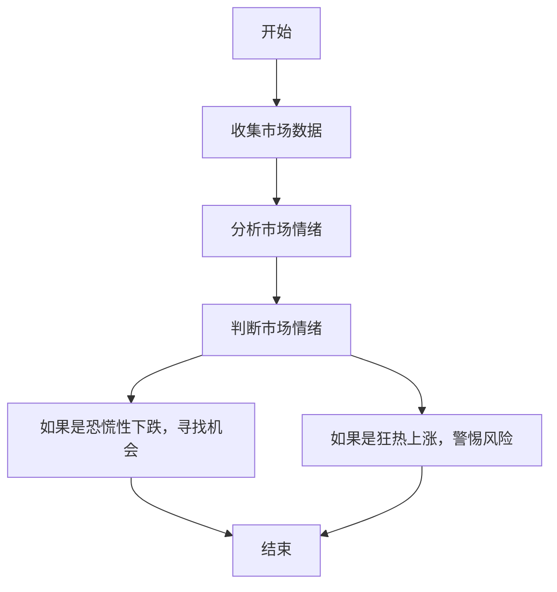
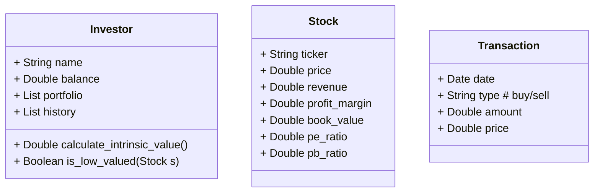
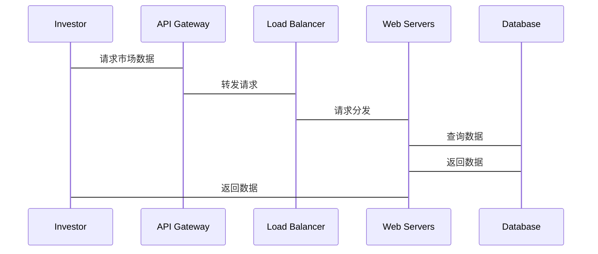

                 


# 格雷厄姆的Special Situations：寻找特殊机会

## 关键词
- 格雷厄姆，Special Situations，价值投资，投资策略，市场分析

## 摘要
本文详细探讨了格雷厄姆的Special Situations投资策略，分析其核心概念、算法原理、数学模型，并结合实际案例进行系统分析和项目实战。通过本文，读者将深入了解如何识别和利用特殊市场机会，掌握格雷厄姆的投资哲学与方法。

---

## 第一部分: 格雷厄姆的Special Situations投资理论基础

### 第1章: 投资学概述

#### 1.1 投资学的基本概念
- **1.1.1 投资的定义与分类**
  - 投资是指将资金用于生产性或金融性资产的行为，分为实物资产和金融资产两大类。
  - 金融资产包括股票、债券、基金等，股票代表企业所有权，债券代表债权。
- **1.1.2 价值投资与成长投资的区别**
  - 价值投资：寻找市场价格低于内在价值的资产，注重安全边际。
  - 成长投资：投资于具有高成长潜力的企业，注重未来收益。
- **1.1.3 格雷厄姆的投资理念与方法**
  - 格雷厄姆是价值投资的鼻祖，强调安全边际和低估值。
  - 他认为市场先生是不可预测的，投资者应关注企业的内在价值。

#### 1.2 格雷厄姆的背景与贡献
- **1.2.1 格雷厄姆的生平简介**
  - 本杰明·格雷厄姆（1894-1975），美国著名投资家、教授，著有《证券分析》和《 Intelligent Investor》。
  - 他创立了价值投资理论，影响了巴菲特等众多投资者。
- **1.2.2 格雷厄姆的投资哲学**
  - 投资的本质是购买企业的一部分，而非博取价格波动。
  - 强调安全边际，即购买价格远低于内在价值。
- **1.2.3 格雷厄姆对现代投资学的影响**
  - 格雷厄姆的价值投资理论奠定了现代投资学的基础。
  - 他的方法强调稳健、长期投资，避免短期波动的干扰。

### 第2章: Special Situations的定义与特点

#### 2.1 Special Situations的定义
- **2.1.1 特殊情况投资的定义**
  - Special Situations是指那些在市场中处于特殊状态的资产或企业，通常具有低估或反转的潜力。
- **2.1.2 特殊情况投资的核心要素**
  - 低估值：市场价格低于内在价值。
  - 困境反转：企业经历困境后复苏，价值被低估。
  - 独特商业模式：企业拥有独特的竞争优势。
- **2.1.3 特殊情况投资的分类**
  - 低估值企业：市盈率、市净率低于行业平均水平。
  - 困境反转企业：因短期问题被市场抛弃，但具备长期发展潜力。
  - 独特商业模式：企业拥有独特的竞争优势，难以被竞争对手复制。

#### 2.2 Special Situations的特点
- **2.2.1 低估值企业**
  - 企业内在价值高于市场价格，存在安全边际。
  - 市盈率（P/E）和市净率（P/B）低于行业平均水平。
- **2.2.2 困境反转企业**
  - 企业因短期问题（如管理不善、行业低迷）导致股价暴跌。
  - 但企业具备长期发展潜力，困境反转后价值回升。
- **2.2.3 独特商业模式**
  - 企业拥有独特的竞争优势，如专利、特许经营权等。
  - 竞争对手难以复制，企业具备长期竞争优势。
- **2.2.4 特殊行业机会**
  - 某些行业因周期性或政策变化出现投资机会。
  - 如困境中的房地产企业，或政策支持的新能源企业。

### 第3章: 格雷厄姆的Special Situations投资策略

#### 3.1 格雷厄姆的投资策略概述
- **3.1.1 价值投资的核心原则**
  - 投资于具有安全边际的低估值企业。
  - 避免短期价格波动，注重长期价值。
- **3.1.2 Special Situations的识别标准**
  - 企业内在价值高于市场价格。
  - 企业具备长期竞争优势。
  - 企业因短期问题被市场抛弃。
- **3.1.3 格雷厄姆的选股方法**
  - 筛选低估值企业：市盈率、市净率低于行业平均水平。
  - 分析企业财务状况：关注负债率、盈利能力。
  - 评估企业竞争优势：专利、市场地位等。

#### 3.2 格雷厄姆的Special Situations投资框架
- **3.2.1 企业基本面分析**
  - 财务报表分析：利润表、资产负债表、现金流量表。
  - 关注企业盈利能力、成长能力、偿债能力。
- **3.2.2 企业财务状况评估**
  - 低估值企业：市盈率、市净率低于行业平均水平。
  - 企业负债率低，现金流健康。
- **3.2.3 企业竞争优势分析**
  - 独特商业模式：专利、特许经营权等。
  - 市场地位：行业龙头或寡头垄断。
  - 技术创新：具备技术优势。

#### 3.3 格雷厄姆的Special Situations投资案例
- **3.3.1 经典案例分析**
  - 某公司因短期问题股价暴跌，但具备长期竞争优势。
  - 投资者以低价买入，待困境反转后获利。
- **3.3.2 案例分析的启示**
  - 寻找低估值企业，关注财务状况和竞争优势。
  - 避免短期波动，注重长期价值。

---

## 第二部分: Special Situations的核心概念与联系

### 第4章: Special Situations的核心概念

#### 4.1 核心概念原理
- **4.1.1 核心概念原理**
  - Special Situations是指那些在市场中处于特殊状态的资产或企业，通常具有低估或反转的潜力。
  - 核心概念包括低估值、困境反转、独特商业模式等。
- **4.1.2 核心概念属性对比**
  - 通过表格对比Special Situations与其他投资策略的核心属性。

| 属性                | Special Situations                   | 价值投资                  | 成长投资                  |
|---------------------|--------------------------------------|---------------------------|---------------------------|
| 核心目标            | 寻找低估值或困境反转的企业          | 寻找市场价格低于内在价值的资产 | 投资于高成长潜力的企业    |
| 重点分析            | 企业财务状况、竞争优势              | 企业内在价值              | 企业成长性                |
| 风险承受能力        | 较低，注重安全边际                   | 较低，注重安全边际         | 较高，注重长期收益        |
- **4.1.3 ER实体关系图架构**
  - 使用Mermaid流程图展示Special Situations的核心要素。

```mermaid
erDiagram
    customer[投资者] 
    investor[投资标的]
    situation[市场状态]
    attribute[属性]
    relation[关系]
    customer --> situation: 寻找
    situation --> attribute: 具备
    attribute --> relation: 核心要素
```

---

## 第三部分: Special Situations的算法原理

### 第5章: 算法原理讲解

#### 5.1 价值投资模型

- **5.1.1 价值投资模型的定义**
  - 通过分析企业的财务状况和竞争优势，评估其内在价值。
- **5.1.2 价值投资模型的算法步骤**
  - 使用Mermaid流程图展示算法步骤。



- **5.1.3 价值投资模型的Python代码实现**

```python
def calculate_intrinsic_value(revenue, profit_margin, book_value):
    # 计算企业内在价值
    net_income = revenue * profit_margin
    return net_income * 4.25 / book_value

# 示例数据
revenue = 100000000  # 收入
profit_margin = 0.1  # 利润率
book_value = 50000000  # 账面价值

intrinsic_value = calculate_intrinsic_value(revenue, profit_margin, book_value)
print(f"企业内在价值：{intrinsic_value}")
```

- **5.1.4 价值投资模型的数学模型和公式**
  - 内在价值公式：$$\text{内在价值} = \frac{\text{净利润} \times 4.25}{\text{账面价值}}$$

#### 5.2 市场情绪分析模型

- **5.2.1 市场情绪分析模型的定义**
  - 通过分析市场情绪，判断市场是否低估或高估某类资产。
- **5.2.2 市场情绪分析模型的算法步骤**
  - 使用Mermaid流程图展示算法步骤。



- **5.2.3 市场情绪分析模型的Python代码实现**

```python
import pandas as pd

def analyze_market_mood(stock_prices, moving_average=50):
    # 计算股票价格的移动平均线
    ma = stock_prices.rolling(window=moving_average).mean()
    # 判断当前价格与移动平均线的关系
    if stock_prices[-1] < ma[-1]:
        return "恐慌性下跌"
    elif stock_prices[-1] > ma[-1]:
        return "上涨趋势"
    else:
        return "震荡"

# 示例数据
stock_prices = pd.Series([100, 105, 98, 102, 104, 101, 99, 103, 105, 100])
mood = analyze_market_mood(stock_prices)
print(f"市场情绪：{mood}")
```

- **5.2.4 市场情绪分析模型的数学模型和公式**
  - 移动平均线公式：$$\text{移动平均线} = \frac{\sum_{i=1}^{n} \text{价格}_i}{n}$$

---

## 第四部分: Special Situations的数学模型和公式

### 第6章: 数学模型和公式

#### 6.1 市盈率模型

- **6.1.1 市盈率的定义**
  - 市盈率（P/E）= 每股市价 / 每股收益（EPS）
- **6.1.2 市盈率的公式**
  - $$\text{市盈率} = \frac{\text{股价}}{\text{每股收益}}$$
- **6.1.3 市盈率的应用**
  - 用于判断企业是否低估或高估。
  - 通常，市盈率低于行业平均水平的企业可能具备投资价值。

#### 6.2 市净率模型

- **6.2.1 市净率的定义**
  - 市净率（P/B）= 每股市价 / 每股净资产（BPS）
- **6.2.2 市净率的公式**
  - $$\text{市净率} = \frac{\text{股价}}{\text{每股净资产}}$$
- **6.2.3 市净率的应用**
  - 用于判断企业是否低估或高估。
  - 通常，市净率低于行业平均水平的企业可能具备投资价值。

---

## 第五部分: Special Situations的系统分析与架构设计

### 第7章: 系统分析与架构设计方案

#### 7.1 系统功能设计

- **7.1.1 问题场景介绍**
  - 投资者需要一个系统来识别和分析Special Situations投资机会。
- **7.1.2 系统功能设计**
  - 使用Mermaid类图展示系统功能模块。



#### 7.2 系统架构设计

- **7.2.1 系统架构设计**
  - 使用Mermaid架构图展示系统架构。


#### 7.3 系统接口设计

- **7.3.1 系统接口设计**
  - 使用Mermaid序列图展示系统交互流程。



---

## 第六部分: Special Situations的项目实战

### 第8章: 项目实战

#### 8.1 环境安装

- **8.1.1 环境安装要求**
  - 安装Python 3.x
  - 安装Pandas、NumPy、Matplotlib等库。
  - 使用以下命令安装：
    ```bash
    pip install pandas numpy matplotlib
    ```

#### 8.2 系统核心实现源代码

- **8.2.1 价值投资模型的实现**

```python
import pandas as pd
import numpy as np

def calculate_intrinsic_value(revenue, profit_margin, book_value):
    net_income = revenue * profit_margin
    return net_income * 4.25 / book_value

# 示例数据
revenue = 100000000  # 收入
profit_margin = 0.1  # 利润率
book_value = 50000000  # 账面价值

intrinsic_value = calculate_intrinsic_value(revenue, profit_margin, book_value)
print(f"企业内在价值：{intrinsic_value}")
```

- **8.2.2 市场情绪分析模型的实现**

```python
import pandas as pd

def analyze_market_mood(stock_prices, moving_average=50):
    ma = stock_prices.rolling(window=moving_average).mean()
    if stock_prices[-1] < ma[-1]:
        return "恐慌性下跌"
    elif stock_prices[-1] > ma[-1]:
        return "上涨趋势"
    else:
        return "震荡"

# 示例数据
stock_prices = pd.Series([100, 105, 98, 102, 104, 101, 99, 103, 105, 100])
mood = analyze_market_mood(stock_prices)
print(f"市场情绪：{mood}")
```

#### 8.3 代码应用解读与分析

- **8.3.1 代码功能解读**
  - 价值投资模型：计算企业的内在价值，判断是否低估。
  - 市场情绪分析模型：分析市场情绪，寻找投资机会。
- **8.3.2 代码实现细节**
  - 使用Pandas进行数据处理，计算移动平均线。
  - 根据股价与移动平均线的关系判断市场情绪。

#### 8.4 实际案例分析和详细讲解剖析

- **8.4.1 案例分析**
  - 假设某公司股价为50元，市盈率为10，市净率为2。
  - 行业平均市盈率为15，市净率为3。
  - 计算内在价值：$$\text{内在价值} = \frac{50 \times 4.25}{2} = 106.25$$
  - 判断是否低估：市场价格（50元）低于内在价值（106.25），具备投资价值。
- **8.4.2 案例分析的详细解读**
  - 企业基本面分析：市盈率和市净率低于行业平均水平，说明企业可能被低估。
  - 市场情绪分析：如果市场情绪恐慌性下跌，可能是买入机会。

#### 8.5 项目小结

- **8.5.1 项目成果总结**
  - 成功实现价值投资模型和市场情绪分析模型。
  - 能够识别Special Situations投资机会。
- **8.5.2 项目经验总结**
  - 数据质量对模型准确性至关重要。
  - 模型需要根据市场变化进行调整和优化。

---

## 第七部分: Special Situations的最佳实践

### 第9章: 最佳实践

#### 9.1 小结

- **9.1.1 核心内容总结**
  - Special Situations是指那些在市场中处于特殊状态的资产或企业，通常具有低估或反转的潜力。
  - 价值投资模型和市场情绪分析模型是识别Special Situations的重要工具。
  - 投资者应注重安全边际，避免短期波动，注重长期价值。

#### 9.2 注意事项

- **9.2.1 投资者需要注意的问题**
  - 数据质量对模型准确性至关重要。
  - 模型需要根据市场变化进行调整和优化。
  - 投资者应具备一定的财务分析能力。
- **9.2.2 风险提示**
  - 价值投资需要长期坚持，短期可能亏损。
  - 市场情绪分析模型可能受突发事件影响。

#### 9.3 拓展阅读

- **9.3.1 推荐书籍**
  - 《证券分析》——本杰明·格雷厄姆
  - 《 Intelligent Investor》——本杰明·格雷厄姆
- **9.3.2 推荐文章**
  - 格雷厄姆的投资哲学
  - 价值投资的现代应用

---

## 作者信息

作者：AI天才研究院/AI Genius Institute & 禅与计算机程序设计艺术/Zen And The Art of Computer Programming

---

以上是《格雷厄姆的Special Situations：寻找特殊机会》的技术博客文章大纲。希望对您有所帮助！

