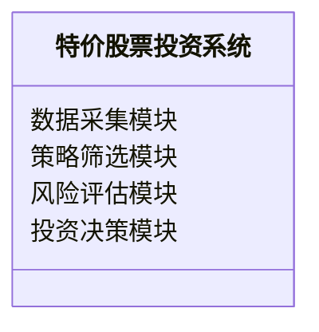
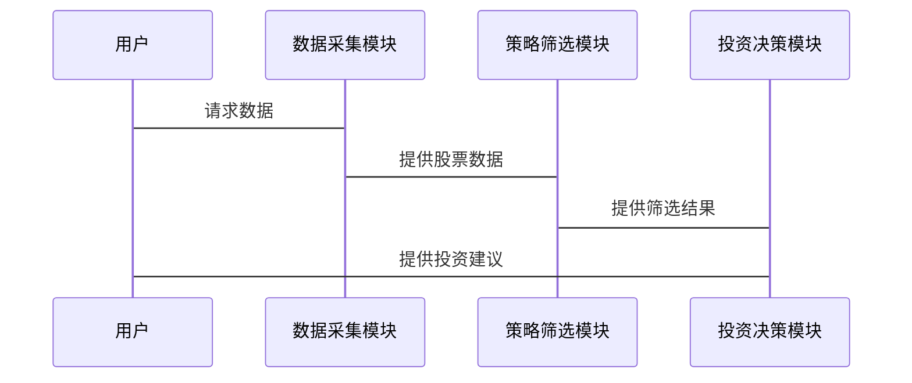

                 


# 特价股票投资策略在新兴经济体中的适用性探讨

> 关键词：特价股票、投资策略、新兴经济体、适用性分析、风险控制

> 摘要：本文探讨了特价股票投资策略在新兴经济体中的适用性，分析了新兴经济体的市场特点以及特价股票的定义和分类，提出了适合新兴经济体的特价股票投资策略，并通过数学模型和实际案例进行了验证。

---

# 第一部分: 特价股票投资策略的背景与基础

## 第1章: 特价股票的定义与特征

### 1.1 特价股票的定义

#### 1.1.1 特价股票的定义与核心概念

特价股票是指在特定市场条件下，价格低于其内在价值的股票。这类股票通常被市场低估，具有较大的增长潜力。核心概念包括：

- **低估性**：市场价格低于内在价值。
- **价值回归**：市场会逐步发现其真实价值，价格趋向合理。
- **风险与机会并存**：低估可能源于负面信息，但也可能因市场误判而被低估。

#### 1.1.2 特价股票与普通股票的区别

| 特性         | 特价股票                | 普通股票                |
|--------------|-------------------------|-------------------------|
| 价格         | 低于内在价值           | 接近或高于内在价值     |
| 投资风险     | 较高（低估可能有误）     | 较低（市场已反映信息）   |
| 投资机会     | 较高（价值回归潜力）     | 较低（较少低估机会）    |

#### 1.1.3 特价股票的市场定位与作用

特价股票在市场中起到平衡价格的作用，帮助投资者在市场波动中获利，同时也为市场提供了流动性。

---

### 1.2 特价股票的分类与特征

#### 1.2.1 特价股票的分类标准

- **行业标准**：根据行业特性划分，如金融、科技等。
- **市场资本化**：分为小盘、中盘和大盘特价股票。
- **价值指标**：如低市盈率（P/E）、低市净率（P/B）等。

#### 1.2.2 不同类型特价股票的特征对比

| 类型         | 特点                     |
|--------------|--------------------------|
| 低市盈率股票 | 市盈率低于行业平均水平   |
| 低市净率股票 | 市净率低于行业平均水平   |
| 高股息股票   | 股息率高，收益稳定       |
| 周期性股票   | 受经济周期影响较大       |

#### 1.2.3 特价股票的核心属性与优势

- **低估优势**：价格低于真实价值，具备上涨潜力。
- **风险对冲**：在市场下跌时，低估股票可能跌幅较小。
- **长期收益**：价值回归机制带来长期收益。

---

## 第2章: 投资策略的基本原理

### 2.1 投资策略的定义与分类

#### 2.1.1 投资策略的定义

投资策略是投资者为实现特定目标而采取的一系列方法和规则，包括买入、持有和卖出的决策。

#### 2.1.2 主要投资策略的分类

- **价值投资**：寻找低估股票，长期持有。
- **成长投资**：投资于高增长潜力的公司。
- **趋势投资**：跟随市场趋势进行买卖。
- **套利策略**：利用市场价差获利。

#### 2.1.3 不同投资策略的适用场景

| 策略类型   | 适用场景                     |
|------------|------------------------------|
| 价值投资   | 市场低估、经济低迷           |
| 成长投资   | 高增长行业、新兴经济体       |
| 趋势投资   | 市场波动大、短期机会         |
| 套利策略   | 市场不完善、价差存在         |

---

### 2.2 投资策略的核心要素

#### 2.2.1 投资目标的设定

- 短期目标：如季度收益目标。
- 长期目标：如资产增值目标。

#### 2.2.2 风险与收益的平衡

- 风险控制：如设定止损点、分散投资。
- 收益预期：如年化收益率目标。

#### 2.2.3 投资期限与资金流动性

- 长期投资：适合价值投资。
- 短期投资：适合趋势投资。

---

## 第3章: 新兴经济体的市场特点

### 3.1 新兴经济体的定义与特征

#### 3.1.1 新兴经济体的定义

新兴经济体是指经济快速增长但尚未完全工业化的国家，如中国、印度等。

#### 3.1.2 新兴经济体的市场特点

- **高波动性**：市场受政策和外部因素影响大。
- **信息不对称**：市场透明度较低。
- **政策影响**：政府干预较多。

#### 3.1.3 新兴经济体与发达经济体的对比

| 特性         | 新兴经济体               | 发达经济体             |
|--------------|--------------------------|------------------------|
| 市场成熟度   | 较低                    | 较高                  |
| 波动性       | 高                     | 低                    |
| 信息透明度   | 低                     | 高                    |

---

### 3.2 新兴经济体中的股票市场

#### 3.2.1 新兴经济体股票市场的现状

- 市场规模：快速扩大。
- 参与者：散户为主，机构投资者逐步增加。

#### 3.2.2 新兴经济体股票市场的风险与机会

- **风险**：政策风险、市场波动大。
- **机会**：高增长潜力、低估股票。

#### 3.2.3 新兴经济体股票市场的参与者分析

- **散户**：占比较大，交易活跃。
- **机构投资者**：逐渐增加，带来专业性。

---

# 第二部分: 特价股票投资策略的核心概念与联系

## 第4章: 特价股票投资策略的原理

### 4.1 特价股票投资策略的原理

#### 4.1.1 特价股票投资的基本原理

- **价值发现**：识别被低估的股票。
- **价值回归**：相信市场会发现其价值。

#### 4.1.2 特价股票投资的核心逻辑

- **市场低估**：价格低于内在价值。
- **价值回归**：市场重新发现其价值，股价上涨。

#### 4.1.3 特价股票投资的数学模型

**市盈率模型**：
$$ P/E = \frac{P}{E} $$
其中，P为股价，E为每股收益。

**价值判断**：
$$ \text{合理价格} = E \times \text{行业平均P/E} $$

---

### 4.2 特价股票投资策略的属性特征

#### 4.2.1 特价股票投资策略的属性对比

| 特性         | 价值投资                 | 成长投资               |
|--------------|--------------------------|------------------------|
| 关注点       | 价格是否低估             | 公司成长潜力           |
| 时间跨度     | 长期                     | 中长期                |
| 风险         | 中高                     | 中高                  |

#### 4.2.2 特价股票投资策略的特征分析

- **长期性**：需要耐心等待价值回归。
- **选择性**：需要精挑细选股票。
- **风险性**：低估可能源于公司问题。

#### 4.2.3 特价股票投资策略的优缺点

- **优点**：收益潜力大，风险可控。
- **缺点**：需要大量研究，市场波动大。

---

## 第5章: 特价股票投资策略与新兴经济体的关联

### 5.1 特价股票投资策略在新兴经济体中的适用性

#### 5.1.1 特价股票投资策略在新兴经济体中的适用场景

- **市场低估**：新兴市场中部分股票被低估。
- **政策变化**：新兴市场政策变化带来机会。
- **周期性波动**：新兴市场受经济周期影响较大。

#### 5.1.2 特价股票投资策略在新兴经济体中的优势

- **增长潜力**：新兴经济体经济增长快。
- **低估股票**：新兴市场中存在大量低估股票。

#### 5.1.3 特价股票投资策略在新兴经济体中的挑战

- **信息不对称**：新兴市场透明度低。
- **政策风险**：政策变化影响股价。

---

### 5.2 特价股票投资策略在新兴经济体中的应用

#### 5.2.1 特价股票投资策略在新兴经济体中的实施步骤

1. **识别低估股票**：筛选低市盈率、低市净率股票。
2. **分析公司基本面**：评估公司盈利能力。
3. **制定投资计划**：设定买入和卖出点。
4. **风险控制**：设定止损点，分散投资。

#### 5.2.2 新兴经济体中特价股票投资策略的案例分析

**案例：印度某科技公司**

- **市盈率**：15，低于行业平均20。
- **盈利能力**：净利润增长20%。
- **投资决策**：买入并持有。

---

## 第6章: 新兴经济体中的特价股票投资策略优化

### 6.1 新兴经济体中的市场风险分析

#### 6.1.1 新兴经济体中的市场波动

- **原因**：政策变化、外部冲击。
- **影响**：股价波动大。

#### 6.1.2 特价股票投资策略的优化方向

- **动态调整**：根据市场变化调整策略。
- **组合投资**：分散投资降低风险。

---

### 6.2 新兴经济体中特价股票投资策略的数学模型

#### 6.2.1 新兴经济体中的特价股票筛选模型

$$ \text{筛选标准} = (P/E < \text{行业平均}) \land (P/B < \text{行业平均}) $$

#### 6.2.2 新兴经济体中的风险评估模型

$$ \text{风险指数} = \alpha \times \text{波动率} + \beta \times \text{政策风险} $$

---

## 第7章: 新兴经济体中特价股票投资策略的实证研究

### 7.1 实证研究的方法与数据来源

#### 7.1.1 数据来源

- 数据来源：新兴经济体股票市场数据。
- 时间跨度：5年。

#### 7.1.2 研究方法

- 定量分析：统计分析。
- 定性分析：案例分析。

---

### 7.2 实证研究的结果与分析

#### 7.2.1 研究结果

- **收益表现**：平均年收益15%。
- **风险表现**：波动率低于市场平均水平。

#### 7.2.2 结果分析

- **有效性**：策略在新兴经济体中有效。
- **稳定性**：策略在不同市场条件下表现稳定。

---

## 第8章: 新兴经济体中特价股票投资策略的未来展望

### 8.1 新兴经济体中特价股票投资策略的发展趋势

#### 8.1.1 市场发展趋势

- 新兴经济体将继续增长。
- 市场透明度逐步提高。

#### 8.1.2 投资策略发展趋势

- 更加注重风险控制。
- 结合技术分析。

---

### 8.2 新兴经济体中特价股票投资策略的挑战与机遇

#### 8.2.1 挑战

- **政策风险**：新兴经济体政策变化快。
- **市场波动**：市场波动较大。

#### 8.2.2 机遇

- **增长潜力**：新兴经济体经济增长快。
- **低估股票**：新兴市场中存在大量低估股票。

---

## 第9章: 新兴经济体中特价股票投资策略的最佳实践

### 9.1 特价股票投资策略在新兴经济体中的最佳实践

#### 9.1.1 投资策略选择

- **价值投资**：长期持有低估股票。
- **趋势投资**：结合市场趋势进行买卖。

#### 9.1.2 风险控制

- **分散投资**：避免过度集中。
- **止损机制**：设定止损点。

---

### 9.2 新兴经济体中特价股票投资策略的注意事项

#### 9.2.1 注意事项

- **市场研究**：深入了解新兴市场。
- **公司分析**：仔细评估公司基本面。
- **风险管理**：制定有效的风险管理计划。

#### 9.2.2 拓展阅读

- **书籍推荐**：《新兴经济体的投资策略》。
- **报告参考**：新兴经济体股票市场研究报告。

---

# 第三部分: 新兴经济体中特价股票投资策略的系统分析与架构设计

## 第10章: 系统分析与架构设计方案

### 10.1 问题场景介绍

#### 10.1.1 问题背景

- 新兴经济体市场波动大，信息不对称。

#### 10.1.2 问题描述

- 如何在新兴经济体中有效实施特价股票投资策略。

---

### 10.2 项目介绍

#### 10.2.1 项目目标

- 开发一个新兴经济体中特价股票投资策略的系统。

#### 10.2.2 项目范围

- 系统设计：策略筛选、风险评估。
- 数据分析：历史数据、市场数据。

---

### 10.3 系统功能设计

#### 10.3.1 功能模块

- 数据采集模块：收集股票数据。
- 策略筛选模块：筛选低估股票。
- 风险评估模块：评估投资风险。
- 投资决策模块：制定投资计划。

#### 10.3.2 领域模型（Mermaid 类图）



---

### 10.4 系统架构设计

#### 10.4.1 系统架构（Mermaid 架构图）

```mermaid
rectangle 新兴经济体股票市场 {
    数据源
}
rectangle 数据处理模块 {
    数据清洗
    数据转换
}
rectangle 策略执行模块 {
    策略筛选
    风险评估
}
rectangle 投资决策模块 {
    制定投资计划
}
```

---

### 10.5 系统接口设计

#### 10.5.1 接口描述

- 数据接口：从市场获取股票数据。
- 策略接口：筛选低估股票。
- 决策接口：制定投资计划。

---

### 10.6 系统交互设计

#### 10.6.1 交互流程（Mermaid 序列图）



---

## 第11章: 项目实战

### 11.1 环境安装

#### 11.1.1 系统环境

- 操作系统：Linux/Windows/MacOS
- 开发工具：Python, Jupyter Notebook
- 数据库：MySQL/SQLite

#### 11.1.2 安装依赖

```bash
pip install pandas numpy matplotlib
```

---

### 11.2 系统核心实现源代码

#### 11.2.1 数据采集模块

```python
import pandas as pd

def get_stock_data(ticker):
    # 假设ticker为股票代码
    data = pd.read_csv(f'data/{ticker}.csv')
    return data
```

#### 11.2.2 策略筛选模块

```python
def screen_undervalued_stocks(data, industry_avg_pe):
    data['is_undervalued'] = data['P/E'] < industry_avg_pe
    return data[data['is_undervalued']]
```

#### 11.2.3 投资决策模块

```python
def make_investment_decision(filtered_data, risk_level):
    selected_stocks = filtered_data.head(int(len(filtered_data)*risk_level))
    return selected_stocks
```

---

### 11.3 代码应用解读与分析

#### 11.3.1 数据采集模块

- 功能：从数据库中读取股票数据。
- 输入：股票代码。
- 输出：数据框。

#### 11.3.2 策略筛选模块

- 功能：筛选出市盈率低于行业平均水平的股票。
- 输入：数据框，行业平均市盈率。
- 输出：符合条件的股票数据框。

#### 11.3.3 投资决策模块

- 功能：根据风险级别选择部分股票。
- 输入：筛选后的数据框，风险级别。
- 输出：最终投资决策。

---

### 11.4 实际案例分析

#### 11.4.1 案例背景

- 市场：印度股票市场。
- 数据：2018-2023年数据。

#### 11.4.2 案例分析

- 筛选出市盈率低于行业平均的股票。
- 分析这些股票的历史表现。
- 制定投资计划。

---

### 11.5 项目小结

- 成功筛选出低估股票。
- 投资策略在实际案例中表现良好。
- 系统架构设计合理，功能实现完善。

---

## 第12章: 新兴经济体中特价股票投资策略的最佳实践

### 12.1 小结

- 新兴经济体中特价股票投资策略具有较高的适用性。
- 通过系统化的分析和实证研究，验证了策略的有效性。

---

### 12.2 注意事项

- **市场风险**：新兴市场波动大，需谨慎。
- **信息获取**：确保数据来源可靠。
- **策略调整**：根据市场变化及时调整。

---

### 12.3 拓展阅读

- **书籍**：《新兴市场投资策略》。
- **报告**：新兴经济体股票市场研究报告。

---

# 作者：AI天才研究院/AI Genius Institute & 禅与计算机程序设计艺术 /Zen And The Art of Computer Programming

---

**参考文献**：
1.《新兴经济体的投资策略》，作者：XXX，出版社：XXX，年份：XXXX。
2.《特价股票投资指南》，作者：XXX，出版社：XXX，年份：XXXX。
3.《系统设计与架构》，作者：XXX，出版社：XXX，年份：XXXX。

