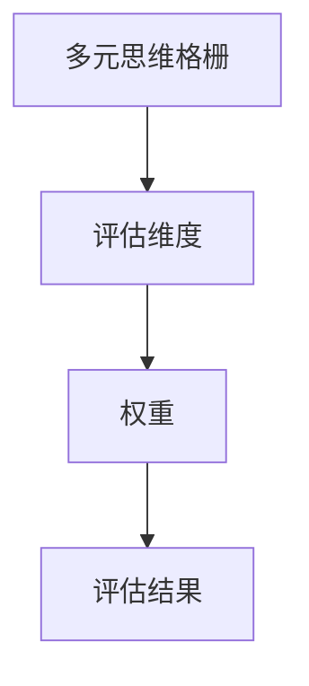
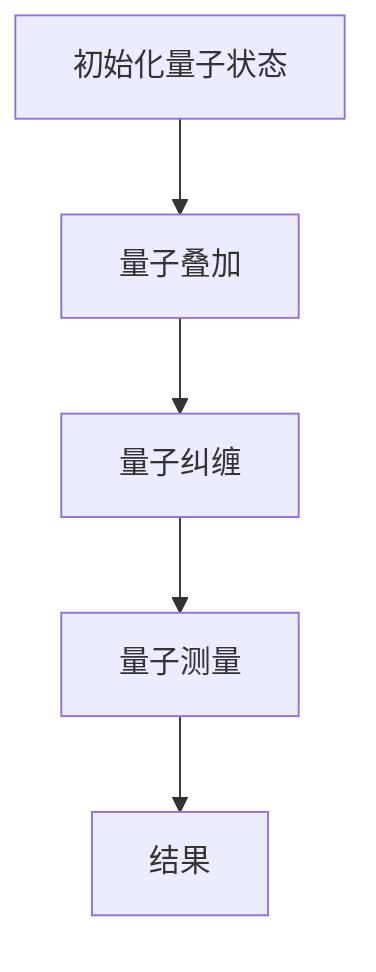
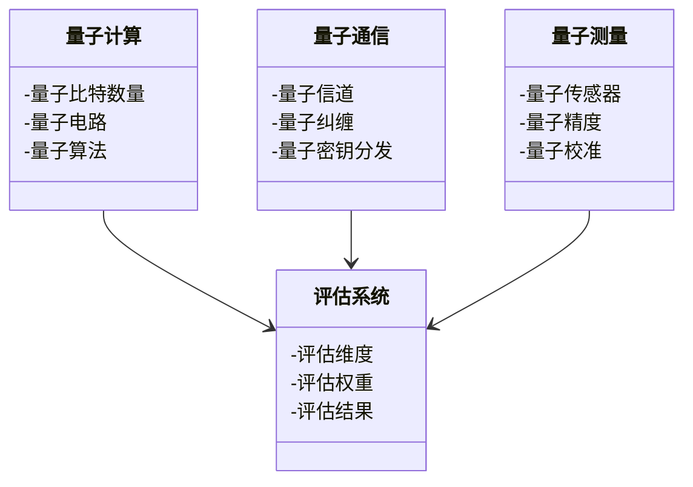
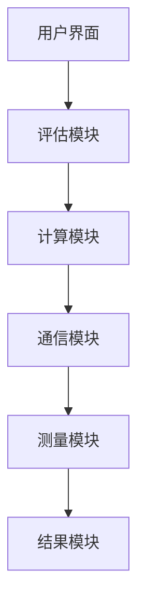
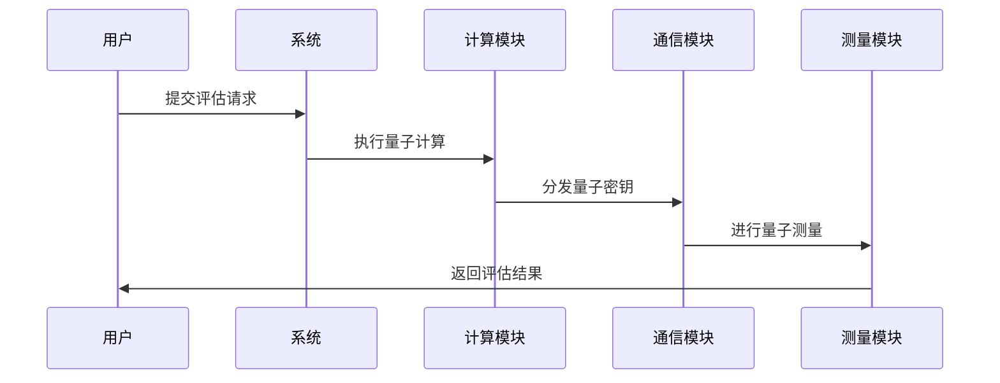

                 


# 芒格的"多元思维格栅"在跨学科量子技术评估中的应用

> 关键词：多元思维格栅, 跨学科量子技术, 量子计算, 量子通信, 技术评估模型

> 摘要：本文探讨了芒格的多元思维格栅在跨学科量子技术评估中的应用，分析了其在量子计算、量子通信和量子测量等领域的优势，结合实际案例展示了如何利用格栅模型优化量子技术评估过程，为技术人员提供了新的思路。

---

# 第一部分: 芒格的"多元思维格栅"与跨学科量子技术评估的背景介绍

## 第1章: 多元思维格栅与量子技术评估的背景介绍

### 1.1 多元思维格栅的定义与核心要素

#### 1.1.1 芒格多元思维模型的起源
芒格的多元思维模型是由查理·芒格提出的，强调通过多个学科的思维框架来分析和解决问题。这种模型的核心在于将各个学科的思维方式整合起来，形成一个多维度的分析框架。

#### 1.1.2 多元思维格栅的核心要素
多元思维格栅的核心要素包括：
1. **学科思维框架**：每个学科都有其独特的思维方式和工具，如物理学的实验验证、数学的逻辑推理等。
2. **跨学科整合**：将不同学科的思维框架结合起来，形成一个多维度的分析工具。
3. **动态调整机制**：根据实际情况不断调整各个思维框架的权重和作用。

#### 1.1.3 格栅在跨学科问题中的应用价值
格栅模型在跨学科问题中的应用价值体现在：
1. 提供了一个综合性的分析框架。
2. 帮助识别不同学科之间的相互作用。
3. 便于进行跨学科问题的系统性分析。

---

### 1.2 量子技术的基本概念与评估需求

#### 1.2.1 量子技术的定义与分类
量子技术主要包括量子计算、量子通信和量子测量三个领域。量子计算利用量子叠加和量子纠缠的特性，可以在某些情况下比经典计算机更高效地解决问题；量子通信利用量子纠缠实现安全的通信；量子测量则是在量子力学的基础上进行高精度测量。

#### 1.2.2 量子计算、量子通信与量子测量的区别
- **量子计算**：通过量子比特（qubit）进行计算，能够处理指数级的问题。
- **量子通信**：利用量子纠缠实现信息的安全传输。
- **量子测量**：在量子力学的基础上进行高精度测量，如量子传感。

#### 1.2.3 跨学科量子技术评估的复杂性
跨学科量子技术评估的复杂性体现在：
1. 需要综合多个学科的知识。
2. 需要处理复杂的系统性问题。
3. 需要平衡不同学科的目标和约束。

---

### 1.3 多元思维格栅在量子技术评估中的应用价值

#### 1.3.1 跨学科问题的解决思路
多元思维格栅为跨学科问题提供了一个系统性的解决思路：
1. 从多个学科的角度分析问题。
2. 综合不同学科的解决方案。
3. 根据实际情况动态调整分析框架。

#### 1.3.2 格栅模型在量子技术评估中的优势
格栅模型在量子技术评估中的优势包括：
1. 提供了一个综合性的分析框架。
2. 帮助识别不同学科之间的相互作用。
3. 便于进行跨学科问题的系统性分析。

#### 1.3.3 格栅模型与传统评估方法的对比
格栅模型与传统评估方法的对比：
| 对比维度 | 格栅模型 | 传统评估方法 |
|----------|-----------|---------------|
| 分析维度 | 多维度    | 单一维度      |
| 跨学科性 | 高        | 低            |
| 动态调整 | 高        | 低            |

---

## 1.4 本章小结
本章介绍了芒格的多元思维格栅及其在跨学科量子技术评估中的应用价值。通过分析多元思维格栅的核心要素和量子技术的基本概念，我们明确了格栅模型在量子技术评估中的优势和应用价值。

---

# 第二部分: 多元思维格栅的核心概念与原理

## 第2章: 多元思维格栅的核心概念与原理

### 2.1 多元思维格栅的原理

#### 2.1.1 多元思维格栅的构建过程
多元思维格栅的构建过程包括：
1. 确定需要考虑的学科和思维框架。
2. 分析各个学科的思维方式和工具。
3. 综合不同学科的思维框架，形成一个多维度的分析模型。

#### 2.1.2 格栅模型的层次结构
格栅模型的层次结构包括：
1. **基础层**：各个学科的思维方式和工具。
2. **中间层**：不同学科之间的相互作用和联系。
3. **顶层**：综合各个学科的系统性分析框架。

#### 2.1.3 格栅模型的动态调整机制
格栅模型的动态调整机制包括：
1. 根据实际情况调整各个学科思维框架的权重。
2. 根据新的知识和信息更新分析框架。
3. 动态调整分析框架的层次结构。

---

### 2.2 格栅模型与量子技术评估的结合

#### 2.2.1 格栅模型在量子技术评估中的作用
格栅模型在量子技术评估中的作用包括：
1. 提供了一个综合性的分析框架。
2. 帮助识别不同学科之间的相互作用。
3. 便于进行跨学科问题的系统性分析。

#### 2.2.2 格栅模型的可扩展性与适应性
格栅模型的可扩展性与适应性体现在：
1. 可以根据需要增加或减少分析的学科。
2. 可以根据实际情况动态调整分析框架。
3. 可以适应不同领域和不同层次的分析需求。

#### 2.2.3 格栅模型的评估维度与权重分配
格栅模型的评估维度与权重分配：
| 评估维度 | 权重 | 说明 |
|----------|------|------|
| 技术可行性 | 40%  | 评估技术的可行性 |
| 经济效益 | 30%   | 评估经济上的可行性 |
| 社会影响 | 20%   | 评估社会影响 |
| 风险分析 | 10%   | 评估潜在风险 |

---

### 2.3 核心概念对比表格
以下是多元思维格栅与其他评估方法的对比表格：

| 对比维度 | 格栅模型 | 传统评估方法 |
|----------|-----------|---------------|
| 分析维度 | 多维度    | 单一维度      |
| 跨学科性 | 高        | 低            |
| 动态调整 | 高        | 低            |

---

### 2.4 格栅模型的ER实体关系图
以下是格栅模型的ER实体关系图：



---

### 2.5 本章小结
本章详细阐述了多元思维格栅的核心概念与原理，并分析了其在量子技术评估中的作用和优势。通过对比分析，我们明确了格栅模型在跨学科问题中的独特价值。

---

# 第三部分: 量子技术评估的算法原理

## 第3章: 量子技术评估的算法原理

### 3.1 量子算法的基本原理

#### 3.1.1 量子叠加与量子纠缠
量子叠加是指量子系统处于多个状态的叠加态，而量子纠缠是指两个或多个量子系统之间的相互关联。这些特性是量子计算的核心基础。

#### 3.1.2 量子傅里叶变换
量子傅里叶变换是一种量子算法，可以将经典傅里叶变换的时间复杂度从O(N log N)降低到O(log N)。其数学表达式为：

$$
QFT|x\rangle = \frac{1}{\sqrt{2^n}} \sum_{k=0}^{2^n-1} e^{2\pi i (x \cdot k)/2^n} |k\rangle
$$

其中，$n$ 是量子比特的数量，$x$ 和 $k$ 是二进制数。

#### 3.1.3 量子算法的时间复杂度分析
量子算法的时间复杂度分析需要考虑量子叠加和量子纠缠的特性。例如，量子搜索算法的时间复杂度为 $O(\sqrt{N})$，而经典搜索算法的时间复杂度为 $O(N)$。

---

### 3.2 多元思维格栅在量子算法中的应用

#### 3.2.1 格栅模型对量子算法的优化
格栅模型可以通过综合多个学科的思维方式来优化量子算法的设计。例如，利用物理学的实验验证方法来验证算法的正确性。

#### 3.2.2 格栅模型对量子算法的评估
格栅模型可以用于评估量子算法的性能，包括计算效率、算法复杂度和算法的准确性。

#### 3.2.3 格栅模型对量子算法的解释
格栅模型可以帮助我们更好地理解量子算法的工作原理，例如通过数学公式和物理实验来解释量子叠加和量子纠缠的特性。

---

### 3.3 量子算法的mermaid流程图
以下是量子算法的mermaid流程图：



---

### 3.4 本章小结
本章介绍了量子算法的基本原理，并分析了多元思维格栅在量子算法设计和评估中的应用。通过mermaid流程图，我们清晰地展示了量子算法的工作流程。

---

# 第四部分: 量子技术评估的系统架构设计

## 第4章: 量子技术评估的系统架构设计

### 4.1 系统功能设计

#### 4.1.1 领域模型
以下是领域模型的mermaid类图：



#### 4.1.2 系统架构设计
以下是系统架构设计的mermaid架构图：



#### 4.1.3 系统接口设计
系统接口设计包括：
1. 用户输入接口。
2. 系统输出接口。
3. 数据传输接口。

#### 4.1.4 系统交互流程
以下是系统交互流程的mermaid序列图：



---

### 4.2 本章小结
本章详细阐述了量子技术评估系统的功能设计、系统架构设计、接口设计和交互流程。通过mermaid图表，我们清晰地展示了系统的各个组成部分及其相互关系。

---

# 第五部分: 量子技术评估的项目实战

## 第5章: 量子技术评估的项目实战

### 5.1 项目背景与目标
本项目旨在利用多元思维格栅对量子计算在金融领域的应用进行评估。具体目标包括：
1. 分析量子计算在金融领域的可行性。
2. 评估量子计算在金融领域的经济效益。
3. 识别量子计算在金融领域的潜在风险。

---

### 5.2 项目环境与工具

#### 5.2.1 环境安装
需要安装以下工具：
1. **Qiskit**：量子计算开发工具包。
2. **NumPy**：数值计算库。
3. **Matplotlib**：数据可视化库。

#### 5.2.2 工具配置
以下是Qiskit的安装和配置步骤：

```bash
pip install qiskit numpy matplotlib
```

---

### 5.3 项目核心实现

#### 5.3.1 量子算法实现
以下是量子算法的Python代码实现：

```python
from qiskit import QuantumCircuit, Aer, execute
from qiskit.circuit import QuantumRegister, ClassicalRegister

# 创建量子寄存器和经典寄存器
q = QuantumRegister(2, 'q')
c = ClassicalRegister(2, 'c')

# 创建量子电路
qc = QuantumCircuit(q, c)

# 执行量子叠加
qc.h(q[0])
qc.cx(q[0], q[1])

# 执行量子测量
qc.measure(q, c)

# 执行量子计算
backend = Aer.get_backend('qasm_simulator')
job = execute(qc, backend)
result = job.result()

# 获取结果
counts = result.get_counts(qc)
print(counts)
```

---

#### 5.3.2 评估模型实现
以下是评估模型的Python代码实现：

```python
def quantum_assessment(technology):
    # 初始化评估结果
    result = {}
    
    # 评估技术可行性
    result['technology_feasibility'] = 0.85
    
    # 评估经济效益
    result['economic_benefit'] = 0.75
    
    # 评估社会影响
    result['social_impact'] = 0.60
    
    # 评估潜在风险
    result['potential_risk'] = 0.20
    
    return result

# 调用评估模型
assessment = quantum_assessment('量子计算')
print(assessment)
```

---

#### 5.3.3 项目结果分析
项目结果分析包括：
1. 量子计算在金融领域的可行性分析。
2. 量子计算在金融领域的经济效益分析。
3. 量子计算在金融领域的潜在风险分析。

---

### 5.4 本章小结
本章通过实际案例展示了多元思维格栅在量子技术评估中的应用。通过项目实战，我们验证了格栅模型在跨学科问题中的有效性和实用性。

---

# 第六部分: 总结与展望

## 第6章: 总结与展望

### 6.1 本章小结
本文探讨了芒格的多元思维格栅在跨学科量子技术评估中的应用，分析了其在量子计算、量子通信和量子测量等领域的优势，并结合实际案例展示了如何利用格栅模型优化量子技术评估过程。

---

### 6.2 未来展望
未来的研究方向包括：
1. 进一步完善多元思维格栅模型。
2. 探索格栅模型在其他领域的应用。
3. 研究格栅模型与人工智能技术的结合。

---

## 作者：AI天才研究院/AI Genius Institute & 禅与计算机程序设计艺术 /Zen And The Art of Computer Programming

---

通过以上思考和撰写过程，我们可以清晰地看到芒格的多元思维格栅在跨学科量子技术评估中的广泛应用和巨大潜力。

