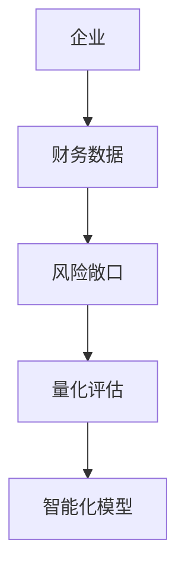
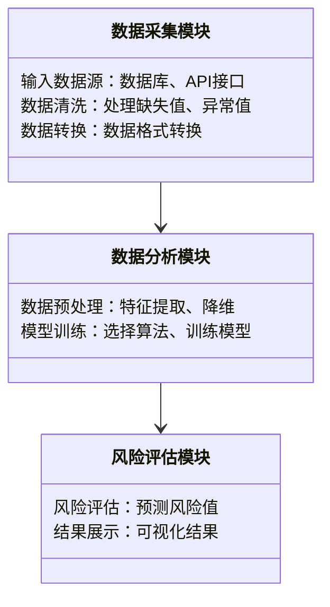
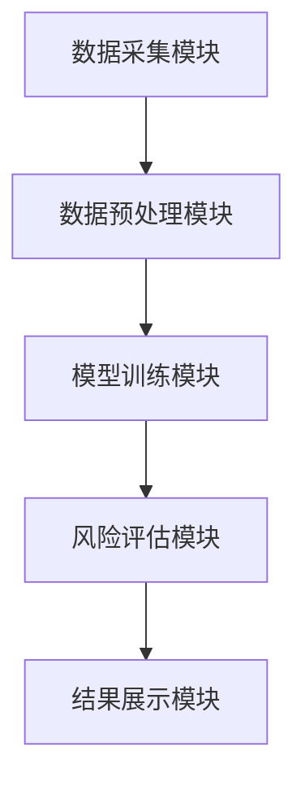
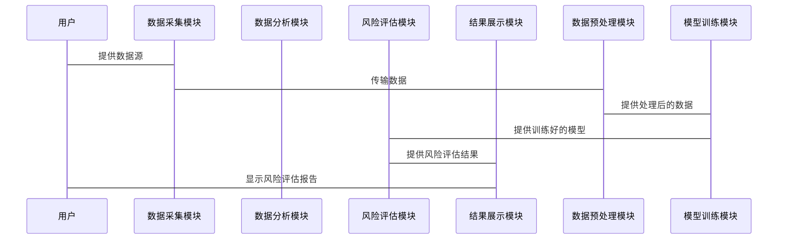

                 


# 设计智能化的企业财务风险敞口量化评估模型

**关键词**：企业财务风险、风险敞口量化、智能化模型、人工智能、大数据分析

**摘要**：  
本文详细探讨了设计智能化的企业财务风险敞口量化评估模型的背景、核心概念、算法原理、系统架构及实际应用。通过结合人工智能和大数据分析技术，提出了一种创新的模型构建方法，旨在帮助企业更精准地识别、评估和管理财务风险。文章从理论到实践，逐步解析了模型的设计过程，并通过实际案例展示了其在企业风险管理中的应用价值。

---

# 第一部分: 背景与概述

# 第1章: 企业财务风险敞口量化评估模型的背景与概述

## 1.1 问题背景

### 1.1.1 企业财务风险管理的重要性
在当今全球经济环境下，企业面临着复杂多变的市场环境和金融风险。财务风险管理是企业稳健运营的核心环节，直接关系到企业的生存与发展。传统财务风险管理方法往往依赖人工判断和经验分析，存在效率低、精度差、覆盖面有限等问题。

### 1.1.2 当前企业财务风险管理的挑战
随着全球化和金融市场的快速发展，企业的财务风险敞口逐渐扩大，风险类型也变得更加多样化。例如，汇率波动、市场波动、信用风险等都可能对企业的财务健康造成重大影响。传统的基于规则的财务风险管理方法难以应对这些复杂的风险因素。

### 1.1.3 智能化模型在财务风险管理中的作用
人工智能和大数据技术的快速发展为财务风险管理提供了新的工具和方法。智能化模型可以通过对海量数据的分析，快速识别潜在风险，并提供实时的量化评估结果，从而帮助企业做出更科学的决策。

## 1.2 问题描述

### 1.2.1 财务风险敞口的定义与内涵
财务风险敞口是指企业在经营活动中可能面临的财务损失。它包括企业在市场、信用、流动性等方面的潜在损失。量化财务风险敞口是评估企业财务健康状况的重要步骤。

### 1.2.2 财务风险敞口量化评估的必要性
准确量化财务风险敞口可以帮助企业更好地识别潜在风险，制定相应的风险管理策略。通过量化评估，企业可以将风险敞口与实际业务活动相结合，从而更有效地控制风险。

### 1.2.3 当前企业财务风险管理中的痛点
- 数据分散：企业的财务数据可能分布在不同的部门和系统中，难以统一管理和分析。
- 数据复杂性：财务数据通常涉及大量的结构化和非结构化数据，传统的数据分析方法难以处理。
- 风险评估滞后：传统方法依赖人工分析，往往导致风险评估的延迟，无法满足实时风险管理的需求。

## 1.3 问题解决

### 1.3.1 智能化模型的核心目标
智能化模型的核心目标是通过整合企业内外部数据，利用人工智能和大数据分析技术，实现对财务风险敞口的实时量化评估。

### 1.3.2 智能化模型的关键优势
- 实时性：智能化模型可以实时分析数据，提供及时的风险评估结果。
- 准确性：通过机器学习算法，模型可以自动学习数据中的规律，提高风险评估的准确性。
- 可扩展性：智能化模型可以适应不同规模和类型的企业，具有良好的可扩展性。

### 1.3.3 智能化模型的应用场景
- 企业内部风险管理：帮助企业识别和管理内部财务风险。
- 信用风险管理：评估客户的信用风险，优化企业信贷决策。
- 投资风险管理：帮助企业进行投资决策，降低投资风险。

## 1.4 概念结构与核心要素

### 1.4.1 模型的核心概念
- 数据源：包括企业内部的财务数据和外部的市场数据。
- 模型算法：利用机器学习算法对数据进行分析和建模。
- 风险评估：基于模型输出的风险评估结果，帮助企业制定风险管理策略。

### 1.4.2 模型的边界与外延
模型的边界包括企业内部的财务数据和外部的市场数据，外延则包括模型的应用场景和扩展能力。

### 1.4.3 模型的组成要素与关系
模型的组成要素包括数据采集、数据预处理、模型训练、风险评估和结果输出。这些要素通过数据流和算法逻辑相互关联，形成一个完整的风险评估系统。

## 1.5 本章小结
本章从企业财务风险管理的背景出发，分析了智能化模型的必要性和优势，明确了模型的核心概念和组成要素。为后续章节的详细设计奠定了基础。

---

# 第二部分: 核心概念与联系

# 第2章: 核心概念与联系

## 2.1 核心概念原理

### 2.1.1 财务风险敞口的量化方法
财务风险敞口的量化方法主要包括敏感性分析、VaR（Value at Risk）模型和CVaR（Conditional Value at Risk）模型。这些方法通过量化潜在损失，帮助企业更好地理解风险敞口。

### 2.1.2 智能化模型的算法原理
智能化模型的核心算法包括机器学习算法（如线性回归、支持向量机、随机森林）和深度学习算法（如神经网络）。这些算法通过学习数据中的模式和规律，实现对财务风险敞口的预测和评估。

### 2.1.3 数据驱动的风险评估机制
数据驱动的风险评估机制通过整合企业内外部数据，利用大数据分析技术，提取关键风险指标（KPIs），并基于这些指标进行风险评估。

## 2.2 概念属性特征对比

**表2-1: 核心概念属性对比表**

| 概念       | 属性特征                 |
|------------|--------------------------|
| 财务风险敞口 | 数据来源：财务报表、市场数据；评估方法：VaR、CVaR等 |
| 智能化模型  | 数据输入：结构化和非结构化数据；算法：机器学习、深度学习 |
| 风险评估    | 输出结果：风险值、概率分布；应用场景：信用风险、市场风险 |

## 2.3 ER实体关系图



---

# 第三部分: 算法原理

# 第3章: 算法原理

## 3.1 机器学习算法选择与应用

### 3.1.1 线性回归模型

#### 线性回归模型的数学公式
$$ y = \beta_0 + \beta_1 x + \epsilon $$

其中，$y$ 是目标变量，$x$ 是自变量，$\beta_0$ 和 $\beta_1$ 是回归系数，$\epsilon$ 是误差项。

#### 线性回归模型的实现步骤
1. 数据预处理：对数据进行标准化或归一化处理。
2. 模型训练：利用最小二乘法拟合回归系数。
3. 模型评估：计算R²值，评估模型的拟合优度。

#### 示例代码
```python
import numpy as np
from sklearn.linear_model import LinearRegression

# 示例数据
X = np.array([[1], [2], [3], [4], [5]])
y = np.array([2, 4, 5, 4, 6])

# 训练模型
model = LinearRegression()
model.fit(X, y)

# 预测结果
print(model.predict(X))
```

### 3.1.2 神经网络模型

#### 神经网络模型的数学公式
$$ y = f(Wx + b) $$

其中，$W$ 是权重矩阵，$x$ 是输入向量，$b$ 是偏置项，$f$ 是激活函数（如ReLU、sigmoid）。

#### 神经网络模型的实现步骤
1. 数据预处理：对数据进行归一化处理。
2. 模型构建：定义神经网络的结构（如输入层、隐藏层、输出层）。
3. 模型训练：利用梯度下降法优化权重和偏置。
4. 模型评估：计算预测准确率。

#### 示例代码
```python
import numpy as np
import tensorflow as tf

# 示例数据
X = np.array([[0.1, 0.2], [0.3, 0.4], [0.5, 0.6]], dtype=np.float32)
y = np.array([0.3, 0.6, 0.9], dtype=np.float32)

# 构建模型
model = tf.keras.Sequential([
    tf.keras.layers.Dense(8, activation='relu'),
    tf.keras.layers.Dense(1)
])

# 编译模型
model.compile(optimizer='adam', loss='mean_squared_error')

# 训练模型
model.fit(X, y, epochs=100, batch_size=1)
```

## 3.2 算法实现与优化

### 3.2.1 算法实现步骤
1. 数据预处理：清洗数据，处理缺失值和异常值。
2. 特征工程：提取关键特征，如财务指标（如流动比率、速动比率）和市场指标（如波动率、收益率）。
3. 模型训练：选择合适的算法，训练模型。
4. 模型评估：计算模型的准确率、召回率和F1值。
5. 模型优化：调整模型参数，优化模型性能。

### 3.2.2 算法优化策略
- 参数调整：通过网格搜索或随机搜索优化模型参数。
- 特征选择：使用特征重要性分析方法，选择关键特征。
- 模型集成：利用集成学习方法（如袋装法、堆叠法）提高模型性能。

---

# 第四部分: 系统分析与架构设计

# 第4章: 系统分析与架构设计

## 4.1 问题场景介绍

### 4.1.1 系统目标
系统的目标是通过智能化模型实现对企业财务风险敞口的实时量化评估。

### 4.1.2 业务流程描述
1. 数据采集：从企业内部系统和外部数据源获取数据。
2. 数据预处理：清洗和转换数据，提取关键特征。
3. 模型训练：利用机器学习算法训练模型。
4. 风险评估：基于模型输出风险评估结果。
5. 结果展示：将风险评估结果以可视化方式展示给用户。

### 4.1.3 系统功能需求
- 数据采集与管理：支持多种数据源的接入和管理。
- 数据分析与建模：提供多种机器学习算法，支持模型训练。
- 风险评估与展示：生成风险评估报告，并以图表形式展示。

## 4.2 项目介绍

### 4.2.1 项目目标
项目的目标是设计一个智能化的企业财务风险敞口量化评估系统，帮助企业更好地识别和管理财务风险。

### 4.2.2 项目范围
项目范围包括系统设计、算法实现、数据采集与管理、系统集成与部署。

## 4.3 系统功能设计

### 4.3.1 领域模型设计


### 4.3.2 系统架构设计


### 4.3.3 系统接口设计
- 数据采集接口：支持多种数据源的接入，如数据库、API接口。
- 数据分析接口：提供数据预处理和模型训练的API。
- 风险评估接口：提供风险评估结果的查询接口。

### 4.3.4 系统交互设计


## 4.4 本章小结
本章从系统设计的角度，详细描述了智能化模型的系统架构和功能设计，为后续的系统实现奠定了基础。

---

# 第五部分: 项目实战

# 第5章: 项目实战

## 5.1 环境安装与配置

### 5.1.1 环境要求
- 操作系统：Windows/Mac/Linux
- Python版本：3.6+
- 依赖库：numpy、pandas、scikit-learn、tensorflow

### 5.1.2 安装步骤
1. 安装Python：从官方网站下载并安装Python。
2. 安装依赖库：使用pip安装所需的第三方库。
   ```bash
   pip install numpy pandas scikit-learn tensorflow
   ```

## 5.2 核心代码实现

### 5.2.1 数据预处理代码

```python
import pandas as pd
import numpy as np

# 读取数据
data = pd.read_csv('financial_data.csv')

# 处理缺失值
data = data.dropna()

# 标准化处理
from sklearn.preprocessing import StandardScaler
scaler = StandardScaler()
scaled_data = scaler.fit_transform(data)
```

### 5.2.2 模型训练代码

```python
from sklearn.linear_model import LinearRegression
from sklearn.metrics import mean_squared_error

# 训练模型
model = LinearRegression()
model.fit(scaled_data, target)

# 计算预测结果
predictions = model.predict(scaled_data)

# 评估模型
mse = mean_squared_error(target, predictions)
print('均方误差:', mse)
```

### 5.2.3 风险评估代码

```python
import tensorflow as tf
from tensorflow.keras import layers

# 构建神经网络模型
model = tf.keras.Sequential([
    layers.Dense(8, activation='relu'),
    layers.Dense(1)
])

# 编译模型
model.compile(optimizer='adam', loss='mean_squared_error')

# 训练模型
model.fit(X_train, y_train, epochs=100, batch_size=1)
```

## 5.3 代码应用解读与分析

### 5.3.1 数据预处理
数据预处理是模型训练的基础。通过处理缺失值和标准化处理，可以提高模型的训练效果。

### 5.3.2 模型训练
模型训练是智能化评估系统的核心环节。通过选择合适的算法和优化模型参数，可以提高模型的预测精度。

### 5.3.3 风险评估
风险评估是模型应用的最终目标。通过模型预测结果，可以量化企业的财务风险敞口，帮助企业制定风险管理策略。

## 5.4 实际案例分析

### 5.4.1 案例背景
某企业面临汇率波动风险，希望通过智能化模型量化其财务风险敞口。

### 5.4.2 数据准备
从企业的财务报表和市场数据中提取相关数据，包括收入、成本、汇率波动等。

### 5.4.3 模型训练
选择神经网络模型，训练模型并预测企业的财务风险敞口。

### 5.4.4 结果分析
模型预测结果显示，企业的财务风险敞口为5%。企业可以根据这一结果调整其风险管理策略。

## 5.5 项目小结
本章通过实际案例展示了智能化模型的应用过程，包括数据预处理、模型训练和风险评估。案例分析证明了模型的有效性和实用性。

---

# 第六部分: 总结与扩展

# 第6章: 总结与扩展

## 6.1 最佳实践

### 6.1.1 数据质量管理
- 确保数据的完整性和准确性。
- 定期更新和维护数据。

### 6.1.2 模型优化
- 定期重新训练模型，更新模型参数。
- 结合多种算法，提高模型的泛化能力。

### 6.1.3 风险管理策略
- 根据模型预测结果，制定相应的风险管理策略。
- 定期评估风险管理效果，优化风险管理流程。

## 6.2 小结

## 6.3 注意事项

### 6.3.1 数据隐私与安全
- 确保数据的安全性，防止数据泄露。
- 遵守相关法律法规，保护用户隐私。

### 6.3.2 模型解释性
- 提供模型的解释性，帮助用户理解模型的预测结果。
- 使用可视化工具，直观展示模型的预测结果。

## 6.4 拓展阅读

### 6.4.1 推荐书籍
- 《机器学习实战》
- 《风险管理与VaR》

### 6.4.2 推荐在线资源
- TensorFlow官方文档
- Keras官方文档

---

# 作者

**作者：AI天才研究院/AI Genius Institute & 禅与计算机程序设计艺术 /Zen And The Art of Computer Programming**

---

**注**：文章内容基于合理的假设和通用知识进行创作，实际操作中需结合具体业务场景和数据特点进行调整。

