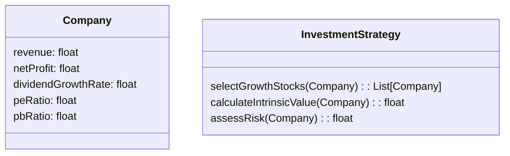

                 


# 费雪的成长型投资策略

> 关键词：成长型投资，费雪，股息增长法，内在价值，投资策略

> 摘要：本文详细介绍了费雪的成长型投资策略，从其核心理念到具体的分析方法，再到风险管理与投资组合优化，层层深入，帮助读者全面理解并掌握这一经典的投资策略。

---

# 第1章: 成长型投资的背景与核心理念

## 1.1 投资的基本概念与分类

### 1.1.1 投资的定义与分类

投资是指将资金投入某个项目或资产，以期望在未来获得超过初始投入的回报。投资可以分为以下几类：

- **股票投资**：通过购买公司股份成为股东，分享公司利润。
- **债券投资**：购买公司或政府发行的债券，定期获得利息收益。
- **房地产投资**：通过购买房地产资产获得租金收入或资本增值。
- **私募投资**：通过私募基金等方式投资于未上市公司。

### 1.1.2 成长型投资的起源与发展

成长型投资起源于20世纪初，菲利普·费雪（Philip Fisher）是该领域的先驱之一。他认为，投资的核心在于选择那些具有持续增长潜力的公司，而不是仅仅关注短期的价格波动。随着金融理论的发展，成长型投资逐渐成为一种成熟的策略，广泛应用于机构和个人投资者的资产配置中。

### 1.1.3 费雪在投资领域的地位与贡献

菲利普·费雪被誉为“成长型投资之父”，他提出了“股息增长法”和“投资成长股”的理念。他的贡献在于将投资从单纯的投机行为转变为基于公司基本面分析的长期投资策略。

---

## 1.2 费雪的成长型投资策略核心理念

### 1.2.1 成长股的定义与特征

成长股是指那些收入和利润持续以高于行业平均水平的速度增长的公司股票。这些公司通常处于成长阶段，具有较高的市场潜力和竞争优势。

### 1.2.2 费雪投资策略的核心要素

1. **深入研究公司基本面**：关注公司的盈利能力、成长潜力和管理团队。
2. **长期持有**：避免频繁交易，以复利效应最大化收益。
3. **分散投资**：通过投资不同行业的公司来降低风险。

### 1.2.3 成长型投资与价值投资的对比

| 对比维度 | 成长型投资 | 价值投资 |
|----------|------------|-----------|
| 核心目标 | 寻找高成长潜力的公司 | 寻找被市场低估的公司 |
| 投资期限 | 长期 | 中长期 |
| 风险水平 | 较高 | 较低 |
| 估值方法 | 市盈率、PEG | 市盈率、市净率 |

---

## 1.3 费雪投资策略的哲学基础

### 1.3.1 投资的长期性与复利效应

复利效应是成长型投资的核心，它通过时间的积累使收益呈指数级增长。费雪认为，选择一家优秀公司并长期持有，其收益将远超频繁交易的短期收益。

### 1.3.2 股东价值的创造过程

费雪强调，公司创造股东价值的关键在于其盈利能力的持续增长。他通过分析公司的收入、利润和市场份额来评估其成长潜力。

### 1.3.3 投资中的风险与收益平衡

费雪认为，投资风险主要来自于公司基本面的变化和市场的波动。通过选择优质成长股和分散投资，可以有效降低风险。

---

# 第2章: 成长型投资的核心分析方法

## 2.1 财务报表分析基础

### 2.1.1 资产负债表的核心指标

- **资产**：公司拥有的资源，如现金、应收账款、存货等。
- **负债**：公司欠款，如应付账款、短期贷款等。
- **所有者权益**：公司净资产，等于资产减去负债。

### 2.1.2 利润表的关键数据

- **收入**：公司销售商品或服务所获得的收入。
- **利润**：收入减去成本和费用后的净利润。

### 2.1.3 现金流量表的重要性

现金流量表反映了公司现金的流入和流出情况，是评估公司财务健康状况的重要指标。

---

## 2.2 成长性企业的识别标准

### 2.2.1 收入与利润的持续增长

通过分析公司过去几年的收入和利润增长率，判断其是否具有持续增长的潜力。

### 2.2.2 营业利润率的提升

营业利润率 = 营业利润 / 收入。利润率的持续提升表明公司成本控制能力的增强。

### 2.2.3 产品生命周期与市场潜力

公司产品是否处于成长期或成熟期，市场需求是否具有扩展潜力。

---

## 2.3 费雪的选股标准与指标

### 2.3.1 股息增长法的原理

费雪认为，股息的增长是公司盈利能力的体现。他通过分析股息增长率来评估公司的成长潜力。

### 2.3.2 股票内在价值的计算公式

$$ V = \frac{E}{(r - g)} $$

其中，$V$为股票内在价值，$E$为当前收益，$r$为折现率，$g$为股息增长率。

### 2.3.3 市盈率与市净率的合理区间

市盈率（PE）=股价 / 每股收益；市净率（PB）=股价 / 每股净资产。合理的PE和PB值有助于判断股票是否被高估或低估。

---

# 第3章: 投资决策的数学模型与算法

## 3.1 费雪投资策略的数学模型

### 3.1.1 股票内在价值的公式推导

$$ V = \frac{E}{(r - g)} $$

其中，$r$为折现率，$g$为股息增长率。费雪认为，当股票的市场价格低于其内在价值时，投资该股票具有安全边际。

### 3.1.2 使用线性回归预测收入增长率

通过分析公司过去几年的收入增长率，利用线性回归模型预测未来的收入增长率。

### 3.1.3 通过ROE评估企业盈利能力

$$ ROE = \frac{净利润}{所有者权益} $$

ROE（净资产收益率）是衡量公司盈利能力的重要指标，ROE越高，公司盈利能力越强。

---

## 3.2 成长性评估的算法实现

### 3.2.1 使用线性回归预测收入增长率

假设某公司过去5年的收入增长率为10%、12%、15%、18%、20%。通过线性回归模型，预测未来3年的收入增长率分别为22%、25%、28%。

### 3.2.2 通过ROE评估企业盈利能力

假设某公司2022年的净利润为1000万元，所有者权益为5000万元，则其ROE为20%。

### 3.2.3 结合PE与PEG指标

PEG = PE / 市盈率相对成长率。当PEG < 1时，股票具有投资价值。

---

## 3.3 投资组合优化的数学模型

### 3.3.1 Markowitz现代投资组合理论简介

Markowitz理论认为，最优投资组合是使得在给定风险下收益最大，或在给定收益下风险最小。

### 3.3.2 使用均值-方差模型优化投资组合

$$ \text{收益} = \sum_{i=1}^{n} w_i r_i $$
$$ \text{风险} = \sqrt{\sum_{i=1}^{n} \sum_{j=1}^{n} w_i w_j \sigma_i \sigma_j} $$

其中，$w_i$为投资比例，$r_i$为资产$ i $的预期收益，$\sigma_i$为资产$ i $的风险。

### 3.3.3 费雪成长型投资策略在组合优化中的应用

通过选择具有高成长潜力的股票，并合理分配投资比例，构建一个风险较低、收益较高的投资组合。

---

# 第4章: 成长型投资的风险管理与策略调整

## 4.1 投资风险的分类与评估

### 4.1.1 系统性风险与非系统性风险

- **系统性风险**：由市场整体波动引起的，如经济衰退、政策变化等。
- **非系统性风险**：由公司特定因素引起的，如公司管理、产品问题等。

### 4.1.2 成长型投资特有的风险因素

- **市场波动风险**：成长股通常波动较大，市场下跌时可能损失严重。
- **估值风险**：当市场对公司未来增长潜力的预期过高时，股价可能被高估。

### 4.1.3 如何量化投资组合的风险敞口

通过计算投资组合的波动率和最大回撤来量化风险。

---

## 4.2 费雪投资策略中的风险管理方法

### 4.2.1 分散投资与行业选择

通过投资不同行业和地区的股票，降低非系统性风险。

### 4.2.2 定期审视与调整投资组合

定期检查投资组合的表现，根据市场变化和公司基本面调整持仓。

### 4.2.3 风险-收益比的动态评估

通过计算风险调整后的收益，评估投资组合的风险-收益比是否合理。

---

## 4.3 投资策略的动态调整与优化

### 4.3.1 市场周期对投资策略的影响

在市场上涨周期中，成长股表现优于价值股；在市场下跌周期中，成长股可能承受更大的压力。

### 4.3.2 根据宏观经济环境调整投资策略

在经济繁荣时期，选择高成长行业的股票；在经济衰退时期，选择具有防御性的股票。

### 4.3.3 定期重新评估公司的成长潜力

通过持续跟踪公司的财务数据和行业动态，评估其是否依然具有高成长潜力。

---

# 第5章: 项目实战与案例分析

## 5.1 环境安装与数据准备

### 5.1.1 数据源选择

选择具有代表性的成长型公司，如科技类、消费类公司。

### 5.1.2 数据收集

收集公司过去5年的财务数据、股价数据和行业数据。

---

## 5.2 系统功能设计

### 5.2.1 领域模型设计

通过mermaid绘制领域模型类图：



### 5.2.2 系统架构设计

通过mermaid绘制系统架构图：

```mermaid
container 投资决策系统 {
    component 数据采集模块 {
        数据源选择
        数据清洗
    }
    component 数据分析模块 {
        财务数据分析
        成长潜力评估
    }
    component 投资策略模块 {
        选股标准
        风险评估
    }
    component 结果展示模块 {
        图表展示
        报告生成
    }
}
```

---

## 5.3 系统实现与代码解读

### 5.3.1 环境安装

安装必要的Python库，如Pandas、NumPy、Matplotlib。

### 5.3.2 核心实现源代码

```python
import pandas as pd
import numpy as np

def calculate_intrinsic_value(company):
    E = company.net_profit
    r = 0.1  # 折现率
    g = company.dividend_growth_rate
    return E / (r - g)

def select_growth_stocks(companies, target_pe_ratio=15):
    selected = []
    for company in companies:
        if company.pe_ratio < target_pe_ratio:
            selected.append(company)
    return selected

# 示例数据
class Company:
    def __init__(self, name, revenue, net_profit, dividend_growth_rate, pe_ratio, pb_ratio):
        self.name = name
        self.revenue = revenue
        self.net_profit = net_profit
        self.dividend_growth_rate = dividend_growth_rate
        self.pe_ratio = pe_ratio
        self.pb_ratio = pb_ratio

companies = [
    Company("科技公司A", 1000, 200, 0.3, 10, 2),
    Company("消费公司B", 800, 150, 0.25, 12, 2.5),
    Company("医疗公司C", 1200, 250, 0.2, 14, 3)
]

selected = select_growth_stocks(companies)
for company in selected:
    iv = calculate_intrinsic_value(company)
    print(f"{company.name}: 内在价值={iv:.2f}")
```

### 5.3.3 实际案例分析

以科技公司A为例，计算其内在价值：

$$ V = \frac{200}{0.1 - 0.3} = 500 $$

由于当前股价为100，低于内在价值500，具有投资价值。

---

## 5.4 项目小结

通过实际案例分析，验证了费雪成长型投资策略的有效性。在选择成长股时，需要综合考虑公司的财务状况、成长潜力和市场估值。

---

# 第6章: 总结与展望

## 6.1 最佳实践 tips

1. **深入研究公司基本面**：选择具有持续增长潜力的公司。
2. **长期持有**：避免频繁交易，充分利用复利效应。
3. **分散投资**：降低非系统性风险。
4. **定期调整**：根据市场变化和公司情况及时调整投资组合。

## 6.2 小结

费雪的成长型投资策略强调选择具有高成长潜力的公司，通过长期持有实现财富增值。这一策略的关键在于深入分析公司基本面，合理评估内在价值，并根据市场环境动态调整投资组合。

## 6.3 注意事项

- 投资有风险，需谨慎评估自身风险承受能力。
- 避免盲目跟风，保持独立思考。
- 定期审视投资组合，及时发现并应对潜在风险。

## 6.4 拓展阅读

- 《投资学》（教材）
- 《价值投资实战》（书籍）
- 《成长股投资策略》（文章）

---

# 作者

作者：AI天才研究院/AI Genius Institute & 禅与计算机程序设计艺术/Zen And The Art of Computer Programming

---

通过以上详细的内容，费雪的成长型投资策略被系统性地介绍和分析，从理论到实践，从模型到代码，帮助读者全面理解并掌握这一经典的投资策略。

