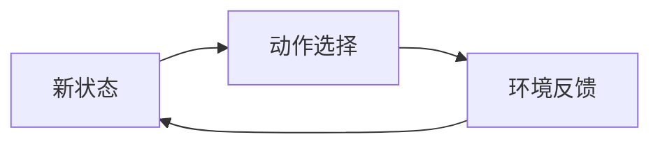
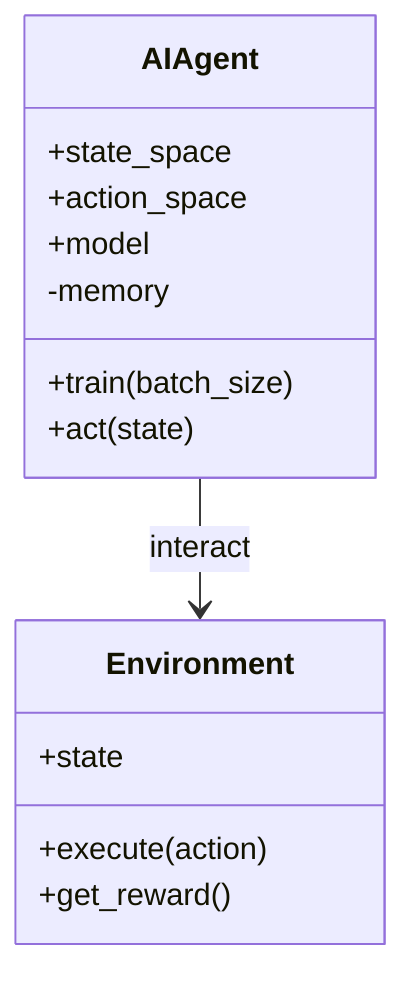
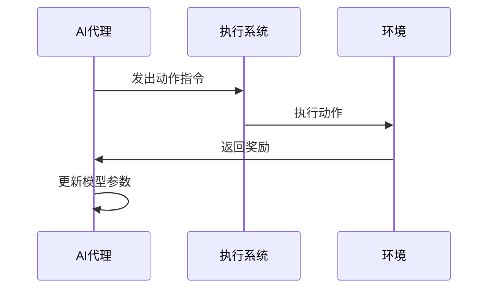

                 


# AI agents在公司长期战略执行力评估中的应用

> 关键词：AI代理，战略执行力，企业战略管理，人工智能，算法模型

> 摘要：本文深入探讨了AI代理在公司长期战略执行力评估中的应用。通过分析AI代理的核心原理、算法模型、系统架构以及实际案例，揭示了AI代理如何提升战略目标的分解、执行过程的实时反馈和结果评估的闭环优化。文章还提供了详细的数学模型、代码实现和系统设计，为读者提供了全面的技术视角。

---

# 第一部分: AI代理与公司战略执行力评估的背景介绍

# 第1章: AI代理与战略执行力评估的背景

## 1.1 问题背景与描述

### 1.1.1 公司战略执行力评估的重要性

在现代企业竞争中，战略规划是企业发展的核心，而战略执行力则是决定企业目标能否实现的关键因素。传统的企业战略管理依赖于人工评估和经验判断，这种方法不仅效率低下，而且容易受到主观因素的影响，难以量化和优化。

### 1.1.2 当前战略执行力评估的痛点

1. **评估过程复杂**：传统战略执行力评估需要收集大量数据，涵盖多个部门和业务线，过程繁琐且耗时。
2. **结果缺乏动态性**：评估结果通常是静态的，难以实时反馈执行过程中的问题。
3. **难以量化优化**：缺乏统一的量化标准，优化过程难以系统化。

### 1.1.3 AI代理在战略执行力评估中的潜力

AI代理（AI Agent）是一种能够感知环境、自主决策并执行任务的智能体。通过AI代理，企业可以实现战略目标的自动分解、执行过程的实时监控和结果的动态优化。AI代理的优势在于其高效性、精准性和可扩展性，能够显著提升战略执行力评估的效率和效果。

## 1.2 问题解决与边界

### 1.2.1 AI代理如何解决战略执行力评估问题

AI代理通过以下方式解决战略执行力评估的问题：

1. **自动分解战略目标**：AI代理能够将长期战略目标分解为可执行的任务，并分配给不同的部门或团队。
2. **实时反馈机制**：AI代理实时监控执行过程，提供动态反馈，帮助及时调整执行策略。
3. **闭环优化系统**：AI代理通过收集执行结果，优化战略目标的分解和执行策略，形成闭环。

### 1.2.2 问题的边界与外延

AI代理在战略执行力评估中的应用有以下边界：

1. **适用范围**：适用于需要分解和执行的复杂任务，不适用于简单重复性工作。
2. **数据要求**：需要大量的历史数据和实时数据支持决策。
3. **技术限制**：目前的AI代理在复杂场景下的决策能力有限，仍需人工干预。

### 1.2.3 核心概念与要素组成

战略执行力评估的核心概念包括：

1. **战略目标分解**：将长期目标分解为具体的可执行任务。
2. **执行过程监控**：实时跟踪任务的执行情况。
3. **结果评估与优化**：根据执行结果优化战略目标和执行策略。

## 1.3 本章小结

本章介绍了AI代理在公司长期战略执行力评估中的背景和意义，分析了传统评估方法的痛点，并提出了AI代理的应用潜力。通过AI代理，企业可以实现战略目标的自动分解、执行过程的实时监控和闭环优化，显著提升战略执行力评估的效率和效果。

---

# 第二部分: AI代理与战略执行力评估的核心概念与联系

# 第2章: AI代理的核心原理

## 2.1 AI代理的基本概念

### 2.1.1 AI代理的定义与分类

AI代理是一种能够感知环境、自主决策并执行任务的智能体。根据功能的不同，AI代理可以分为以下几类：

1. **反应式代理**：根据当前环境信息做出反应，没有内部状态。
2. **认知式代理**：具有复杂推理能力，能够处理知识和不确定性。
3. **学习式代理**：能够通过经验改进性能。

### 2.1.2 AI代理的主要特点

1. **自主性**：能够自主决策和行动，无需人工干预。
2. **反应性**：能够根据环境变化实时调整行为。
3. **学习能力**：通过经验改进性能，适应新场景。

### 2.1.3 AI代理与传统算法的区别

表2-1: AI代理与传统算法的对比

| 特性 | AI代理 | 传统算法 |
|------|--------|----------|
| 决策方式 | 基于环境反馈的自主决策 | 线性或固定的规则 |
| 学习能力 | 具备学习能力 | 无学习能力 |
| 适应性 | 能够适应新环境 | 适应性有限 |

## 2.2 AI代理的核心算法原理

### 2.2.1 强化学习与监督学习的对比

强化学习是AI代理的核心算法之一，与监督学习的区别如下：

| 特性 | 强化学习 | 监督学习 |
|------|---------|----------|
| 数据来源 | 环境反馈 | 标签数据 |
| 决策方式 | 基于反馈的奖励机制 | 基于标签的错误修正 |
| 应用场景 | 环境动态变化 | 数据静态 |

### 2.2.2 AI代理的决策机制

AI代理的决策机制包括以下步骤：

1. **感知环境**：通过传感器或数据接口获取环境信息。
2. **状态表示**：将环境信息转换为状态表示。
3. **动作选择**：基于状态表示和历史经验选择最优动作。
4. **执行动作**：将选择的动作发送到执行系统。
5. **反馈机制**：根据执行结果更新模型参数。

### 2.2.3 状态空间与动作空间的构建

状态空间和动作空间是AI代理的核心组成部分。状态空间表示环境中的所有可能状态，动作空间表示AI代理在每个状态下可能执行的所有动作。

例如，假设一个AI代理的目标是优化生产流程，状态空间可以包括生产效率、资源利用率等指标，动作空间可以包括调整生产线速度、分配资源等操作。

## 2.3 AI代理在战略执行力评估中的应用

### 2.3.1 战略目标分解与AI代理的关系

AI代理可以帮助企业将长期战略目标分解为可执行的任务。例如，将“提高市场份额”分解为“增加广告投入”、“优化客户服务”等具体任务。

### 2.3.2 执行过程中的实时反馈机制

AI代理实时监控执行过程，提供动态反馈。例如，当发现某个部门的执行进度落后于计划时，AI代理可以立即发出调整指令。

### 2.3.3 结果评估与优化的闭环系统

AI代理通过收集执行结果，优化战略目标的分解和执行策略。例如，根据上季度的执行结果，AI代理可以调整下季度的目标分解方式。

## 2.4 核心概念对比表格

表2-2: AI代理与传统评估方法的对比

| 特性 | AI代理 | 传统评估方法 |
|------|--------|---------------|
| 评估效率 | 高效实时 | 低效且静态 |
| 评估精度 | 高精度 | 低精度 |
| 可优化性 | 易优化 | 难优化 |

## 2.5 实体关系图


## 2.6 本章小结

本章详细介绍了AI代理的核心原理，包括其定义、分类、特点以及与传统算法的区别。通过对比分析，揭示了AI代理在战略执行力评估中的独特优势和应用场景。

---

# 第三部分: AI代理的算法原理与数学模型

# 第3章: AI代理的核心算法

## 3.1 算法原理

### 3.1.1 强化学习的基本原理

强化学习是一种基于奖励机制的算法，通过不断试错来优化决策策略。其核心在于通过最大化累积奖励来优化动作选择。

### 3.1.2 策略网络与值函数网络的构建

策略网络和值函数网络是强化学习中的两个关键组件：

1. **策略网络**：直接输出动作的概率分布，用于选择最优动作。
2. **值函数网络**：估计当前状态的值函数，用于评估动作的优劣。

### 3.1.3 探索与利用的平衡机制

在强化学习中，探索（Exploration）和利用（Exploitation）是两个关键概念。AI代理需要在探索新动作和利用已知动作之间找到平衡。

例如，使用ε-贪心策略（ε-greedy）：在概率ε的情况下选择随机动作（探索），在概率1-ε的情况下选择当前最优动作（利用）。

## 3.2 算法流程图



## 3.3 核心代码实现

以下是一个强化学习算法（Q-learning）的Python代码示例：

```python
import numpy as np
import tensorflow as tf

class AIAgent:
    def __init__(self, state_space, action_space):
        self.state_space = state_space
        self.action_space = action_space
        self.model = self.build_model()

    def build_model(self):
        model = tf.keras.Sequential([
            tf.keras.layers.Dense(64, activation='relu'),
            tf.keras.layers.Dense(self.action_space, activation='softmax')
        ])
        return model

    def act(self, state):
        prediction = self.model.predict(np.array([state]))
        action = np.argmax(prediction[0])
        return action

    def remember(self, state, action, reward, next_state):
        self.memory.append((state, action, reward, next_state))

    def replay(self, batch_size):
        if len(self.memory) < batch_size:
            return
        batch = random.sample(self.memory, batch_size)
        for state, action, reward, next_state in batch:
            target = reward + self.gamma * np.max(self.model.predict(np.array([next_state]))[0])
            target_f = self.model.predict(np.array([state]))
            target_f[0][action] = target
            self.model.fit(np.array([state]), target_f, epochs=1, verbose=0)

    def train(self, batch_size):
        self.replay(batch_size)
```

## 3.4 数学模型与公式

### 3.4.1 Q-learning算法公式

Q-learning的核心公式是：

$$ Q(s, a) = Q(s, a) + \alpha \cdot [r + \gamma \cdot \max(Q(s', a')) - Q(s, a)] $$

其中：
- \( Q(s, a) \) 是当前状态 \( s \) 和动作 \( a \) 的价值。
- \( \alpha \) 是学习率。
- \( r \) 是奖励。
- \( \gamma \) 是折扣率。
- \( s' \) 是下一个状态。
- \( a' \) 是下一个动作。

### 3.4.2 动作选择概率

在策略网络中，动作选择的概率可以表示为：

$$ P(a | s) = \frac{\exp(Q(s, a))}{\sum_{a'} \exp(Q(s, a'))} $$

### 3.4.3 倒推法在战略目标分解中的应用

倒推法（Backward Chaining）是一种将长期目标分解为可执行任务的方法。例如，假设战略目标是“提高市场份额”，可以通过以下步骤分解：

1. **确定关键因素**：市场份额受广告投入、产品质量和服务质量的影响。
2. **分解任务**：提高广告投入、优化产品质量和服务质量。
3. **制定具体策略**：增加广告预算、改进售后服务流程。

## 3.5 本章小结

本章详细介绍了AI代理的核心算法，包括强化学习的基本原理、策略网络和值函数网络的构建，以及动作选择机制。通过数学公式和代码示例，揭示了AI代理在战略执行力评估中的技术实现。

---

# 第四部分: 系统分析与架构设计方案

# 第4章: 系统分析与架构设计

## 4.1 问题场景介绍

### 4.1.1 战略目标分解

以“提高企业利润率”为例，战略目标分解可以包括以下步骤：

1. **明确目标**：提高企业利润率。
2. **分解任务**：优化成本结构、提高收入。
3. **分配责任**：财务部门负责成本优化，销售部门负责收入增长。

## 4.2 系统功能设计

### 4.2.1 领域模型

领域模型是系统功能设计的核心，可以用Mermaid类图表示：



### 4.2.2 系统架构设计

系统架构设计可以用Mermaid架构图表示：


### 4.2.3 系统接口设计

系统接口设计包括以下内容：

1. **输入接口**：接收战略目标和执行数据。
2. **输出接口**：输出优化策略和执行结果。
3. **反馈接口**：收集执行结果并更新模型。

### 4.2.4 系统交互设计

系统交互设计可以用Mermaid序列图表示：



## 4.3 本章小结

本章通过问题场景介绍、系统功能设计、系统架构设计和系统交互设计，全面分析了AI代理在战略执行力评估中的系统实现方案。

---

# 第五部分: 项目实战

# 第5章: 项目实战

## 5.1 环境安装与配置

### 5.1.1 安装Python与TensorFlow

```bash
pip install numpy tensorflow
```

### 5.1.2 安装其他依赖

```bash
pip install matplotlib scikit-learn
```

## 5.2 核心代码实现

### 5.2.1 AI代理的核心代码

```python
import numpy as np
import tensorflow as tf

class AIAgent:
    def __init__(self, state_space, action_space):
        self.state_space = state_space
        self.action_space = action_space
        self.model = self.build_model()

    def build_model(self):
        model = tf.keras.Sequential([
            tf.keras.layers.Dense(64, activation='relu'),
            tf.keras.layers.Dense(self.action_space, activation='softmax')
        ])
        model.compile(optimizer='adam', loss='sparse_categorical_crossentropy')
        return model

    def act(self, state):
        prediction = self.model.predict(np.array([state]))
        action = np.argmax(prediction[0])
        return action

    def train(self, state, action, reward, next_state):
        target = reward + 0.95 * np.max(self.model.predict(np.array([next_state]))[0])
        target_f = self.model.predict(np.array([state]))
        target_f[0][action] = target
        self.model.fit(np.array([state]), target_f, epochs=1, verbose=0)
```

### 5.2.2 环境模拟代码

```python
class Environment:
    def __init__(self):
        self.state = 0
        self.reward = 0

    def execute(self, action):
        # 模拟执行动作
        self.state += 1
        self.reward = np.random.randn() * action + 1
        return self.reward

    def get_reward(self):
        return self.reward
```

## 5.3 代码应用解读与分析

### 5.3.1 AI代理的训练过程

AI代理通过与环境的交互不断优化其策略。例如，假设一个AI代理的目标是优化生产效率，它可以通过以下步骤进行训练：

1. **初始状态**：生产效率为0。
2. **选择动作**：随机选择一个动作（探索）或选择当前最优动作（利用）。
3. **执行动作**：执行选择的动作，更新生产效率。
4. **反馈奖励**：根据执行结果更新奖励。
5. **更新模型**：根据反馈更新策略网络。

### 5.3.2 环境模拟的实现细节

环境模拟是AI代理与现实世界的接口。通过环境模拟，AI代理可以将动作转化为实际操作，并获取环境反馈。

## 5.4 实际案例分析

### 5.4.1 案例背景

假设某企业的战略目标是“提高客户满意度”，我们可以通过AI代理来优化客户服务流程。

### 5.4.2 案例分析

1. **战略目标分解**：将“提高客户满意度”分解为“优化客户服务流程”和“改进客户响应时间”。
2. **执行过程监控**：AI代理实时监控客户服务流程的执行情况，根据反馈调整策略。
3. **结果评估与优化**：根据客户满意度的评估结果，优化战略目标的分解和执行策略。

## 5.5 本章小结

本章通过实际案例分析，展示了AI代理在战略执行力评估中的具体应用。通过环境模拟和代码实现，揭示了AI代理在实际场景中的工作原理和优化效果。

---

# 第六部分: 最佳实践与总结

# 第6章: 最佳实践与总结

## 6.1 最佳实践

### 6.1.1 数据质量的重要性

AI代理的性能高度依赖于数据质量。确保数据的准确性和完整性是成功应用AI代理的关键。

### 6.1.2 模型优化的注意事项

1. **选择合适的算法**：根据具体场景选择适合的算法。
2. **调整超参数**：通过实验调整学习率、折扣率等超参数。
3. **监控模型性能**：定期评估模型性能，及时优化。

### 6.1.3 人机协作的必要性

AI代理可以显著提升战略执行力评估的效率，但人机协作仍然是必不可少的。人类专家的决策和判断是AI代理无法替代的。

## 6.2 小结

通过本文的分析和实践，我们可以看到AI代理在公司长期战略执行力评估中的巨大潜力。AI代理不仅可以提高评估效率，还能通过实时反馈和闭环优化显著提升战略目标的执行效果。

## 6.3 注意事项

1. **技术风险**：AI代理的应用需要较高的技术门槛，企业需要具备相应的技术能力。
2. **数据风险**：数据泄露或滥用可能带来严重的后果。
3. **伦理问题**：AI代理的应用需要遵守相关法律法规和伦理规范。

## 6.4 拓展阅读

1. **强化学习的经典论文**：如《Playing Atari Games Using Deep Reinforcement Learning》。
2. **战略管理相关书籍**：如《竞争优势》（Competitive Advantage）。
3. **AI代理的最新研究**：如《Multi-Agent Reinforcement Learning: A Survey》。

## 6.5 本章小结

本章总结了AI代理在战略执行力评估中的最佳实践，提出了数据质量、模型优化和人机协作的重要性，并指出了应用中的注意事项和拓展阅读的方向。

---

# 作者：AI天才研究院/AI Genius Institute & 禅与计算机程序设计艺术/Zen And The Art of Computer Programming

