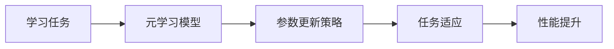

                 


# 元学习框架：构建快速适应的AI Agent系统

> 关键词：元学习，AI Agent，快速适应，Meta-Learning，机器学习，自适应系统

> 摘要：元学习是一种能够让AI Agent快速适应新任务的学习方法，通过对已有知识的元化处理，能够显著提升AI系统在复杂环境中的适应能力和灵活性。本文将深入探讨元学习的核心概念、算法原理、系统架构设计以及实际应用场景，帮助读者全面理解如何利用元学习框架构建快速适应的AI Agent系统。

---

## 第一部分: 元学习框架概述

### 第1章: 元学习的基本概念与背景

#### 1.1 元学习的定义与核心概念

- **1.1.1 元学习的定义**  
  元学习（Meta-Learning）是一种机器学习方法，旨在通过在多个任务上的经验，使模型能够快速适应新的任务。它不同于传统机器学习算法，后者通常需要大量特定任务的数据进行训练。元学习的核心在于“学习如何学习”，即通过元学习，模型能够在新任务上仅用少量数据就能快速调整参数，从而达到较好的性能。

- **1.1.2 元学习的核心概念**  
  元学习涉及多个关键概念，包括元任务、元模型、元损失函数等。元任务是指一组用于训练元模型的任务集合，元模型是用于生成或调整子模型的模型，元损失函数则是衡量元模型在不同任务之间一致性或泛化能力的损失函数。

- **1.1.3 元学习与传统学习的区别**  
  传统机器学习算法通常专注于单任务学习，而元学习则关注跨任务的学习，目标是通过多个任务的训练，使得模型具备快速适应新任务的能力。

#### 1.2 元学习的背景与问题背景

- **1.2.1 传统机器学习的局限性**  
  传统机器学习算法在面对新任务时，通常需要重新训练整个模型，且需要大量特定任务的数据支持。这种模式在实际应用中效率低下，尤其是在动态变化的环境中。

- **1.2.2 快速适应新任务的需求**  
  在现实应用中，AI Agent需要能够在不断变化的环境中快速适应新的任务，例如在自动驾驶中快速适应新的驾驶规则，或者在自然语言处理中快速适应新的领域知识。

- **1.2.3 元学习的解决方案**  
  元学习通过在多个任务上的训练，使得模型能够快速调整参数以适应新任务。这种方法特别适用于数据稀疏或任务频繁变化的场景。

#### 1.3 元学习的核心问题描述

- **1.3.1 元学习的目标**  
  元学习的目标是通过元训练过程，使得模型在面对新任务时，仅需少量数据即可快速收敛并达到较高的性能。

- **1.3.2 元学习的边界与外延**  
  元学习不仅适用于多任务学习，还可以与其他学习范式（如迁移学习、强化学习）结合，形成更强大的学习框架。

- **1.3.3 元学习的核心要素组成**  
  元学习的核心要素包括元任务、元模型、元损失函数和元训练过程。

#### 1.4 元学习的应用场景与价值

- **1.4.1 元学习在AI Agent中的应用**  
  AI Agent需要在动态环境中快速适应新任务，元学习能够显著提升其适应能力和灵活性。

- **1.4.2 元学习的实际案例分析**  
  例如，在自然语言处理中，元学习可以用于跨领域文本分类，使得模型能够快速适应新的领域数据。

- **1.4.3 元学习的未来发展展望**  
  元学习有望成为通用人工智能（AGI）的重要组成部分，帮助AI系统更好地适应复杂多变的现实世界。

#### 1.5 本章小结

本章介绍了元学习的基本概念、核心问题和应用场景，强调了元学习在构建快速适应AI Agent系统中的重要性。

---

## 第二部分: 元学习框架的核心概念与联系

### 第2章: 元学习的核心概念与联系

#### 2.1 元学习的核心概念原理

- **2.1.1 元学习的数学模型**  
  元学习通常涉及两个学习阶段：元训练阶段和任务适应阶段。在元训练阶段，模型学习如何调整参数以适应不同的任务；在任务适应阶段，模型利用元训练得到的能力快速适应新任务。

- **2.1.2 元学习的优化目标**  
  元学习的优化目标通常包括两个部分：元损失函数和任务损失函数。元损失函数用于衡量模型在不同任务之间的泛化能力，任务损失函数用于衡量模型在具体任务上的性能。

- **2.1.3 元学习的算法框架**  
  元学习的算法框架通常包括参数初始化、元训练过程、任务适应过程和性能优化等步骤。

#### 2.2 元学习的核心概念对比分析

- **2.2.1 任务间的关系对比**  
  元学习通常假设任务之间存在某种关系，例如共享某些特征或相似的结构。这种关系可以通过任务嵌入或任务描述来建模。

- **2.2.2 模型参数更新策略对比**  
  不同的元学习算法采用不同的参数更新策略，例如Meta-SGD算法采用梯度的线性组合，而MAML算法采用迭代的梯度更新。

- **2.2.3 不同元学习算法的对比**  
  不同元学习算法在训练效率、适应能力和应用场景上有不同的特点，例如Meta-SGD适用于快速适应，而MAML适用于复杂的任务结构。

#### 2.3 元学习的ER实体关系图



#### 2.4 本章小结

本章通过对元学习核心概念的分析，揭示了元学习在构建快速适应AI Agent系统中的关键要素和内在联系。

---

## 第三部分: 元学习算法原理与数学模型

### 第3章: 元学习算法原理

#### 3.1 元学习算法的基本流程

- **3.1.1 元学习的训练阶段**  
  元学习的训练阶段通常包括多个任务的训练，模型在训练过程中学习如何调整参数以适应不同的任务。

- **3.1.2 元学习的推理阶段**  
  在推理阶段，模型利用元训练得到的能力，快速适应新的任务。

- **3.1.3 元学习的优化过程**  
  元学习的优化过程通常涉及元损失函数的优化，以提高模型在不同任务之间的泛化能力。

#### 3.2 元学习的主流算法

- **3.2.1 Meta-SGD算法**  
  Meta-SGD是一种经典的元学习算法，通过在多个任务上训练，使得模型能够在新任务上快速收敛。

- **3.2.2 MAML算法**  
  MAML（Meta-Automated Machine Learning）是一种基于优化的元学习算法，通过迭代更新模型参数来实现任务适应。

- **3.2.3 Reptile算法**  
  Reptile是一种基于梯度的元学习算法，通过在多个任务上进行梯度更新来实现快速适应。

#### 3.3 元学习算法的数学模型

- **3.3.1 元学习的参数更新公式**  
  $$ \theta_{t+1} = \theta_t + \alpha \nabla_{\theta_t} \mathcal{L}_i $$  
  其中，$\alpha$ 是学习率，$\nabla_{\theta_t} \mathcal{L}_i$ 是任务 $i$ 的梯度。

- **3.3.2 元学习的优化目标**  
  $$ \min_{\theta} \sum_{i=1}^N \mathcal{L}_i(\theta) + \beta \mathcal{L}_{meta}(\theta) $$  
  其中，$\mathcal{L}_i(\theta)$ 是任务 $i$ 的损失函数，$\mathcal{L}_{meta}(\theta)$ 是元损失函数，$\beta$ 是调节参数。

#### 3.4 元学习算法的实现

以下是一个简单的Meta-SGD算法的Python实现示例：

```python
import torch

def meta_sgd(theta, loss_per_task, learning_rate=0.1):
    # 计算梯度
    gradients = []
    for task in tasks:
        loss = loss_per_task(task)
        gradient = torch.autograd.grad(loss, theta, retain_graph=False)[0]
        gradients.append(gradient)
    # 平均梯度
    avg_gradient = torch.mean(torch.stack(gradients), dim=0)
    # 参数更新
    theta = theta - learning_rate * avg_gradient
    return theta
```

#### 3.5 本章小结

本章详细讲解了元学习算法的基本流程、主流算法及其数学模型，并通过代码示例展示了元学习算法的实现过程。

---

## 第四部分: 元学习框架在AI Agent中的应用

### 第4章: 元学习在AI Agent中的应用

#### 4.1 AI Agent的系统架构

AI Agent的系统架构通常包括感知层、决策层和执行层。元学习框架主要应用于决策层，帮助AI Agent快速适应新任务。

#### 4.2 元学习在AI Agent中的具体应用

- **4.2.1 快速任务适应**  
  元学习使得AI Agent能够在新任务上快速调整参数，从而快速适应新任务。

- **4.2.2 多任务学习**  
  元学习可以用于多任务学习，帮助AI Agent在多个任务之间共享知识，提升整体性能。

- **4.2.3 动态环境适应**  
  元学习使得AI Agent能够在动态变化的环境中快速适应新的任务和环境条件。

#### 4.3 元学习在AI Agent中的实际案例

- **4.3.1 跨领域自然语言处理**  
  元学习可以用于跨领域文本分类，使得模型能够快速适应新的领域数据。

- **4.3.2 自动驾驶中的场景适应**  
  元学习可以帮助自动驾驶系统快速适应新的驾驶场景和规则。

#### 4.4 本章小结

本章探讨了元学习在AI Agent中的具体应用，展示了元学习在快速任务适应、多任务学习和动态环境适应中的重要作用。

---

## 第五部分: 元学习框架的系统设计与实现

### 第5章: 元学习框架的系统设计与实现

#### 5.1 系统架构设计

- **5.1.1 系统功能设计**  
  元学习框架的功能包括元训练、任务适应、性能优化等。

- **5.1.2 系统架构图**  
  ```mermaid
  graph LR
      A[元训练] --> B[任务适应]
      B --> C[性能优化]
      C --> D[结果输出]
  ```

- **5.1.3 系统接口设计**  
  元学习框架需要提供接口，用于加载任务、训练模型、适应新任务和输出结果。

#### 5.2 系统实现

- **5.2.1 环境安装**  
  需要安装必要的库，例如PyTorch、numpy、scikit-learn等。

- **5.2.2 核心代码实现**  
  以下是元学习框架的核心代码示例：

```python
import torch
import torch.nn as nn
import torch.optim as optim

class MetaLearner(nn.Module):
    def __init__(self, input_size, hidden_size, output_size):
        super(MetaLearner, self).__init__()
        self.fc1 = nn.Linear(input_size, hidden_size)
        self.fc2 = nn.Linear(hidden_size, output_size)

    def forward(self, x):
        x = torch.relu(self.fc1(x))
        x = self.fc2(x)
        return x

def meta_train(meta_model, optimizer, criterion, tasks, epochs):
    for epoch in range(epochs):
        for task in tasks:
            optimizer.zero_grad()
            outputs = meta_model(task['input'])
            loss = criterion(outputs, task['label'])
            loss.backward()
            optimizer.step()
    return meta_model
```

- **5.2.3 案例分析与代码解读**  
  上述代码展示了元学习框架的基本实现，包括元模型的定义、训练过程和优化策略。

#### 5.3 本章小结

本章详细讲解了元学习框架的系统设计与实现过程，包括架构设计、核心代码实现和案例分析。

---

## 第六部分: 元学习框架的扩展与优化

### 第6章: 元学习框架的扩展与优化

#### 6.1 元学习的扩展应用

- **6.1.1 元学习与强化学习的结合**  
  元学习可以与强化学习结合，用于动态环境中的任务适应。

- **6.1.2 元学习与自适应计算的结合**  
  元学习可以用于自适应计算，帮助计算系统快速适应新的任务需求。

#### 6.2 元学习框架的优化策略

- **6.2.1 参数初始化优化**  
  优化参数初始化策略可以提高元学习的训练效率和性能。

- **6.2.2 元损失函数的设计优化**  
  设计有效的元损失函数可以提高模型在不同任务之间的泛化能力。

- **6.2.3 任务选择策略优化**  
  合理选择任务集合可以提高元学习的训练效果。

#### 6.3 本章小结

本章探讨了元学习框架的扩展应用和优化策略，为读者提供了进一步研究的方向。

---

## 第七部分: 总结与展望

### 第7章: 总结与展望

#### 7.1 元学习框架的核心总结

- 元学习是一种能够让AI Agent快速适应新任务的学习方法。
- 元学习的核心在于通过元训练过程，使得模型能够在新任务上快速调整参数并达到较高的性能。

#### 7.2 元学习框架的未来展望

- 元学习有望成为通用人工智能的重要组成部分。
- 元学习与强化学习、自适应计算等技术的结合将进一步提升AI系统的灵活性和适应能力。

#### 7.3 本章小结

本章总结了元学习框架的核心内容，并展望了其未来的发展方向。

---

## 作者信息

作者：AI天才研究院/AI Genius Institute & 禅与计算机程序设计艺术 /Zen And The Art of Computer Programming

---

以上是《元学习框架：构建快速适应的AI Agent系统》的技术博客文章的完整目录和内容概览。如果您需要进一步扩展某一部分的内容，请随时告诉我！

