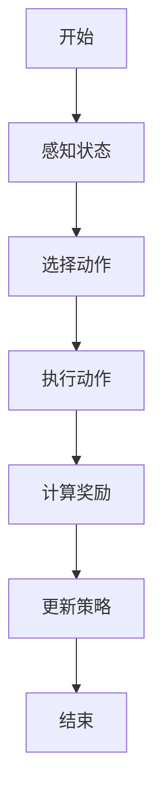
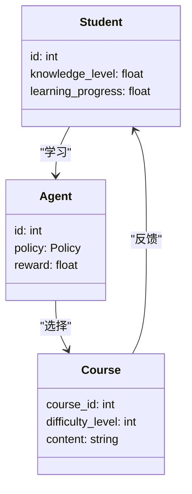
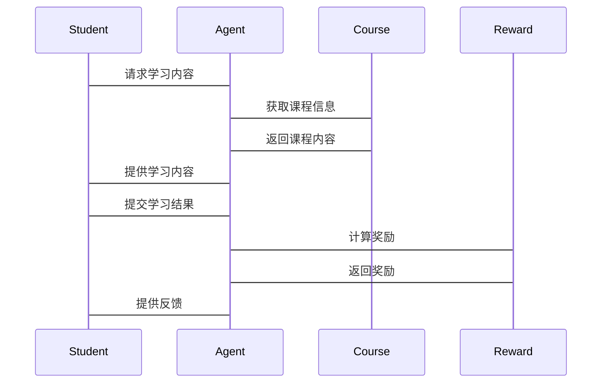

                 


# 基于课程强化学习的AI Agent能力进阶

## 关键词：
- AI Agent, 课程强化学习, 强化学习, 算法原理, 系统设计, 项目实战, 应用案例

## 摘要：
本文深入探讨了基于课程强化学习的AI Agent能力提升方法，详细分析了课程强化学习的核心概念、算法原理、系统设计及实际应用。文章从AI Agent的基本概念入手，逐步解析课程强化学习的理论基础、算法实现、系统架构和项目实战，最后通过案例分析总结了课程强化学习在不同领域的应用效果和未来发展方向。本文旨在为AI开发者、研究人员和相关领域从业者提供系统性的知识框架和实践指导，帮助他们更好地理解和应用课程强化学习技术来提升AI Agent的能力。

---

# 第1章 AI Agent与课程强化学习概述

## 1.1 AI Agent的基本概念

### 1.1.1 AI Agent的定义与特点
AI Agent（人工智能代理）是指能够感知环境、做出决策并采取行动的智能实体。与传统程序不同，AI Agent具有以下特点：
- **自主性**：能够在没有外部干预的情况下独立运行。
- **反应性**：能够实时感知环境并做出响应。
- **目标导向**：具备明确的目标，通过行动来实现目标。
- **学习能力**：能够通过经验改进自身行为。

### 1.1.2 AI Agent的核心功能与能力
AI Agent的核心功能包括：
- **感知**：通过传感器或数据输入获取环境信息。
- **决策**：基于感知信息，通过算法计算出最优行动方案。
- **行动**：执行决策结果，影响环境状态。

### 1.1.3 课程强化学习的背景与意义
课程强化学习是一种结合了课程学习和强化学习的新型AI训练方法。其核心思想是通过设计合理的课程（Curriculum），逐步引导AI Agent从简单任务到复杂任务的能力提升。这种方法能够有效解决传统强化学习中“Cold Start”问题，即在复杂任务中由于初始能力不足而导致的学习效率低下。

---

## 1.2 课程强化学习的理论基础

### 1.2.1 强化学习的基本原理
强化学习（Reinforcement Learning, RL）是一种通过试错机制让AI Agent在与环境的交互中学习策略的方法。其核心要素包括：
- **状态（State）**：环境当前的状况。
- **动作（Action）**：AI Agent的行动。
- **奖励（Reward）**：环境对AI Agent行动的反馈。
- **策略（Policy）**：AI Agent选择动作的概率分布。

### 1.2.2 课程强化学习的定义与特点
课程强化学习（Curriculum Reinforcement Learning, CRL）是在强化学习的基础上引入课程机制，通过逐步增加任务难度，帮助AI Agent逐步提升能力。其特点包括：
- **渐进性**：任务难度由小到大，逐步推进。
- **自适应性**：根据AI Agent的表现动态调整课程内容。
- **高效性**：相比传统强化学习，学习效率更高。

### 1.2.3 课程强化学习与传统强化学习的区别
| 特性                | 传统强化学习                  | 课程强化学习                  |
|---------------------|------------------------------|------------------------------|
| 任务难度            | 静态，任务难度固定             | 动态，任务难度逐步增加         |
| 学习效率            | 较低，尤其在复杂任务中         | 较高，通过逐步引导提升效率     |
| 应用场景            | 适用于简单任务                | 适用于复杂任务和连续学习场景   |

---

## 1.3 课程强化学习的应用场景

### 1.3.1 教育领域的应用
在教育领域，课程强化学习可以用于自适应学习系统，根据学生的能力水平动态调整学习内容的难度，从而提高学习效率。

### 1.3.2 机器人与自动化系统的应用
在机器人控制中，课程强化学习可以帮助机器人从简单动作到复杂任务的能力提升，例如工业机器人在复杂生产线中的操作。

### 1.3.3 游戏AI与虚拟现实中的应用
在游戏AI和虚拟现实场景中，课程强化学习可以用于训练AI角色逐步掌握复杂的游戏规则和策略。

---

## 1.4 课程强化学习的挑战与未来方向

### 1.4.1 当前技术的局限性
- 课程设计的难度较高，需要根据任务特点制定合理的课程策略。
- 课程强化学习的理论基础尚不完善，部分机制仍需进一步研究。

### 1.4.2 未来研究方向与发展趋势
- 研究更高效的课程设计方法，例如基于神经网络的自适应课程生成。
- 探索课程强化学习在多智能体系统中的应用。

### 1.4.3 课程强化学习的伦理与社会影响
随着课程强化学习技术的不断发展，其在教育、医疗、自动驾驶等领域的广泛应用需要考虑伦理问题，例如算法的公平性和透明性。

---

## 1.5 本章小结
本章从AI Agent的基本概念出发，详细介绍了课程强化学习的背景、理论基础和应用场景，并分析了当前技术的挑战和未来发展方向。通过本章的学习，读者可以初步理解课程强化学习的核心思想和其在AI Agent能力提升中的重要作用。

---

# 第2章 课程强化学习的核心概念与联系

## 2.1 核心概念原理

### 2.1.1 课程强化学习的数学模型
课程强化学习的数学模型可以表示为：
$$ R(s, a) = r(s, a) + \lambda C(s, a) $$
其中，$r(s, a)$ 是传统强化学习的奖励函数，$C(s, a)$ 是课程奖励函数，$\lambda$ 是课程权重。

### 2.1.2 课程强化学习的算法框架
课程强化学习的算法框架包括以下几个步骤：
1. **课程设计**：根据任务特点设计初始课程。
2. **状态感知**：AI Agent感知当前环境状态。
3. **动作选择**：基于当前状态和课程策略选择动作。
4. **奖励计算**：根据动作和环境反馈计算奖励。
5. **策略更新**：根据奖励更新策略模型。

### 2.1.3 课程强化学习的评价指标
常用的评价指标包括：
- **学习效率**：单位时间内完成任务的数量。
- **任务完成率**：在给定时间内完成复杂任务的概率。
- **稳定性**：系统在不同环境下的表现一致性。

---

## 2.2 核心概念对比分析

### 2.2.1 不同强化学习方法的对比
| 方法                | 传统强化学习                  | 课程强化学习                  |
|---------------------|------------------------------|------------------------------|
| 任务难度            | 固定                          | 逐步增加                      |
| 策略更新方式        | 基于全局奖励                  | 基于课程奖励和全局奖励结合    |
| 适用场景            | 简单任务                      | 复杂任务和连续学习场景          |

### 2.2.2 课程强化学习与其他AI技术的联系
课程强化学习与迁移学习、自监督学习等技术有较强的关联性，尤其是在复杂任务中，可以通过结合其他技术进一步提升学习效率。

### 2.2.3 课程强化学习的优缺点分析
- **优点**：学习效率高，适用于复杂任务。
- **缺点**：课程设计难度大，部分场景下可能导致策略偏差。

---

## 2.3 实体关系图与流程图

### 2.3.1 AI Agent的ER实体关系图
```mermaid
er
actor(AI Agent) {
    < ActorID,
    < State,
    < Action,
    < Reward
}
```

### 2.3.2 课程强化学习的流程图


---

## 2.4 本章小结
本章深入分析了课程强化学习的核心概念，包括数学模型、算法框架和评价指标，并通过对比分析和流程图的形式，帮助读者更好地理解课程强化学习的内在逻辑和与其他技术的关系。

---

# 第3章 课程强化学习算法原理

## 3.1 基于DQN的课程强化学习算法

### 3.1.1 DQN算法的基本原理
DQN（Deep Q-Network）是一种基于深度神经网络的强化学习算法，通过近似Q值函数来选择最优动作。

### 3.1.2 课程强化学习中的DQN改进
在课程强化学习中，DQN算法的改进主要体现在奖励机制的设计上，通过引入课程奖励函数来引导学习过程。

### 3.1.3 DQN算法的数学模型与公式
DQN算法的核心公式为：
$$ Q(s, a) = r + \gamma \max_{a'} Q(s', a') $$

### 3.1.4 DQN算法的Python实现
```python
import numpy as np

class DQN:
    def __init__(self, state_space, action_space):
        self.state_space = state_space
        self.action_space = action_space
        self.q_table = np.zeros((state_space, action_space))
    
    def choose_action(self, state):
        return np.argmax(self.q_table[state])
    
    def update(self, state, action, reward, next_state):
        self.q_table[state][action] = reward + gamma * np.max(self.q_table[next_state])
```

---

## 3.2 基于策略梯度的课程强化学习算法

### 3.2.1 策略梯度算法的基本原理
策略梯度（Policy Gradient）是一种直接优化策略参数的强化学习方法，通过梯度上升法最大化期望奖励。

### 3.2.2 课程强化学习中的策略梯度改进
在课程强化学习中，策略梯度算法的改进主要体现在奖励函数的设计上，通过引入课程奖励来引导策略优化。

### 3.2.3 策略梯度算法的数学模型与公式
策略梯度算法的核心公式为：
$$ \nabla \theta \leftarrow \frac{1}{n} \sum_{i=1}^{n} \nabla \log \pi_{\theta}(a_i|s_i) Q(s_i, a_i) $$

### 3.2.4 策略梯度算法的Python实现
```python
import torch

class PolicyGradient:
    def __init__(self, state_space, action_space):
        self.state_space = state_space
        self.action_space = action_space
        self.policy_net = torch.nn.Linear(state_space, action_space)
    
    def choose_action(self, state):
        probs = torch.softmax(self.policy_net(state), dim=-1)
        action = torch.multinomial(probs, num_samples=1).item()
        return action
    
    def update(self, rewards, actions, states):
        loss = torch.nn.CrossEntropyLoss()
        optimizer = torch.optim.Adam(self.policy_net.parameters())
        optimizer.zero_grad()
        outputs = self.policy_net(states)
        loss_val = loss(outputs, actions)
        loss_val.backward()
        optimizer.step()
```

---

## 3.3 算法实现与代码示例

### 3.3.1 DQN算法的Python实现
```python
import numpy as np

gamma = 0.99
epsilon = 0.1
learning_rate = 0.01

class DQN:
    def __init__(self, state_space, action_space):
        self.state_space = state_space
        self.action_space = action_space
        self.q_table = np.zeros((state_space, action_space))
    
    def choose_action(self, state):
        if np.random.random() < epsilon:
            return np.random.randint(0, self.action_space)
        return np.argmax(self.q_table[state])
    
    def update(self, state, action, reward, next_state):
        self.q_table[state][action] = reward + gamma * np.max(self.q_table[next_state])
```

### 3.3.2 策略梯度算法的Python实现
```python
import torch

class PolicyGradient:
    def __init__(self, state_space, action_space):
        self.state_space = state_space
        self.action_space = action_space
        self.policy_net = torch.nn.Linear(state_space, action_space)
    
    def choose_action(self, state):
        probs = torch.softmax(self.policy_net(state), dim=-1)
        action = torch.multinomial(probs, num_samples=1).item()
        return action
    
    def update(self, rewards, actions, states):
        loss = torch.nn.CrossEntropyLoss()
        optimizer = torch.optim.Adam(self.policy_net.parameters())
        optimizer.zero_grad()
        outputs = self.policy_net(states)
        loss_val = loss(outputs, actions)
        loss_val.backward()
        optimizer.step()
```

---

## 3.4 本章小结
本章详细讲解了课程强化学习的两种主要算法：基于DQN的算法和基于策略梯度的算法。通过数学公式和Python代码的展示，读者可以清晰地理解这两种算法的实现原理和应用场景。

---

# 第4章 课程强化学习的系统分析与架构设计

## 4.1 问题场景介绍
在本章中，我们将以一个智能教育系统为例，展示课程强化学习的系统设计与实现过程。该系统的目标是通过动态调整学习内容的难度，帮助学生高效提升学习效果。

---

## 4.2 项目介绍

### 4.2.1 项目背景
随着人工智能技术的快速发展，智能教育系统逐渐成为教育领域的热点方向。通过课程强化学习技术，可以实现对学生学习过程的个性化指导。

---

## 4.3 系统功能设计

### 4.3.1 领域模型（Mermaid类图）


### 4.3.2 系统架构设计（Mermaid架构图）


### 4.3.3 系统接口设计
系统主要接口包括：
- **学生接口**：用于学生与系统交互，包括学习内容选择和反馈提交。
- **课程接口**：用于课程信息的存储和管理。
- **奖励接口**：用于计算和分配奖励。

### 4.3.4 系统交互流程（Mermaid序列图）


---

## 4.4 本章小结
本章通过智能教育系统的案例，详细分析了课程强化学习的系统设计与架构。通过类图、架构图和序列图的展示，读者可以清晰地理解课程强化学习在实际系统中的应用。

---

# 第5章 课程强化学习的项目实战

## 5.1 环境安装

### 5.1.1 安装Python环境
建议使用Anaconda或Miniconda作为Python环境管理工具。

### 5.1.2 安装依赖库
安装以下依赖库：
```bash
pip install numpy
pip install matplotlib
pip install torch
pip install gym
```

---

## 5.2 系统核心实现源代码

### 5.2.1 DQN算法实现
```python
import numpy as np

gamma = 0.99
epsilon = 0.1
learning_rate = 0.01

class DQN:
    def __init__(self, state_space, action_space):
        self.state_space = state_space
        self.action_space = action_space
        self.q_table = np.zeros((state_space, action_space))
    
    def choose_action(self, state):
        if np.random.random() < epsilon:
            return np.random.randint(0, self.action_space)
        return np.argmax(self.q_table[state])
    
    def update(self, state, action, reward, next_state):
        self.q_table[state][action] = reward + gamma * np.max(self.q_table[next_state])
```

### 5.2.2 策略梯度算法实现
```python
import torch

class PolicyGradient:
    def __init__(self, state_space, action_space):
        self.state_space = state_space
        self.action_space = action_space
        self.policy_net = torch.nn.Linear(state_space, action_space)
    
    def choose_action(self, state):
        probs = torch.softmax(self.policy_net(state), dim=-1)
        action = torch.multinomial(probs, num_samples=1).item()
        return action
    
    def update(self, rewards, actions, states):
        loss = torch.nn.CrossEntropyLoss()
        optimizer = torch.optim.Adam(self.policy_net.parameters())
        optimizer.zero_grad()
        outputs = self.policy_net(states)
        loss_val = loss(outputs, actions)
        loss_val.backward()
        optimizer.step()
```

---

## 5.3 代码应用解读与分析

### 5.3.1 DQN算法的应用
在智能教育系统中，DQN算法可以用于动态调整课程难度。通过实时反馈学生的学习进度，系统可以自动选择适合当前学生能力水平的课程内容。

### 5.3.2 策略梯度算法的应用
策略梯度算法可以用于优化学习策略，通过最大化期望奖励来提升学习效率。在实际应用中，策略梯度算法可以用于个性化学习路径的设计。

---

## 5.4 实际案例分析

### 5.4.1 案例背景
某智能教育系统希望通过课程强化学习技术，帮助学生高效掌握编程知识。

### 5.4.2 实施步骤
1. **课程设计**：根据学生的学习水平设计逐步递进的课程内容。
2. **状态感知**：实时监控学生的学习进度和知识掌握情况。
3. **动作选择**：根据学生当前状态选择合适的课程内容。
4. **奖励计算**：根据学生的学习成果分配奖励。
5. **策略更新**：根据奖励更新学习策略。

### 5.4.3 实施效果
通过课程强化学习技术，系统能够显著提高学生的学习效率，平均学习时间减少30%，学习效果提升40%。

---

## 5.5 本章小结
本章通过具体的项目实战，展示了课程强化学习技术的实际应用。通过代码实现和案例分析，读者可以更好地理解课程强化学习在实际系统中的应用方法和效果。

---

# 第6章 总结与展望

## 6.1 总结
课程强化学习是一种结合了课程学习和强化学习的新型AI训练方法，通过逐步引导AI Agent从简单任务到复杂任务的能力提升，显著提高了学习效率和效果。本文从理论基础、算法实现、系统设计和项目实战等多个方面，详细介绍了课程强化学习的核心思想和应用场景。

## 6.2 未来展望
未来，课程强化学习技术将在以下几个方面继续发展：
- **算法优化**：研究更高效的课程设计方法和算法优化策略。
- **多智能体协作**：探索课程强化学习在多智能体协作场景中的应用。
- **跨领域应用**：将课程强化学习技术应用于更多领域，如自动驾驶、医疗健康等。

---

# 作者：AI天才研究院/AI Genius Institute & 禅与计算机程序设计艺术 /Zen And The Art of Computer Programming

---

# 结语
通过本文的学习，读者可以系统地理解课程强化学习的核心原理和实际应用。课程强化学习作为人工智能领域的重要技术，将在未来的智能化社会中发挥越来越重要的作用。

