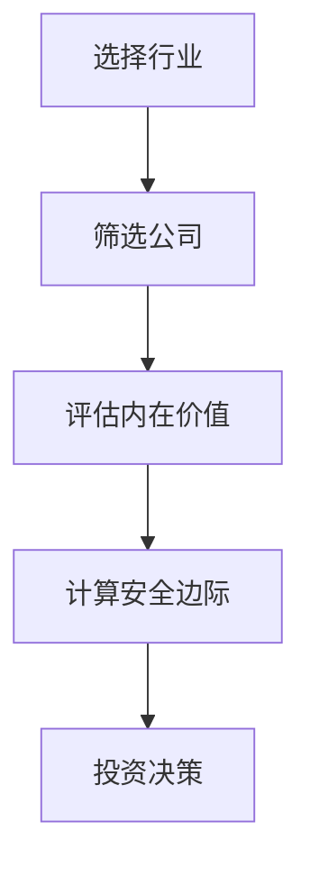
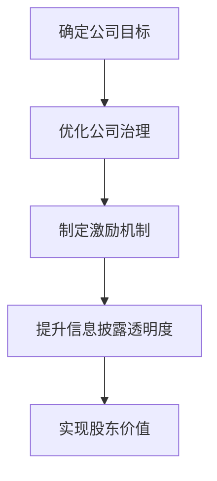
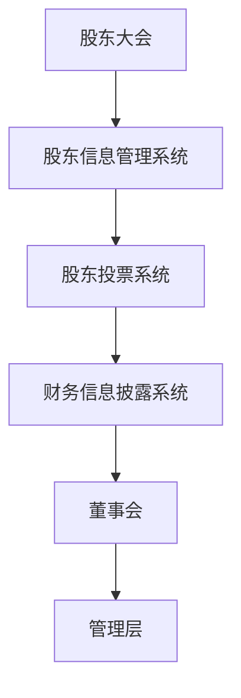

                 


# 巴菲特的股东友好政策

> 关键词：巴菲特、股东友好政策、投资理念、公司治理、价值投资

> 摘要：本文深入探讨了巴菲特的股东友好政策，分析其核心理念、投资策略、公司治理模式及其对现代企业治理的启示。通过详细讲解巴菲特的投资哲学、价值评估模型、股东权益保护机制以及实际案例分析，本文旨在为读者提供一个全面的理解框架，帮助他们在投资和企业管理中更好地应用这些原则。

---

# 第一部分: 巴菲特的股东友好政策背景介绍

## 第1章: 巴菲特的生平与投资理念

### 1.1 巴菲特的生平简介

#### 1.1.1 巴菲特的早年经历
沃伦·巴菲特（Warren Buffett）于1934年8月30日出生在美国堪萨斯州的奥马哈市。他从小就展现出了对数字和投资的浓厚兴趣，12岁时便开始投资股票，15岁时出版了第一本关于棒球卡交易的书。

#### 1.1.2 巴菲特的投资生涯
巴菲特进入哥伦比亚大学后，师从本杰明·格雷厄姆（Benjamin Graham），学习价值投资理论。毕业后，他回到奥马哈，创立了自己的投资公司——巴菲特合伙公司（Buffett Partnership），并在1965年收购了伯克希尔·哈撒韦公司（Berkshire Hathaway），将其发展为全球最大的多元化企业之一。

#### 1.1.3 巴菲特的核心价值观
巴菲特的价值观以长期主义、股东权益保护和社会责任感为核心。他强调企业应以股东利益为重，同时注重企业文化的建设和社会的可持续发展。

---

### 1.2 巴菲特的投资理念

#### 1.2.1 价值投资的定义
价值投资是一种投资策略，旨在通过深入分析公司的基本面，寻找市场价格低于其内在价值的股票进行投资。

#### 1.2.2 巴菲特的价值投资原则
1. **安全边际**：购买价格低于内在价值，确保足够的安全空间。
2. **长期持有**：避免频繁交易，长期持有优质资产。
3. **集中投资**：将资金集中在少数具有竞争优势的企业上。
4. **公司质量**：选择具有强大竞争优势、良好管理和财务状况的公司。

#### 1.2.3 巴菲特的投资策略
巴菲特的投资策略强调对公司基本面的深入分析，关注企业的盈利能力、财务健康状况和竞争优势。他倾向于投资那些能够持续创造价值的企业，并通过长期持有实现财富增长。

---

## 第2章: 股东友好政策的定义与特点

### 2.1 股东友好政策的定义

#### 2.1.1 股东友好政策的核心概念
股东友好政策是指企业在管理和决策过程中，优先考虑股东利益，通过透明的沟通、合理的激励机制和有效的公司治理结构，实现股东价值最大化。

#### 2.1.2 股东友好政策的实施目标
股东友好政策的目标是通过优化公司治理结构、增强股东权益保护和提升信息披露透明度，实现股东利益的最大化，同时促进企业的长期健康发展。

#### 2.1.3 股东友好政策的边界与外延
股东友好政策不仅关注股东权益，还注重企业与利益相关者的平衡。它强调在追求股东利益的同时，兼顾员工、客户和社会的利益，实现可持续发展。

---

### 2.2 股东友好政策的特点

#### 2.2.1 透明化与开放性
巴菲特强调企业应与股东保持透明的沟通，及时披露公司经营状况和财务信息，增强股东的信任感。

#### 2.2.2 长期主义与股东价值最大化
巴菲特主张以长期视角看待投资，注重企业的可持续发展和股东价值的持续增长，而非短期利润的追求。

#### 2.2.3 公司治理与股东权益保护
股东友好政策要求企业建立科学的公司治理结构，确保董事会和管理层的有效监督，保护中小股东的权益。

---

### 2.3 股东友好政策的核心要素

#### 2.3.1 股东权益的保护机制
包括股东投票权、知情权、收益权和监督权的保护，确保股东在公司治理中的地位。

#### 2.3.2 公司治理结构的优化
通过合理的董事会结构、独立董事制度和管理层激励机制，提升公司治理效率。

#### 2.3.3 股东沟通与信息透明
企业应定期与股东沟通，通过财报、股东大会等形式，保持与股东的信息互动。

---

# 第二部分: 股东友好政策的核心概念与联系

## 第3章: 股东友好政策的核心概念原理

### 3.1 股东友好政策的理论基础

#### 3.1.1 股东价值理论
股东价值理论认为，企业的价值来源于股东权益的创造和增长，企业的目标是实现股东价值的最大化。

#### 3.1.2 公司治理
公司治理是股东友好政策的重要组成部分，涉及董事会结构、管理层职责和利益相关者的权益保护。

---

### 3.2 股东友好政策的核心要素

#### 3.2.1 股东权益保护机制
通过公司章程、股东大会和董事会决策，确保股东权益不受侵害。

#### 3.2.2 公司治理结构优化
包括董事会独立性、管理层激励机制和内部审计制度的建立。

#### 3.2.3 股东沟通与信息透明
企业应定期发布财务报表、业务报告，并通过股东大会等形式与股东保持沟通。

---

### 3.3 股东友好政策与公司治理的对比

#### 3.3.1 股东友好政策的特点
- 以股东利益为核心
- 强调长期主义
- 注重公司治理结构的优化

#### 3.3.2 公司治理的特点
- 涵盖董事会、管理层和股东的职责
- 强调制衡与协调
- 注重企业内部控制和风险管理

---

### 3.4 股东友好政策的核心要素与实现路径

#### 3.4.1 股东权益保护
- 股东投票权：确保中小股东的投票权，避免一股独大的现象。
- 股东知情权：通过定期信息披露，让股东了解企业的经营状况。
- 股东收益权：通过分红和股价增长，实现股东的收益。

#### 3.4.2 公司治理结构优化
- 独立董事制度：引入独立董事，提升董事会的独立性和决策能力。
- 管理层激励机制：通过股票期权、绩效奖金等方式，激励管理层为股东创造价值。
- 内部审计和风险控制：建立完善的内部审计制度，防范经营风险。

#### 3.4.3 股东沟通与信息透明
- 定期发布财务报表：企业应定期披露财务报表，确保股东了解企业的财务状况。
- 股东大会：通过股东大会与股东沟通企业的发展战略和重大决策。
- 投资者关系管理：建立专业的投资者关系管理团队，与投资者保持良好的互动。

---

## 第4章: 股东友好政策的实现路径与挑战

### 4.1 股东友好政策的实现路径

#### 4.1.1 制度保障
通过公司章程和法律法规，明确股东的权益和公司的治理结构。

#### 4.1.2 透明化管理
通过定期的信息披露和股东大会，增强股东对公司的信任。

#### 4.1.3 长期激励机制
通过股票期权、限制性股票等方式，激励管理层和核心员工为股东创造长期价值。

---

### 4.2 股东友好政策的挑战

#### 4.2.1 股东利益与公司利益的平衡
在追求股东利益的同时，需要平衡公司与员工、客户和社会的利益。

#### 4.2.2 公司治理的复杂性
公司治理涉及多个利益相关者，协调各方利益关系具有一定的复杂性。

#### 4.2.3 信息不对称问题
股东可能无法完全掌握企业的内部信息，导致决策的困难。

---

## 第5章: 股东友好政策的成功案例分析

### 5.1 巴菲特的伯克希尔 Hathaway案例

#### 5.1.1 伯克希尔 Hathaway的公司治理结构
- 董事会由独立董事和管理层组成，确保决策的独立性和专业性。
- 独立董事在董事会中占据多数，确保董事会的独立性。

#### 5.1.2 股东权益保护机制
- 股东享有投票权，可以通过股东大会参与公司重大决策。
- 公司定期发布财务报表和业务报告，保持与股东的信息透明。

#### 5.1.3 长期激励机制
- 管理层和核心员工通过股票期权获得长期激励，与股东利益绑定。

---

### 5.2 股东友好政策的其他成功案例

#### 5.2.1 苹果公司（Apple Inc.）
- 苹果公司通过回购股票和分红的方式，回馈股东，增强股东的收益感。
- 公司定期举办投资者日活动，与投资者保持良好的沟通。

#### 5.2.2 微软公司（Microsoft Corporation）
- 微软公司通过股票回购和股息分红，回馈股东。
- 公司注重长期价值创造，注重研发投入和技术创新。

---

# 第三部分: 股东友好政策的数学模型与算法原理

## 第6章: 股东友好政策的数学模型

### 6.1 价值投资的数学模型

#### 6.1.1 内在价值计算公式
$$ \text{内在价值} = \frac{\text{每股收益} \times (1 + g)}{r - g} $$
其中，\( g \) 是公司的净利润增长率，\( r \) 是期望的回报率。

#### 6.1.2 安全边际计算
$$ \text{安全边际} = \text{内在价值} - \text{市场价格} $$

---

### 6.2 股东权益最大化模型

#### 6.2.1 股东权益最大化目标函数
$$ \max \text{股东权益} = \text{净利润} \times \text{股份数量} $$

#### 6.2.2 约束条件
$$ \text{股东权益} \leq \text{公司资产} $$
$$ \text{股东权益} \geq 0 $$

---

## 第7章: 股东友好政策的算法原理

### 7.1 价值投资算法

#### 7.1.1 算法步骤
1. **选择行业**：选择具有稳定增长的行业。
2. **筛选公司**：寻找具有竞争优势、财务健康和良好治理的公司。
3. **评估内在价值**：使用内在价值公式计算公司股票的合理价格。
4. **安全边际计算**：比较市场价格与内在价值，确保安全边际。
5. **投资决策**：购买价格低于内在价值的股票，长期持有。

#### 7.1.2 算法流程图


---

### 7.2 股东权益最大化算法

#### 7.2.1 算法步骤
1. **确定公司目标**：明确公司的发展战略和长期目标。
2. **优化公司治理**：建立科学的公司治理结构，确保董事会和管理层的有效监督。
3. **制定激励机制**：通过股票期权、绩效奖金等方式，激励管理层为股东创造价值。
4. **提升信息披露透明度**：定期发布财务报表和业务报告，保持与股东的信息互动。
5. **实现股东价值**：通过净利润增长和股价上涨，实现股东权益的最大化。

#### 7.2.2 算法流程图


---

# 第四部分: 股东友好政策的系统架构与实施

## 第8章: 股东友好政策的系统架构设计

### 8.1 系统功能设计

#### 8.1.1 股东信息管理系统
- 功能：管理股东信息，包括股东注册、股权变更等。
- 实现：通过数据库存储股东信息，提供在线查询和修改功能。

#### 8.1.2 股东投票系统
- 功能：支持股东在线投票，确保股东大会的顺利进行。
- 实现：通过加密技术确保投票的安全性和真实性。

#### 8.1.3 财务信息披露系统
- 功能：定期发布财务报表和业务报告，保持与股东的信息透明。
- 实现：通过企业网站或专门的信息披露平台发布相关信息。

---

### 8.2 系统架构图


---

## 第9章: 股东友好政策的实施步骤

### 9.1 实施背景
企业实施股东友好政策需要考虑自身的财务状况、发展阶段和市场环境。

### 9.2 实施步骤

#### 9.2.1 制定政策
- 明确股东友好政策的目标和实施路径。
- 确保政策符合法律法规和企业实际情况。

#### 9.2.2 系统开发
- 开发股东信息管理系统、股东大会投票系统和财务信息披露系统。
- 确保系统的安全性和稳定性。

#### 9.2.3 培训与沟通
- 对管理层和员工进行政策培训，确保政策的顺利实施。
- 通过股东大会和投资者关系管理与股东保持良好的沟通。

#### 9.2.4 监测与评估
- 定期评估政策的实施效果，发现问题并及时调整。
- 通过股东满意度调查和财务绩效分析，评估政策的效果。

---

### 9.3 实施中的注意事项

#### 9.3.1 政策的合规性
- 确保政策符合相关法律法规和监管要求。
- 避免政策设计中的法律风险。

#### 9.3.2 系统的安全性
- 加强系统的安全防护，防止信息泄露和网络攻击。
- 定期进行系统维护和更新，确保系统的稳定运行。

#### 9.3.3 股东的参与度
- 提高股东的参与度，增强股东对公司的信任感。
- 通过多种渠道与股东保持沟通，确保政策的顺利实施。

---

# 第五部分: 股东友好政策的项目实战

## 第10章: 股东友好政策的项目实战

### 10.1 项目背景

#### 10.1.1 项目目标
通过实施股东友好政策，优化公司治理结构，提升股东的参与度和满意度，实现股东权益的最大化。

#### 10.1.2 项目范围
涵盖股东信息管理、股东大会投票和财务信息披露系统的开发与实施。

---

### 10.2 系统设计

#### 10.2.1 系统功能模块
1. 股东信息管理模块
2. 股东大会投票模块
3. 财务信息披露模块

#### 10.2.2 系统架构设计


---

### 10.3 系统实现

#### 10.3.1 环境安装
- 开发环境：Python、Django框架
- 数据库：MySQL
- 服务器：Linux

#### 10.3.2 核心代码实现
```python
# 股东信息管理模块
class Shareholder:
    def __init__(self, name, id, shares):
        self.name = name
        self.id = id
        self.shares = shares

    def update_shares(self, shares):
        self.shares = shares

# 股东大会投票模块
class股东大会投票:
    def __init__(self, shareholders):
        self.shareholders = shareholders

    def vote(self, shareholder, proposal):
        if shareholder in self.shareholders:
            return f"{shareholder.name} 已对 {proposal} 投票。"
        else:
            return "该股东不在股东列表中。"

# 财务信息披露模块
class FinancialDisclosure:
    def __init__(self, financial_data):
        self.financial_data = financial_data

    def disclose(self):
        print(f"财务数据已披露：{self.financial_data}")
```

---

### 10.4 项目总结

#### 10.4.1 项目成果
- 成功开发股东信息管理系统、股东大会投票系统和财务信息披露系统。
- 提高了公司的治理效率，增强了股东的参与度和满意度。

#### 10.4.2 经验总结
- 系统设计要注重模块化和可扩展性，确保系统的灵活性和可维护性。
- 项目实施过程中，需要加强与股东的沟通，确保政策的顺利实施。
- 定期对系统进行维护和更新，确保系统的安全性和稳定性。

---

# 第六部分: 股东友好政策的最佳实践与小结

## 第11章: 股东友好政策的最佳实践

### 11.1 投资原则

#### 11.1.1 长期投资
- 避免短期交易，注重长期价值的创造。
- 选择具有强大竞争优势和良好治理的企业。

#### 11.1.2 价值投资
- 通过深入分析公司的基本面，寻找市场价格低于内在价值的股票进行投资。
- 注重安全边际，确保投资的稳妥性。

---

### 11.2 公司治理的关键点

#### 11.2.1 董事会结构
- 建立科学的董事会结构，确保董事会的独立性和决策能力。
- 引入独立董事，提升董事会的专业性和公信力。

#### 11.2.2 管理层激励机制
- 通过股票期权、绩效奖金等方式，激励管理层为股东创造长期价值。
- 确保管理层的利益与股东的利益一致。

#### 11.2.3 信息透明
- 定期发布财务报表和业务报告，保持与股东的信息透明。
- 通过股东大会和投资者关系管理，增强与股东的互动。

---

## 第12章: 小结

### 12.1 股东友好政策的核心思想
股东友好政策的核心思想是通过优化公司治理结构、增强股东权益保护和提升信息披露透明度，实现股东价值的最大化，同时促进企业的长期健康发展。

### 12.2 投资与管理的启示
- 投资者应选择具有长期价值创造能力和良好治理结构的企业。
- 企业应注重股东权益的保护，建立透明的沟通机制和有效的激励机制，实现股东与企业的共同发展。

### 12.3 未来展望
随着全球化和科技的发展，股东友好政策将面临新的挑战和机遇。企业需要不断创新和完善治理结构，以适应新的市场环境和股东需求。

---

# 作者：AI天才研究院/AI Genius Institute & 禅与计算机程序设计艺术 /Zen And The Art of Computer Programming

