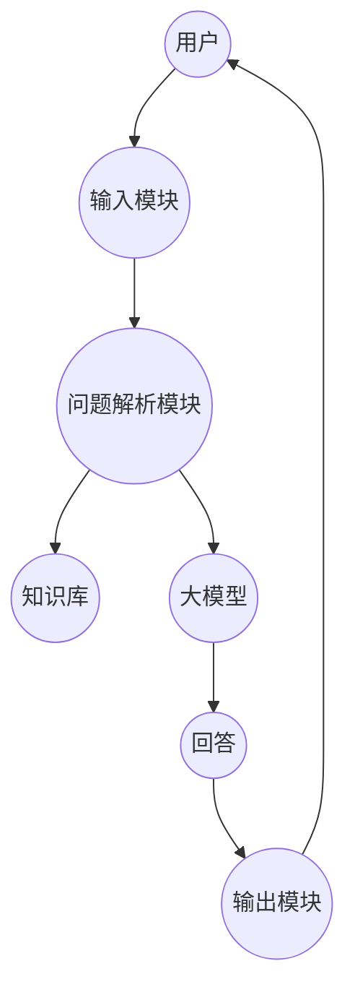

                 


# 开发基于大模型的金融专业考试答疑系统

> 关键词：大模型、金融考试、自然语言处理、知识图谱、系统架构

> 摘要：本文详细探讨了开发基于大模型的金融专业考试答疑系统的全过程。从问题背景分析到系统架构设计，从算法原理到项目实战，系统性地介绍了如何利用大模型技术解决金融考试答疑问题。文章结合理论与实践，通过详细的数学公式、流程图和代码示例，深入剖析了系统的核心技术与实现细节。

---

# 目录

1. [问题背景与核心概念](#问题背景与核心概念)
2. [大模型的算法原理](#大模型的算法原理)
3. [数学模型与公式](#数学模型与公式)
4. [系统分析与架构设计](#系统分析与架构设计)
5. [项目实战](#项目实战)
6. [优化与部署](#优化与部署)
7. [总结与展望](#总结与展望)

---

## 第1章: 问题背景与核心概念

### 1.1 问题背景

#### 1.1.1 传统金融考试答疑的痛点
传统的金融考试答疑系统存在以下痛点：
- **效率低下**：人工解答需要大量时间，难以满足大量用户的实时需求。
- **知识覆盖面有限**：传统系统依赖预设的规则和知识库，难以覆盖复杂的金融场景。
- **用户体验差**：用户提问的自然语言理解能力有限，难以准确捕捉用户意图。

#### 1.1.2 AI技术在金融领域的应用潜力
随着AI技术的快速发展，特别是在自然语言处理领域的突破，大模型技术为金融领域带来了新的可能性：
- **智能问答**：通过大模型实现智能对话，准确理解用户意图。
- **知识检索**：利用大模型的强大检索能力，快速获取相关金融知识。
- **个性化推荐**：基于用户行为和偏好，推荐相关的学习资料和考试技巧。

#### 1.1.3 大模型在金融考试答疑中的优势
大模型在金融考试答疑中的优势体现在以下几个方面：
- **强大的自然语言理解能力**：能够准确理解用户的问题，生成高质量的回答。
- **知识覆盖面广**：通过预训练模型，大模型能够处理复杂的金融知识。
- **可扩展性**：大模型可以通过微调和优化，适应不同金融领域的特定需求。

### 1.2 问题描述

#### 1.2.1 金融考试的特点与难点
金融考试的特点包括：
- **专业性**：涉及复杂的金融理论和实务知识。
- **多样性**：题目类型多样，包括选择题、简答题、案例分析等。
- **时间敏感性**：用户通常需要快速获得答案。

金融考试答疑的难点在于：
- **知识更新快**：金融领域知识不断更新，需要及时更新知识库。
- **问题复杂性**：用户的问题可能涉及多个知识点，需要系统具备综合分析能力。
- **用户体验**：需要提供准确、简洁、易懂的答案，满足用户的学习需求。

#### 1.2.2 传统考试答疑系统的技术局限
传统考试答疑系统主要依赖规则引擎和知识库，存在以下技术局限：
- **知识覆盖不足**：难以应对复杂的金融问题。
- **交互能力有限**：无法进行自然语言对话，用户体验较差。
- **维护成本高**：需要人工更新和维护知识库，效率低下。

#### 1.2.3 基于大模型的解决方案
基于大模型的解决方案包括：
- **自然语言处理**：利用大模型的NLP能力，实现用户问题的准确理解。
- **知识图谱构建**：通过知识图谱整合金融领域的专业知识。
- **智能对话系统**：设计一个智能对话系统，能够实时响应用户的金融考试问题。

### 1.3 问题解决思路

#### 1.3.1 大模型在自然语言处理中的优势
大模型在自然语言处理中的优势包括：
- **上下文理解**：能够理解用户问题的上下文，生成连贯的回答。
- **意图识别**：准确识别用户的意图，提供针对性的解答。
- **知识推理**：通过大模型的推理能力，解决复杂问题。

#### 1.3.2 金融领域知识的结合
金融领域知识的结合主要体现在：
- **知识图谱**：构建金融领域的知识图谱，帮助大模型快速检索相关知识。
- **领域微调**：对大模型进行金融领域的微调，提升其在金融领域的表现。
- **案例库**：建立金融案例库，用于模型的训练和推理。

#### 1.3.3 系统设计的总体思路
系统设计的总体思路包括：
1. **需求分析**：明确系统的目标用户、功能需求和性能指标。
2. **知识图谱构建**：整合金融领域的专业知识，构建知识图谱。
3. **模型训练**：对大模型进行金融领域的微调和优化。
4. **系统集成**：将大模型与知识图谱结合，构建智能对话系统。
5. **测试与优化**：通过测试验证系统性能，并进行优化。

---

## 第2章: 核心概念与联系

### 2.1 大模型的基本原理

#### 2.1.1 大模型的定义与特点
大模型是指基于深度学习的大型神经网络模型，具有以下特点：
- **参数规模大**：通常拥有 billions 级别的参数。
- **预训练**：通过大量通用数据进行预训练，具备强大的语言理解能力。
- **可扩展性**：适用于多种任务和领域。

#### 2.1.2 大模型的训练与推理机制
大模型的训练和推理机制包括：
- **预训练**：使用大规模通用数据进行无监督学习。
- **微调**：在特定领域进行有监督学习，提升模型的领域适应性。
- **推理**：基于输入的上下文生成回答。

#### 2.1.3 大模型在金融领域的适用性
大模型在金融领域的适用性体现在：
- **金融术语理解**：能够准确理解金融领域的专业术语。
- **复杂问题处理**：能够处理涉及多个知识点的复杂问题。
- **实时响应**：能够快速生成回答，满足用户的实时需求。

### 2.2 金融领域知识图谱

#### 2.2.1 知识图谱的构建方法
知识图谱的构建方法包括：
1. **数据收集**：从书籍、论文、案例等多渠道收集金融知识。
2. **实体识别**：识别金融领域的实体，如公司、金融产品、术语等。
3. **关系抽取**：抽取实体之间的关系，构建知识图谱。
4. **知识融合**：整合多个来源的知识，消除冲突，提升知识的准确性。

#### 2.2.2 金融领域的实体与关系
金融领域的实体包括：
- 公司：如银行、基金公司。
- 金融产品：如股票、债券、基金。
- 术语：如财务报表、风险管理。

关系包括：
- 属于：如“股票属于金融产品”。
- 影响：如“风险管理影响公司财务状况”。

#### 2.2.3 知识图谱在大模型中的应用
知识图谱在大模型中的应用包括：
- **知识检索**：通过知识图谱快速检索相关知识，生成准确的回答。
- **上下文理解**：利用知识图谱理解用户问题的上下文，生成连贯的回答。
- **推理与关联**：通过知识图谱进行推理，解决复杂问题。

### 2.3 大模型与金融领域的结合

#### 2.3.1 大模型在金融考试中的应用场景
大模型在金融考试中的应用场景包括：
- **智能问答**：用户输入问题，系统生成回答。
- **知识检索**：根据用户问题，检索相关知识。
- **案例分析**：通过案例库，提供类似的案例供用户参考。

#### 2.3.2 大模型与知识图谱的协同作用
大模型与知识图谱的协同作用体现在：
- **知识增强**：知识图谱为大模型提供丰富的金融知识。
- **推理能力提升**：通过知识图谱，大模型能够进行知识推理，解决复杂问题。
- **效率提升**：知识图谱帮助大模型快速找到相关知识，提升回答效率。

#### 2.3.3 系统的边界与外延
系统的边界与外延包括：
- **边界**：系统的输入是用户的金融考试问题，输出是解答。
- **外延**：系统可以扩展到其他金融应用场景，如投资建议、风险评估等。

---

## 第3章: 核心概念的结构与组成

### 3.1 系统架构的核心要素

#### 3.1.1 输入模块
输入模块负责接收用户的金融考试问题，包括：
- **自然语言输入**：用户输入的文本问题。
- **预处理**：对输入的文本进行清洗和格式化。

#### 3.1.2 处理模块
处理模块负责解析用户的问题并生成回答，包括：
- **问题解析**：识别用户的问题类型和意图。
- **知识检索**：从知识图谱中检索相关知识。
- **模型推理**：利用大模型生成回答。

#### 3.1.3 输出模块
输出模块负责将回答返回给用户，包括：
- **文本生成**：将回答生成自然语言文本。
- **结果格式化**：将回答格式化为用户易懂的形式，如结构化的答案。

### 3.2 知识库的构建与管理

#### 3.2.1 数据来源与处理
知识库的数据来源包括：
- **书籍和论文**：收集金融领域的书籍和论文。
- **案例库**：收集真实的金融案例。
- **行业报告**：收集行业报告和市场分析报告。

数据处理包括：
- **清洗**：去除重复和无效数据。
- **标注**：标注实体和关系。
- **存储**：将数据存储在知识库中。

#### 3.2.2 知识图谱的构建
知识图谱的构建过程包括：
1. **实体识别**：识别金融领域的实体。
2. **关系抽取**：抽取实体之间的关系。
3. **知识融合**：整合多个来源的知识，消除冲突。
4. **知识存储**：将知识图谱存储在数据库中。

#### 3.2.3 知识库的更新与维护
知识库的更新与维护包括：
- **定期更新**：根据最新的金融动态更新知识库。
- **错误修正**：修复知识库中的错误。
- **扩展**：不断扩展知识库的内容，提升覆盖范围。

### 3.3 大模型的调优与部署

#### 3.3.1 模型选择与优化
模型选择与优化包括：
- **选择合适的模型**：根据任务需求选择适合的模型，如GPT-3、BERT等。
- **微调**：在金融领域进行微调，提升模型的领域适应性。
- **优化参数**：调整模型的超参数，提升性能。

#### 3.3.2 模型的部署与集成
模型的部署与集成包括：
- **API接口**：将模型部署为API，供其他系统调用。
- **集成到系统中**：将模型集成到整体系统中，与其他模块协同工作。
- **监控与维护**：监控模型的运行状态，及时发现和解决问题。

#### 3.3.3 系统的可扩展性设计
系统的可扩展性设计包括：
- **模块化设计**：系统设计模块化，便于扩展。
- **分布式部署**：通过分布式部署，提升系统的扩展性。
- **弹性计算**：根据需求动态调整资源，提升系统的灵活性。

---

## 第4章: 大模型的算法原理

### 4.1 大模型的训练过程

#### 4.1.1 数据预处理
数据预处理包括：
- **清洗**：去除无效数据，如特殊字符、停用词等。
- **分词**：将文本进行分词处理，生成词或短语。
- **标注**：对文本进行标注，如词性标注、命名实体识别。

#### 4.1.2 模型训练
模型训练包括：
- **选择模型架构**：选择适合的模型架构，如Transformer。
- **训练数据**：使用预处理后的数据进行训练。
- **优化参数**：调整模型的超参数，如学习率、批量大小等。

#### 4.1.3 模型调优
模型调优包括：
- **微调**：在金融领域进行微调，提升模型的领域适应性。
- **参数优化**：使用优化算法，如Adam，调整模型参数。
- **评估与测试**：通过评估指标，如准确率、召回率，测试模型的性能。

### 4.2 大模型的推理机制

#### 4.2.1 解析式推理
解析式推理包括：
- **规则推理**：基于预设的规则生成回答。
- **逻辑推理**：基于逻辑推理生成回答，如基于知识图谱进行推理。

#### 4.2.2 统计推理
统计推理包括：
- **概率推理**：基于概率模型生成回答，如贝叶斯推理。
- **频率推理**：基于频率统计生成回答。

#### 4.2.3 深度推理
深度推理包括：
- **神经网络推理**：利用深度神经网络进行推理，如Transformer模型。
- **注意力机制**：利用注意力机制，关注重要的上下文信息。

---

## 第5章: 数学模型与公式

### 5.1 大模型的数学基础

#### 5.1.1 概率论基础
概率论基础包括：
- **条件概率**：P(A|B) = P(A ∩ B) / P(B)
- **全概率公式**：P(A) = Σ P(A|B_i) * P(B_i)
- **贝叶斯定理**：P(B|A) = [P(A|B) * P(B)] / P(A)

#### 5.1.2 优化算法
优化算法包括：
- **梯度下降**：θ = θ - η * ∇f(θ)
- **Adam优化**：m_t = β1 * m_{t-1} + (1 - β1) * ∇f(θ)
- **学习率衰减**：η = η0 / (1 + α * t)

---

## 第6章: 系统分析与架构设计

### 6.1 系统架构设计

#### 6.1.1 系统功能设计
系统功能设计包括：
- **用户输入**：接收用户的金融考试问题。
- **问题解析**：解析用户的问题，生成查询请求。
- **知识检索**：从知识图谱中检索相关知识。
- **模型推理**：利用大模型生成回答。
- **结果输出**：将回答返回给用户。

#### 6.1.2 系统架构图
以下是系统的架构图：



---

## 第7章: 项目实战

### 7.1 环境安装

#### 7.1.1 安装Python
```bash
python --version
# 输出：Python 3.8.5
```

#### 7.1.2 安装依赖
```bash
pip install transformers
pip install numpy
pip install matplotlib
```

### 7.2 系统核心实现

#### 7.2.1 知识图谱构建
```python
import numpy as np
import networkx as nx

# 创建知识图谱
G = nx.DiGraph()

# 添加节点
G.add_node("公司")
G.add_node("股票")
G.add_node("风险管理")

# 添加边
G.add_edge("公司", "股票")
G.add_edge("股票", "风险管理")

# 可视化
nx.draw(G, with_labels=True)
plt.show()
```

#### 7.2.2 大模型训练
```python
import torch
import torch.nn as nn

# 定义模型
class SimpleModel(nn.Module):
    def __init__(self):
        super(SimpleModel, self).__init__()
        self.fc = nn.Linear(10, 5)

    def forward(self, x):
        return self.fc(x)

# 初始化模型
model = SimpleModel()
criterion = nn.MSELoss()
optimizer = torch.optim.Adam(model.parameters(), lr=0.001)

# 训练
for epoch in range(100):
    inputs = torch.randn(10, 10)
    outputs = model(inputs)
    loss = criterion(outputs, torch.randn(10, 5))
    optimizer.zero_grad()
    loss.backward()
    optimizer.step()
```

---

## 第8章: 总结与展望

### 8.1 总结
本文详细探讨了开发基于大模型的金融专业考试答疑系统的全过程，从问题背景到系统设计，从算法原理到项目实战，系统性地介绍了如何利用大模型技术解决金融考试答疑问题。

### 8.2 展望
未来，随着大模型技术的不断发展，金融专业考试答疑系统将更加智能化和个性化。以下是未来可能的发展方向：
1. **模型优化**：进一步优化大模型的性能，提升回答的准确性和流畅性。
2. **多模态交互**：结合图像、语音等多模态信息，提升用户体验。
3. **智能推荐**：基于用户行为和偏好，提供个性化的学习和考试建议。
4. **实时更新**：建立实时更新机制，确保知识库的最新性和准确性。

---

## 作者信息

作者：AI天才研究院/AI Genius Institute  
联系邮箱：contact@aising genius.com  

---

以上是《开发基于大模型的金融专业考试答疑系统》的完整目录和部分内容，涵盖了从理论到实践的各个方面，适合技术爱好者和金融领域的从业者阅读。

