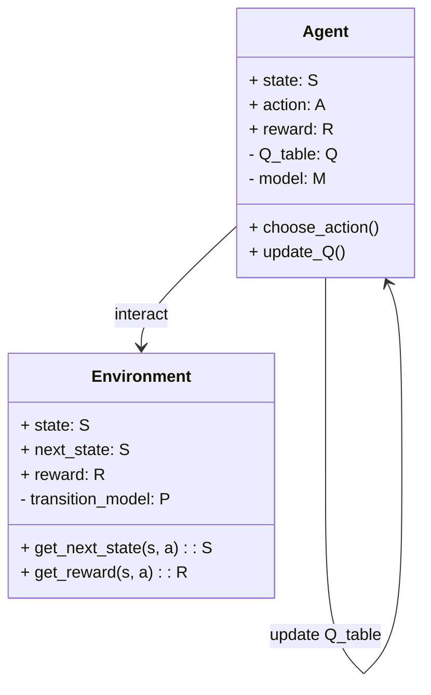
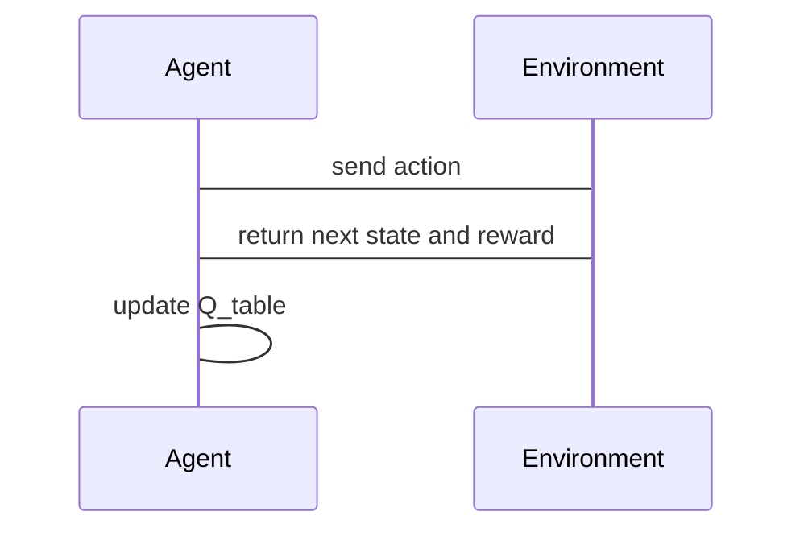

                 


# 强化学习在AI Agent交互式学习中的应用

> 关键词：强化学习，AI Agent，交互式学习，Q-learning，Deep Q-Networks（DQN），马尔可夫决策过程（MDP）

> 摘要：本文深入探讨了强化学习在AI Agent交互式学习中的应用，从基本概念到核心算法，再到系统架构和实际案例，详细分析了如何通过强化学习提升AI Agent的交互式学习能力。文章结合理论与实践，旨在为读者提供全面的理解和实用的指导。

---

## 第一部分: 强化学习与AI Agent交互式学习概述

### 第1章: 强化学习与AI Agent概述

#### 1.1 强化学习的基本概念

##### 1.1.1 强化学习的定义与特点
强化学习（Reinforcement Learning，RL）是一种机器学习范式，其中智能体通过与环境互动来学习策略，以最大化累积奖励。其特点是：
- **目标驱动**：智能体通过探索和利用策略，最大化累积奖励。
- **在线学习**：智能体在与环境的实时互动中学习。
- **适应性**：智能体能够根据反馈调整行为，适应动态环境。

##### 1.1.2 AI Agent的基本概念与分类
AI Agent（智能体）是能够感知环境并采取行动以实现目标的实体。分类包括：
- **简单反射型**：基于当前状态采取行动。
- **基于模型的规划型**：维护环境模型，进行规划。
- **目标驱动型**：基于目标采取行动。

##### 1.1.3 交互式学习的定义与特点
交互式学习是通过智能体与环境之间的实时互动进行学习，特点包括：
- **实时反馈**：智能体通过奖励信号调整策略。
- **动态适应**：智能体能够根据环境变化调整行为。
- **任务导向**：专注于特定任务目标的优化。

#### 1.2 强化学习的核心原理

##### 1.2.1 马尔可夫决策过程（MDP）的定义
MDP是强化学习的核心模型，由以下五元组定义：
- **状态空间（S）**：智能体所处的环境状态。
- **动作空间（A）**：智能体可执行的动作。
- **转移概率（P）**：从当前状态执行动作后转移到下一个状态的概率。
- **奖励函数（R）**：智能体执行动作后获得的奖励。
- **折扣因子（γ）**：未来奖励的折扣因子，γ ∈ [0,1]。

##### 1.2.2 状态、动作、奖励的定义与关系
- **状态（s）**：环境的当前情况，如棋盘上的棋子位置。
- **动作（a）**：智能体的执行动作，如移动棋子。
- **奖励（r）**：执行动作后获得的反馈，如得分或损失。

##### 1.2.3 策略与价值函数的定义与作用
- **策略（π）**：决定智能体在给定状态下采取的动作的概率分布。
- **价值函数（V）**：衡量从当前状态开始的预期累积奖励。

#### 1.3 AI Agent在交互式学习中的应用

##### 1.3.1 交互式学习的场景与优势
- **教育领域**：自适应学习系统根据学生反馈调整教学策略。
- **游戏领域**：游戏AI通过与玩家互动优化游戏体验。

##### 1.3.2 AI Agent在教育、游戏、机器人等领域的应用
- **教育**：自适应学习系统。
- **游戏**：游戏AI优化玩家体验。
- **机器人**：机器人通过与环境互动提升任务执行能力。

##### 1.3.3 交互式学习的挑战与未来发展方向
- **挑战**：环境复杂性、实时反馈的准确性。
- **未来方向**：多智能体协作、复杂环境下的自适应学习。

---

### 第2章: 强化学习的核心算法原理

#### 2.1 Q-learning算法

##### 2.1.1 Q-learning的基本原理
Q-learning是一种基于值的强化学习算法，通过更新Q值表来学习最优策略。

##### 2.1.2 Q-learning的数学模型与公式
Q-learning的更新公式为：
$$ Q(s, a) ← Q(s, a) + α [r + γ \max Q(s', a') - Q(s, a)] $$
其中：
- α：学习率
- γ：折扣因子
- r：即时奖励
- Q(s', a')：下一状态的最大Q值

##### 2.1.3 Q-learning的优缺点与适用场景
- **优点**：离线学习，适用于静态环境。
- **缺点**：需要完整的状态转移模型，难以处理高维状态空间。

#### 2.2 策略梯度方法

##### 2.2.1 策略梯度的基本原理
策略梯度方法通过直接优化策略参数，最大化累积奖励。

##### 2.2.2 策略梯度的数学模型与公式
策略梯度的更新公式为：
$$ \theta ← \theta + α \nabla_\theta J(θ) $$
其中：
- J(θ)：目标函数，通常为对数概率的期望。

##### 2.2.3 策略梯度的优缺点与适用场景
- **优点**：适用于高维状态空间，无需值函数。
- **缺点**：需要实时反馈，计算复杂。

#### 2.3 Deep Q-Networks（DQN）算法

##### 2.3.1 DQN的基本原理
DQN结合Q-learning和深度学习，使用神经网络近似Q值函数。

##### 2.3.2 DQN的数学模型与公式
DQN的损失函数为：
$$ L = \mathbb{E}[(r + γ Q(s', a') - Q(s, a))^2] $$

##### 2.3.3 DQN的优缺点与适用场景
- **优点**：适用于高维状态空间，处理复杂任务。
- **缺点**：需要离线存储经验，计算资源消耗大。

---

### 第3章: AI Agent的交互式学习方法

#### 3.1 基于模型的强化学习方法

##### 3.1.1 基于模型的强化学习的基本原理
基于模型的强化学习通过构建环境模型，进行规划和决策。

##### 3.1.2 基于模型的强化学习的数学模型与公式
模型预测公式：
$$ P(s' | s, a) $$
价值函数更新公式：
$$ V(s) = \max_a [r + γ V(s')] $$

##### 3.1.3 基于模型的强化学习的优缺点与适用场景
- **优点**：适用于复杂环境，能够进行长期规划。
- **缺点**：模型构建困难，计算资源消耗大。

#### 3.2 基于策略的强化学习方法

##### 3.2.1 基于策略的强化学习的基本原理
直接优化策略参数，如策略梯度方法。

##### 3.2.2 基于策略的强化学习的数学模型与公式
策略梯度更新公式：
$$ \theta ← \theta + α \nabla_\theta J(θ) $$

##### 3.2.3 基于策略的强化学习的优缺点与适用场景
- **优点**：适用于复杂任务，无需值函数。
- **缺点**：需要实时反馈，计算复杂。

---

## 第二部分: 强化学习在AI Agent交互式学习中的应用

### 第4章: 基于强化学习的AI Agent系统架构设计

#### 4.1 问题场景介绍
AI Agent在教育领域中的应用，如自适应学习系统。

#### 4.2 系统功能设计

##### 4.2.1 系统功能模块
- **状态感知模块**：感知当前状态。
- **动作选择模块**：选择最优动作。
- **奖励机制模块**：计算并提供奖励。

##### 4.2.2 系统功能流程
1. 状态感知模块获取当前状态。
2. 动作选择模块根据当前状态选择动作。
3. 系统执行动作并获得奖励。
4. 奖励机制模块计算奖励并反馈给动作选择模块。

#### 4.3 系统架构设计

##### 4.3.1 系统架构类图


#### 4.4 系统交互流程

##### 4.4.1 系统交互序列图


---

### 第5章: 项目实战——基于强化学习的自适应学习系统

#### 5.1 环境配置与依赖安装
安装Python和必要的库，如TensorFlow、OpenAI Gym。

#### 5.2 系统核心实现源代码

##### 5.2.1 Q-learning实现
```python
import numpy as np

class QLearning:
    def __init__(self, state_space, action_space, alpha=0.1, gamma=0.99):
        self.state_space = state_space
        self.action_space = action_space
        self.alpha = alpha
        self.gamma = gamma
        self.Q = np.zeros((state_space, action_space))

    def choose_action(self, state):
        return np.argmax(self.Q[state])

    def update_Q(self, state, action, reward, next_state):
        self.Q[state, action] += self.alpha * (reward + self.gamma * np.max(self.Q[next_state]) - self.Q[state, action])
```

##### 5.2.2 DQN实现
```python
import numpy as np
from tensorflow.keras import layers

class DQN:
    def __init__(self, state_space, action_space, hidden_units=32, alpha=0.01, gamma=0.99):
        self.state_space = state_space
        self.action_space = action_space
        self.alpha = alpha
        self.gamma = gamma
        self.model = self.build_model()

    def build_model(self):
        model = tf.keras.Sequential()
        model.add(layers.Dense(hidden_units, activation='relu', input_shape=(state_space,)))
        model.add(layers.Dense(action_space, activation='linear'))
        model.compile(loss='mean_squared_error', optimizer='adam', lr=alpha)
        return model

    def choose_action(self, state):
        q_values = self.model.predict(np.array([state]))
        return np.argmax(q_values[0])
```

##### 5.2.3 环境实现
```python
class Environment:
    def __init__(self, state_space, action_space):
        self.state_space = state_space
        self.action_space = action_space
        self.current_state = 0

    def get_next_state(self, action):
        next_state = (self.current_state + action) % self.state_space
        return next_state

    def get_reward(self, action):
        return 1 if action == 1 else 0
```

#### 5.3 代码应用解读与分析
- **Q-learning**：适用于小规模状态空间，计算简单，适合教育领域的简单任务。
- **DQN**：适用于大规模状态空间，如图像识别任务。

#### 5.4 实际案例分析和详细讲解剖析
通过自适应学习系统的案例，展示如何设计和实现一个基于强化学习的AI Agent系统。

---

### 第6章: 最佳实践与未来展望

#### 6.1 最佳实践 tips
- **算法选择**：根据任务需求选择合适的强化学习算法。
- **系统设计**：确保系统架构的可扩展性和可维护性。
- **性能优化**：优化算法参数，提高学习效率。

#### 6.2 小结
本文详细探讨了强化学习在AI Agent交互式学习中的应用，从基本概念到核心算法，再到系统架构和实际案例，为读者提供了全面的理解和实用的指导。

#### 6.3 注意事项
- **环境设计**：确保环境能够提供有效的反馈，促进智能体学习。
- **算法调优**：根据实际需求调整算法参数，提高性能。

#### 6.4 拓展阅读
推荐相关书籍和论文，进一步深入学习强化学习和AI Agent的知识。

---

## 第三部分: 参考文献

### 参考文献
1. 爱新鲁特，强化学习导论，机械工业出版社，2021。
2. 哈萨比斯，深度强化学习，人民邮电出版社，2020。
3. Sutton, R. S., & Barto, A. G. (2018). Reinforcement learning: An introduction. MIT press.

---

## 作者信息

作者：AI天才研究院/AI Genius Institute & 禅与计算机程序设计艺术 /Zen And The Art of Computer Programming

---

以上内容为《强化学习在AI Agent交互式学习中的应用》的完整目录和文章内容，涵盖从基础到高级的强化学习知识，结合理论与实践，为读者提供了全面的理解和实用的指导。

