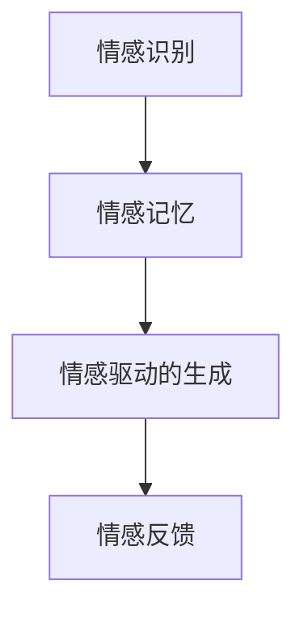
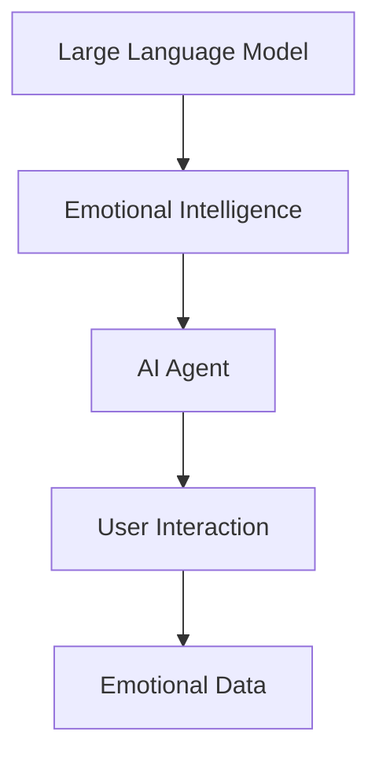
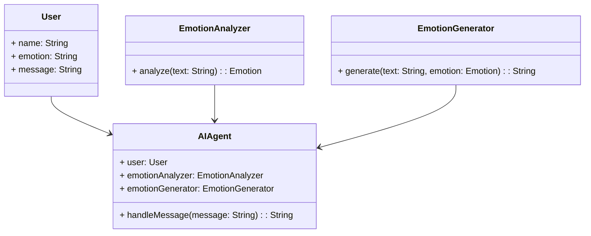
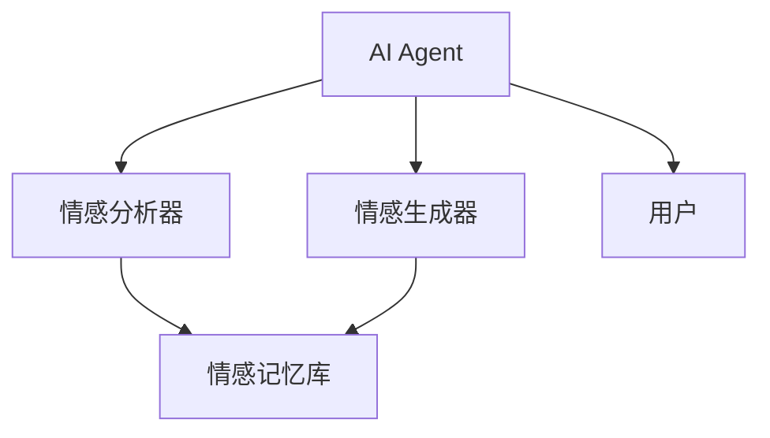
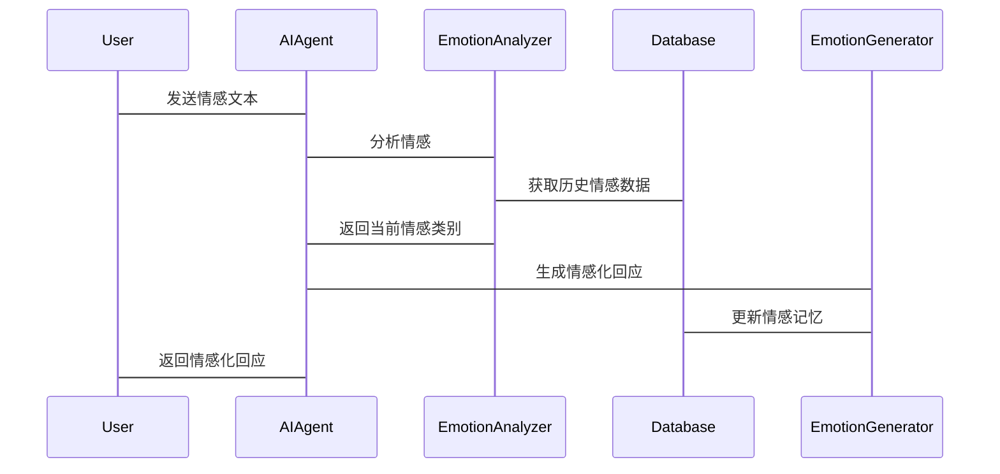

                 


# 构建LLM驱动的AI Agent情感智能交互

## 关键词：LLM, AI Agent, 情感智能, 人机交互, 情感计算

## 摘要：本文详细探讨了如何利用大型语言模型（LLM）构建具备情感智能的AI Agent，实现情感智能交互。文章从背景介绍、核心概念、算法原理、系统架构到项目实战和最佳实践，全面分析了构建LLM驱动AI Agent的关键技术和实现路径，帮助读者深入理解情感智能交互的原理和应用。

---

## 第1章：问题背景与描述

### 1.1 问题背景

#### 1.1.1 人工智能与情感计算的发展现状
人工智能技术近年来取得了显著进展，尤其是在自然语言处理（NLP）领域，大型语言模型（LLM）如GPT-3、GPT-4等，展现了强大的文本生成和理解能力。然而，尽管这些模型在技术上取得了突破，它们在情感智能方面的应用仍处于起步阶段。

情感计算，也称为情感智能，是人工智能的一个重要分支，旨在理解和模拟人类情感。情感计算的应用范围广泛，包括智能客服、情感支持、教育辅助等领域。然而，目前的情感计算技术多依赖于规则引擎或简单的情感分析模型，难以实现复杂的情感交互。

#### 1.1.2 当前人机交互中的情感智能缺失
现有的人机交互系统，如智能音箱、聊天机器人等，虽然在功能上日益完善，但在情感智能方面仍有明显不足。这些系统通常只能进行简单的信息查询和任务执行，无法真正理解用户的情感状态，也无法根据情感反馈调整交互策略。例如，当用户表达情绪低落时，系统无法提供情感上的支持，而是继续按照预设的流程执行任务。

#### 1.1.3 LLM在情感智能中的潜力
随着LLM技术的发展，其在情感智能中的潜力逐渐显现。LLM具备强大的文本理解和生成能力，可以处理复杂的情感表达，并根据上下文调整回应的情感色彩。通过结合情感计算技术，LLM能够构建具备情感智能的AI Agent，实现更加自然和智能的交互。

### 1.2 问题描述

#### 1.2.1 情感智能交互的核心问题
情感智能交互的核心问题在于如何让AI系统具备理解、识别和回应用户情感的能力。这不仅包括识别用户的情感状态，还需要根据情感状态调整交互策略，提供个性化的情感反馈。

#### 1.2.2 当前LLM在情感交互中的局限性
尽管LLM在文本生成和理解方面表现出色，但在情感智能方面仍存在一些局限性：
1. **情感识别的准确性**：LLM通常依赖于预训练的数据，可能无法准确识别特定的情感表达，尤其是在复杂或模糊的情感情境下。
2. **情感回应的深度**：LLM生成的情感回应可能缺乏深度，无法真正理解和回应用户的情感需求。
3. **情感记忆的能力**：当前的LLM不具备长期的情感记忆能力，无法根据之前的交互历史调整当前的情感回应。

#### 1.2.3 构建LLM驱动AI Agent的目标与意义
构建LLM驱动的AI Agent情感智能交互系统的目标是实现人机交互的情感智能化，使AI系统能够理解用户情感、记忆情感状态，并根据情感反馈调整交互策略。这不仅能够提升用户体验，还能够拓展AI系统在教育、医疗、心理健康等领域中的应用。

### 1.3 问题解决思路

#### 1.3.1 LLM与情感计算的结合方法
为了实现情感智能交互，可以将LLM与情感计算技术相结合，具体方法包括：
1. **情感特征提取**：通过情感分析技术提取用户输入中的情感特征，如情感类别（正面、负面、中性）和情感强度。
2. **情感驱动的文本生成**：根据提取的情感特征，调整LLM的生成策略，使其生成的情感化文本更加贴合用户情感需求。
3. **情感记忆与上下文管理**：通过记忆网络或对话历史记录，保存用户的情感状态，以便后续交互中进行情感调整。

#### 1.3.2 AI Agent的情感智能实现路径
AI Agent的情感智能实现路径可以分为以下几个步骤：
1. **情感识别**：通过自然语言处理技术识别用户输入中的情感信息。
2. **情感记忆**：将识别到的情感信息存储起来，形成情感记忆。
3. **情感驱动的交互**：根据当前和历史情感信息，生成相应的情感化回应。

#### 1.3.3 技术与应用的平衡
在实现情感智能交互的过程中，需要平衡技术实现和实际应用之间的关系。一方面，要确保技术的可行性，另一方面，要满足实际应用中的需求。例如，在实际应用中，可能需要在准确性和实时性之间进行权衡。

### 1.4 边界与外延

#### 1.4.1 情感智能交互的边界
情感智能交互的边界主要体现在以下几个方面：
1. **情感识别的范围**：当前主要关注正面、负面和中性情感的识别，对复杂情感（如嫉妒、孤独）的识别能力有限。
2. **情感记忆的深度**：目前的情感记忆能力主要基于对话历史，缺乏对长期情感记忆的管理。
3. **情感回应的多样性**：生成的情感回应的多样性和自然性有待提高。

#### 1.4.2 LLM驱动的AI Agent的应用范围
LLM驱动的AI Agent在情感智能交互中的应用范围广泛，包括：
1. **智能客服**：提供情感化支持，提升用户体验。
2. **心理健康助手**：通过情感交互帮助用户缓解压力。
3. **教育辅助**：根据学生情绪调整教学策略。

#### 1.4.3 与其他技术的关联与区别
- **关联**：情感智能交互与自然语言处理（NLP）、机器学习（ML）等技术密切相关。
- **区别**：情感智能交互注重情感的理解和回应，而传统的NLP技术更多关注文本的结构和语义。

### 1.5 核心要素与概念结构

#### 1.5.1 核心要素列表
1. **情感识别**：识别用户输入中的情感信息。
2. **情感记忆**：存储用户的情感状态。
3. **情感驱动的生成**：根据情感信息生成相应的情感化文本。
4. **情感反馈**：用户对系统回应的情感反馈。

#### 1.5.2 概念结构图


---

## 第2章：LLM与情感智能的核心概念

### 2.1 LLM的基本原理

#### 2.1.1 大语言模型的定义与特点
大语言模型（LLM）是一种基于深度学习的自然语言处理模型，具有以下特点：
1. **大规模训练数据**：通常基于数十亿级别的文本数据进行训练。
2. **多任务学习能力**：能够在多种任务（如文本生成、翻译、问答）中表现出色。
3. **上下文理解能力**：能够理解文本的上下文关系，生成连贯的文本。

#### 2.1.2 基于LLM的文本生成机制
LLM的文本生成机制主要基于自回归或自编码器架构，通过概率模型生成文本。具体步骤包括：
1. **输入处理**：将用户输入的文本转换为模型可处理的向量表示。
2. **解码过程**：模型根据输入向量生成下一个词的概率分布，选择概率最高的词作为生成的下一个词。
3. **生成结果**：重复解码过程，直到生成完整的文本。

#### 2.1.3 LLM的训练与推理过程
1. **训练过程**：
   - 使用大规模文本数据进行预训练，目标是最大化上下文的似然。
   - 采用自监督学习，模型同时学习词的分布和上下文关系。
2. **推理过程**：
   - 给定用户输入，模型生成概率分布，选择最高概率的词作为输出。

### 2.2 情感智能的核心原理

#### 2.2.1 情感计算的定义与实现方式
情感计算是一种通过计算方法分析和模拟人类情感的技术，实现方式包括：
1. **情感分析**：通过文本分析技术识别文本中的情感倾向。
2. **情感生成**：根据情感信息生成相应的情感化文本。

#### 2.2.2 情感分析与生成的关键技术
1. **情感分析**：
   - 基于词袋模型或词嵌入（如Word2Vec）的特征提取。
   - 使用机器学习或深度学习模型（如LSTM、Transformer）进行情感分类。
2. **情感生成**：
   - 基于LLM的文本生成技术，结合情感特征进行生成。

#### 2.2.3 情感智能的评估指标
- **准确率**：情感分类的正确率。
- **F1值**：综合考虑精确率和召回率。
- **生成文本的情感一致性**：生成文本是否与目标情感一致。

### 2.3 LLM与情感智能的联系

#### 2.3.1 LLM在情感分析中的优势
1. **上下文理解能力强**：LLM能够理解文本的上下文关系，提高情感分析的准确性。
2. **多任务学习能力**：LLM可以在情感分析和文本生成之间切换，实现情感智能交互。

#### 2.3.2 情感智能对LLM的增强作用
1. **情感驱动的生成**：情感智能可以指导LLM生成更符合用户情感需求的文本。
2. **情感记忆与上下文管理**：情感智能可以帮助LLM更好地管理对话历史，提升生成文本的连贯性。

#### 2.3.3 两者结合的协同效应
1. **提升用户体验**：通过情感智能交互，用户能够感受到更加自然和贴心的回应。
2. **增强系统智能性**：结合LLM的生成能力和情感智能的理解能力，系统能够更好地理解用户需求，提供更精准的服务。

### 2.4 核心概念对比表

| **核心概念** | **LLM** | **情感智能** | **联系** |
|--------------|---------|-------------|----------|
| **核心任务** | 文本生成与理解 | 情感识别与生成 | LLM为情感生成提供文本能力 |
| **技术基础** | 深度学习 | 机器学习、自然语言处理 | 情感计算增强LLM的情感生成能力 |
| **应用场景** | 智能写作、机器翻译 | 智能客服、心理健康助手 | 结合应用，提升交互体验 |

### 2.5 实体关系图（ER图）



---

## 第3章：算法原理

### 3.1 情感分析算法

#### 3.1.1 基于词袋模型的情感分析
1. **词袋模型**：
   - 将文本转换为词袋表示，提取关键词。
   - 使用机器学习模型（如SVM、Naive Bayes）进行分类。

#### 3.1.2 基于深度学习的情感分析
1. **LSTM网络**：
   - 使用循环神经网络处理序列数据，捕捉文本的情感倾向。
2. **Transformer模型**：
   - 使用自注意力机制，捕捉文本中长距离依赖关系。

#### 3.1.3 基于LLM的情感分析
1. **微调LLM**：
   - 在特定情感分析任务上微调LLM，提升情感识别的准确性。
2. **直接使用LLM**：
   - 使用LLM进行情感分析，通过生成式对话获取情感信息。

### 3.2 情感生成算法

#### 3.2.1 基于规则的情感生成
1. **情感模板**：
   - 根据预设的情感模板生成回应。
   - 适用于简单的情感生成任务。

#### 3.2.2 基于LLM的情感生成
1. **情感驱动的文本生成**：
   - 根据情感特征调整LLM的生成策略，生成情感化的文本。
2. **情感强化学习**：
   - 使用强化学习方法，优化生成文本的情感一致性。

#### 3.2.3 情感生成的数学模型
1. **情感特征表示**：
   - 将情感特征（如情感类别、情感强度）表示为向量。
2. **情感驱动的生成模型**：
   - 在生成过程中，将情感特征融入生成模型的输入中。

### 3.3 LLM与情感计算的协同算法

#### 3.3.1 情感特征提取与融合
1. **情感特征提取**：
   - 使用情感分析模型提取文本中的情感特征。
2. **情感特征融合**：
   - 将情感特征与LLM的输入特征进行融合，生成情感化文本。

#### 3.3.2 情感记忆与上下文管理
1. **情感记忆模型**：
   - 使用记忆网络记录用户的对话历史和情感状态。
2. **上下文管理**：
   - 根据对话历史和情感记忆调整生成文本的内容和语气。

#### 3.3.3 情感反馈与自适应生成
1. **情感反馈收集**：
   - 用户对生成文本的情感反馈作为输入，调整生成策略。
2. **自适应生成模型**：
   - 根据情感反馈动态调整生成模型的参数，优化生成文本的情感一致性。

### 3.4 案例分析：基于LLM的情感生成

#### 3.4.1 案例背景
假设用户输入为“我今天心情很不好，感到非常孤独。”

#### 3.4.2 情感特征提取
1. **情感类别**：负面情感。
2. **情感强度**：强烈。

#### 3.4.3 情感驱动的生成
1. **生成策略调整**：
   - 生成文本时，重点使用安慰性语言，语气柔和。
2. **生成结果**：
   - “我很抱歉你现在感到孤独，如果你愿意，我可以陪你聊聊，帮你缓解一些情绪。”

#### 3.4.4 案例总结
通过情感特征提取和情感驱动的生成策略，LLM能够生成符合用户情感需求的文本，提升交互体验。

---

## 第4章：系统分析与架构设计

### 4.1 问题场景介绍

#### 4.1.1 系统目标
构建一个基于LLM的AI Agent，具备情感智能交互能力，能够理解用户情感并生成情感化的回应。

#### 4.1.2 问题场景
用户与AI Agent进行对话，AI Agent能够识别用户情感，根据情感状态生成相应的回应。

### 4.2 系统功能设计

#### 4.2.1 领域模型类图



#### 4.2.2 系统架构图



#### 4.2.3 系统接口设计
1. **用户输入接口**：
   - 提供文本输入框，用户输入情感相关文本。
2. **情感分析接口**：
   - 输入：文本字符串
   - 输出：情感类别（正面、负面、中性）
3. **情感生成接口**：
   - 输入：文本字符串、情感类别
   - 输出：情感化文本

#### 4.2.4 系统交互序列图



### 4.3 系统实现细节

#### 4.3.1 环境安装
1. **安装Python**：确保Python版本为3.8及以上。
2. **安装LLM框架**：选择适合的LLM框架，如Hugging Face的Transformers库。
3. **安装情感分析库**：如NLTK、VADER Sentiment等。

#### 4.3.2 核心代码实现

```python
from transformers import pipeline

# 情感分析模型加载
sentiment_analyzer = pipeline("sentiment-analysis")

# 情感生成模型加载
generator = pipeline("text-generation")

# AI Agent类
class AIAgent:
    def __init__(self):
        self.user_emotion = None

    def handle_message(self, message):
        # 情感分析
        emotion = sentiment_analyzer(message)
        self.user_emotion = emotion[0]['label']
        
        # 情感驱动的生成
        response = self.generate_emotional_response(message, self.user_emotion)
        return response
    
    def generate_emotional_response(self, message, emotion):
        # 根据情感生成回应
        inputs = f"Given the user's message: {message}, and emotion: {emotion}, generate a response."
        response = generator(inputs, max_length=50, num_return_sequences=1)
        return response[0]['generated_text']
```

---

## 第5章：项目实战

### 5.1 环境安装

```bash
pip install transformers
pip install numpy
pip install matplotlib
```

### 5.2 系统核心实现

#### 5.2.1 情感分析实现
```python
# 情感分析实现
from transformers import pipeline

sentiment_analyzer = pipeline("sentiment-analysis")
```

#### 5.2.2 情感生成实现
```python
# 情感生成实现
from transformers import pipeline

generator = pipeline("text-generation")
```

#### 5.2.3 AI Agent实现
```python
class AIAgent:
    def __init__(self):
        self.emotion_memory = {}
    
    def handle_message(self, user_id, message):
        # 情感分析
        emotion = self.analyze_emotion(message)
        
        # 情感记忆更新
        self.emotion_memory[user_id] = emotion
        
        # 情感生成
        response = self.generate_emotional_response(message, emotion)
        return response
    
    def analyze_emotion(self, message):
        return sentiment_analyzer(message)[0]['label']
    
    def generate_emotional_response(self, message, emotion):
        inputs = f"Given the user's message: {message}, and emotion: {emotion}, generate a response."
        return generator(inputs, max_length=50, num_return_sequences=1)[0]['generated_text']
```

### 5.3 代码解读与分析

#### 5.3.1 情感分析代码解读
- 使用Hugging Face的`pipeline`加载情感分析模型。
- 输入用户消息，返回情感类别。

#### 5.3.2 情感生成代码解读
- 使用生成模型根据情感类别生成回应文本。

#### 5.3.3 AI Agent代码解读
- `AIAgent`类初始化时创建情感记忆字典。
- `handle_message`方法处理用户消息，更新情感记忆，并生成情感化回应。

### 5.4 案例分析

#### 5.4.1 案例背景
用户A向AI Agent发送消息：“我今天遇到了很大的困难，感到非常沮丧。”

#### 5.4.2 情感分析
AI Agent调用情感分析模型，分析消息为“negative”情感。

#### 5.4.3 情感生成
AI Agent根据“negative”情感，生成回应：“听到你遇到困难，我感到很遗憾。如果你愿意，我可以陪你一起面对，帮你找到解决办法。”

### 5.5 项目小结
通过以上代码实现，我们可以构建一个具备情感智能的AI Agent，能够根据用户的情感状态生成相应的回应，提升用户体验。

---

## 第6章：最佳实践

### 6.1 小结

#### 6.1.1 核心技术总结
- 情感分析：基于LLM的情感识别技术。
- 情感生成：情感驱动的文本生成策略。
- 情感记忆：对话历史和情感状态的管理。

#### 6.1.2 实现路径总结
1. **环境安装**：安装必要的库和框架。
2. **模型加载**：加载情感分析和生成模型。
3. **系统设计**：设计AI Agent类，实现情感分析、生成和记忆功能。
4. **案例实现**：通过具体案例验证系统功能。

### 6.2 注意事项

#### 6.2.1 情感识别的准确性
- 注意情感识别的准确性，特别是在复杂或模糊的情感表达下。

#### 6.2.2 情感生成的多样性
- 提供多样化的生成策略，避免生成内容单一化。

#### 6.2.3 情感记忆的管理
- 合理管理情感记忆，避免内存消耗过大。

### 6.3 实践技巧

#### 6.3.1 情感驱动的生成策略
- 根据情感类别调整生成模型的参数，生成更符合情感需求的文本。

#### 6.3.2 情感记忆的优化
- 使用合适的数据结构管理情感记忆，提高访问效率。

#### 6.3.3 情感反馈的处理
- 收集用户的情感反馈，动态调整生成策略，优化用户体验。

### 6.4 拓展阅读

#### 6.4.1 情感计算相关文献
- 参考情感计算领域的经典论文和书籍，深入了解情感智能的理论基础。

#### 6.4.2 LLM的前沿研究
- 关注LLM领域的最新研究，了解情感生成的新技术和新方法。

#### 6.4.3 项目实战案例
- 查找更多情感智能交互的项目案例，学习实际应用中的经验教训。

---

## 作者：AI天才研究院/AI Genius Institute & 禅与计算机程序设计艺术 /Zen And The Art of Computer Programming

---

**总结**：通过本文的详细讲解，我们深入探讨了如何构建基于LLM的AI Agent情感智能交互系统，从背景介绍到系统实现，再到最佳实践，全面分析了情感智能交互的关键技术和实现路径。希望本文能够为相关领域的研究和应用提供有价值的参考和指导。

