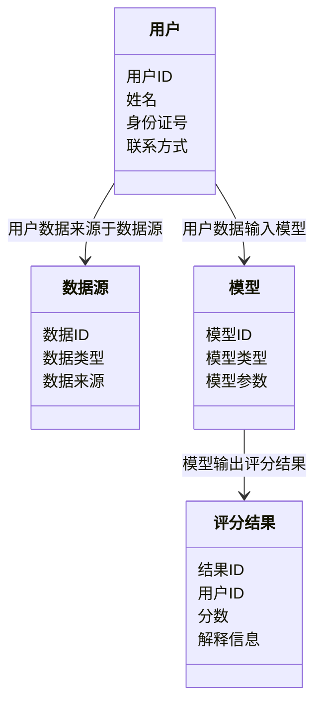

                 


# 《构建智能化的个人信用评分解释系统》

> 关键词：个人信用评分、可解释性机器学习、智能化评分系统、评分解释、模型可解释性

> 摘要：本文将详细探讨如何构建一个智能化的个人信用评分解释系统。通过分析传统信用评分的局限性，结合可解释性机器学习的核心概念，本文将从算法原理、系统设计到项目实战，全面解析如何实现一个高效、可解释的个人信用评分系统。通过实际案例分析和代码实现，本文将帮助读者理解如何在金融领域中应用智能化技术，提升信用评分的准确性和透明度。

---

# 第1章: 背景介绍与核心概念

## 1.1 信用评分的背景与意义

### 1.1.1 信用评分的定义与作用
信用评分是衡量个人信用状况的重要指标，广泛应用于金融、信贷等领域。它通过分析个人的财务数据、消费行为和信用历史，评估其还款能力和信用风险。信用评分的准确性直接影响金融机构的决策和风险管理能力。

### 1.1.2 信用评分在金融领域的应用
信用评分在信用卡审批、贷款额度确定、信用风险管理等方面发挥着重要作用。传统的信用评分主要依赖于简单的线性模型，但随着数据量的增加和算法的进步，智能化评分的需求日益增长。

### 1.1.3 智能化信用评分的必要性
传统信用评分模型的局限性逐渐显现，例如对复杂数据的处理能力不足、可解释性差等问题。智能化评分系统通过引入机器学习和大数据技术，能够更好地捕捉非线性关系，提高评分的准确性和透明度。

## 1.2 个人信用评分问题的背景

### 1.2.1 传统信用评分的局限性
传统信用评分模型通常基于简单的线性回归或逻辑回归，难以处理高维数据和复杂关系。此外，模型的可解释性较差，用户难以理解评分结果的原因。

### 1.2.2 数据驱动评分的兴起
随着大数据技术的发展，越来越多的非结构化数据（如社交媒体数据、消费行为数据）被引入信用评分系统。数据驱动的评分方法能够更全面地评估个人信用状况，但同时也带来了模型复杂性和可解释性的挑战。

### 1.2.3 智能化评分的挑战与机遇
智能化评分的核心目标是提高评分的准确性和可解释性。然而，复杂的算法（如深度学习）往往难以解释，这限制了其在金融领域的应用。如何在保证评分准确性的前提下，提高模型的可解释性，是当前智能化评分的核心挑战。

## 1.3 问题描述与解决思路

### 1.3.1 信用评分中的关键问题
- 数据特征的多样性与复杂性
- 模型的可解释性问题
- 高维数据的处理与建模
- 模型的实时性和可扩展性

### 1.3.2 智能化评分的核心目标
- 提高评分的准确性和鲁棒性
- 提升模型的可解释性
- 实现高效的实时评分
- 支持多样化的数据源

### 1.3.3 解决问题的思路与方法
- 引入可解释性机器学习算法（如决策树、线性模型）
- 数据预处理与特征选择
- 模型评估与优化
- 可视化解释工具的开发

## 1.4 系统的边界与外延

### 1.4.1 系统的输入与输出
- 输入：个人信用数据（如收入、支出、信用历史、消费行为等）
- 输出：信用评分及评分解释（如影响评分的关键因素）

### 1.4.2 系统的边界定义
- 系统不涉及具体的评分规则制定，但支持规则的可解释性分析
- 系统不直接处理信用风险，但提供风险评估的可视化工具

### 1.4.3 系统的外延与扩展
- 支持多种数据源的接入
- 支持不同评分模型的对比与分析
- 提供实时评分和历史评分的对比功能

## 1.5 核心要素与概念结构

### 1.5.1 核心概念的组成
- 数据特征：收入、支出、信用历史、消费行为等
- 模型选择：线性回归、决策树、随机森林等
- 可解释性工具：特征重要性分析、规则提取等

### 1.5.2 概念之间的关系
- 数据特征与模型选择：不同特征组合影响模型的性能和可解释性
- 模型与解释工具：模型的复杂性影响解释工具的选择

### 1.5.3 系统的逻辑结构
1. 数据预处理与特征选择
2. 模型训练与优化
3. 模型解释与可视化
4. 系统集成与部署

## 1.6 本章小结

---

# 第2章: 核心概念与联系

## 2.1 可解释性机器学习的定义

### 2.1.1 什么是可解释性
可解释性是指模型的决策过程能够被人类理解。在信用评分系统中，可解释性意味着用户能够理解评分结果的原因，从而增强对评分结果的信任。

### 2.1.2 可解释性在信用评分中的重要性
- 提高评分结果的透明度
- 帮助用户理解评分依据
- 便于监管机构审查和合规

### 2.1.3 可解释性与模型性能的关系
可解释性与模型性能之间可能存在权衡。复杂的模型通常性能更好，但可解释性较差；简单的模型性能较低，但可解释性较好。

## 2.2 传统模型与黑箱模型的对比

### 2.2.1 传统模型的特点
- 线性回归：简单、可解释性强，但对复杂关系的捕捉能力有限
- 逻辑回归：适用于二分类问题，可解释性较好

### 2.2.2 黑箱模型的优缺点
- 优点：性能高，能够捕捉复杂模式
- 缺点：可解释性差，难以理解模型决策过程

### 2.2.3 可解释性模型的选择
- 根据需求选择模型：高准确性的场景可以选择黑箱模型，需要可解释性的场景选择线性模型或决策树

## 2.3 核心概念的属性特征对比

### 2.3.1 模型复杂度与可解释性的关系
| 模型复杂度 | 可解释性 |
|------------|----------|
| 低         | 高       |
| 中         | 中       |
| 高         | 低       |

### 2.3.2 数据特征对模型解释性的影响
| 数据特征类型 | 对解释性的影响 |
|--------------|---------------|
| 线性特征     | 明显影响       |
| 非线性特征   | 影响较难分析   |

### 2.3.3 模型类型对解释性的影响
| 模型类型     | 可解释性       |
|--------------|---------------|
| 线性回归     | 高            |
| 决策树       | 中高          |
| 随机森林     | 中            |
| 神经网络     | 低            |

## 2.4 ER实体关系图架构

### 2.4.1 实体关系图的定义
ER图（Entity-Relationship Diagram）用于描述系统中实体之间的关系。在信用评分系统中，主要实体包括用户、数据源、模型和评分结果。

### 2.4.2 实体关系图的绘制
```mermaid
erd
  user (用户)
    + 用户ID (主键)
    + 姓名
    + 身份证号
    + 联系方式

  data_source (数据源)
    + 数据ID (主键)
    + 数据类型
    + 数据来源

  model (模型)
    + 模型ID (主键)
    + 模型类型
    + 模型参数

  score_result (评分结果)
    + 结果ID (主键)
    + 用户ID (外键)
    + 分数
    + 解释信息

  user --> data_source (用户数据来源于数据源)
  user --> model (用户数据输入模型)
  model --> score_result (模型输出评分结果)
```

### 2.4.3 实体关系图的解释
用户数据通过数据源输入模型，模型根据用户数据生成评分结果，评分结果包含评分分数和解释信息。通过ER图可以清晰地理解系统中各实体之间的关系和数据流。

---

# 第3章: 算法原理与数学模型

## 3.1 可解释性算法的选择与实现

### 3.1.1 线性回归模型
线性回归是一种简单且可解释性较强的模型，适用于处理线性关系的数据。

#### 算法原理
线性回归的目标是找到最佳拟合直线，使得预测值与实际值之间的残差平方和最小。数学表达式为：
$$ y = \beta_0 + \beta_1x_1 + \beta_2x_2 + ... + \beta_nx_n $$

#### 优缺点
- 优点：简单、可解释性强
- 缺点：只能处理线性关系，对非线性关系的捕捉能力有限

### 3.1.2 决策树模型
决策树是一种基于树状结构的模型，能够处理复杂的非线性关系，且具有较强的可解释性。

#### 算法原理
决策树通过特征分裂构建树状结构，最终将数据划分为不同的叶子节点，每个叶子节点对应一个预测结果。数学表达式为：
$$ f(x) = \text{sign}(\sum_{i=1}^n \alpha_i h_i(x)) $$

#### 优缺点
- 优点：可解释性强，能够处理非线性关系
- 缺点：对噪声数据敏感，容易过拟合

---

## 3.2 模型可解释性评估与实现

### 3.2.1 特征重要性分析
特征重要性分析是评估模型可解释性的重要方法。通过分析特征对模型预测结果的贡献程度，可以确定哪些特征对评分结果影响最大。

#### 方法实现
- 线性模型：通过回归系数的绝对值大小排序特征的重要性
- 树模型：通过特征分裂的次数或信息增益排序特征的重要性

### 3.2.2 模型解释工具
模型解释工具（如SHAP值）能够帮助理解每个特征对模型预测结果的具体影响。

#### SHAP值的计算与解释
SHAP（Shapley Additive exPlanations）是一种用于解释模型预测结果的方法。它通过分解预测结果，量化每个特征对最终预测的贡献。

#### SHAP值的可视化
通过SHAP值的可视化工具（如SHAPdashboard），可以直观地展示每个特征对评分结果的影响。

---

## 3.3 算法实现与代码示例

### 3.3.1 线性回归模型的实现
以下是线性回归模型的Python代码示例：

```python
import numpy as np
from sklearn.linear_model import LinearRegression

# 数据准备
X = np.array([[1], [2], [3], [4], [5]])
y = np.array([2, 4, 5, 4, 5])

# 模型训练
model = LinearRegression()
model.fit(X, y)

# 预测
print(model.predict(X))
```

### 3.3.2 决策树模型的实现
以下是决策树模型的Python代码示例：

```python
from sklearn.tree import DecisionTreeRegressor
from sklearn.model_selection import train_test_split
import numpy as np

# 数据准备
X = np.array([[1], [2], [3], [4], [5]])
y = np.array([2, 4, 5, 4, 5])

# 模型训练
model = DecisionTreeRegressor()
model.fit(X, y)

# 预测
print(model.predict(X))
```

---

# 第4章: 系统分析与架构设计

## 4.1 问题场景介绍

### 4.1.1 项目背景
本项目旨在构建一个智能化的个人信用评分解释系统，通过引入可解释性机器学习算法，提高信用评分的准确性和透明度。

### 4.1.2 项目目标
- 实现信用评分的智能化
- 提升评分结果的可解释性
- 支持多样化的数据源

## 4.2 系统功能设计

### 4.2.1 领域模型设计


### 4.2.2 系统架构设计


### 4.2.3 接口设计
- 前端接口：用户提交请求，获取评分结果和解释信息
- 后端接口：接收前端请求，调用模型服务和解释服务
- 模型服务接口：提供模型调用和预测功能
- 解释服务接口：提供解释信息的生成和返回功能

### 4.2.4 交互流程
1. 用户提交请求
2. 前端接收请求并转发到后端
3. 后端调用模型服务进行评分
4. 后端调用解释服务获取解释信息
5. 后端返回评分结果和解释信息到前端
6. 前端展示评分结果和解释信息

---

## 4.3 项目实战与代码实现

### 4.3.1 环境安装
需要安装以下Python库：
- scikit-learn
- numpy
- matplotlib
- shap

### 4.3.2 核心代码实现

#### 4.3.2.1 数据预处理与特征选择
```python
import pandas as pd
from sklearn.preprocessing import StandardScaler

# 数据加载
data = pd.read_csv('credit_data.csv')

# 特征选择
selected_features = ['income', '支出', '信用历史', '消费行为']
X = data[selected_features]
y = data['信用评分']

# 数据标准化
scaler = StandardScaler()
X_scaled = scaler.fit_transform(X)
```

#### 4.3.2.2 模型训练与优化
```python
from sklearn.linear_model import LinearRegression
from sklearn.metrics import mean_squared_error

# 模型训练
model = LinearRegression()
model.fit(X_scaled, y)

# 模型评估
y_pred = model.predict(X_scaled)
print(mean_squared_error(y, y_pred))
```

#### 4.3.2.3 模型解释与可视化
```python
import shap

# SHAP值计算
explainer = shap.LinearExplainer(model, X_scaled)
shap_values = explainer.shap_values(X_scaled)

# SHAP值可视化
shap.summary_plot(shap_values, X_scaled, feature_names=selected_features)
```

### 4.3.3 案例分析与解读
通过实际案例分析，展示模型的预测结果和解释信息。例如，对于一个用户，模型预测其信用评分为75分，解释信息显示收入和消费行为是主要影响因素。

---

## 4.4 项目小结

---

# 第5章: 最佳实践与总结

## 5.1 最佳实践

### 5.1.1 模型选择
- 根据需求选择模型：需要可解释性的场景选择线性模型，需要高准确性的场景选择复杂模型
- 通过交叉验证评估模型性能

### 5.1.2 数据处理
- 数据清洗：处理缺失值、异常值
- 数据标准化/归一化：确保特征在相同尺度下
- 特征选择：去除冗余特征，选择关键特征

### 5.1.3 模型解释
- 使用SHAP值等工具分析特征重要性
- 提供直观的可视化解释

## 5.2 小结

### 5.2.1 核心知识点回顾
- 可解释性机器学习的核心概念
- 线性回归和决策树的实现与对比
- SHAP值的计算与可视化
- 系统架构设计与实现

### 5.2.2 本文总结
本文详细探讨了如何构建一个智能化的个人信用评分解释系统，从背景介绍、核心概念、算法原理到系统设计和项目实战，全面解析了智能化评分系统的实现过程。

## 5.3 注意事项

### 5.3.1 数据隐私与安全
在处理用户数据时，必须遵守数据隐私法规，确保数据的安全性和用户隐私的保护。

### 5.3.2 模型的实时性与可扩展性
在实际应用中，需要考虑模型的实时性和可扩展性，确保系统能够支持大规模数据处理和实时评分。

## 5.4 拓展阅读

### 5.4.1 推荐书籍
- 《Hands-On Machine Learning with Scikit-Learn, Keras, and TensorFlow》
- 《解释模型: 使用 SHAP 和 LIME 进行模型解释》

### 5.4.2 推荐博客与文章
- [可解释性机器学习的现状与未来](https://towardsdatascience.com/explainable-machine-learning)
- [SHAP 值的深度解读](https://www.fiverr.com/guides/shap-values-deep-dive)

---

# 作者：AI天才研究院 & 禅与计算机程序设计艺术

