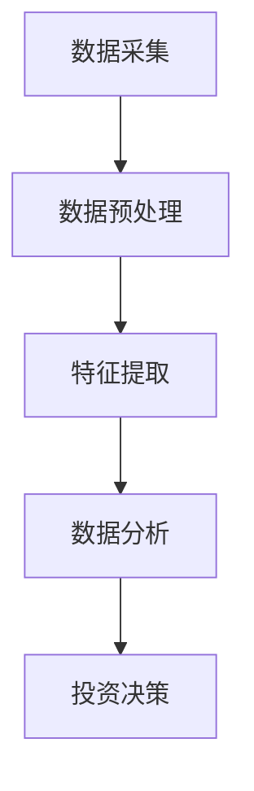
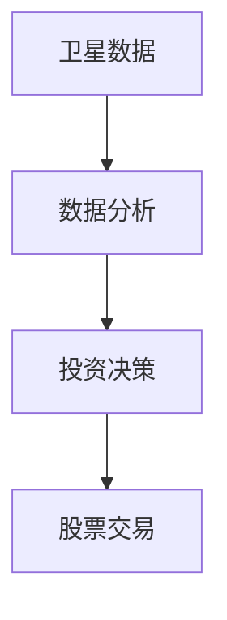
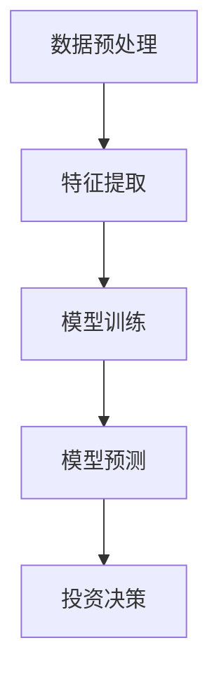
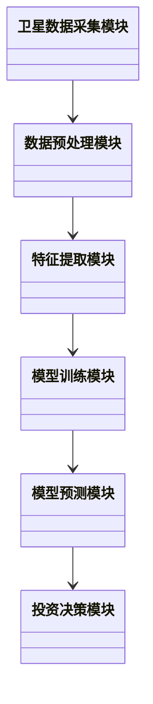
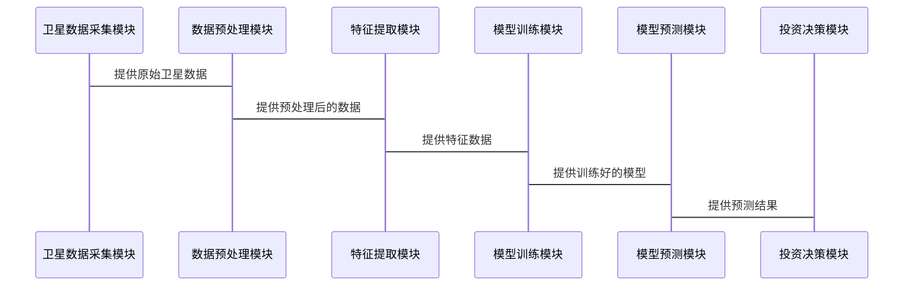

                 


# 特价股票投资中的卫星数据应用与分析

> 关键词：卫星数据，股票投资，机器学习，数据预处理，特征提取，系统架构设计

> 摘要：本文探讨了卫星数据在特价股票投资中的应用，分析了卫星数据的类型及其对股票市场的影响，详细讲解了基于卫星数据的股票价格预测算法，包括数据预处理、特征提取、模型构建与优化，并通过实际案例展示了卫星数据在股票投资中的实战应用，最后总结了卫星数据在股票投资中的价值与未来发展方向。

---

# 第1章: 特价股票投资与卫星数据应用的背景

## 1.1 特价股票投资的定义与特点

### 1.1.1 特价股票的定义
特价股票指的是价格相对较低、市场流动性较低、市值较小的股票，通常属于小盘股或中盘股。这类股票往往被市场忽视，但可能隐藏着投资机会。

### 1.1.2 特价股票投资的特征
- **低估值**：通常市盈率、市净率等估值指标低于市场平均水平。
- **低流动性**：交易量较小，市场关注度较低。
- **高波动性**：由于流动性较低，价格波动较大，投资者需要承担更高的风险。

### 1.1.3 特价股票投资的潜在机会与风险
- **机会**：可能发现被市场低估的优质公司。
- **风险**：信息不透明、流动性差、容易受到市场情绪影响。

## 1.2 卫星数据在金融领域的应用背景

### 1.2.1 卫星数据的定义与类型
- **卫星数据**：通过卫星技术收集的地理、气象、遥感等数据，包括图像数据、温度数据、地表变化等。
- **类型**：
  - 遥感图像数据（如 Landsat、Sentinel）
  - 气象数据（如温度、降水、风速）
  - 地表变化数据（如土地使用变化、城市扩张）

### 1.2.2 卫星数据在金融分析中的优势
- **实时性**：卫星数据可以提供实时或接近实时的地理信息。
- **全局性**：覆盖全球的地理数据，有助于分析全球经济趋势。
- **多样性**：数据类型丰富，可以结合其他金融数据进行分析。

### 1.2.3 特价股票投资中卫星数据的潜在价值
- **供应链分析**：通过卫星图像分析企业的供应链状况，评估企业的运营能力。
- **市场情绪分析**：通过卫星图像分析特定区域的经济活动，推测市场情绪。
- **地理风险评估**：通过卫星数据评估自然灾害、地缘政治风险对特定企业的影响。

## 1.3 卫星数据与股票投资的结合

### 1.3.1 卫星数据在股票市场中的应用现状
- **学术研究**：卫星数据被用于分析企业的生产活动、供应链稳定性。
- **实际应用**：部分机构已经开始利用卫星数据进行投资决策。

### 1.3.2 卫星数据如何影响股票价格
- **企业运营能力**：卫星图像可以帮助分析企业的生产活动，预测企业业绩。
- **市场情绪**：特定区域的经济活动可以通过卫星图像进行分析，影响市场情绪。
- **地理风险**：自然灾害、地缘政治风险等因素可以通过卫星数据进行评估。

### 1.3.3 特价股票投资中的卫星数据应用前景
- **精准选股**：利用卫星数据筛选出被低估的企业。
- **风险控制**：通过卫星数据评估投资风险，制定投资策略。

---

# 第2章: 卫星数据在股票市场中的核心概念与联系

## 2.1 卫星数据的核心概念

### 2.1.1 卫星数据的分类与特征
- **分类**：
  - 遥感图像数据：包括光学图像、雷达图像等。
  - 气象数据：包括温度、降水、风速等。
  - 地表变化数据：包括土地使用变化、城市扩张等。
- **特征**：
  - 空间分辨率：图像的清晰度。
  - 时间分辨率：数据的更新频率。
  - 波谱分辨率：数据的波长范围。

### 2.1.2 卫星数据的采集与处理流程
- **数据采集**：通过卫星传感器获取地理数据。
- **数据预处理**：包括几何校正、辐射校正等。
- **数据分析**：通过图像处理技术提取有用信息。

### 2.1.3 卫星数据与股票市场的关联性分析
- **正相关性**：企业生产活动与股票价格正相关。
- **负相关性**：自然灾害可能对股票价格产生负面影响。

## 2.2 卫星数据与股票投资的关系

### 2.2.1 卫星数据对市场情绪的影响
- **市场情绪分析**：通过分析特定区域的经济活动，推测投资者情绪。
- **市场情绪指数**：通过卫星数据构建市场情绪指数，指导投资决策。

### 2.2.2 卫星数据对供应链分析的作用
- **供应链监控**：通过卫星图像监控企业的生产活动，评估供应链稳定性。
- **供应链风险**：评估自然灾害对企业供应链的影响，制定风险管理策略。

### 2.2.3 卫星数据对经济指标的预测能力
- **GDP预测**：通过卫星图像分析经济活动，预测GDP增长。
- **工业活动预测**：通过卫星图像分析工业区的生产活动，预测工业产值。

## 2.3 卫星数据与股票投资的实体关系图

### 2.3.1 数据流的ER实体关系图
```mermaid
er
  root
    title 数据流的ER实体关系图
    entity 卫星数据
      attribute 数据类型（遥感图像、气象数据）
      attribute 数据来源（卫星名称）
      attribute 数据时间（采集时间）
    entity 股票市场
      attribute 股票代码
      attribute 股票价格
      attribute 市场指数
    entity 投资决策
      attribute 投资策略
      attribute 风险评估
      attribute 投资组合
    relation 卫星数据 -> 投资决策
      cardinality N:1
    relation 股票市场 -> 投资决策
      cardinality N:1
```

### 2.3.2 数据处理流程的mermaid流程图


### 2.3.3 数据分析与决策的逻辑关系图


## 2.4 本章小结

---

# 第3章: 卫星数据驱动的股票投资算法原理

## 3.1 卫星数据的预处理与特征提取

### 3.1.1 数据清洗与标准化
- **数据清洗**：去除噪声数据、填补缺失值。
- **标准化**：将数据归一化处理，便于后续分析。

### 3.1.2 特征选择与降维
- **特征选择**：通过统计方法或机器学习方法选择重要特征。
- **降维**：使用主成分分析（PCA）等方法减少特征维度。

### 3.1.3 时间序列数据分析
- **时间序列分析**：分析股票价格的时间序列数据，发现趋势和周期性。

## 3.2 基于卫星数据的机器学习模型

### 3.2.1 算法流程的mermaid流程图


### 3.2.2 算法实现的Python代码示例
```python
import numpy as np
import pandas as pd
from sklearn.ensemble import RandomForestRegressor
from sklearn.metrics import mean_squared_error

# 数据加载
data = pd.read_csv('stock_data.csv')

# 特征选择
features = ['feature1', 'feature2', 'feature3']
target = 'price'

X = data[features]
y = data[target]

# 数据标准化
from sklearn.preprocessing import StandardScaler
scaler = StandardScaler()
X_scaled = scaler.fit_transform(X)

# 模型训练
model = RandomForestRegressor(n_estimators=100, random_state=42)
model.fit(X_scaled, y)

# 模型预测
y_pred = model.predict(X_scaled)
print('均方误差:', mean_squared_error(y, y_pred))
```

### 3.2.3 模型训练与优化
- **模型选择**：随机森林、支持向量机（SVM）、神经网络等。
- **超参数优化**：使用网格搜索（Grid Search）优化模型参数。

## 3.3 卫星数据与股票价格预测的数学模型

### 3.3.1 时间序列预测模型
- **ARIMA模型**：自回归积分滑动平均模型，用于时间序列预测。
  $$ ARIMA(p, d, q) $$
  其中，p为自回归阶数，d为差分阶数，q为滑动平均阶数。

### 3.3.2 随机森林算法的应用
- **随机森林**：一种基于决策树的集成学习方法，适用于特征较多的情况。
  $$ y = \sum_{i=1}^{n} \text{Tree}_i(x) \times \alpha_i $$
  其中，$\alpha_i$为树的权重。

### 3.3.3 神经网络模型的构建
- **LSTM网络**：长短期记忆网络，适用于时间序列数据。
  $$ LSTM(t, h_{t-1}, c_{t-1}) \rightarrow (h_t, c_t) $$

## 3.4 本章小结

---

# 第4章: 卫星数据驱动的股票投资系统架构设计

## 4.1 问题场景介绍

### 4.1.1 项目背景
- **项目目标**：利用卫星数据进行股票价格预测。
- **项目范围**：特价股票投资。

### 4.1.2 项目介绍
- **项目名称**：卫星数据驱动的股票投资系统。
- **项目目标**：构建一个基于卫星数据的股票价格预测系统。

## 4.2 系统功能设计

### 4.2.1 领域模型mermaid类图


### 4.2.2 系统架构设计mermaid架构图


### 4.2.3 系统接口设计
- **输入接口**：接收卫星数据和股票历史数据。
- **输出接口**：输出股票价格预测结果和投资决策建议。

### 4.2.4 系统交互mermaid序列图


## 4.3 本章小结

---

# 第5章: 项目实战

## 5.1 环境安装

### 5.1.1 安装Python环境
- 安装Python 3.8或更高版本。
- 安装必要的库：numpy、pandas、scikit-learn、mermaid、matplotlib。

### 5.1.2 数据获取
- 获取卫星数据：通过公开数据集或API获取遥感图像数据。
- 获取股票数据：通过Yahoo Finance或其它API获取股票历史数据。

## 5.2 系统核心实现源代码

### 5.2.1 数据预处理代码
```python
import pandas as pd
import numpy as np

# 数据加载
data = pd.read_csv('stock_data.csv')

# 数据清洗
data = data.dropna()

# 数据标准化
from sklearn.preprocessing import StandardScaler
scaler = StandardScaler()
X_scaled = scaler.fit_transform(data[['feature1', 'feature2', 'feature3']])
```

### 5.2.2 模型训练代码
```python
from sklearn.ensemble import RandomForestRegressor

# 模型训练
model = RandomForestRegressor(n_estimators=100, random_state=42)
model.fit(X_scaled, data['target'])
```

### 5.2.3 模型预测代码
```python
# 模型预测
y_pred = model.predict(X_scaled)
print('预测结果:', y_pred)
```

## 5.3 代码应用解读与分析

### 5.3.1 数据预处理解读
- **数据清洗**：去除缺失值，确保数据完整性。
- **数据标准化**：将特征数据标准化，确保模型训练效果。

### 5.3.2 模型训练解读
- **随机森林模型**：适用于特征较多的情况，能够捕捉非线性关系。
- **超参数优化**：通过网格搜索优化模型参数，提高预测准确率。

## 5.4 案例分析和详细讲解

### 5.4.1 案例分析
- **案例背景**：某地区工业活动变化对股票价格的影响。
- **数据来源**：卫星图像数据和股票历史数据。
- **分析过程**：通过卫星图像分析工业区的变化，结合股票历史数据进行建模和预测。

### 5.4.2 详细讲解
- **数据获取**：通过公开数据集获取卫星图像和股票数据。
- **数据预处理**：清洗和标准化数据。
- **特征提取**：提取与股票价格相关的特征。
- **模型训练**：训练随机森林模型，预测股票价格。
- **结果分析**：分析预测结果，制定投资策略。

## 5.5 本章小结

---

# 第6章: 最佳实践与总结

## 6.1 小结

### 6.1.1 卫星数据在股票投资中的价值
- **信息优势**：卫星数据提供实时地理信息，帮助投资者做出更明智的决策。
- **风险控制**：通过卫星数据评估地理风险，制定风险管理策略。

### 6.1.2 本文的主要内容总结
- 介绍了卫星数据在特价股票投资中的应用背景。
- 展示了卫星数据与股票投资的核心概念与联系。
- 讲解了基于卫星数据的股票价格预测算法。
- 通过实际案例展示了卫星数据在股票投资中的实战应用。

## 6.2 注意事项

### 6.2.1 数据获取的注意事项
- **数据质量**：确保数据的准确性和完整性。
- **数据来源**：选择可靠的卫星数据源和股票数据源。

### 6.2.2 模型优化的注意事项
- **模型选择**：根据数据特征选择合适的模型。
- **超参数优化**：通过网格搜索等方法优化模型性能。

### 6.2.3 投资决策的注意事项
- **风险管理**：制定合理的风险管理策略，避免过度依赖模型预测。
- **市场波动**：关注市场波动，及时调整投资策略。

## 6.3 未来展望

### 6.3.1 卫星数据在股票投资中的未来发展方向
- **多源数据融合**：结合卫星数据、社交媒体数据、经济指标数据等，构建多源数据驱动的投资模型。
- **人工智能技术**：利用深度学习等技术，提高模型的预测精度和泛化能力。
- **实时监控**：开发实时监控系统，及时捕捉市场变化，做出快速反应。

---

# 作者：AI天才研究院/AI Genius Institute & 禅与计算机程序设计艺术/Zen And The Art of Computer Programming

